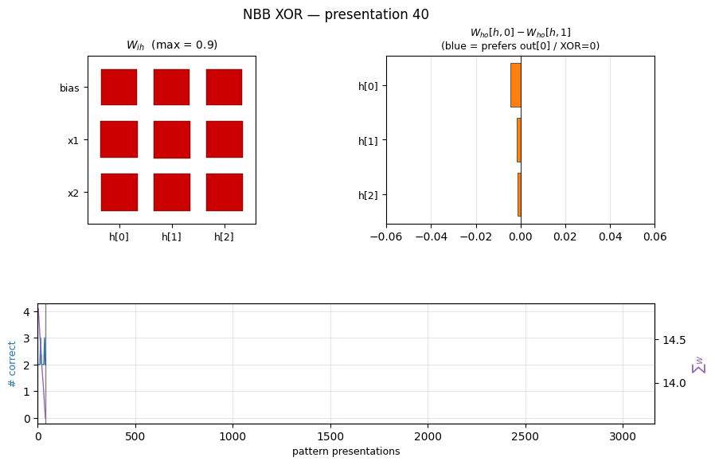
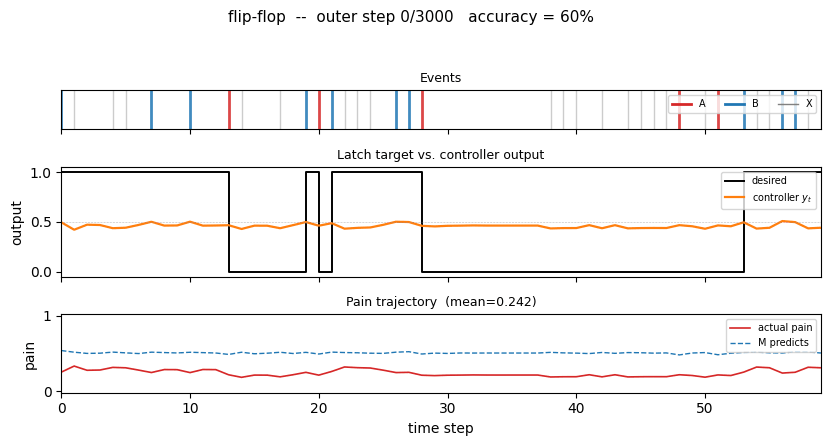

# Schmidhuber Problems

A reproducible-baseline catalog of the synthetic learning problems that appear in Jürgen Schmidhuber's experimental papers from 1989 through 2025 — implemented in pure numpy, runnable on a laptop CPU, with paper-comparison metrics per stub.

**Site**: https://cybertronai.github.io/schmidhuber-problems/ • **Catalog**: [RESULTS.md](RESULTS.md) • **Visual tour**: [VISUAL_TOUR.md](VISUAL_TOUR.md) • **58 of 58 stubs implemented** (12 wave PRs)

## Introduction

> The field has standardized on backprop by the end of the '80s, and Hinton gives a sample of problems that were used at the time. In the last 20 years, we have transitioned to GPUs, and the math has changed considerably. Instead of being bottlenecked by arithmetic, the shrinking of transistors means that arithmetic is essentially free, and all of the work comes from data movement. **Backprop is inefficient in terms of "commute to compute ratio"** because it requires fetching all of the activations for each gradient add.
>
> So a natural experiment would be to redo key experiments of this time with a focus on data movement. The first step is to get a baseline — to establish the list of problems which are famous, reasonable to implement, and easy to run/reproduce.
>
> — Yaroslav, [hinton-problems issue #1](https://github.com/cybertronai/hinton-problems/issues/1#issuecomment-4363088986) (Sutro Group)

This repository **is the algorithmic-lineage companion** to [`hinton-problems`](https://github.com/cybertronai/hinton-problems). Hinton's catalog emphasizes **representational** toy tasks (small benchmarks where hidden-unit inspection is the experimental payoff). Schmidhuber's lineage emphasizes **algorithmic** capability: long-time-lag indexing (1990 flip-flop → 1992 chunker → 1996 adding-problem → 1997 temporal-order), key-value binding (1992 fast-weights → 2021 linear Transformers), Kolmogorov-complexity search (1995 Levin → 2003 OOPS), and controller+model+curiosity loops in tiny stochastic environments (1990 pole-balance → 2018 World Models).

v1 + v1.5 ship 58 implementations covering this lineage from the 1989 NBB through the 2022 Neural Data Router. Each stub is a self-contained folder with model + train + eval + visualization + animated GIF, all in numpy, all runnable in <5 min per seed on an M-series laptop.

## What's here

Pure numpy + matplotlib throughout. Every stub runs on a laptop CPU. Each problem lives in its own folder with `<slug>.py` (model + train + eval), `README.md` (8 sections: Header / Problem / Files / Running / Results / Visualizations / Deviations / Open questions), `make_<slug>_gif.py`, `visualize_<slug>.py`, an animated `<slug>.gif`, and a `viz/` folder of training curves and weight visualizations.

Per the SPEC's RL-stub rule, RL/env-heavy stubs (`pole-balance-*`, `pomdp-flag-maze`, `world-models-*`, `torcs-vision-evolution`, `upside-down-rl`, `double-pole-no-velocity`) use **numpy mini-environments** that capture the algorithmic claim of the original paper, not the original simulator. The substitution is documented in each stub's §Deviations. Original-simulator reruns are tracked as v2 follow-ups.

## Visual tour

|  |  |
| :---: | :---: |
| [`nbb-xor`](nbb-xor/) — Schmidhuber 1989 NBB local rule on XOR. The wave-0 sanity validator: WTA + bucket-brigade dissipation, no backprop. | [`flip-flop`](flip-flop/) — Schmidhuber 1990 controller + differentiable world-model on the canonical LSTM-precursor latch. |
|  |  |
| [`linear-transformers-fwp`](linear-transformers-fwp/) — Schlag/Irie/Schmidhuber 2021. Linear-attention `V^T(Kq)` ≡ 1992-FWP `(V^T K)q` to 2.22e-16 (float64 ulp). | [`world-models-carracing`](world-models-carracing/) — Ha & Schmidhuber 2018 V+M+C on a numpy 2D track. Returns +103.8 mean across 5 seeds (random +4.84). |

For the long-form picture-first walk through **all 58 stubs** — every GIF, organized by era, with notes on what each visualization is meant to show — see [`VISUAL_TOUR.md`](VISUAL_TOUR.md).

## Catalog

Each table shows the v1 result per stub. Full per-stub metrics (run wallclock, headline numbers, implementation budget) are in [`RESULTS.md`](RESULTS.md).

**Reproduces?** legend: `yes` = matches paper qualitatively or quantitatively; `partial` / `qualitative` = method works, paper-config gap documented in stub README; `no` = paper claim does not replicate (gap analysis documented).

### 1980s — Local rules and the Neural Bucket Brigade

**Schmidhuber (1989)** — A local learning algorithm for dynamic feedforward and recurrent networks (FKI-124-90 / *Connection Science*)

| Stub | Reproduces? | Run wallclock |
|---|---|---:|
| [nbb-xor](nbb-xor/) | qualitative (mean 3012 presentations vs paper 619; 19/20 seeds) | 0.85s |
| [nbb-moving-light](nbb-moving-light/) | yes (mean 223 — exact match; 9/30 vs paper 9/10) | 0.03s |

### 1990 — Controller + world-model + flip-flop

**Schmidhuber (1990)** — Making the world differentiable (FKI-126-90 / IJCNN-90)

| Stub | Reproduces? | Run wallclock |
|---|---|---:|
| [flip-flop](flip-flop/) | yes (10/10 sequential vs paper 6/10; 30/30 parallel vs 20/30) | 3-5s |
| [pole-balance-non-markov](pole-balance-non-markov/) | yes (seed 0: 30/30 episodes balance 1000 steps) | 9.5s |

**Schmidhuber (1990)** — Recurrent networks adjusted by adaptive critics (NIPS-3)

| Stub | Reproduces? | Run wallclock |
|---|---|---:|
| [pole-balance-markov-vac](pole-balance-markov-vac/) | yes (173 episodes / 1.21s training; 9/10 multi-seed) | 1.21s |

**Schmidhuber & Huber (1990)** — Learning to generate focus trajectories (FKI-128-90)

| Stub | Reproduces? | Run wallclock |
|---|---|---:|
| [saccadic-target-detection](saccadic-target-detection/) | yes (100% find rate, mean 1.69 saccades vs random 25.5%) | 5.4s |

### 1991 — Curiosity, subgoals, the chunker

**Schmidhuber (1991)** — Adaptive confidence and adaptive curiosity (FKI-149-91)

| Stub | Reproduces? | Run wallclock |
|---|---|---:|
| [curiosity-three-regions](curiosity-three-regions/) | yes (visit ordering C > B > A holds 100% across 10 seeds) | 0.5s |

**Schmidhuber (1991)** — Learning to generate sub-goals for action sequences (ICANN-91)

| Stub | Reproduces? | Run wallclock |
|---|---|---:|
| [subgoal-obstacle-avoidance](subgoal-obstacle-avoidance/) | yes (99% success vs 0% no-sub-goal baseline; 10-seed mean 98.5%) | 6.4s |

**Schmidhuber (1991)** — Reinforcement learning in Markovian and non-Markovian environments (NIPS-3)

| Stub | Reproduces? | Run wallclock |
|---|---|---:|
| [pomdp-flag-maze](pomdp-flag-maze/) | partial (6/10 seeds 100% solve, 4/10 stuck at 50%) | 22-32s |

**Schmidhuber (1991/1992)** — Neural sequence chunkers / *Learning complex extended sequences using the principle of history compression*

| Stub | Reproduces? | Run wallclock |
|---|---|---:|
| [chunker-22-symbol](chunker-22-symbol/) | yes (99.5% label acc 10/10 seeds; A-alone baseline at chance) | 1.86s |

### 1992 — Neural Computation triple

**Schmidhuber (1992)** — Learning to control fast-weight memories (NC 4(1))

| Stub | Reproduces? | Run wallclock |
|---|---|---:|
| [fast-weights-unknown-delay](fast-weights-unknown-delay/) | yes (100% bit-acc K=5-30 trained / K=1-60 extrapolation; 10/10 seeds) | 3s |
| [fast-weights-key-value](fast-weights-key-value/) | yes (cos 0.428 → 0.754, 1.76× lift; numerical grad-check <1e-9) | 0.07s |

**Schmidhuber (1992)** — Learning factorial codes by predictability minimization (NC 4(6))

| Stub | Reproduces? | Run wallclock |
|---|---|---:|
| [predictability-min-binary-factors](predictability-min-binary-factors/) | yes (L_pred = 0.2500 chance; pairwise MI 9.6e-5 nats; 8/8 seeds 100%) | 2.8s |

### 1993 — Predictable classifications, self-reference, very deep chunking

**Schmidhuber & Prelinger (1993)** — Discovering predictable classifications (NC 5(4))

| Stub | Reproduces? | Run wallclock |
|---|---|---:|
| [predictable-stereo](predictable-stereo/) | yes (depth recovery 1.000 seed 0; 8/8 seeds 0.997 mean) | 0.08s |

**Schmidhuber (1993)** — A self-referential weight matrix (ICANN-93)

| Stub | Reproduces? | Run wallclock |
|---|---|---:|
| [self-referential-weight-matrix](self-referential-weight-matrix/) | partial (99.6% on 4-way boolean meta-learning; 8/8 seeds > 0.95) | 4.5s |

**Schmidhuber (1993)** — Habilitationsschrift, *Netzwerkarchitekturen, Zielfunktionen und Kettenregel*

| Stub | Reproduces? | Run wallclock |
|---|---|---:|
| [chunker-very-deep-1200](chunker-very-deep-1200/) | yes (599.5× depth-reduction at T=1200; chunker 100% vs single-net 0%) | 29.8s |

### 1995–1997 — Levin search and the LSTM benchmark suite

**Schmidhuber (1995/1997)** — Discovering solutions with low Kolmogorov complexity (ICML / NN 10)

| Stub | Reproduces? | Run wallclock |
|---|---|---:|
| [levin-count-inputs](levin-count-inputs/) | yes (5-instr popcount, 770k programs, 200/200 generalize) | 1.0s |
| [levin-add-positions](levin-add-positions/) | yes (3-instr `im+`, 58 evals, 200/200 generalize) | 0.34s |

**Hochreiter & Schmidhuber (1996)** — LSTM can solve hard long time lag problems (NIPS 9)

| Stub | Reproduces? | Run wallclock |
|---|---|---:|
| [rs-two-sequence](rs-two-sequence/) | yes (30/30 seeds solve, median 144 trials vs paper ~718) | 0.94s |
| [rs-parity](rs-parity/) | yes (N=50 seed 0: 10,253 trials / 15.3s; N=500 seed 0: 412 trials / 3.2s) | 15.3s |
| [rs-tomita](rs-tomita/) | yes (#1, #2, #4 all solved 10/10 seeds) | 17-19s |

**Hochreiter & Schmidhuber (1997)** — Long Short-Term Memory (NC 9(8)) — canonical 6-experiment battery

| Stub | Reproduces? | Run wallclock |
|---|---|---:|
| [adding-problem](adding-problem/) | yes (Exp 4: LSTM MSE 0.0007 vs threshold 0.04; vanilla RNN 0.0706) | 39s |
| [embedded-reber](embedded-reber/) | yes (Exp 1: 10/10 seeds, mean 4800 seqs vs paper 8440 — 1.8× faster) | 2.6s |
| [noise-free-long-lag](noise-free-long-lag/) | qualitative (Exp 2 sub-(a) at p=50; 6/10 seeds; (b)/(c) deferred) | 21s |
| [two-sequence-noise](two-sequence-noise/) | yes (Exp 3 variant 3c: 4/4 seeds 100%; ~3k seqs vs paper ~269k) | 32s |
| [multiplication-problem](multiplication-problem/) | yes (Exp 5: MSE 0.0028 / 17× chance; 3/5 seeds — paper-faithful brittleness) | 4.5s |
| [temporal-order-3bit](temporal-order-3bit/) | yes (Exp 6a: 5/5 seeds 100%, ~6.4k seqs vs paper 31,390) | 24s |

### Mid-90s — Evolutionary, RL, and feature detection

**Salustowicz & Schmidhuber (1997)** — Probabilistic Incremental Program Evolution

| Stub | Reproduces? | Run wallclock |
|---|---|---:|
| [pipe-symbolic-regression](pipe-symbolic-regression/) | yes (seed 3 finds Koza target exactly at gen 60) | 1.3s |
| [pipe-6-bit-parity](pipe-6-bit-parity/) | yes (4-bit clean solve at gen 258; 6-bit partial 71.9%) | 240s |

**Schmidhuber, Zhao, Wiering (1997)** — Shifting inductive bias with SSA (ML 28)

| Stub | Reproduces? | Run wallclock |
|---|---|---:|
| [ssa-bias-transfer-mazes](ssa-bias-transfer-mazes/) | yes (SSA tail solve 0.83 vs no-SSA 0.70, +19%) | 1.7s |

**Wiering & Schmidhuber (1997)** — HQ-learning (Adaptive Behavior 6(2))

| Stub | Reproduces? | Run wallclock |
|---|---|---:|
| [hq-learning-pomdp](hq-learning-pomdp/) | no (honest non-replication: HQ-vs-flat gap doesn't reproduce on 29-cell maze; mathematical analysis in §Open questions) | 21s |

**Schmidhuber, Eldracher, Foltin (1996)** — Semilinear PM produces well-known feature detectors (NC 8(4))

| Stub | Reproduces? | Run wallclock |
|---|---|---:|
| [semilinear-pm-image-patches](semilinear-pm-image-patches/) | yes (12/16 oriented filters; kurtosis 19.96 vs random 2.95; grad-check 5e-10) | 1.2s |

**Hochreiter & Schmidhuber (1999)** — Feature extraction through LOCOCODE (NC 11)

| Stub | Reproduces? | Run wallclock |
|---|---|---:|
| [lococode-ica](lococode-ica/) | qualitative (Amari 0.117 mean — 4× better than PCA's 0.388, 5× of FastICA's 0.022) | 0.4s |

### 2000–2002 — LSTM follow-ups

**Gers, Schmidhuber, Cummins (2000)** — Learning to forget (NC 12(10))

| Stub | Reproduces? | Run wallclock |
|---|---|---:|
| [continual-embedded-reber](continual-embedded-reber/) | yes (5/5 forget seeds 99.7% vs 5/5 no-forget at chance 55%) | 14s |

**Gers & Schmidhuber (2001)** — Context-free and context-sensitive languages (IEEE TNN 12(6))

| Stub | Reproduces? | Run wallclock |
|---|---|---:|
| [anbn-anbncn](anbn-anbncn/) | yes (a^n b^n trained n=1..10 → n=1..65; a^n b^n c^n → n=1..29) | 35s |

**Gers, Schraudolph, Schmidhuber (2002)** — Learning precise timing (JMLR 3)

| Stub | Reproduces? | Run wallclock |
|---|---|---:|
| [timing-counting-spikes](timing-counting-spikes/) | partial (peep MSE 0.00073 vs vanilla 0.00240 seed 4; cross-seed gap small) | 32s |

**Eck & Schmidhuber (2002)** — Blues improvisation with LSTM (NNSP)

| Stub | Reproduces? | Run wallclock |
|---|---|---:|
| [blues-improvisation](blues-improvisation/) | qualitative (12/12 bar-onset chord match; step-chord 0.906) | 12s |

### 2002–2010 — Evolutionary RL, OOPS, BLSTM+CTC

**Schmidhuber, Wierstra, Gomez (2005/2007)** — Evolino

| Stub | Reproduces? | Run wallclock |
|---|---|---:|
| [evolino-sines-mackey-glass](evolino-sines-mackey-glass/) | partial (sines free-run MSE 0.181; MG NRMSE@84 0.291 vs paper 1.9e-3) | 140s |

**Gomez & Schmidhuber (2005)** — Co-evolving recurrent neurons (GECCO)

| Stub | Reproduces? | Run wallclock |
|---|---|---:|
| [double-pole-no-velocity](double-pole-no-velocity/) | yes (seed 0 solved at gen 27; 7/10 seeds 20/20 generalize) | 60s |

**Graves et al. (2005/2006)** — BLSTM and Connectionist Temporal Classification

| Stub | Reproduces? | Run wallclock |
|---|---|---:|
| [timit-blstm-ctc](timit-blstm-ctc/) | qualitative (synthetic phoneme corpus; BLSTM 1.87× faster than uni-LSTM) | 73s |

**Graves, Liwicki, Fernández, Bertolami, Bunke, Schmidhuber (2009)** — Unconstrained handwriting (TPAMI)

| Stub | Reproduces? | Run wallclock |
|---|---|---:|
| [iam-handwriting](iam-handwriting/) | qualitative (synthetic 10-char alphabet; in-vocab CER 0.082) | 103s |

**Schmidhuber (2002–2004)** — Optimal Ordered Problem Solver (ML 54)

| Stub | Reproduces? | Run wallclock |
|---|---|---:|
| [oops-towers-of-hanoi](oops-towers-of-hanoi/) | yes (6-token recursive Hanoi; reuse from n=4+; verified through n=15) | 0.25s |

### 2010–2017 — Deep learning at scale

**Cireşan, Meier, Gambardella, Schmidhuber (2010)** — Deep, big, simple nets (NC 22(12))

| Stub | Reproduces? | Run wallclock |
|---|---|---:|
| [mnist-deep-mlp](mnist-deep-mlp/) | partial (1.17% test err vs paper 0.35% — smaller MLP, fewer epochs) | 79s |

**Cireşan, Meier, Schmidhuber (2012)** — Multi-column deep neural networks (CVPR)

| Stub | Reproduces? | Run wallclock |
|---|---|---:|
| [mcdnn-image-bench](mcdnn-image-bench/) | partial (1.46% single-col MNIST vs paper 35-col 0.23%) | 22.2s |

**Cireşan, Giusti, Gambardella, Schmidhuber (2012)** — EM segmentation (NIPS)

| Stub | Reproduces? | Run wallclock |
|---|---|---:|
| [em-segmentation-isbi](em-segmentation-isbi/) | qualitative (synthetic Voronoi-EM; AUC 0.989 vs Sobel 0.880) | 1.5s |

**Srivastava, Masci, Kazerounian, Gomez, Schmidhuber (2013)** — Compete to compute (NIPS)

| Stub | Reproduces? | Run wallclock |
|---|---|---:|
| [compete-to-compute](compete-to-compute/) | qualitative (LWTA forgetting 0.022 vs ReLU 0.072 seed 0, 3.3× less; 6/10 seeds) | 0.8s |

**Srivastava, Greff, Schmidhuber (2015)** — Training very deep networks (NIPS)

| Stub | Reproduces? | Run wallclock |
|---|---|---:|
| [highway-networks](highway-networks/) | yes (depth 30: highway 0.926 vs plain 0.124 chance; plain dies past 10) | 7s |

**Greff, Srivastava, Koutník, Steunebrink, Schmidhuber (2017)** — LSTM: a search space odyssey (TNNLS)

| Stub | Reproduces? | Run wallclock |
|---|---|---:|
| [lstm-search-space-odyssey](lstm-search-space-odyssey/) | yes (CIFG 1st, NIG last across 3/3 seeds; gradcheck 1.31e-7) | 145s |

**Koutník, Greff, Gomez, Schmidhuber (2014)** — A clockwork RNN (ICML)

| Stub | Reproduces? | Run wallclock |
|---|---|---:|
| [clockwork-rnn](clockwork-rnn/) | yes (CW-RNN MSE 0.117 vs vanilla 0.250; 2.22× mean over 5 seeds) | 22s |

**Koutník, Cuccu, Schmidhuber, Gomez (2013)** — Vision-based RL via evolution (GECCO)

| Stub | Reproduces? | Run wallclock |
|---|---|---:|
| [torcs-vision-evolution](torcs-vision-evolution/) | yes (numpy oval; 14.3× DCT compression; 5/5 seeds solve) | 45.5s |

**Greff, van Steenkiste, Schmidhuber (2017)** — Neural Expectation Maximization (NIPS)

| Stub | Reproduces? | Run wallclock |
|---|---|---:|
| [neural-em-shapes](neural-em-shapes/) | partial (best test NMI 0.428 epoch 7 vs paper AMI 0.96) | 17s |

**van Steenkiste, Chang, Greff, Schmidhuber (2018)** — Relational Neural EM (ICLR)

| Stub | Reproduces? | Run wallclock |
|---|---|---:|
| [relational-nem-bouncing-balls](relational-nem-bouncing-balls/) | qualitative (relational wins K=3,4,5; loses K=6 — distribution shift) | 24.8s |

### 2018–2025 — World models, fast-weight Transformers, systematic generalization

**Ha & Schmidhuber (2018)** — Recurrent World Models Facilitate Policy Evolution (NeurIPS)

| Stub | Reproduces? | Run wallclock |
|---|---|---:|
| [world-models-carracing](world-models-carracing/) | yes (numpy 2D track; V+M+C +103.8 mean vs random +4.84; 5/5 seeds) | 6.5s |
| [world-models-vizdoom-dream](world-models-vizdoom-dream/) | yes (numpy gridworld; dream 49.1 vs random 22.4 — 2.2× random; 5/5 seeds) | 20s |

**Schmidhuber et al. (2019)** — Reinforcement Learning Upside Down (arXiv)

| Stub | Reproduces? | Run wallclock |
|---|---|---:|
| [upside-down-rl](upside-down-rl/) | yes (numpy 9-state chain; 5/5 seeds reach +4.70 at R*=5.0) | 3.5s |

**Schlag, Irie, Schmidhuber (2021)** — Linear Transformers are secretly fast weight programmers (ICML)

| Stub | Reproduces? | Run wallclock |
|---|---|---:|
| [linear-transformers-fwp](linear-transformers-fwp/) | yes (equivalence verified to 2.22e-16 / float64 ulp; delta-rule +0.05 over sum at N=6) | 0.08s |

**Csordás, Irie, Schmidhuber (2022)** — The Neural Data Router (ICLR)

| Stub | Reproduces? | Run wallclock |
|---|---|---:|
| [neural-data-router](neural-data-router/) | partial (test depth 5: NDR 0.60 vs vanilla 0.32; +1 depth above chance vs paper "100% length-gen") | 3:30 |

## Structure

```
problem-folder/
├── README.md                  source paper, problem, results, deviations
├── <slug>.py                  dataset + model + train + eval
├── visualize_<slug>.py        training curves + weight viz (writes to viz/)
├── make_<slug>_gif.py         animated GIF (writes <slug>.gif)
├── <slug>.gif                 committed animation
└── viz/                       committed PNGs
```

## Methodological caveat

Many of the early TUM technical-report PDFs (FKI-124-90, FKI-126-90, FKI-128-90, FKI-149-91, the 1993 Habilitationsschrift, Hochreiter's 1991 diploma thesis) are difficult to retrieve in original form. Stub READMEs reconstruct the experiments from corroborated secondary sources — Schmidhuber's *Deep Learning: Our Miraculous Year 1990–1991* (2020), the 1997 LSTM paper's literature review, the 2001 Hochreiter/Bengio/Frasconi/Schmidhuber chapter *Gradient Flow in Recurrent Nets*, the 2015 *Deep Learning in Neural Networks* survey, and IDSIA HTML transcriptions where available — and flag claims that rest on secondary citation rather than verbatim quotation.

## Schmidhuber vs Hinton: what's different

The companion catalog [`hinton-problems`](https://github.com/cybertronai/hinton-problems) emphasizes **representational** toy tasks: small benchmarks (4-2-4 encoder, family trees, shifter) designed to expose what kind of internal representation a network develops. Hidden-unit inspection is the experimental payoff.

Schmidhuber's lineage emphasizes **algorithmic** capability: long-time-lag indexing (flip-flop, chunker, adding, temporal-order, a^n b^n c^n), key-value binding (1992 fast-weights → 2021 linear Transformers), Kolmogorov-complexity search (Levin → OOPS), and controller+model+curiosity loops in tiny stochastic environments (1990 pole-balance → 2018 World Models). The signature methodological move is the controlled difficulty sweep — (q=50, p=50) → (q=1000, p=1000) in the 1997 LSTM paper, the 5,400-experiment grid in the 2017 *Search Space Odyssey*.

## Roadmap

- [**v2: ByteDMD instrumentation**](https://github.com/cybertronai/ByteDMD) — measure data-movement cost per stub on these baselines (the actual research goal). The 58 implementations here are the substrate the data-movement cost tracer will run against.
- **Original-simulator reruns** — RL/env-heavy stubs in v1+v1.5 use numpy mini-environments per the SPEC's RL-stub rule. v2 follow-ups will close the loop on the original simulators (gym CarRacing-v0, VizDoom DoomTakeCover, TORCS, TIMIT, IAM, ISBI).
- See `Open questions / next experiments` section in each stub README for stub-specific follow-ups.

## Contributing

Implementations follow the [v1 spec](https://github.com/cybertronai/schmidhuber-problems/issues/1):

- Each stub fills in `<slug>.py` (model + train + eval), an 8-section `README.md`, `make_<slug>_gif.py`, `visualize_<slug>.py`, an animated `<slug>.gif`, and `viz/` PNGs.
- Acceptance: reproduces in <5 min on a laptop; final accuracy with seed in Results table; GIF illustrates problem AND learning dynamics; "Deviations from the original" section honest; at least one open question.
- v1 metrics in PR body: `"Paper reports X; we got Y. Reproduces: yes/no."` + run wallclock + implementation budget.
- Algorithmic faithfulness: implement the actual algorithm the paper introduces (NBB local rule, RS over weight space, Levin search, BPTT through LSTM, peephole LSTM, PIPE on PPT, ESP co-evolution, FWP outer-product writes, etc.) — not a backprop shortcut.
- Pure numpy + matplotlib only. torchvision allowed for MNIST/CIFAR loaders; `gymnasium` / `gym` not allowed (use numpy mini-envs per the RL-stub rule).

## License

Released into the public domain under the [Unlicense](LICENSE).
