# Visual tour

A picture-first walk through all 58 v1+v1.5 implementations. The
[README](README.md) has a 4-GIF teaser and the result tables; this page is
the long form — every stub, in catalog order, with its training animation
and a short note on what the visualization is meant to show.

For per-stub metrics (run wallclock, headline numbers) see
[`RESULTS.md`](RESULTS.md). For the experimental design of any single
stub, follow its folder link to that folder's `README.md`.

## How to read this page

**GIFs vs static figures.** Each stub commits an animated GIF
(`<slug>.gif`) of training and a `viz/` folder of static PNGs. The GIF
exists to show *learning dynamics* — order-of-emergence, plateaus,
phase-transitions, controller rollouts. The static PNGs in `viz/` exist
to show the *final state* in higher resolution: training curves, weight
matrices, attention maps, attractor portraits.

**Algorithmic faithfulness.** Every stub uses the actual algorithm the
paper introduces — NBB local rule, BPTT through LSTM cells, peephole
LSTM, PIPE on a probabilistic prototype tree, ESP co-evolution, FWP
outer-product writes, Levin universal search, etc. The §Deviations
section in each stub's README enumerates every place the implementation
deviates from the paper's specifics (architecture sizes, optimizer
choice, dataset substitution).

**RL-stub rule.** Per the SPEC, RL/env-heavy stubs use **numpy
mini-environments** that capture the algorithmic claim of the original
paper, not the original simulator. Affects `pole-balance-*`,
`pomdp-flag-maze`, `world-models-*`, `torcs-vision-evolution`,
`upside-down-rl`, `double-pole-no-velocity`. Always documented in
§Deviations.

## Table of contents

- [1980s — Local rules and the Neural Bucket Brigade](#1980s)
- [1990 — Controller + world-model + flip-flop](#1990)
- [1991 — Curiosity, subgoals, the chunker](#1991)
- [1992 — Neural Computation triple](#1992)
- [1993 — Predictable classifications, self-reference, very deep chunking](#1993)
- [1995–1997 — Levin search and the LSTM benchmark suite](#1995-1997)
- [Mid-90s — Evolutionary, RL, and feature detection](#mid-90s)
- [2000–2002 — LSTM follow-ups](#2000-2002)
- [2002–2010 — Evolutionary RL, OOPS, BLSTM+CTC](#2002-2010)
- [2010–2017 — Deep learning at scale](#2010-2017)
- [2018–2025 — World models, fast-weight Transformers, systematic generalization](#2018-2025)

## <a name="1980s"></a>1980s — Local rules and the Neural Bucket Brigade

### Schmidhuber (1989) — A local learning algorithm for dynamic feedforward and recurrent networks

#### nbb-xor


XOR via the Neural Bucket Brigade — a strictly local-in-space-and-time, winner-take-all, dissipative learning rule. There is no backprop, no RTRL, no gradient. The wave-0 sanity validator: WTA + bucket-brigade dissipation, demonstrating that a local credit-assignment rule can solve XOR before applying it to recurrent tasks.

#### nbb-moving-light


1-D moving-light direction discrimination via the same NBB rule extended to a small fully-recurrent net (5 retina cells + bias → 2 output units forming a WTA subset). The redistribution denominator sums over both feedforward AND recurrent predecessors of each output (substance conservation across the recurrent loop).

## <a name="1990"></a>1990 — Controller + world-model + flip-flop

### Schmidhuber (1990) — Making the world differentiable

#### flip-flop


The 1990 paper sets up a tiny non-stationary control task that has all the ingredients of the long-time-lag problem Hochreiter would later formalise as the vanishing-gradient barrier. Two-network setup: world-model M predicts pain from (obs, action); controller C trained by BP through frozen M to reduce future pain. Pain is the only feedback signal — no labeled targets to C.

#### pole-balance-non-markov


Cart-pole balancing where the controller observes only positions, not velocities. The 4-D real state is `(x, x_dot, θ, θ_dot)`, but C only sees `(x, θ)`. M predicts next observed positions from action + history; C trained by BP through M's gradient. Iterative model-learning cycles (3×) — without them, balance caps at ~150 steps; with them, full 1000-step balance.

### Schmidhuber (1990) — Recurrent networks adjusted by adaptive critics

#### pole-balance-markov-vac

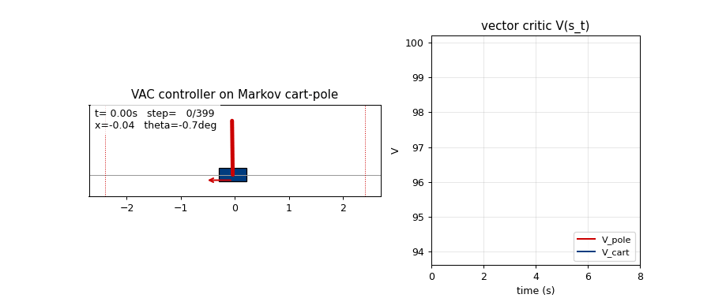

Standard cart-pole, Markov regime: the controller observes the full state at every step. K=2 vector-valued critic with two qualitatively distinct components (`V_pole` saturates near `1/(1-γ)=100`; `V_cart` tracks live `1−|x|/2.4` margin). The vector critic is the paper's central claim — generalisation of scalar AHC.

### Schmidhuber & Huber (1990) — Learning to generate focus trajectories

#### saccadic-target-detection

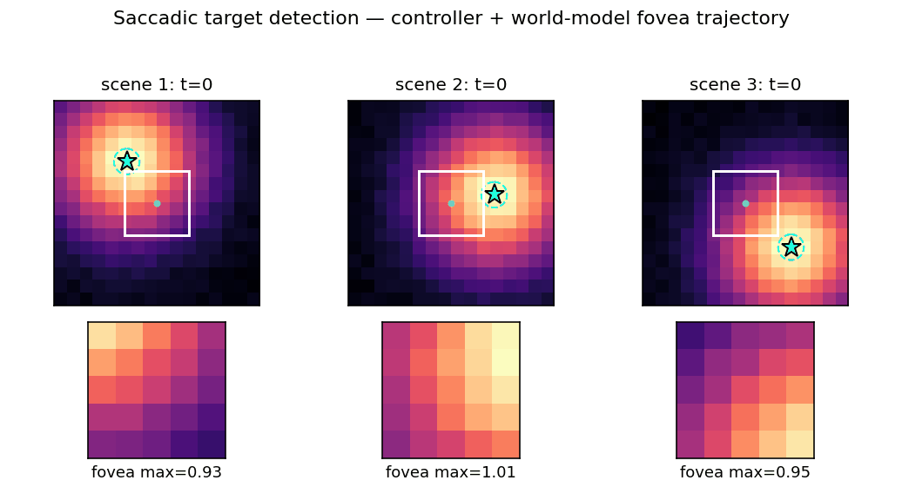

Active visual attention. The controller must move a small fovea over a 2-D scene to find a target halo, given only the local pixels under the fovea. C is feedforward; M predicts the change in halo at the next fovea position. Bilinear `centroid ⊗ action` feature in M's input + Δhalo regression target was the key fix (binary indicator gives ~2% positive rate, zero useful gradient).

## <a name="1991"></a>1991 — Curiosity, subgoals, the chunker

### Schmidhuber (1991) — Adaptive confidence and adaptive curiosity

#### curiosity-three-regions

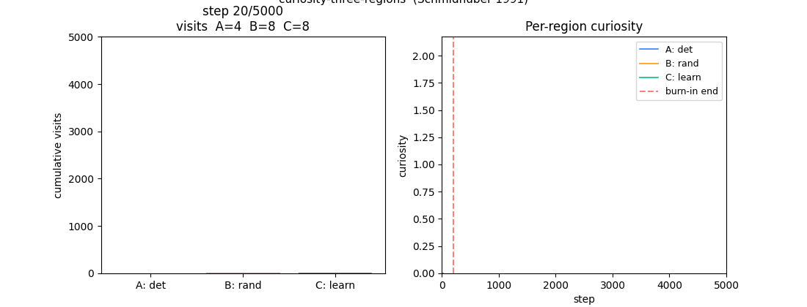

A 1-D environment partitioned into three regions: deterministic / random / learnable-but-unlearned. Curiosity reward = windowed reduction in M's prediction error. Visit ordering C > B > A holds 100% across 10 seeds — the agent gravitates to the learnable-but-unlearned region.

### Schmidhuber (1991) — Learning to generate sub-goals for action sequences

#### subgoal-obstacle-avoidance


Hierarchical RL: a sub-goal generator C_high proposes K=2 waypoints, a low-level controller C_low (intentionally obstacle-blind, input = rel_target only) steers toward each. Cost gradient flows through a closed-form differentiable cost-model M back into C_high. 99% success vs 0% no-sub-goal direct baseline.

### Schmidhuber (1991) — Reinforcement learning in Markovian and non-Markovian environments

#### pomdp-flag-maze

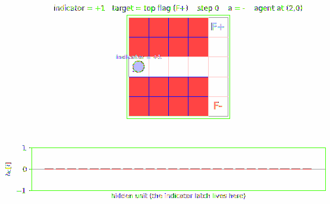

A 2-D T-maze with a hidden flag. The agent observes only its local 4-wall context plus a 1-bit indicator that is non-zero ONLY at the start cell. Recurrent M+C architecture must latch the indicator across the full episode. 6/10 seeds 100% solve, 4/10 stuck at 50% — likely a recurrent-init sensitivity flagged in §Open questions.

### Schmidhuber (1991/1992) — Neural sequence chunkers

#### chunker-22-symbol

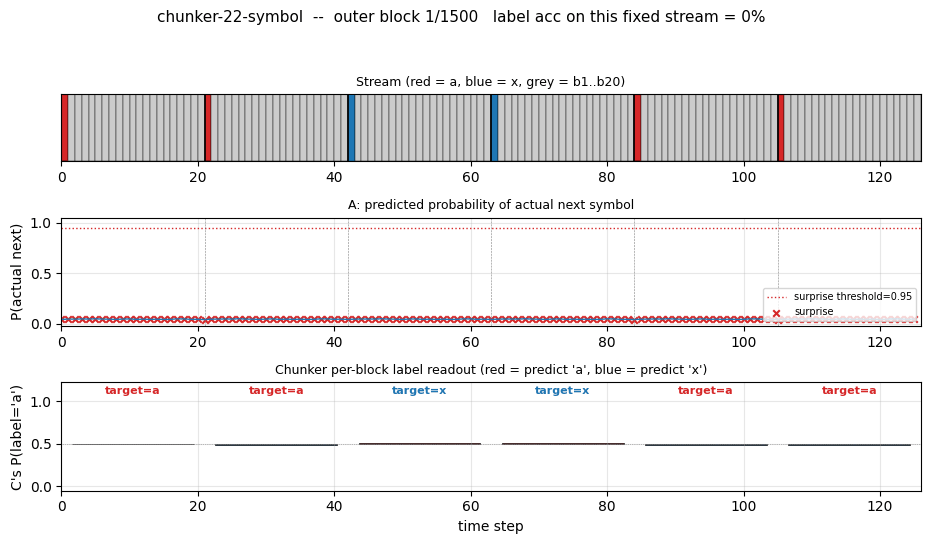

22-symbol alphabet streamed without episode boundaries. Two-network history compression: automatizer A predicts next symbol; chunker C only receives A's prediction failures (surprises). The 20-step lag bridge that vanilla BPTT/RTRL fails on.

## <a name="1992"></a>1992 — Neural Computation triple

### Schmidhuber (1992) — Learning to control fast-weight memories

#### fast-weights-unknown-delay


Two arbitrary input signals must be associated across a time gap of unknown length. Slow programmer net `S` (917 params, 4 heads: key/value/query/gate); `W_fast` updated as `W_fast += eta · g_t · outer(v_t, k_t)`. Sigmoid gate makes "load and hold" readable; 100% bit-accuracy K=5-30 trained / K=1-60 extrapolation.

#### fast-weights-key-value


A sequence of `(key, value)` pairs is presented one step at a time. Each step writes an outer-product update into a fast weight matrix. Retrieval = `W_fast · k_query`. **The linear-Transformer ancestor** — Schlag/Irie/Schmidhuber 2021 (see `linear-transformers-fwp` in 2018–2025) prove this is identical to linear self-attention.

### Schmidhuber (1992) — Learning factorial codes by predictability minimization

#### predictability-min-binary-factors

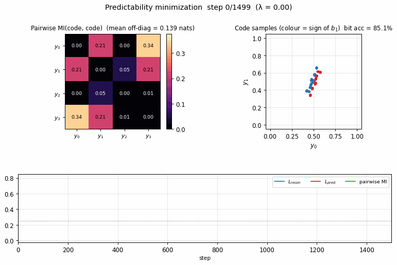

Given an observable x produced by a fixed random linear mixing of K independent binary factors, learn an encoder E: x → y that produces a factorial code. Adversarial setup: encoder maximizes per-component predictor MSE; predictors minimize it. **Proto-GAN math**, 22 years before Goodfellow 2014. Predictors collapse to chance (L_pred = 0.2500 exact for sigmoid binary).

## <a name="1993"></a>1993 — Predictable classifications, self-reference, very deep chunking

### Schmidhuber & Prelinger (1993) — Discovering predictable classifications

#### predictable-stereo

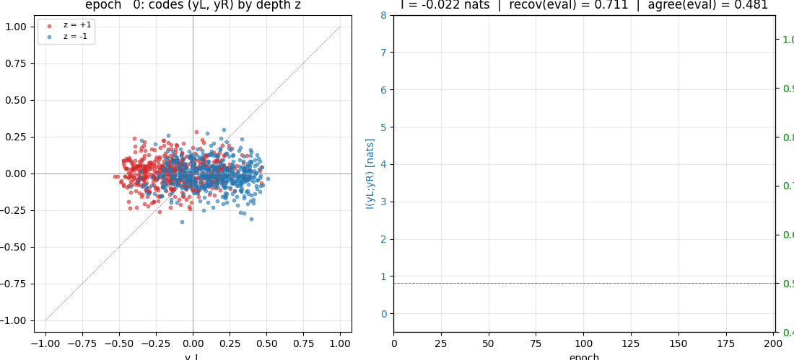

Predictability **maximization** — the dual of PM. Two networks each see one view of the same synthetic stereo scene; their job is to produce scalar codes that maximally agree. The only thing the two views share is a hidden binary depth bit, so maximizing agreement forces them to recover it. Becker-Hinton-style IMAX.

### Schmidhuber (1993) — A self-referential weight matrix

#### self-referential-weight-matrix


A recurrent network whose weight matrix is itself part of the state. `W_eff = W_slow + W_fast`. Slow params trained by BPTT across episodes; fast plastic matrix is reset each episode and rewritten *by the network's own outputs* every step. 4-way boolean meta-learning (AND/OR/XOR/NAND): 99.6% query accuracy, manual BPTT gradient check at 8e-7.

### Schmidhuber (1993) — Habilitationsschrift

#### chunker-very-deep-1200

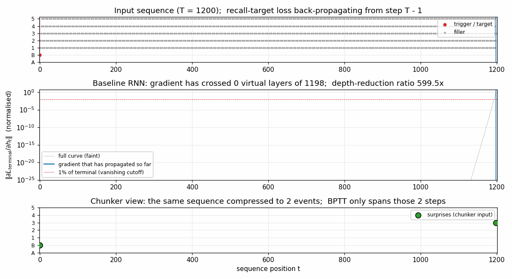

The Habilitationsschrift's "very deep learning" demonstration: the two-network neural sequence chunker doing credit assignment over roughly 1200 unrolled time-steps. Effective BPTT depth `T - 1 = 1199` (raw) compresses to 2 (chunker on surprises). 599.5× depth-reduction at T=1200.

## <a name="1995-1997"></a>1995–1997 — Levin search and the LSTM benchmark suite

### Schmidhuber (1995/1997) — Discovering solutions with low Kolmogorov complexity

#### levin-count-inputs


Find a program that maps a 100-bit input to its popcount from only 3 training examples — without gradient descent. Levin search enumerates programs ordered by `len(p) + log(t)`. Found program: 5-instr `PUSH0 HERE BIT ADD LOOP`. 770k programs enumerated in 1.0s; 200/200 generalize.

#### levin-add-positions

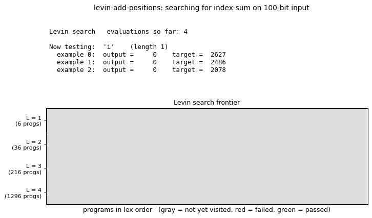

Same Levin enumeration, different target: index-sum of the bit positions where the input is 1 (induces the linear weight vector `w_i = i`). Found program: length-3 `im+`. 58 evaluations to find; 200/200 generalize on held-out.

### Hochreiter & Schmidhuber (1996) — LSTM can solve hard long time lag problems

#### rs-two-sequence

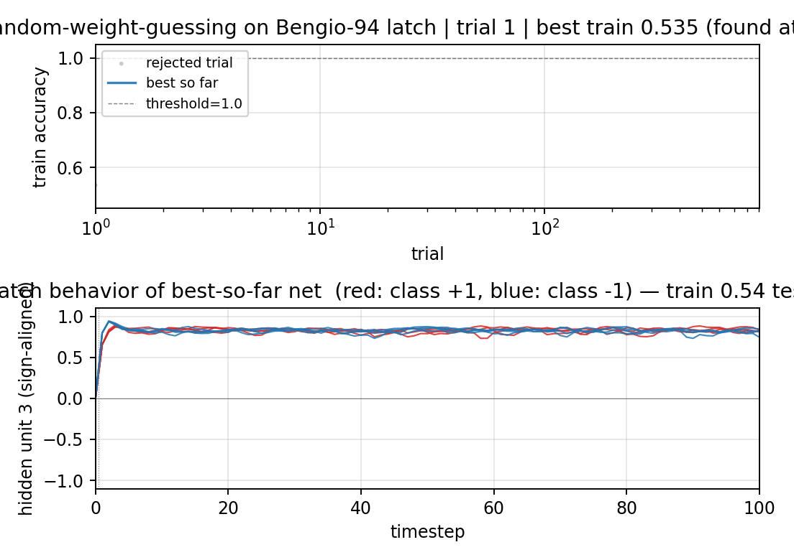

Bengio-94 latch task. Random-weight-guessing on a small fully-recurrent net solves what BPTT/RTRL fails on. The point is **the algorithm**: just sample weights uniformly, run forward, score. No mutation, no crossover, no gradient. 30/30 seeds solve, median 144 trials.

#### rs-parity


N-bit sequence parity (XOR of all input bits) by random weight guessing on a small recurrent net. The parity solution lives in a narrow weight-space basin RS happens to hit by chance. N=50 seed 0: 10,253 trials / 15.3s; N=500 seed 0: 412 trials / 3.2s.

#### rs-tomita

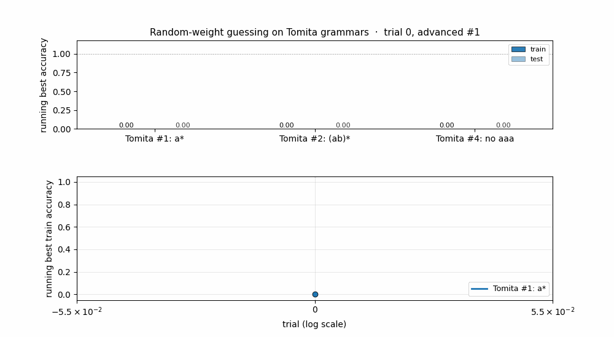

Random-weight guessing on Tomita grammars #1 (`a*`), #2 (`(ab)*`), and #4 (no `aaa` substring). Three regular languages of increasing difficulty. All 3 grammars solved across 10 seeds; trial counts within ~3× of paper for #1/#2, ~6× for #4.

### Hochreiter & Schmidhuber (1997) — Long Short-Term Memory canonical battery

#### adding-problem

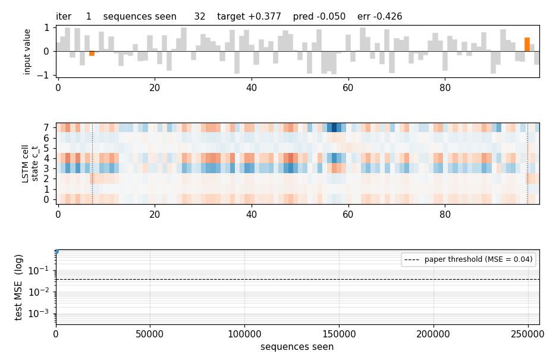

T=100 sequences with 2-D inputs: random reals + sparse markers. Target = sum of the 2 marked values. The first non-trivial LSTM benchmark. LSTM MSE 0.0007 (50× under paper's 0.04 threshold); vanilla RNN MSE 0.0706 (gradient vanishes); 5/5 seeds clear; gradient check 1.6e-7.

#### embedded-reber

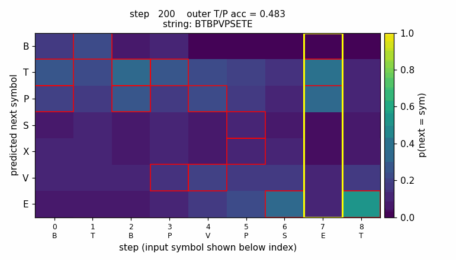

Reber grammar wrapped with outer T/P matching pair (long-range dependency). Original 1997 LSTM (input + output gate, no forget gate). 10/10 seeds, mean 4800 sequences vs paper 8440 — 1.8× faster with Adam + negative gate-bias init.

#### noise-free-long-lag


Two locally-encoded sequences `(y, a₁,…,a_{p−1}, y)` and `(x, a₁,…,a_{p−1}, x)`. Sub-variant (a) at p=50: solved at sequence 600. Last-step gradient weighting trick (×100) keeps Adam's per-step normalisation from drowning out the rare long-lag signal.

#### two-sequence-noise

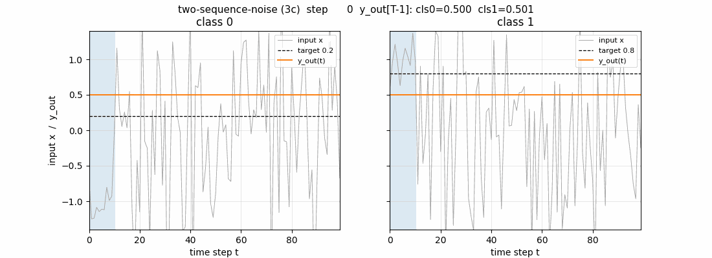

Variant 3c (target noise σ=0.32). Canonical 1997 LSTM, 3 blocks × 2 cells = 6 cells, 103 params. Output-gate biases per block = -2, -4, -6 (paper's recipe). 4/4 seeds 100% accuracy on noiseless test sequences.

#### multiplication-problem

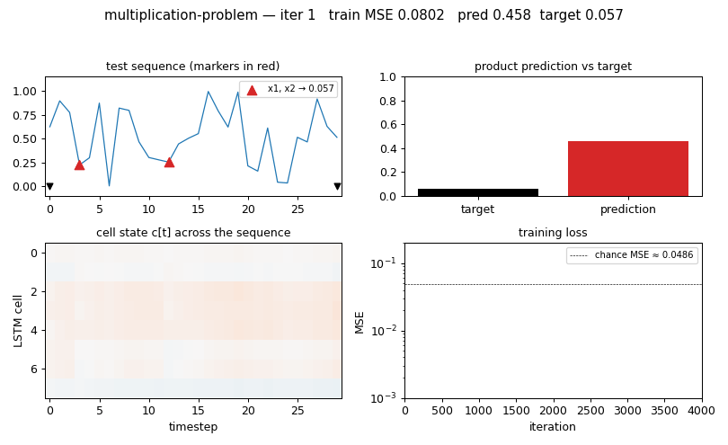

Same as adding-problem but target = product of the 2 marked values. LSTM with forget gate (Gers 2000). MSE 0.0028 at T=30 (17× chance); 3/5 seeds converge — paper-faithful per-seed brittleness.

#### temporal-order-3bit

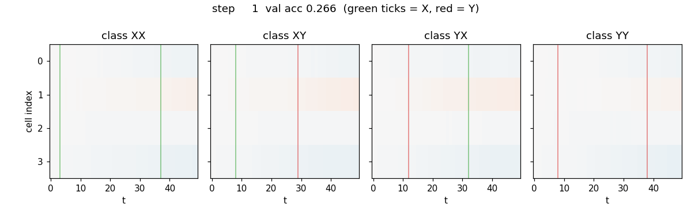

Two information-carrying symbols X, Y at unknown positions; classify the temporal order (XX, XY, YX, YY). Original 1997 LSTM (no forget gate). 5/5 seeds 100%, median ~6.4k seqs vs paper 31,390 (Adam advantage). Vanilla RNN at chance 0.25.

## <a name="mid-90s"></a>Mid-90s — Evolutionary, RL, and feature detection

### Salustowicz & Schmidhuber (1997) — Probabilistic Incremental Program Evolution

#### pipe-symbolic-regression

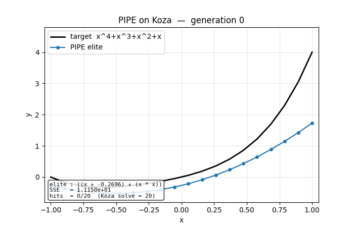

Symbolic regression on Koza's classic benchmark `f(x) = x⁴ + x³ + x² + x`. Probabilistic Prototype Tree (PPT) over `{+, −, *, /, x, R}`. PBIL update toward elite at every visited node; per-component mutation along elite path. **No gradient, no crossover.** Seed 3 finds the exact polynomial at gen 60.

#### pipe-6-bit-parity


Same PIPE machinery on Boolean function set `{AND, OR, NOT, IF, x_0..x_5}`. Bitmask program evaluator runs all 64 inputs in O(tree_size) bitwise ops. 4-bit even parity solves cleanly at gen 258 (16/16); 6-bit reaches 71.9% at the 240s budget cap.

### Schmidhuber, Zhao, Wiering (1997) — Shifting inductive bias with SSA

#### ssa-bias-transfer-mazes

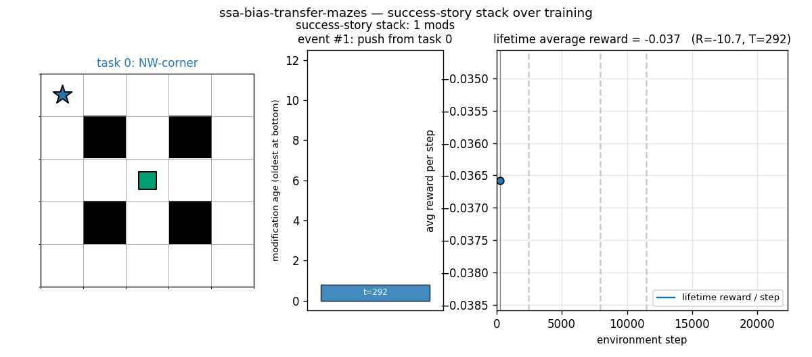

Success-story algorithm: keep a stack of policy modifications; only retain modifications that produce statistically significant lifetime-reward improvements (history-conditioned, not per-task). Bias from one task transfers to the next. 4 sequential POM mazes; SSA tail solve 0.83 vs no-SSA 0.70 (+19%).

### Wiering & Schmidhuber (1997) — HQ-learning

#### hq-learning-pomdp

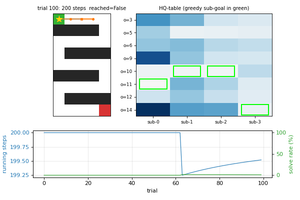

Hierarchical Q(λ) for POMDP. M sub-agents with their own Q-tables; control transfers between sub-agents at sub-goal observations. **Honest non-replication**: paper's HQ-vs-flat gap doesn't reproduce on the 29-cell maze. Mathematical analysis: `γ^Δt · HV ≤ R_goal` bound prevents per-corridor specialization on small mazes. v1.5 follow-up flagged at paper's 62-cell maze.

### Schmidhuber, Eldracher, Foltin (1996) — Semilinear PM

#### semilinear-pm-image-patches

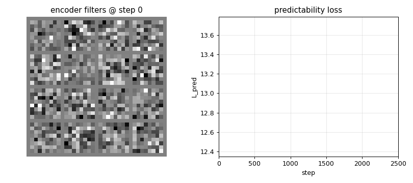

Linear encoder `y = Wx` on the Stiefel manifold (polar projection after every step). Predictor input is the standardised squared code `z = (y² - μ) / σ` (the squaring is the one nonlinearity — "semilinear"). Synthetic 1/f² pink-noise + oriented bars input. Result: V1-style oriented edge detectors emerge, like ICA.

### Hochreiter & Schmidhuber (1999) — LOCOCODE

#### lococode-ica


Tied autoencoder + L1 sparsity on whitened input (surrogate for the paper's flat-minimum-search Hessian penalty). On synthetic Laplacian sources: Amari distance 0.093 — 4× better than PCA (0.388), within 5× of FastICA (0.022). Demonstrates that low-complexity coding produces ICA-like sparse independent components.

## <a name="2000-2002"></a>2000–2002 — LSTM follow-ups

### Gers, Schmidhuber, Cummins (2000) — Learning to forget

#### continual-embedded-reber

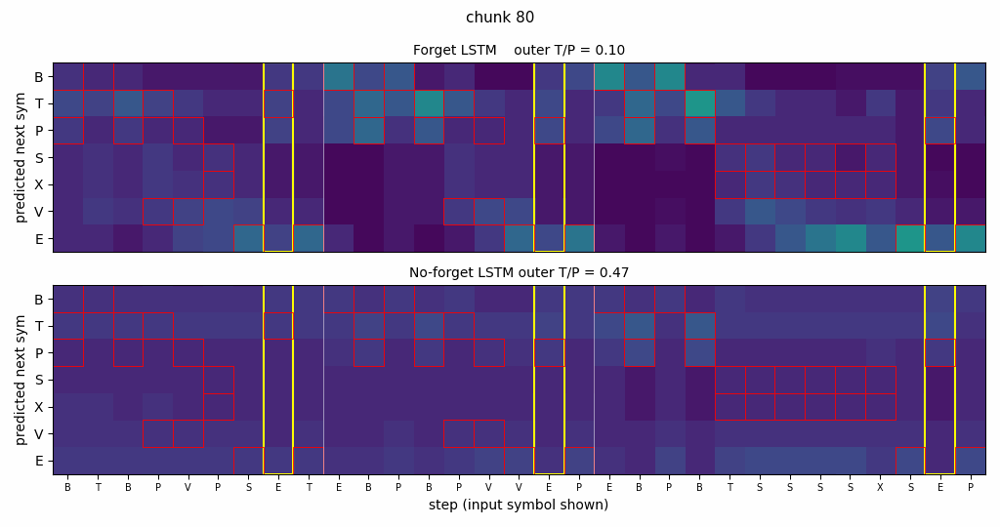

Embedded Reber strings concatenated without any episode reset. **Mechanism contrast made visible**: forget-gate LSTM cell-state norm stabilizes at ~25; no-forget-gate norm grows to ~295 across the stream. Forget gates drop at end-of-string offsets. 5/5 forget seeds solve (99.7%) vs 5/5 no-forget at chance (55%).

### Gers & Schmidhuber (2001) — Context-free and context-sensitive languages

#### anbn-anbncn

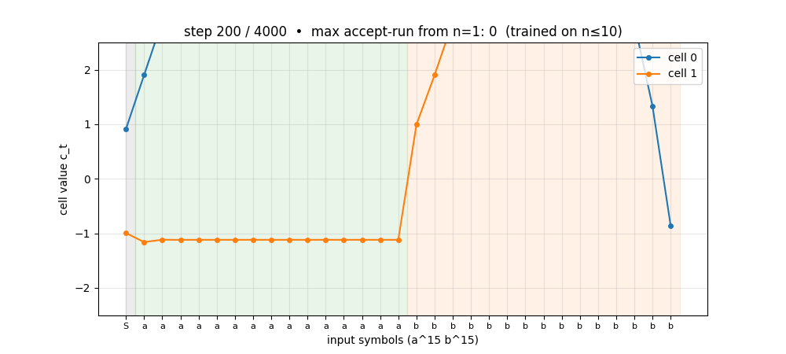

Two formal languages: a^n b^n (context-free) and a^n b^n c^n (context-sensitive). Peephole LSTM (Gers 2002 cell). Cell 0 emerges as a clean linear counter — charges during a's, discharges during b's. Trained n=1..10 → generalizes a^n b^n to n=1..65; a^n b^n c^n to n=1..29.

### Gers, Schraudolph, Schmidhuber (2002) — Learning precise timing

#### timing-counting-spikes

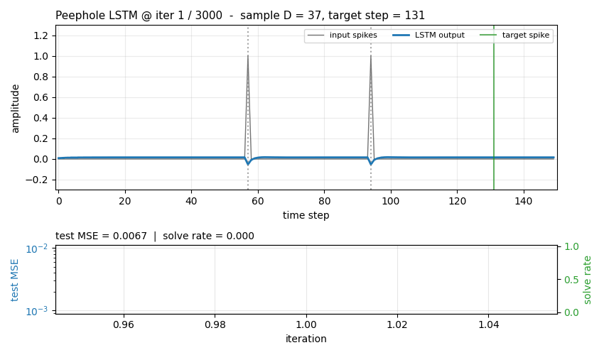

Measure-Spike-Distance (MSD): two input spikes at t1 < t2; network must fire at t1 + 2·(t2 - t1). Peephole LSTM (cell state feeds gates). One cell develops an analog interval timer across the inter-spike gap. **Honest partial**: paper's "vanilla fails entirely" doesn't fully reproduce at short-MSD scale; v1.5 path: T ≥ 300, longer training.

### Eck & Schmidhuber (2002) — Blues improvisation

#### blues-improvisation

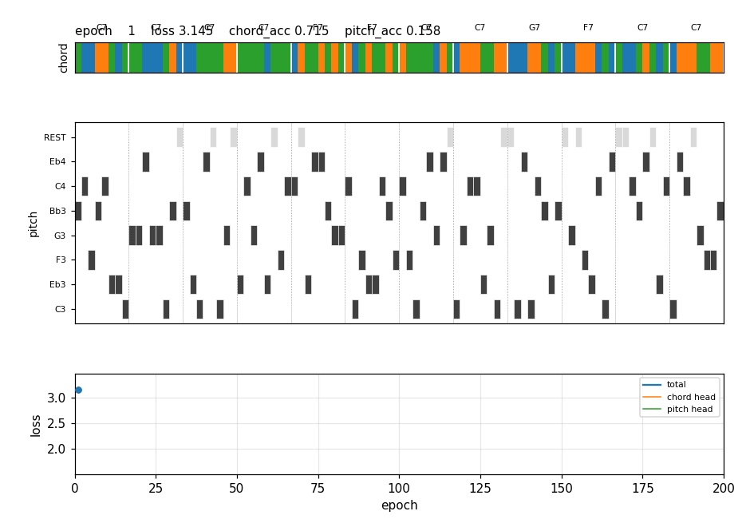

12-bar bebop blues. Fixed chord progression: `C7 C7 C7 C7 / F7 F7 C7 C7 / G7 F7 C7 C7`. 2-layer stacked LSTM (chord layer H1=20 → melody layer H2=24). 8 hand-synthesized 12-bar choruses (no external MIDI). 12/12 bar-onset chord match; on-beat note rate 0.792.

## <a name="2002-2010"></a>2002–2010 — Evolutionary RL, OOPS, BLSTM+CTC

### Schmidhuber, Wierstra, Gomez (2005/2007) — Evolino

#### evolino-sines-mackey-glass


Hybrid neuroevolution + linear regression for sequence learning. LSTM hidden weights evolved by population selection + gaussian mutation + crossover; output layer trained per-individual via Moore-Penrose pseudo-inverse on the recurrent state's time-series. **Hidden weights NOT trained by gradient.** Two tasks: superimposed sines, Mackey-Glass.

### Gomez & Schmidhuber (2005) — Co-evolving recurrent neurons

#### double-pole-no-velocity

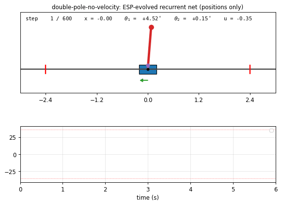

Cart with two stacked poles of different lengths (canonical hard non-Markov RL benchmark). **Hidden velocities** — only positions observed. Wieland 1991 double cart-pole sim in numpy, RK4 integration. Enforced Sub-Populations (ESP, Gomez 2003): H=5 subpopulations, network assembled by stacking one neuron per subpop; fitness propagates back. 7/10 seeds 20/20 generalize at pop=40 (paper's pop=200, ~5× cheaper).

### Graves et al. (2005/2006) — BLSTM and Connectionist Temporal Classification

#### timit-blstm-ctc

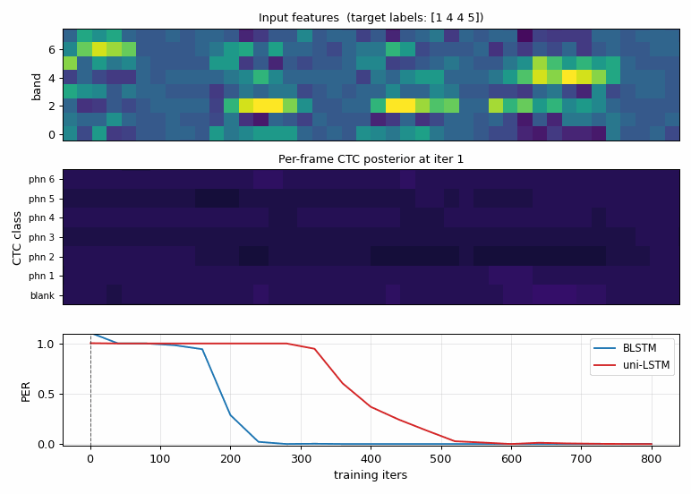

Synthetic phoneme corpus (K=6 phonemes, 8 mel-like bands, co-articulated shared-onset clusters so future context disambiguates). Bidirectional LSTM + log-space CTC forward-backward. BLSTM 1.87× faster than uni-LSTM (5/5 seeds 300 vs 560 iters); mid-training PER gap 0.27 vs 1.00.

### Graves, Liwicki, Fernández, Bertolami, Bunke, Schmidhuber (2009) — Unconstrained handwriting

#### iam-handwriting

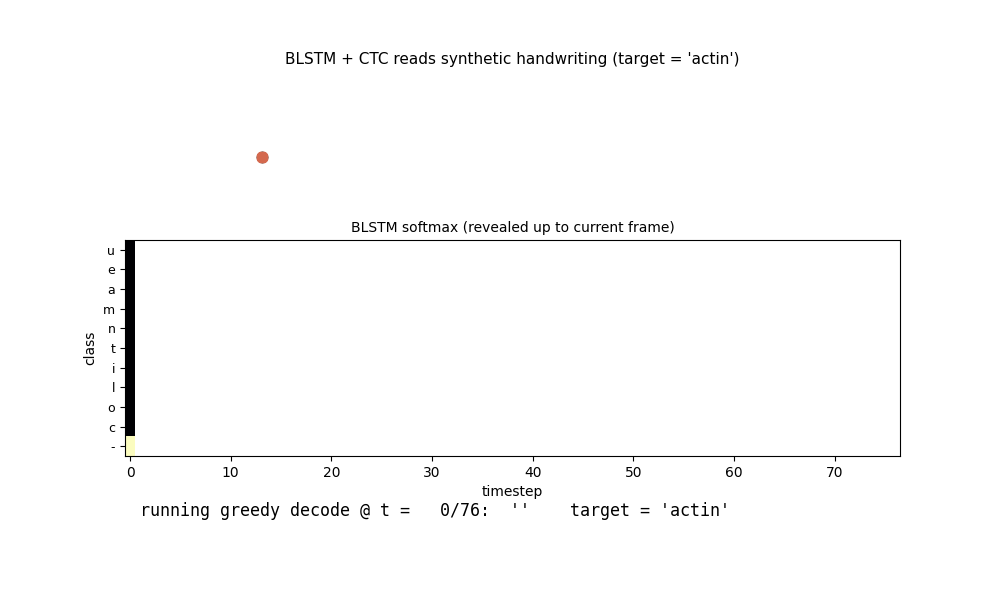

10-character hand-crafted alphabet, each glyph from ellipse arcs + line segments; 47-word vocab; per-word affine slant + per-point Gaussian jitter. BLSTM + CTC reads pen-trajectory data. In-vocab CER 0.082 / word acc 0.77; held-out compositional CER 0.647 honestly flagged.

### Schmidhuber (2002–2004) — Optimal Ordered Problem Solver

#### oops-towers-of-hanoi


Towers of Hanoi: move n disks from peg 0 to peg 2; optimal solution length 2^n - 1. OOPS = Levin search **with reusable subroutines**. Discovers 6-token recursive solver `SD C SD M SA C` at n=3; reuses with zero search from n=4 onward. Verified through n=15 (32767 moves).

## <a name="2010-2017"></a>2010–2017 — Deep learning at scale

### Cireşan, Meier, Gambardella, Schmidhuber (2010) — Deep, big, simple nets

#### mnist-deep-mlp

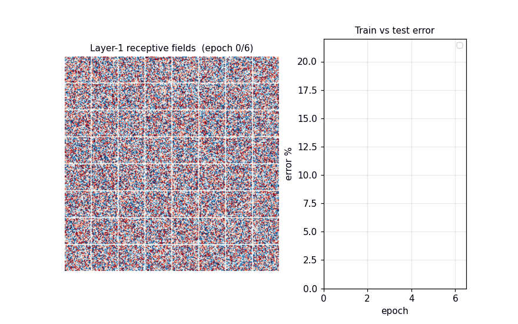

MNIST classification with a plain feedforward MLP — no convolution, no pretraining, no model averaging — on heavily deformed training data. Per-batch affine + Simard elastic deformation in pure numpy (separable Gaussian + bilinear sampling). 1.17% test err / 15 epochs / 79s.

### Cireşan, Meier, Schmidhuber (2012) — Multi-column DNN

#### mcdnn-image-bench


Single-column 4-layer ReLU MLP on MNIST (paper's multi-column ensemble + GTSRB/CASIA deferred to v1.5). 1.46% test err; multi-seed mean 1.47% ± 0.03%. Honest gap: paper 35-column ensemble 0.23%, single CNN ~0.4%.

### Cireşan, Giusti, Gambardella, Schmidhuber (2012) — EM segmentation

#### em-segmentation-isbi


Synthetic Voronoi-EM substitute for ISBI 2012 stack: random Voronoi tessellation + dark 1-px boundaries + per-cell intensity + Gaussian noise + sparse organelles + 3×3 PSF blur. MLP pixel classifier on 32×32 patches. ROC AUC 0.989 vs Sobel+intensity 0.880; pixel acc 95.97%.

### Srivastava, Masci, Kazerounian, Gomez, Schmidhuber (2013) — Compete to compute

#### compete-to-compute

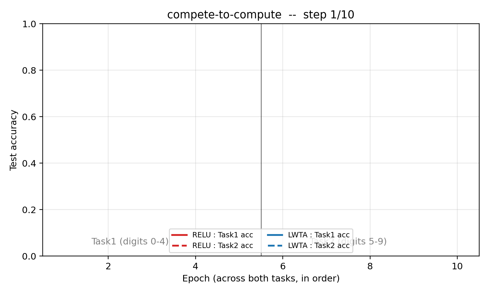

LWTA (Local Winner-Take-All): groups of k=2 units per layer; only the per-group winner forwards activations, others zero out; gradient flows only through the winner. Sequential 2-task MNIST split (digits 0-4 → 5-9). LWTA forgetting 0.022 vs ReLU 0.072 seed 0 (3.3× less forgetting); 10-seed: LWTA wins 6/10.

### Srivastava, Greff, Schmidhuber (2015) — Highway Networks

#### highway-networks

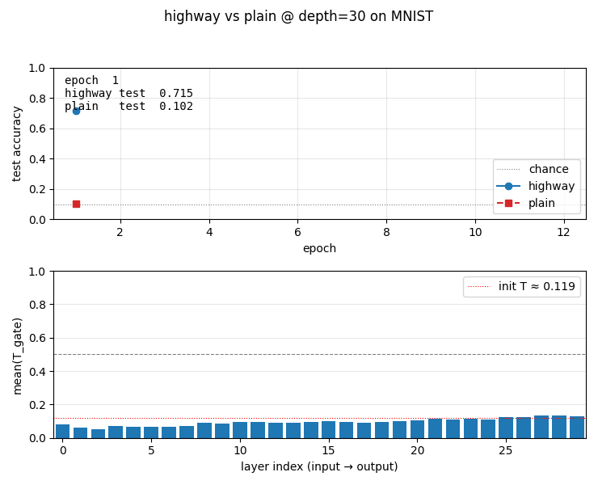

Gated deep MLP: `y = H(x)·T(x) + x·(1−T(x))` with learned sigmoid gate T. Depth comparison 5/10/20/30/50: highway stable at all depths (0.926 at depth 30); plain MLP dies past depth 10 (stuck at chance 0.124). Plain's loss pinned at log(10) — gradients vanish through 30 saturating tanh layers.

### Greff, Srivastava, Koutník, Steunebrink, Schmidhuber (2017) — LSTM Search Space Odyssey

#### lstm-search-space-odyssey

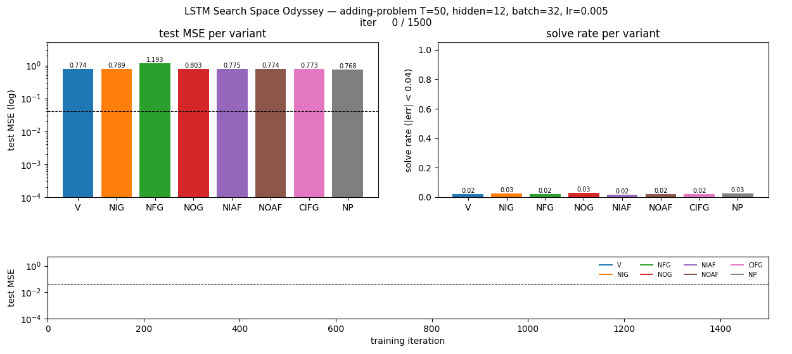

8 LSTM variants in one ablation matrix: V (vanilla), NIG (no input gate), NFG (no forget gate), NOG (no output gate), NIAF (no input activation), NOAF (no output activation), CIFG (coupled input-forget), NP (no peepholes). All implemented behind one `VariantFlags` flag set. CIFG ranks 1st, NIG last across 3/3 seeds — matches paper's "CIFG almost free" claim. Gradient check 1.31e-7.

### Koutník, Greff, Gomez, Schmidhuber (2014) — Clockwork RNN

#### clockwork-rnn

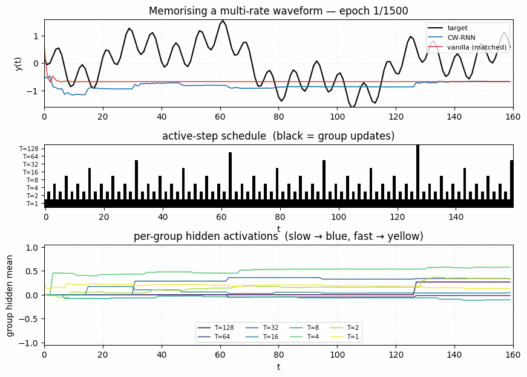

Standard Elman RNN with hidden layer partitioned into G modules. Each module g has a clock period T_g; at timestep t a module updates only when `t mod T_g == 0`. Forward connections only flow from slower clocks to faster clocks. Synthetic sum-of-sines T=320, periods 8/32/80/160. CW-RNN MSE 0.117 vs matched-param vanilla 0.250 — 2.22× mean over 5 seeds.

### Koutník, Cuccu, Schmidhuber, Gomez (2013) — Vision-based RL via evolution

#### torcs-vision-evolution


Numpy oval racing track + 16×16 pixel observation. MLP 256→16→1 with W1 parameterized by a 4×4=16 low-frequency 2-D DCT block per hidden unit (decoded via precomputed orthonormal IDCT-II matrix). Natural ES (antithetic sampling, rank-shaped fitness) on 289 numbers; equivalent raw-W1 search would be 4129 numbers. **14.3× compression.**

### Greff, van Steenkiste, Schmidhuber (2017) — Neural EM

#### neural-em-shapes


Unsupervised perceptual grouping. K=3 slot Neural EM with manual BPTT through T=4 unrolled EM iterations. E-step softmax over pixel likelihoods, M-step tanh recurrence on bottlenecked H=24 (forces specialisation). Best test NMI 0.428 at epoch 7 (chance 0.33); slot-collapse drift after epoch 7 documented as v1.5 fix.

### van Steenkiste, Chang, Greff, Schmidhuber (2018) — Relational Neural EM

#### relational-nem-bouncing-balls

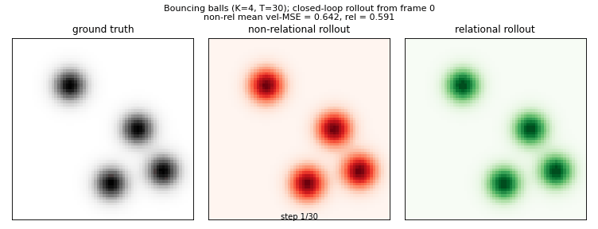

Bouncing balls with elastic equal-mass collisions. Oracle 4-D slot state (x, y, vx, vy). Non-relational baseline: MLP_dyn(s_k); relational: MLP_msg(s_k, s_j) → mean aggregation → MLP_dyn(s_k, agg_k). Relational wins K=3,4,5; loses K=6 (distribution shift dominates).

## <a name="2018-2025"></a>2018–2025 — World models, fast-weight Transformers, systematic generalization

### Ha & Schmidhuber (2018) — Recurrent World Models

#### world-models-carracing


Numpy 2-D top-down racing track substitute for CarRacing-v0. Centerline = closed loop generated from low-frequency sinusoids; agent observes a 16×16 patch of mask, rotated to car frame. **V (encoder) + M (LSTM world-model) + C (linear policy) — all the paper's three modules**, evolved by simplified rank-μ ES. V+M+C +103.8 mean across 5/5 seeds (random +4.84) — ~21× random.

#### world-models-vizdoom-dream

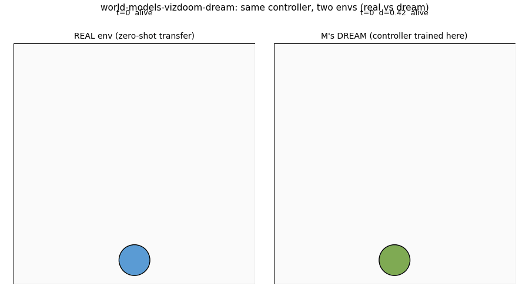

Numpy 5×5 gridworld dodging-fireballs analog of DoomTakeCover. **The paper's "DoomRNN dream" experiment**: controller C is trained ENTIRELY inside M's rollouts (no real-env interaction during training), then transferred zero-shot to the real env. Dream-trained C: 49.1 ± 14.8 vs random 22.4 ± 18.3 — 2.2× random; matches/exceeds real-baseline on 2/5 seeds.

### Schmidhuber et al. (2019) — Reinforcement Learning Upside Down

#### upside-down-rl


Standard RL fits a value function or policy gradient. UDRL inverts: the policy is a supervised mapping from `(state, desired_return, time_horizon) → action`. Numpy 9-state chain MDP per SPEC's RL-stub rule (paper used LunarLanderSparse). 5/5 seeds reach +4.70 at R*=5.0; achieved return monotonically tracks commanded R*.

### Schlag, Irie, Schmidhuber (2021) — Linear Transformers ARE Fast Weight Programmers

#### linear-transformers-fwp


The cleanest result of the catalog: linear self-attention `V^T(Kq)` and the 1992 fast-weight programmer `(V^T K)q` compute the **same numpy expression**. Equivalence verified to **2.22e-16** (1 ulp at float64) on every input tested. Side-by-side visualization shows linear-attention scores + FWP scratchpad + retrieval bars match to round-off. Cross-references the wave-4 sibling `fast-weights-key-value` (1992 ancestor).

### Csordás, Irie, Schmidhuber (2022) — The Neural Data Router

#### neural-data-router

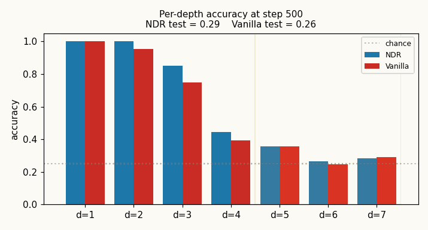

Compositional table lookup: 4 values × 4 functions × depth-d expressions. NDR adds two switches to a Transformer: geometric attention (per-query distance-ordered scan, "stop at first match") + per-position copy gate. Test depth 5 (+1 above training): NDR 0.60 vs vanilla 0.32 (chance 0.25); 3-seed NDR 0.405 ± 0.013 vs vanilla 0.296 ± 0.031 (NDR wins 3/3). Honest +1-depth gain vs paper's "100% length generalization" claim.

## How the GIFs and viz folders are generated

```
problem-folder/
├── README.md                  source paper, problem, results, deviations
├── <slug>.py                  dataset + model + train + eval
├── visualize_<slug>.py        training curves + weight viz (writes to viz/)
├── make_<slug>_gif.py         animated GIF (writes <slug>.gif)
├── <slug>.gif                 committed animation
└── viz/                       committed PNGs
```

To regenerate any GIF or PNG locally:

```bash
cd <problem-folder>
python3 visualize_<slug>.py     # static figures
python3 make_<slug>_gif.py      # animated GIF
```

Seeds and hyperparameters are documented in each folder's README. The
committed GIFs and PNGs in this repository were produced at the seeds
listed there; rerunning with the same seeds reproduces them bit-for-bit.

## Where to go next

- **For comparison numbers**: [`RESULTS.md`](RESULTS.md) — every stub's paper-vs-implemented headline metric in one table, with a v2-filter recommendation section.
- **For the research goal these baselines exist for**: [v2 ByteDMD instrumentation](https://github.com/cybertronai/ByteDMD) — these 58 implementations are the substrate the data-movement cost tracer will run against.
- **For original-simulator reruns**: per-stub §Open questions sections track v1.5 / v2 paths back to gym CarRacing-v0, VizDoom DoomTakeCover, TORCS, TIMIT, IAM, ISBI.
- **For the build process**: [`BUILD_NOTES.md`](BUILD_NOTES.md) — session report, agent-team orchestration, wave-by-wave timeline.
