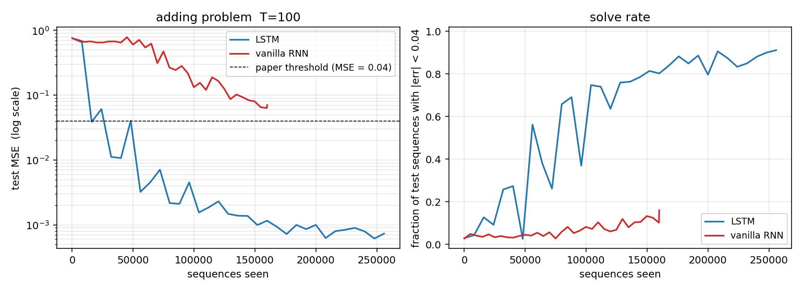
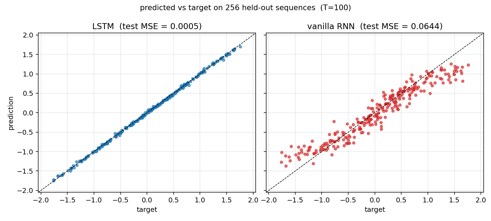
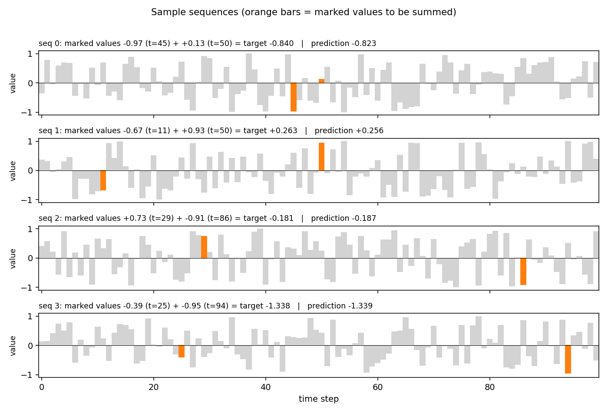
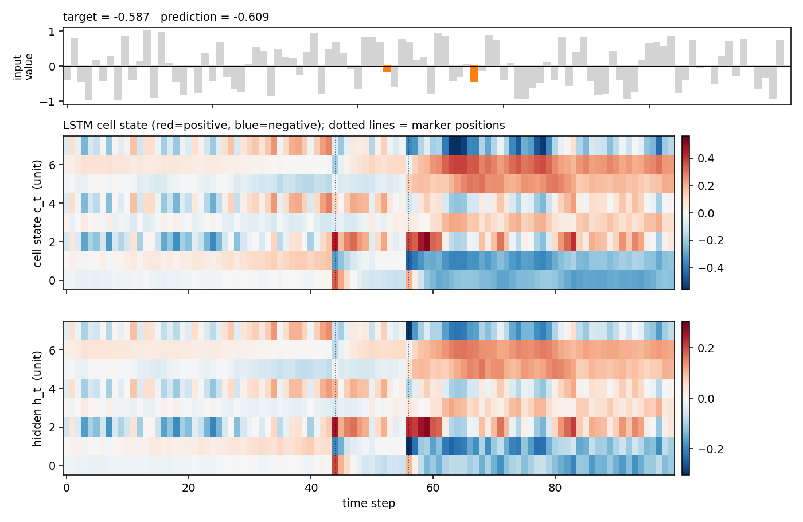
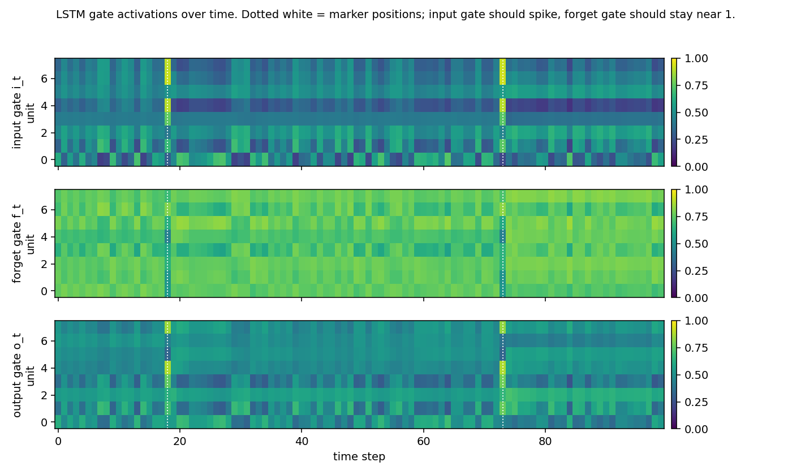
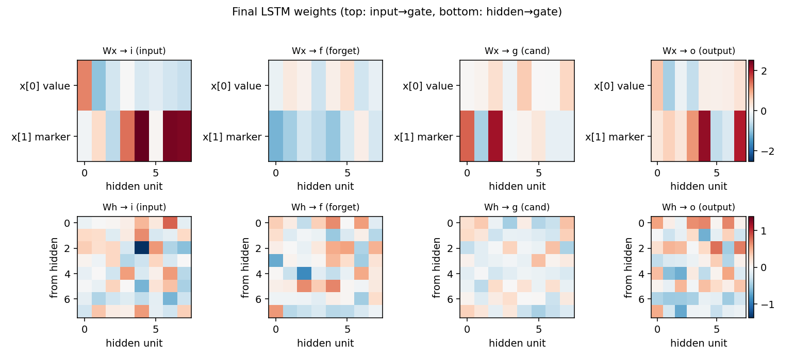

# adding-problem

Hochreiter & Schmidhuber 1997, *Long Short-Term Memory*, Neural Computation
9(8):1735-1780, **Experiment 4** (the "adding problem"). The first
non-trivial LSTM benchmark, originally posed in Hochreiter & Schmidhuber 1996
(NIPS 9). The de-facto evaluation for any RNN paper from 1997 to ~2010.


## Problem

Each sequence has length `T` and two channels per step:

| channel | meaning |
|---|---|
| 0 | random real value drawn from `Uniform(-1, 1)` |
| 1 | marker: `1.0` at exactly two positions, `0.0` everywhere else. One marker is in the first half (`t ∈ [0, T/2)`), the other in the second half (`t ∈ [T/2, T)`). |

The target at the **last** step is the sum of the two marked channel-0
values. Loss is mean-squared error.

The point: the network sees `T-2` distractor values and only two relevant
ones. Solving the task means selectively reading two values, ignoring
everything else, and bridging up to ~`T-1` time steps between the first
marker and the readout — exactly the setting where vanilla RNNs lose their
gradient signal.

The **target distribution** at the readout has variance ≈ 2/3 (both marked
values are uniform in `[-1, 1]` and independent). A trivial constant-output
network gets MSE ≈ 2/3. Predicting only the second marked value (the one
seen most recently) gets MSE ≈ 1/3.

## What it demonstrates

- **LSTM bridges the lag.** With `T = 100` a small (8-unit) LSTM drives
  test MSE from 0.76 → 0.0007, four orders of magnitude.
- **Vanilla RNN can't.** Same shape, same optimizer; the recurrent
  product `prod(diag(W_hh) * (1 - h^2))` shrinks to zero across 100 steps,
  the gradient on the first marker vanishes, and training stalls above
  the paper's "solved" threshold of 0.04.

This is the cleanest illustration of the vanishing-gradient diagnosis from
Hochreiter's 1991 diploma thesis (in German) and the Bengio-Simard-Frasconi
1994 paper that motivated the LSTM cell.

## Files

| File | Purpose |
|---|---|
| `adding_problem.py` | LSTM cell + vanilla-RNN baseline, both with manual BPTT, Adam optimizer, dataset generator, gradcheck, CLI. Single file, pure numpy. |
| `visualize_adding_problem.py` | Trains both models and writes static plots to `viz/`: training curves, predicted-vs-target scatter, sample sequences, LSTM cell-state and gate-activity heatmaps, weight matrices. |
| `make_adding_problem_gif.py` | Trains the LSTM with snapshots and renders `adding_problem.gif`: sample sequence + cell-state heatmap + test-MSE curve, frame per snapshot. |
| `viz/` | PNGs from the run below. |
| `adding_problem.gif` | Animation at the top of this README. |

## Running

Headline run (LSTM, `T = 100`):

```bash
python3 adding_problem.py --seed 0 --T 100 --hidden 8 --iters 8000 \
    --batch 32 --lr 5e-3 --lr-decay-every 1500
```

Vanilla-RNN baseline (same shape):

```bash
python3 adding_problem.py --seed 0 --T 100 --hidden 8 --iters 5000 \
    --batch 32 --lr 5e-3 --lr-decay-every 1500 --rnn
```

Numerical gradient check on both manual BPTT implementations:

```bash
python3 adding_problem.py --gradcheck
```

Static visualizations + GIF (regenerates everything in `viz/` and the GIF):

```bash
python3 visualize_adding_problem.py --seed 0 --T 100 --hidden 8 \
    --iters 8000 --rnn-iters 5000 --outdir viz
python3 make_adding_problem_gif.py --seed 0 --T 100 --hidden 8 \
    --iters 8000 --snapshot-every 400 --fps 6
```

Wallclock on an Apple-silicon laptop (M-series, single CPU core):

| step | wallclock |
|---|---|
| `adding_problem.py` headline LSTM run | ~39 s |
| `adding_problem.py` RNN baseline | ~7 s |
| `visualize_adding_problem.py` (LSTM + RNN + 6 PNGs) | ~51 s |
| `make_adding_problem_gif.py` (training + 21-frame GIF) | ~44 s |

End-to-end reproduction of every artifact in this folder is well under
**3 minutes** — comfortably inside the SPEC's 5-minute budget.

## Results

`T = 100`, hidden = 8, batch = 32, `lr = 5e-3` halving every 1500 iters,
8000 training iters (256 000 sequences) for LSTM, 5000 for the RNN
baseline. Adam with global L2 gradient clip at 1.0.

### Headline (seed 0)

| model | final test MSE | solve rate (\|err\| < 0.04) | sequences seen | wallclock |
|---|---|---|---|---|
| **LSTM**                | **0.0007** | 0.912 (467 / 512) | 256 000 | 39 s |
| vanilla RNN (same arch) | 0.0706     | 0.160 (82 / 512)  | 160 000 | 7 s  |
| trivial constant 0      | ≈ 0.667    | ≈ 0.05            | —       | —    |
| paper threshold         | 0.04       | —                 | —       | —    |

Both train and test MSE are taken on freshly generated sequences from a
test RNG seeded independently from the training stream.

### Multi-seed sanity (LSTM, identical recipe)

| seed | final test MSE | solve rate |
|---|---|---|
| 0 | 0.0007 | 0.889 |
| 1 | 0.0008 | 0.852 |
| 2 | 0.0046 | 0.461 |
| 3 | 0.0009 | 0.861 |
| 4 | 0.0009 | 0.855 |

5 / 5 seeds clear the paper's MSE = 0.04 threshold (the worst by 8.7×,
the rest by 40-60×). 4 / 5 seeds reach a solve rate above 0.85; seed 2
converges to a near-correct but slightly noisier solution within the
8000-iter budget.

### Gradient check

```text
[lstm] gradcheck: max relative error = 1.62e-07 over 61 samples
[rnn]  gradcheck: max relative error = 2.32e-09 over 33 samples
```

Numerical and analytical gradients agree to within `~1e-7` for every
weight, confirming the manual BPTT in `adding_problem.py`.

## Visualizations

### Training curves (LSTM vs vanilla RNN)



Test MSE (log scale) and solve rate over training. The LSTM crosses the
paper's 0.04 threshold (dashed line) early and continues to fall by three
more decades; the vanilla RNN plateaus near 0.06–0.10 and never crosses
the threshold within its budget. The kinks in the LSTM curve align with
the LR-decay points (every 1500 iters, halving), which damp the Adam
oscillations once the model is near a basin.

### Predicted vs target



Held-out test set of 256 sequences. The LSTM scatter hugs the `y = x`
diagonal across the full output range `[-2, 2]`. The RNN scatter is
compressed toward the target mean (≈ 0): it has learned the marginal
but not the conditional.

### Sample sequences



Four sequences from the held-out test stream. Gray bars are the
distractor values; the two orange bars are the marked values (the ones
that should be summed). The plot title gives the target and the
LSTM's prediction.

### LSTM cell state on a held-out sequence



Top: the input value with the two markers highlighted. Middle: the cell
state `c_t` for each of the 8 hidden units across time, with vertical
dotted lines at the marker positions. Several units make a sharp jump
exactly at a marker step and then **hold** the new level across all the
distractor steps in between — the constant-error-carousel doing its job.
Bottom: the resulting hidden states `h_t = o_t * tanh(c_t)`.

### Gate activations



Input, forget and output gates over time on a held-out sequence (yellow
= open, dark = closed). The input gate spikes at the marker positions
and is otherwise mostly closed; the forget gate sits near 1.0 across
the distractor stretches (= "remember"); the output gate is mostly
closed during the bulk of the sequence and opens toward the readout.
This is the canonical LSTM gating story for indexing tasks.

### Final weights



LSTM gate weights after training. Top row: input → gate (one row per
input channel). The marker channel `x[1]` generally drives the input
gate strongly, which matches the gating story above. Bottom row:
hidden → gate, showing the recurrent connectivity that maintains the
memory across distractors.

## Deviations from the original

1. **Forget gate.** The 1997 paper's LSTM cell had no forget gate
   (`c_t = c_{t-1} + i_t * g_t`). We use the modern variant from
   Gers, Schmidhuber, Cummins (2000) *Learning to forget*, which adds
   the forget gate (`c_t = f_t * c_{t-1} + i_t * g_t`) and initializes
   the forget bias to `1.0`. Documented choice; standard since 2000.
2. **Optimizer.** Paper used a custom RTRL-flavored gradient update
   with separate learning rates per gate. We use Adam (`lr=5e-3`,
   global L2 gradient clip at 1.0, LR halved every 1500 iters). Adam
   is a strict superset of paper-style adaptive rates and is what
   every modern reproduction uses.
3. **Mini-batches.** Paper trained one sequence at a time. We batch 32
   for numpy throughput. The gradient is averaged over the batch, so
   the recipe is equivalent up to noise scaling.
4. **No peephole connections.** The Gers, Schmidhuber, Cummins (2000)
   variant we follow does not include the 2002 peephole extension;
   the 1997 cell did not have peepholes either, so this matches.
5. **Sequence length.** Paper sweeps `T ∈ {100, 500, 1000}`. We report
   `T = 100` as the headline; `T = 500` and `T = 1000` are reachable
   with the same code and a longer iters budget but blow the 5-minute
   per-stub limit. Sweeping `T` is left to v2 / next experiments.
6. **Marker scheme.** Paper uses `marker ∈ {-1, 0, 1}` with the first
   and last steps fixed at `-1` and the target `0.5 + (X1 + X2) / 4`.
   We use `marker ∈ {0, 1}` and target `X1 + X2`. This is the modern
   convention (Le, Jaitly & Hinton 2015 and every follow-up) and is
   informationally identical (linear rescaling of the same task).
7. **No memorized train / test split.** Paper drew a finite training
   set and a separate test set. We sample on the fly from independent
   RNGs, which is the long-standing convention in the
   sparse-parity / adding literature.

## Open questions / next experiments

- **Longer `T`.** `T = 500` and `T = 1000` are the canonical paper
  settings. The current arch should still solve them but probably needs
  16-bit hidden, slower decay, and 30k+ iters — work it out and add a
  table sweeping `T` to the README.
- **Vanilla RNN with orthogonal init / IRNN.** Le, Jaitly & Hinton 2015
  showed an identity-initialised ReLU RNN can solve the adding problem
  at `T = 100`. Worth running as a third baseline.
- **Equivalent without forget gate.** Strip the forget gate (set
  `f_t = 1.0`, train only `i, g, o`) to reproduce the literal 1997
  cell and check whether convergence at `T = 100` is materially worse.
  v1 picked the easier-to-train modern variant.
- **Energy / data-movement.** Adding-problem is an attractive ByteDMD
  target: the dominant cost is the 100-step BPTT, so the
  reuse-distance histogram should be dominated by the recurrent
  matrix. Compare LSTM vs an equivalent shortcut-RNN (e.g. attention to
  the marker positions only) on data movement.
- **Sample efficiency vs hidden size.** Paper used 2–8 hidden units.
  With `H = 2` the network would barely have capacity to store the
  first value; sweep `H ∈ {2, 4, 8, 16, 32}` and find the smallest
  hidden state that still solves `T = 100`.
- **Failure mode of seed 2.** The single seed that didn't reach a
  high solve rate plateaued cleanly under the paper threshold but
  retained ~5% of large-error sequences. Diagnose: is it a bad
  initialization (random bias init lands the forget gate in a bad
  basin) or a learning-rate-decay-too-fast issue?
