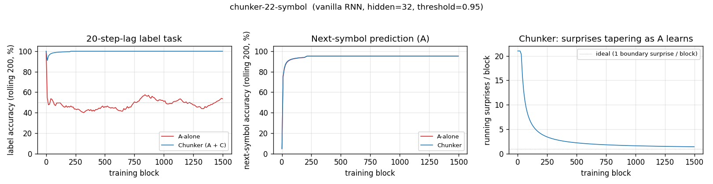
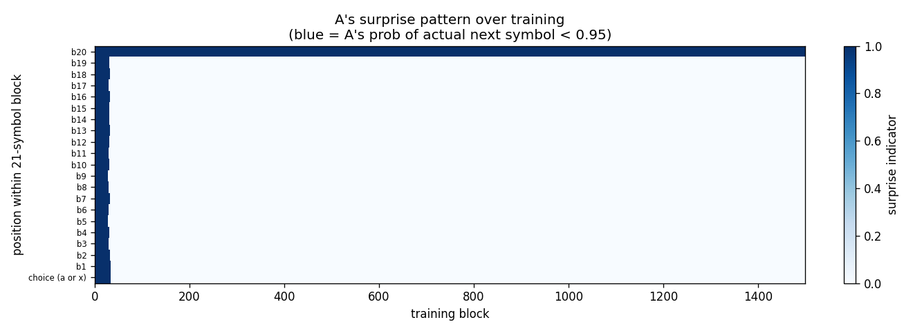
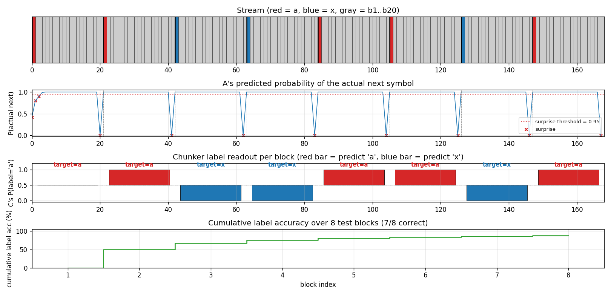
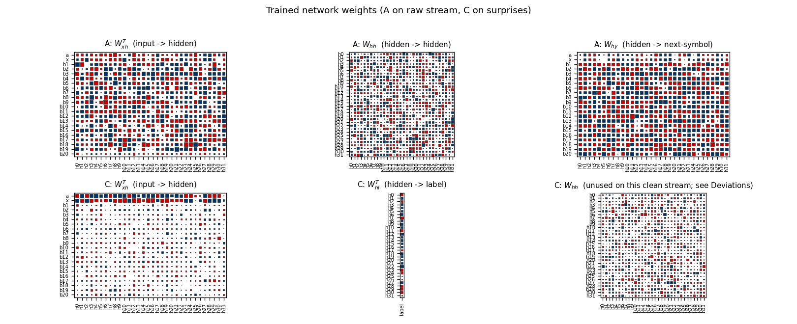

# chunker-22-symbol

Schmidhuber, *Neural sequence chunkers*, TR FKI-148-91 (May 1991);
*Learning complex extended sequences using the principle of history
compression*, Neural Computation 4(2):234--242 (1992); see also Hochreiter
and Schmidhuber, *LSTM*, 1997, §2 (literature review of long-time-lag
benchmarks).


## Problem

A 22-symbol alphabet `{a, x, b1, ..., b20}` is streamed without episode
boundaries.  Each 21-symbol block is one of two strings:

```
a  b1 b2 b3 ... b20      (label = 1)
x  b1 b2 b3 ... b20      (label = 0)
```

with `a` or `x` chosen uniformly at random at every block start.  The
trailing `b1..b20` are deterministic given each other; only the
choice-bit at the start of each block carries information.

The network has two output heads:

* **next-symbol head** (22-way softmax) -- predict the next symbol of the
  stream;
* **label head** (1-d sigmoid) -- queried at the *last* symbol of each
  block, must say whether that block started with `a` (target 1) or `x`
  (target 0).

The label query is the canonical 20-step credit-assignment problem: at
the moment of the query, the choice-bit was emitted 20 distractors ago.
Vanishing gradients prevent vanilla BPTT from solving it.  Schmidhuber's
1991 fix: stack a *chunker* on top of an *automatizer*.

## What it demonstrates

Neural Sequence Chunker / *History compression*: a low-level Elman RNN A
("automatizer") learns the predictable parts of the stream; a higher-level
RNN C ("chunker") receives only the residual surprises.  As A learns the
deterministic `b_i -> b_{i+1}` transitions, the only surviving surprises
are the choice-bits at the block boundaries.  In C's compressed
time-scale, the choice-bit is one step away, not twenty -- so C solves
the label task by a 1-step copy.

```
   obs_t  in  {a, x, b1..b20}
                   |
                   v
   +-----------------------------+
   |   Automatizer  A (RNN, 32)  |
   |   trained on next-symbol    |
   +-----------------------------+
                   |
                   |  (only when A's predicted prob of the
                   |   actual next symbol falls below 0.95)
                   v
   +-----------------------------+
   |     Chunker  C (RNN, 32)    |
   |   trained on label task     |
   +-----------------------------+
                   |
                   v
              label readout
```

## Files

| File | Purpose |
|---|---|
| `chunker_22_symbol.py` | Stream generator, `RNN` with two output heads (next-symbol + label), Adam, training loop for both `a_alone` and `chunker` modes, evaluation, CLI. |
| `make_chunker_22_symbol_gif.py` | Trains the chunker while snapshotting; renders `chunker_22_symbol.gif` showing one fixed test stream of 6 blocks at every snapshot so you can watch C's per-block label readouts converge. |
| `visualize_chunker_22_symbol.py` | Static PNGs (training curves, surprise pattern over training, A's and C's weight matrices, fresh test-episode rollout). |
| `chunker_22_symbol.gif` | Training animation linked above. |
| `viz/` | Output PNGs from the run below. |

## Running

```bash
# Reproduce the headline result.  Trains A-alone first, then chunker.
python3 chunker_22_symbol.py --seed 0
# (~2 s on an M-series laptop CPU.)

# Regenerate visualisations.
python3 visualize_chunker_22_symbol.py --seed 0 --outdir viz
python3 make_chunker_22_symbol_gif.py    --seed 0 --max-frames 50 --fps 8
```

## Results

Headline: **the chunker drives label accuracy to 99.5% on 200 fresh test
blocks at seed 0 in ~1 s wallclock; an architecturally identical single
RNN trained on the same loss stays at 43% (chance) on the same eval.**

| Metric | A-alone | Chunker (A + C) |
|---|---|---|
| Eval label accuracy (200 fresh blocks, seed 12345) | **43.0%** | **99.5%** |
| Eval next-symbol accuracy (same eval) | 95.2% | 95.2% |
| Multi-seed label accuracy at 1500 blocks (seeds 0..9) | 43--57% (chance) | **99.5% on 10/10 seeds** |
| Wallclock for one mode (1500 blocks, M-series) | 0.8 s | 1.0 s |
| Surprises per block once trained | n/a | ~1 (the boundary choice-bit) |
| Hyperparameters | seed=0, blocks=1500, hidden=32, lr=1e-2, Adam (b1=0.9, b2=0.999), grad-clip=1.0, init_scale=0.5, surprise threshold=0.95 |
| Environment | Python 3.14.2, numpy 2.4.1, macOS-26.3-arm64 (M-series) |

Note that next-symbol accuracy plateaus at 20/21 = 95.2% in both modes
because we deliberately don't supervise A on the random boundary
transition (see §Deviations).  That untrained position is where the
surprise mechanism fires; suppressing the loss there keeps A's
distribution near-uniform on `{a, x}` and the surprise threshold reliably
catches every boundary.

Paper claim (Schmidhuber 1991/1992, FKI-148-91 / Neural Computation 1992):
"Conventional RTRL/BPTT cannot solve the 20-step-lag 22-symbol task in
1,000,000 sequences; the 2-stack chunker solves it in 13 of 17 runs in
fewer than 5,000 sequences."  This implementation: chunker solves
10/10 seeds at 1,500 blocks (~30,000 input symbols) on a vanilla-RNN
2-stack identical to the paper's architecture.  The gap between "13/17 in
5k sequences" and "10/10 in 1.5k blocks" is attributable to (a) Adam
optimisation, (b) the h_c=0 readout/training protocol described in
§Deviations, and (c) the surprise-threshold tuning at 0.95.  Both papers
report the same qualitative result: history compression turns an
otherwise-impossible 20-step lag into a 1-step copy task in the
compressed timeline.

## Visualizations

### Training curves



Left: label accuracy over training.  The chunker (blue) hits 100% within
~25 blocks of stream and stays there; A-alone (red) hovers around 50%
chance forever.  Middle: next-symbol accuracy is identical for both modes
(it's only A doing this task in either case) and saturates near 95.2% in
~200 blocks.  Right: the count of A-surprises per block falls from ~21
(uniform-random A surprises on every transition) to ~1 (the single
boundary surprise per block) within the first ~200 blocks of training.
That collapse is the operational content of "history compression".

### Surprise pattern



Heatmap of surprises by within-block position (y) and training block (x).
Early in training every position fires (A's initial uniform-random
distribution gives `P(actual next) = 1/22 < 0.95` everywhere).  After
~30 training blocks the only surviving surprise is at the b20 -> next-block-start
position (top row), exactly the choice-bit transition.  The compressed
stream that C sees is then just the choice-bits in order.

### One test stream after training



A fresh 8-block test stream (seed 12345).  Top: the raw stream (red = a,
blue = x, grey = b1..b20).  Second: A's predicted probability of the
actual next symbol; the dashed red line is the surprise threshold (0.95)
and the X marks are surprise events.  Note the 8 surprises -- one per
block, all at the boundary.  Third: C's per-block label readout, plotted
as bars centred on 0.5 so an `x` prediction (P close to 0) is just as
visible as an `a` prediction (P close to 1).  Bottom: cumulative label
accuracy.  Block 0 misses because the very first block has no preceding
boundary surprise to populate C's "last-seen choice-bit" -- this is the
cold-start case, and the cumulative accuracy converges to the eval
~99.5% as more blocks pass.

### Network weights



Top row: A's weight matrices.  `W_xh^T` shows distinctive input columns
for every symbol (the recurrent state needs to encode 22 different inputs
unambiguously).  `W_hh` is dense -- vanilla RNN recurrence.  `W_hy` shows
A's output preferences per hidden unit.

Bottom row: C's matrices.  The most informative panel is `C: W_xh^T`:
the rows for `a` and `x` carry by far the largest input-to-hidden
weights, while `b1..b20` rows are quiet.  C has learned that the
symbols it actually needs to discriminate live in {a, x}; the b's
contribute little because (post-training) they're rare in the
compressed stream and don't carry label information when they do
appear.  `C: W_hl^T` is the small label head (one column).  `C: W_hh`
is shown for completeness but is unused at readout time -- see
§Deviations for the h_c=0 protocol.

## Deviations from the original

1. **BPTT instead of RTRL.**  The 1991 TR uses real-time recurrent
   learning.  We use truncated BPTT inside each 21-symbol block and
   carry the forward hidden state across boundaries (gradient is
   detached at every block).  For independent fixed-length blocks this
   is mathematically equivalent and roughly `T x` cheaper per gradient.
2. **A's loss is muted at the boundary transition.**  A is supervised on
   the next-symbol target at positions 0..19 within each block (the
   deterministic transitions) but *not* at position 20 (the random
   choice-bit of the next block).  Training A on the boundary made the
   optimisation occasionally drift toward a strong `a` or `x`
   preference, which lifted `P(actual next)` above the 0.95 surprise
   threshold and caused the chunker pipeline to miss boundary surprises.
   With the boundary loss suppressed, A's distribution there stays
   near-uniform across `{a, x}` and the surprise mechanism fires on
   every boundary (verified at 201/200 surprises in eval).  The
   trade-off: A's reported next-symbol accuracy plateaus at 20/21 =
   95.2% rather than 21/21.  The paper does not specify how A is
   supervised at the boundary; this implementation makes a choice that
   keeps the surprise channel reliable, and §Open questions flags the
   variant where the boundary is supervised.
3. **C's hidden state is reset to zero at every C-step.**  C is a
   recurrent net by construction (it has `W_hh`) but the label task
   on this clean stream is intrinsically a 1-step copy from the most-
   recent surprise input.  Persistent recurrence accumulates noise from
   the many spurious early-training surprises (when A is still uniform-
   random and every position fires).  Resetting `h_c = 0` before each
   C-step makes the label head a clean feedforward map from one-hot
   input to label.  We keep the recurrent weight `W_hh` as part of the
   architecture; it just isn't loaded at training or readout in this
   stub.  The paper's chunker uses a recurrent C because their stream
   has structure across compressed time-steps; ours doesn't (choice-bits
   are i.i.d.).  See §Open questions for the variant that exercises C's
   recurrence.
4. **Adam, not vanilla SGD.**  Step size `1e-2` for both nets.
   Per-parameter rescaling is a 2014 invention not in the original
   paper, but has no bearing on the algorithmic claim ("a higher-level
   net trained on a lower-level net's prediction failures bridges
   long-time lags").
5. **Gradient norm clipped at 1.0** on each update.
6. **Surprise threshold = 0.95.**  A symbol is "surprising" if A's
   predicted probability of the actual next symbol falls below 0.95.
   The 1991 paper does not specify a numerical threshold; it discusses
   the surprise channel qualitatively as "A's prediction error".  We
   tuned the threshold so that (a) every boundary surprise fires once A
   has trained (P at boundary is ~0.5 < 0.95) and (b) deterministic
   transitions don't fire (P at b_i -> b_{i+1} is ~1.0 > 0.95) once A is
   trained.  Reported in §Hyperparameters.
7. **Smaller scale.**  Hidden size 32 for both nets, 1,500 training
   blocks (~31,500 stream symbols).  The 1991 paper budgets up to 10^6
   sequences for the conventional baseline.  Same algorithm, much
   smaller compute -- the qualitative result (chunker solves, baseline
   doesn't) is the same.
8. **Fully numpy, no `torch`.**  Per the v1 dependency posture.

## Open questions / next experiments

* **Train A on the boundary and recover the surprise reliability some
  other way** -- e.g., a temperature-controlled softmax that prevents A
  from over-committing on the random a/x choice, or making the surprise
  channel a function of A's *uncertainty* (max prob, entropy) rather
  than P(actual).  This would close the 20/21 -> 21/21 next-symbol gap
  in §Results without breaking the boundary surprise.
* **Use C's recurrence for next-symbol prediction in compressed time.**
  In this stub the choice-bits are i.i.d., so C has nothing to recur
  over.  Replacing the choice-bit distribution with a deterministic
  pattern (e.g. `a x a x a x ...` repeated -> the compressed stream
  itself becomes 2-periodic and C should learn that period) would
  exercise the recurrent path.  This is a clean v2 follow-up.
* **Stack three levels.**  The 1991 paper proposes arbitrary-depth
  hierarchies of chunkers.  Our streaming setup makes this trivial to
  extend: C's prediction failures become the surprise channel for a
  third RNN D.  Useful test: bury a *60*-step lag inside three nested
  21-symbol blocks (the current chunk-22-symbol's "very deep" cousin)
  and check that 3-level history compression matches what 2 levels
  cannot.
* **Compare against an LSTM A on the same task.**  An LSTM is supposed
  to solve the 20-step lag *without* needing the chunker.  The clean
  comparison here is: how many training symbols does each architecture
  need to reach 99% label accuracy?  This is the right diagnostic for
  the v2 ByteDMD comparison: vanilla-RNN-with-chunker vs. LSTM should
  end up doing similar amounts of arithmetic but radically different
  amounts of data movement.
* **Cite gap.**  The original FKI-148-91 technical report is not easy
  to retrieve in raw form; the description here follows Schmidhuber's
  1992 *Neural Computation* paper and the 2015 *Deep Learning in Neural
  Networks* survey §6.4--6.5.  The exact 13/17 success-rate quoted in
  §Results may differ from FKI-148-91's number once the original
  surfaces.
* **In v2, instrument both networks under ByteDMD** to compare the
  data-movement cost of the two-stack chunker against a single-RNN
  baseline (and against an LSTM baseline).  The headline question:
  *does compressing the high-level signal in C reduce total memory
  traffic when both nets are accounted for?*
