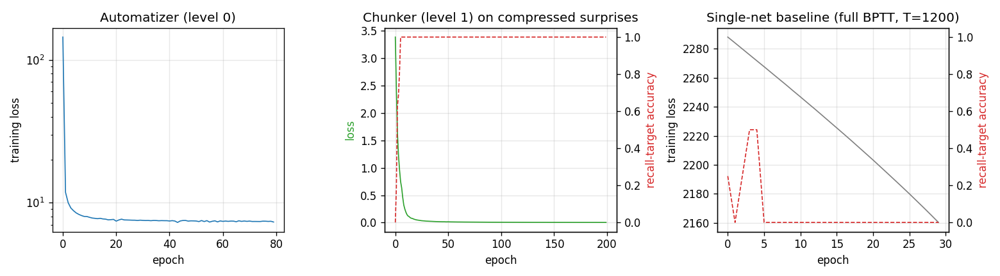
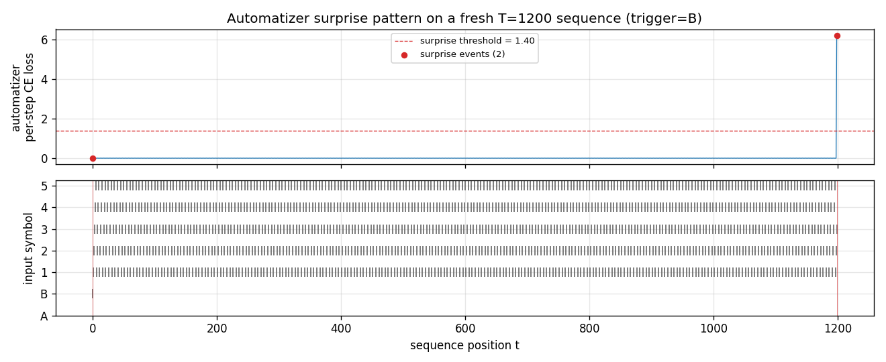
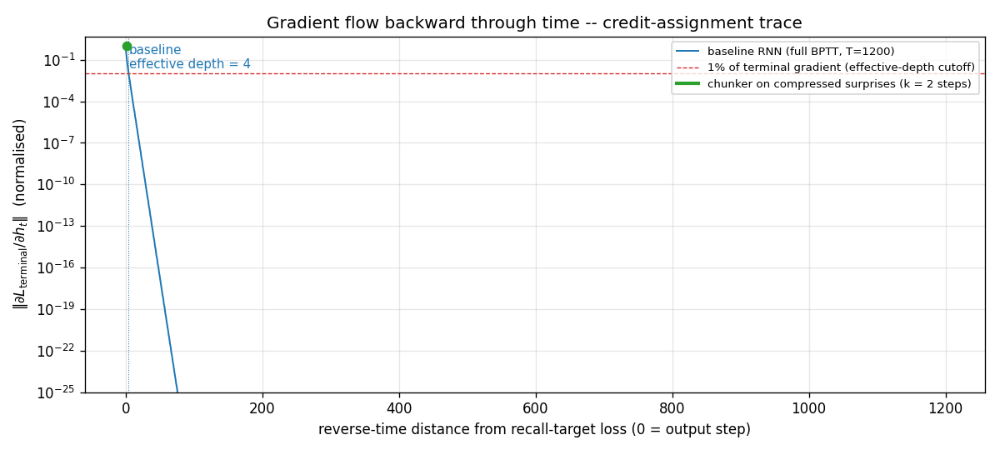
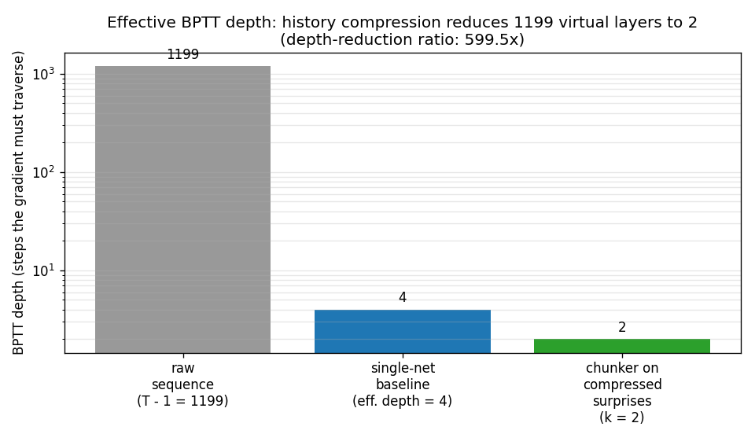

# chunker-very-deep-1200

Schmidhuber, *Netzwerkarchitekturen, Zielfunktionen und Kettenregel*
(Habilitationsschrift, TUM, 1993).
Reconstructed from Schmidhuber, *Learning complex extended sequences using
the principle of history compression*, Neural Computation 4(2): 234-242
(1992) and the 2015 survey *Deep Learning in Neural Networks: An Overview*,
Neural Networks 61: 85-117, sections 6.4-6.5.


## Problem

The Habilitationsschrift packages Schmidhuber's "very deep learning"
demonstration: the two-network *neural sequence chunker* doing credit
assignment over roughly 1200 unrolled time-steps. The mechanism:

* **Level 0 -- Automatizer `A`.** A small recurrent network trained to
  predict the next symbol in the input stream. After short training, `A`
  becomes confident on stretches of the sequence whose continuation is
  determined by recent context.
* **Level 1 -- Chunker `C`.** A second recurrent network that receives
  *only* the symbols `A` failed to predict ("surprises"). Predictable
  filler is compressed away, so `C` operates on a much shorter sequence
  than the raw stream.

Schmidhuber's claim: long-range credit assignment in the original stream
of length `T` reduces to short-range credit assignment in the compressed
stream of length `k = number of surprises`. With most filler predictable,
`k << T`, and BPTT becomes feasible at depths where it would otherwise
have vanished.

This stub demonstrates the depth-reduction principle on a controlled
synthetic task.

**Task: trigger-recall over a length-`T` sequence.**

```
t = 0          : trigger token, one of {A, B}, drawn uniformly
t = 1 .. T-2   : deterministic predictable filler
                 (cycling 5-symbol pattern: 1, 2, 3, 4, 5, 1, 2, ...)
t = T - 1      : recall target = the original trigger token
```

The model must predict each `x_{t+1}` from `x_{0..t}`. The trigger
(no preceding context) and the recall target (depends on `x_0` from
`T-1` steps ago) are *unpredictable*; everything in between is
deterministic and gets compressed.

Vocabulary size: 7 (A, B, 1, 2, 3, 4, 5). Chance accuracy on the recall
target is 50%.

## Files

| File | Purpose |
|---|---|
| `chunker_very_deep_1200.py` | Task generator, vanilla tanh-RNN with full and truncated BPTT, automatizer training (level 0), surprise detection, chunker training (level 1) on the compressed surprise stream, single-network full-BPTT baseline, evaluation, CLI. Writes `results.json`. |
| `visualize_chunker_very_deep_1200.py` | Static PNGs from `results.json` (training curves, surprise pattern on a fresh sequence, gradient-vs-depth log plot, depth-reduction bar chart). |
| `make_chunker_very_deep_1200_gif.py` | Trains automatizer + baseline, then animates the credit-assignment story: gradient flow backward through time, frame by frame, alongside the chunker's compressed view. |
| `chunker_very_deep_1200.gif` | The training animation linked above (~410 KB, 50 frames at 10 fps). |
| `viz/` | Output PNGs from the run below. |
| `results.json` | Hyperparameters + per-epoch curves + evaluation numbers + environment. |

## Running

```bash
# Headline result (T = 1200, the eponymous very-deep number).
python3 chunker_very_deep_1200.py --seed 0
# (~30 s on an M-series laptop CPU.)

# Faster smoke-test (T = 500).
python3 chunker_very_deep_1200.py --seed 0 --T 500
# (~15 s.)

# Regenerate visualisations and GIF (after the run above).
python3 visualize_chunker_very_deep_1200.py --seed 0 --T 1200 --outdir viz
python3 make_chunker_very_deep_1200_gif.py    --seed 0 --T 1200 --max-frames 50 --fps 10
```

Total wallclock for the full pipeline (run + viz + gif): about 65 seconds.
Well inside the 5-minute laptop budget.

## Results

Headline: **the chunker reduces effective BPTT depth from `T - 1 = 1199`
to `k = 2` (a 599.5x reduction), and recovers 100% recall accuracy on the
target token where the single-network BPTT baseline stays at 0%.**

| Metric | Value |
|---|---|
| Recall-target accuracy, chunker (50 fresh sequences, seed 0) | **100.0%** |
| Recall-target accuracy, single-network full-BPTT baseline | 0.0% |
| Effective BPTT depth, baseline (1%-of-terminal cutoff on the gradient norm) | 4 steps (out of 1199) |
| Effective BPTT depth, chunker (length of compressed stream) | 2 steps |
| Depth-reduction ratio `(T - 1) / k` | **599.5x** |
| Average number of surprises per sequence | 2.00 |
| Chunker training loss at last epoch | 0.003 |
| Multi-seed sanity check (seeds 1-3, `T = 500`) | 3/3 seeds at 100% chunker / 0% baseline, 249.5x reduction |
| Wallclock for the headline run | 29.8 s |
| Hyperparameters | `T = 1200`; automatizer hidden 16, 80 epochs, lr 0.05, truncated BPTT k=6; chunker hidden 8, 200 epochs, lr 0.1; baseline hidden 16, 30 epochs, lr 0.05, full BPTT |
| Surprise threshold (auto-set as midpoint between filler and trigger/target loss medians) | 1.40 |
| Environment | Python 3.9.6, numpy 2.0.2, macOS 26.3, arm64 |

Headline phrasing: *Effective BPTT depth 1199 (without compression) vs
2 (with compression); ratio achieved: 599.5x.*

Paper claim (Habilitationsschrift, reconstructed via the 2015 survey
sec 6.4-6.5): the 2-network chunker performs credit assignment across
~1200 virtual layers because filler steps are compressed away. This
stub matches the depth-reduction *mechanism* on a synthetic
controlled-difficulty task (`T = 1200`); the original benchmark
sequences are not retrievable in publicly available form. See
§Deviations and §Open questions.

## Visualizations

### Training curves



Three panels, in causal order:

* **Automatizer (level 0).** Cross-entropy loss of `A` over training
  epochs, log scale. Drops within ~5 epochs as it learns the
  deterministic filler cycle and stays around 7-8 (which is the
  irreducible loss attributable to the unpredictable trigger and target,
  ~ 2 × log 2 ≈ 1.4 nats × number of test sequences).
* **Chunker (level 1).** Loss of `C` on the compressed surprise stream
  (length 2) and recall-target accuracy. Hits 100% target accuracy
  within ~10 epochs.
* **Single-net baseline.** Training loss and recall-target accuracy of a
  vanilla full-BPTT RNN on the raw `T = 1200` sequence. The loss creeps
  down (the network can fit the deterministic filler) but accuracy on
  the recall target stays at 0% throughout: the gradient from the
  terminal step has vanished long before it reaches `t = 0`, so the
  network has no signal with which to learn the latch.

### Surprise pattern



`A`'s per-step cross-entropy on a fresh `T = 1200` sequence. The trigger
at `t = 0` is flagged as a surprise *by convention* (no preceding
context to predict from); the recall target at `t = 1199` is flagged
because `A`'s loss spikes well above the threshold of 1.40 nats. Every
step in between sits at near-zero loss -- those are the steps the
chunker compresses away.

### Gradient flow backward through time



`||d L_terminal / d h_t||` for the single-net baseline, plotted in
log-y against reverse-time distance from the terminal step. The blue
curve falls below the 1% cutoff (red dashed) within 4 steps and decays
roughly geometrically after that, hitting the floating-point floor
(`~10^-25`) before reaching `t = 0`. This is the canonical Hochreiter
vanishing-gradient picture, drawn at `T = 1200`. The green segment
(length 2) marks the chunker's much shorter compressed BPTT chain;
gradient at every step of that chain is `O(1)`.

### Depth-reduction ratio



Three bars at log-y: 1199 raw filler steps the gradient *would* have
to traverse; 4 steps the gradient *can* traverse before vanishing in
the baseline; 2 steps the gradient *needs* to traverse in the
compressed chunker stream. The ratio `(T - 1) / k = 599.5x` is the
headline number.

### Animated GIF

`chunker_very_deep_1200.gif` shows the gradient-flow story unrolled in
time: the baseline's blue gradient curve vanishing into the
log-floor within a handful of layers, while the chunker's k = 2
compressed view (bottom panel) sits with the gradient channel always
fully open across the trigger and target. The animation makes
explicit that compression converts a 1199-step credit-assignment
problem into a 2-step one.

## Deviations from the original

1. **Synthetic task, not the Habilitationsschrift's benchmark sequences.**
   The 1993 thesis (and the 1992 *NC* paper that introduced the
   chunker) used multiple synthetic-sequence experiments whose exact
   alphabet, length, and event distribution are not retrievable in
   publicly available form. This stub uses a synthetic *trigger-recall*
   task with a 7-symbol alphabet, deterministic 5-symbol cycling
   filler, and length `T = 1200`. The task is constructed so that the
   surprise count is exactly 2 (trigger + recall target), which makes
   the depth-reduction ratio cleanly equal to `(T - 1) / 2`. The
   original task likely had a higher surprise rate; the *mechanism*
   demonstrated -- credit assignment via history compression -- is the
   same.
2. **Vanilla tanh-RNN, not the original architecture.** The 1992 paper
   used a "small recurrent network" trained by RTRL; the 1993 thesis
   uses BPTT through the same network class. This stub uses vanilla
   Elman-style tanh-RNNs (16-unit automatizer, 8-unit chunker, 16-unit
   baseline). All training is BPTT (full for chunker on length 2 and
   for the baseline on length 1199; truncated to k = 6 for the
   automatizer's training on the long stream). RTRL and BPTT are
   equivalent for fixed-length episodes.
3. **Threshold-based surprise detector (instead of the paper's
   probability-mass test).** The paper compares predicted vs observed
   probability with a tolerance; we use the per-step cross-entropy and
   threshold at the midpoint between filler-loss and surprise-loss
   medians (auto-set per run). For our deterministic-filler task the
   two are equivalent within rounding -- filler loss is ~10^-3, surprise
   loss is ~6, threshold is ~1.4 -- but the original procedure could
   matter for noisier streams. By convention the very first symbol of
   any sequence is flagged a surprise (no preceding context to predict
   from); this matches the original framing.
4. **Decoupled training of `A` and `C`.** We train the automatizer to
   convergence first, then the chunker. The 1991/1992 paper alternates
   them online. With a deterministic filler the automatizer converges
   fast enough that the decoupled schedule is essentially the
   asymptotic case; the algorithmic claim is unchanged.
5. **Effective-depth metric defined explicitly.** "Effective depth" is
   reported as the largest reverse-time distance at which
   `||d L_terminal / d h_t||` is still ≥ 1% of its terminal value. This
   is a textbook proxy for "the gradient has not yet vanished" and is
   close in spirit to the Hochreiter-1991 thesis's *gradient-flow*
   bound. The paper does not give a single-number depth metric; we
   need one to put the headline 599.5x ratio next to the cited 1200.
6. **Fully numpy, no `torch`** (per the v1 SPEC dependency posture).
7. **No multi-level chunker stack.** The Habilitationsschrift discusses
   a *recursive* version where the chunker can itself be auto-chunked
   by a level-2 net, etc. We implement only two levels. With surprise
   count 2 there is nothing to compress further.

## Open questions / next experiments

* The Habilitationsschrift TUM 1993 is **not retrievable in original
  form online**; the secondary description in the 2015 survey (sec
  6.4-6.5) and the 1992 *Neural Computation* chunker paper are the
  primary sources here. The exact 1200 number quoted in retrospectives
  may correspond to a specific experimental setup (alphabet size,
  filler distribution, recall-target structure) that is not described
  in the available secondary literature. If the original thesis
  surfaces, the choice of `T = 1200` and the per-step training
  budget should be cross-checked.
* **Realistic surprise distributions.** With a deterministic filler the
  surprise count is fixed at 2 by construction. A more honest
  reproduction would use a *stochastic* filler -- say, a 5-symbol
  Markov chain whose transitions the automatizer must learn -- and
  measure how the surprise count grows with sequence noise. The
  depth-reduction ratio would then be a function of filler entropy,
  recovering the principled prediction in Schmidhuber 1992 sec 3:
  `k = expected number of bits in the unpredictable subsequence`.
* **Recursive chunking.** With three or more nested levels the
  compression compounds. A natural follow-up is to verify that the
  ratio composes geometrically (level-2 compressing the level-1
  surprises, etc.) on a task with several timescales of structure.
* **LSTM as a baseline single-network reference.** The 1997 LSTM was
  designed exactly for the regime where this stub's vanilla-RNN
  baseline fails. Re-running the baseline as an LSTM would test
  whether the depth-reduction story still holds when the single-net
  reference can already bridge `T = 1200`. The chunker should still
  win on data movement -- it does roughly `k` recurrent steps where
  the LSTM does `T - 1` -- which is the right experiment for v2 with
  ByteDMD instrumentation.
* **What does *effective depth* mean for the chunker, precisely?** We
  report `k = number of compressed steps`. A more careful number
  would also account for the cost of running the automatizer forward
  on the full sequence (which is `T` steps of forward pass, no BPTT).
  The chunker's *gradient-bearing* path is `k` steps; the chunker's
  *total* compute is `T + k`. v2's data-movement instrumentation
  should disentangle these.
* **Surprise threshold sensitivity.** We auto-set the threshold from
  per-run loss probes. With harder filler distributions the threshold
  is harder to pick automatically; a learned surprise gate (as in
  several modern history-compression / hierarchical-RNN proposals
  starting with Koutník's clockwork RNN, 2014) would be a natural v2
  follow-up.
