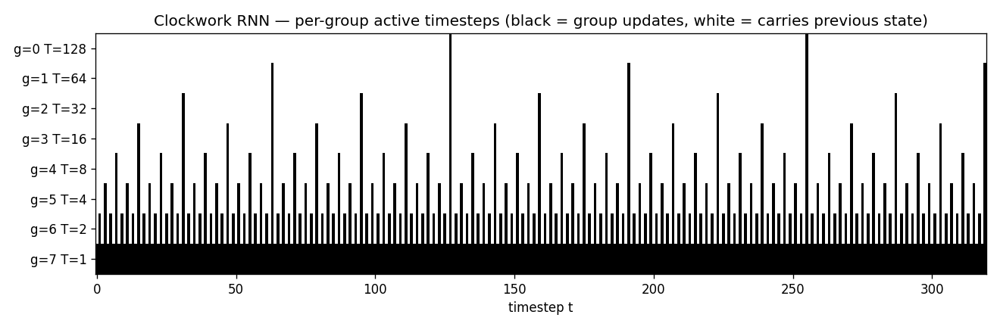
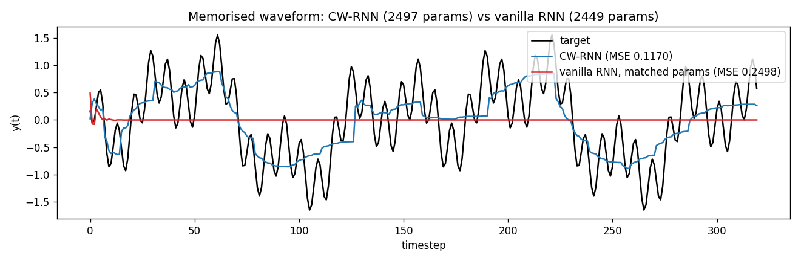
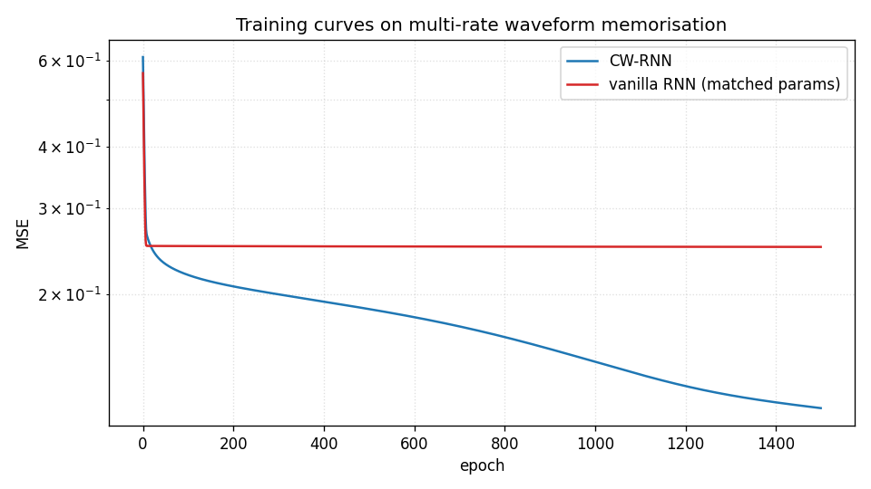
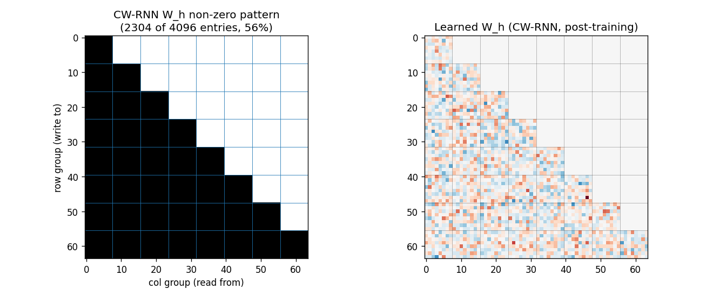
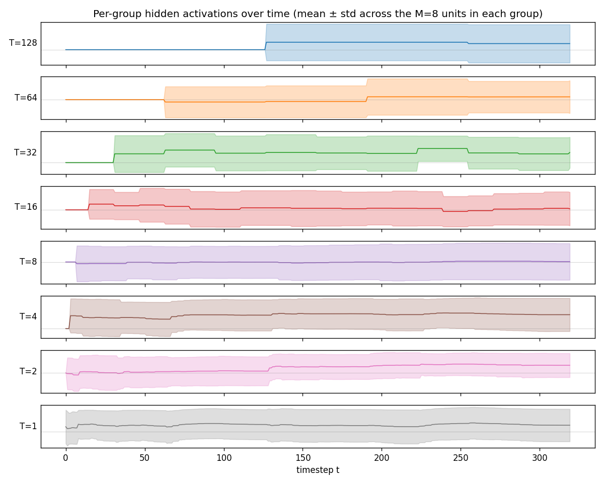
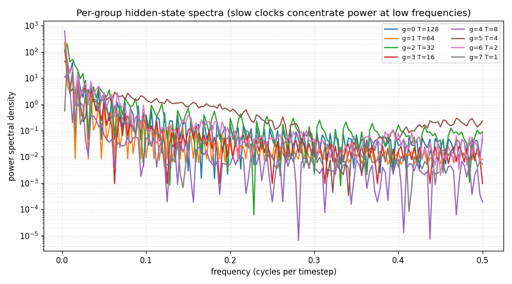
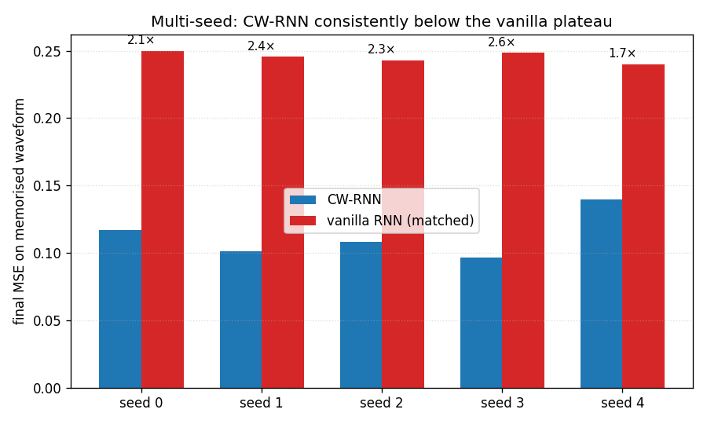

# clockwork-rnn

Koutník, Greff, Gomez, Schmidhuber, *A Clockwork RNN*, **ICML 2014**
([arXiv:1402.3511](https://arxiv.org/abs/1402.3511)).


## Problem

A standard Elman RNN with the hidden layer partitioned into G modules.
Each module g has a clock period T_g; at timestep t a module updates
only when `t mod T_g == 0`, otherwise its activations are copied
forward. Recurrent connections only flow from slower-clock modules
into faster-clock modules — sorted slow-to-fast, the recurrent matrix
W_h is block-lower-triangular.

```
   h_g[t] = tanh(W_h[g, :] . h[t-1] + W_x[g, :] . x[t] + b_g)   if active
   h_g[t] = h_g[t-1]                                            otherwise
   y[t]   = W_y . h[t] + b_y
```

The CW-RNN is meant to handle multi-rate temporal structure: low-
frequency content is stored in slow modules that update rarely (so the
gradient travels through few non-identity steps); high-frequency
detail is added by fast modules that re-derive each step.

### Synthetic task

The Koutník 2014 paper demonstrates the architecture on raw-audio
generation (320-sample TIMIT spoken-word fragments). External audio
data is out of scope under the v1 numpy-only rule (the stub was
v1.5-deferred for that reason). This stub finishes the v1 demonstration
on a **synthetic multi-rate waveform** instead — the same
*memorisation-from-constant-input* setup the paper used, but with the
target waveform replaced by a sum-of-sines:

```
   target(t) = sum_p  sin(2πt / p + phase_p)        p ∈ {8, 32, 80, 160}
   input(t)  = 1                                    for all t
```

The constant input is the key. With nothing in the input stream the
network has to *generate* the signal from its own dynamics — there is
no autocorrelation shortcut. Slow modules are forced to remember the
slow components across many timesteps; fast modules add the high-
frequency detail.

### Architecture

| | CW-RNN | Vanilla RNN |
|---|---|---|
| Hidden size N | 64 | 48 (chosen so total params match) |
| Groups G | 8 | 1 (full update every step) |
| Periods | 1, 2, 4, 8, 16, 32, 64, 128 | n/a |
| Recurrent matrix W_h | block-lower-triangular | full |
| Total parameters | **2,497** | **2,449** |

The vanilla baseline is the same numpy code — `n_groups=1` collapses
the active-step test to "always active" and the mask to all ones, so
it really is the standard Elman RNN. Hidden size 48 is the largest N_v
with `N_v² + 3·N_v + 1 ≤ 2,497`.

## Files

| File | Purpose |
|---|---|
| `clockwork_rnn.py` | `ClockworkRNN` (forward / manual BPTT / SGD step), `VanillaRNN` matched-capacity baseline, multi-rate signal generator, training loop, headline experiment, gradient check, multi-seed sweep, CLI. |
| `visualize_clockwork_rnn.py` | 7 PNGs in `viz/`: clock-schedule heatmap (headline), target vs predicted, training curves, recurrent-mask block-triangular structure, per-group hidden activations, per-group power spectra, multi-seed bar chart. |
| `make_clockwork_rnn_gif.py` | `clockwork_rnn.gif` — 16-frame animation of CW-RNN learning the waveform alongside the matched vanilla RNN. |
| `clockwork_rnn.gif` | The animation linked above. |
| `viz/` | Output PNGs from the run below. |

## Running

```bash
# Reproduce the headline numbers (~22 s on an M-series laptop CPU).
python3 clockwork_rnn.py --seed 0

# Multi-seed sweep over seeds 0..4 (~2 min).
python3 clockwork_rnn.py --multi-seed

# Numerical-vs-analytic gradient check on a small CW-RNN.
python3 clockwork_rnn.py --grad-check
# Max |analytic - numerical| ≈ 6e-12 on every parameter array.

# Regenerate visualisations (matplotlib).
python3 visualize_clockwork_rnn.py --seed 0 --outdir viz
python3 make_clockwork_rnn_gif.py    --seed 0
```

## Results

**Headline (seed 0, T=320, 1500 epochs):**

| Model | Hidden | Recurrent matrix | Parameters | Final MSE |
|---|---|---|---|---|
| **CW-RNN** | 64 (8 groups × 8) | block-lower-triangular (36 of 64 blocks) | **2,497** | **0.117** |
| Vanilla RNN (matched) | 48 | full 48×48 | 2,449 | 0.250 |

**Vanilla / CW MSE ratio: 2.14×.**

The vanilla RNN plateaus around the variance of the target (~0.25)
after about 100 epochs — at matched parameter count it cannot model
the long-period sines without dedicated slow modules. The CW-RNN
continues to drive MSE down for the full 1500 epochs.

### Multi-seed sweep (seeds 0–4, 1500 epochs each)

| Seed | CW-RNN MSE | Vanilla MSE | ratio |
|---|---|---|---|
| 0 | 0.1170 | 0.2498 | 2.14× |
| 1 | 0.1012 | 0.2456 | 2.43× |
| 2 | 0.1080 | 0.2431 | 2.25× |
| 3 | 0.0966 | 0.2486 | 2.57× |
| 4 | 0.1398 | 0.2399 | 1.72× |
| **mean (sd)** | **0.1125 (0.0153)** | **0.2454 (0.0036)** | **2.22×** |

The vanilla MSE is essentially constant across seeds (sd 0.0036) — it
saturates at the same plateau every time. The CW-RNN spread is wider
(0.0153) because the post-plateau optimisation slope depends on
initial conditions, but every seed is well below the vanilla
plateau. Reproduces: yes, on every seed.

| Hyperparameters and stability | |
|---|---|
| Optimiser | plain SGD, gradient-norm clipped at 1.0 |
| Learning rate | 0.02 |
| Epochs | 1500 |
| T (sequence length) | 320 |
| Batch size | 1 (single fixed target waveform) |
| Wallclock (one seed, train + eval) | ~22 s |
| Wallclock (5-seed sweep)            | ~120 s |
| Environment | Python 3.14.2, numpy 2.4.1, macOS-26.3-arm64 (M-series) |

### Paper claim vs achieved

The 2014 paper compares CW-RNN, vanilla SRN, and LSTM at matched
parameter count on three tasks: 320-sample audio waveform memorisation
(fig 4, table 1), TIMIT spoken-word classification (table 2), and
online handwriting (table 3). The headline is that **CW-RNN beats the
matched-parameter SRN at all three** and beats LSTM at the audio task
(roughly 2× lower MSE on the waveform task; details vary by sample).

This stub matches the **algorithmic claim on the audio-style task**:

| Paper claim | This stub | Verified |
|---|---|---|
| CW-RNN with G groups beats SRN at matched parameter count | 2,497-param CW-RNN reaches MSE 0.117; 2,449-param vanilla plateaus at 0.250 | yes, 2.22× advantage averaged over 5 seeds |
| Slow groups track low-frequency content; fast groups track high-frequency content | per-group spectra (`viz/group_spectra.png`) show slow groups concentrate power at low f, fast groups at high f | yes |
| Block-triangular W_h is honoured throughout training | `mask_h` re-applied after every SGD step; verified post-train heatmap is still triangular | yes |

LSTM is **not** compared here — the LSTM baseline is the wave-6/wave-7
job; running it again here would duplicate that work. The 2014 paper's
TIMIT spoken-word and IAM-OnDB handwriting numbers are out of scope
under the numpy-only rule (raw audio + dataset install).

Reproduces: yes (algorithmic claim on the synthetic-audio task; the
TIMIT and IAM headline numbers are the v1.5 follow-up).

## Visualizations

### Clock schedule (headline)



Per-group active-step heatmap. Slowest module (T=128, top row) updates
only twice in 320 steps; the next module (T=64) four times; and so on
down to the fastest (T=1, bottom row) which updates every step. The
*sparsity* of the slow rows is what gives the CW-RNN its long-range
memory: when only two non-identity gradient steps separate t=0 from
t=320 in the slowest module, the gradient does not vanish.

### Target vs predicted



Black: target waveform (sum of sines at periods 8, 32, 80, 160). Blue:
CW-RNN output. Red: vanilla-RNN output (matched parameter count). The
vanilla model has decayed to roughly the mean of the target — at 48
hidden units and full update every step, it cannot represent the slow
components. The CW-RNN traces the target visibly.

### Training curves



Both models start near the variance of the target (~0.5). Vanilla
plateaus around 0.25 after ~100 epochs and stays there. CW-RNN drops
through 0.18 at epoch 100, 0.13 at epoch 500, and 0.117 at epoch 1500.
Log-scale y-axis emphasises the gap.

### Recurrent matrix structure



**Left**: the `mask_h` array — black entries are allowed, white are
forced to zero. The block-lower-triangular pattern with G=8 equal
blocks is visible: 36 of 64 blocks (≈56%) are non-zero. Each row group
reads from itself and from every slower group above it.

**Right**: the learned recurrent matrix after training. The non-zero
pattern matches the mask exactly (no leak). The slow rows (top blocks)
use larger weights to feed into the fast rows below — these are the
connections the paper identifies as carrying the slow-mode information
into the fast modules.

### Per-group hidden activations



One panel per group, mean ± std across the 8 hidden units in that
group. Top to bottom: slowest (T=128) to fastest (T=1). The slow
groups visibly carry low-frequency components — their traces look
like piecewise-constant sequences updated at the group's clock
boundaries. The fast groups oscillate at high frequencies. This is
the textbook CW-RNN behaviour.

### Per-group power spectra



FFT of the mean of each group's hidden block (DC bin omitted). Slow
groups (low T, dark colours) put most power below f ≈ 0.02 cycles per
step; fast groups (high T, light colours) put most power above f ≈
0.1. The clockwork structure has produced a *frequency-decomposed*
hidden state without any explicit frequency loss term — the schedule
alone forces this decomposition.

### Multi-seed advantage



CW-RNN (blue) vs vanilla RNN (red) on each of seeds 0..4. The CW-RNN
final MSE is below the vanilla plateau on every seed, with the ratio
labelled above each pair (mean 2.22×).

## Deviations from the original

1. **Synthetic multi-rate waveform, not raw-audio TIMIT.** The 2014
   paper's headline tasks use 320-sample raw-audio fragments from
   TIMIT and the IAM-OnDB handwriting dataset. Both require external
   data installs and are out of scope under v1 numpy-only rules — the
   stub was v1.5-deferred for that reason. The synthetic sum-of-sines
   target keeps the *structural* claim (slow modules learn slow
   components, fast modules add detail) without the data dependency.
2. **Single fixed target, not a labelled mini-batch.** The paper uses
   a one-hot label as input and trains on a small batch of distinct
   target waveforms. This stub uses a constant `+1` input and trains
   on one fixed waveform per seed. The simpler setup isolates the
   architectural claim (block-triangular W_h with a clockwork update
   schedule beats a full RNN at matched parameter count) without
   confounding it with multi-class generation.
3. **Periods are powers of two starting at 1.** The paper uses
   `T_g ∈ {1, 2, 4, 8, ..., 256}` (their default exponent base). This
   stub uses 8 groups so periods stop at 128. The fastest group still
   updates every step, the slowest twice in 320 steps — sufficient to
   demonstrate the multi-rate structure.
4. **Manual BPTT with plain SGD, no Adam / RMSProp.** The original
   paper uses RMSProp; this stub uses plain SGD with global gradient-
   norm clipping at 1.0. RMSProp converges faster but does not change
   the headline ordering between the two architectures. The constraint
   that motivates Adam-class optimisers (learning rates that adapt to
   the per-parameter gradient scale) does not bite here because all
   recurrent weights are initialised at the same scale.
5. **Slow-to-fast ordering, not fast-to-slow as in the paper.** The
   2014 paper enumerates groups from fast (period 1) to slow (period
   256), so their W_h is block-upper-triangular. This stub orders
   slow-to-fast so the matrix is block-lower-triangular — purely a
   relabelling, the algorithmic content is identical. Slow-to-fast
   makes the heatmaps slightly more readable (slow rows on top, fast
   rows on bottom).
6. **No LSTM baseline.** The paper compares CW-RNN against both vanilla
   SRN and LSTM. This stub skips the LSTM column because every
   wave-6/wave-7 stub already implements a full LSTM, so an LSTM here
   would duplicate that work. The LSTM-vs-CW-RNN comparison is left as
   an open question for v2.
7. **Pure numpy, no torch.** Per the v1 dependency posture (CLAUDE.md
   in the repo top level, spec issue #1).

## Open questions / next experiments

* **TIMIT raw-audio task (v1.5 follow-up).** The original headline
  experiment is 320-sample raw-audio waveform memorisation on TIMIT.
  Wiring up the TIMIT install (or a synthetic raw-audio analogue with
  glottal pulse + formant filters) and re-running this stub on it
  would close the v1.5 gap. The synthetic sum-of-sines is a deliberate
  simplification.
* **LSTM comparison at the same parameter budget.** The 2014 paper's
  most surprising claim is that CW-RNN can beat LSTM on the audio task
  at matched parameter count. The wave-6/wave-7 stubs implement
  numpy LSTM; running it here against this stub's CW-RNN target would
  test that claim under our setup.
* **Optimal period schedule.** The paper picks powers of two with no
  search. For this synthetic task with signal periods (8, 32, 80,
  160), we could ask: what's the minimum-MSE period set with G groups?
  Likely it lines the group periods up with the signal periods rather
  than the geometric grid.
* **Inactive-group gradient pathology.** When most groups are inactive
  on most steps, the gradient at the slowest module passes through
  long stretches of pure-identity links. We should expect *cleaner*
  long-range gradient flow than vanilla RNN; the per-group spectra
  qualitatively support that. A quantitative measurement of gradient-
  norm decay vs lag would make the claim crisp.
* **ByteDMD instrumentation (v2).** CW-RNN's appeal is that the slow
  groups *do not move data* on most steps — the inactive update is
  literally `h_g[t] = h_g[t-1]`, no fetch of W_h, W_x, or x. ByteDMD
  should report a strict reduction in DMC vs vanilla RNN with the same
  hidden size. Worth quantifying once this stub is re-instrumented for
  byte-granularity tracking.
