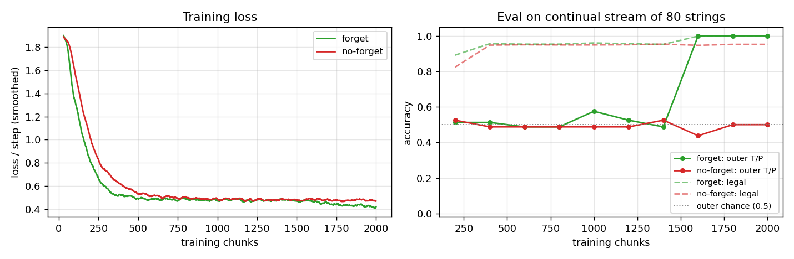
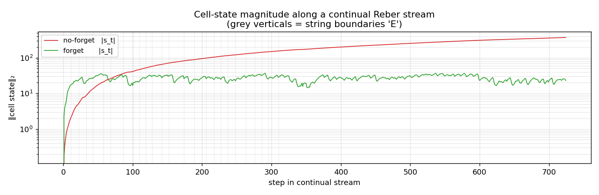
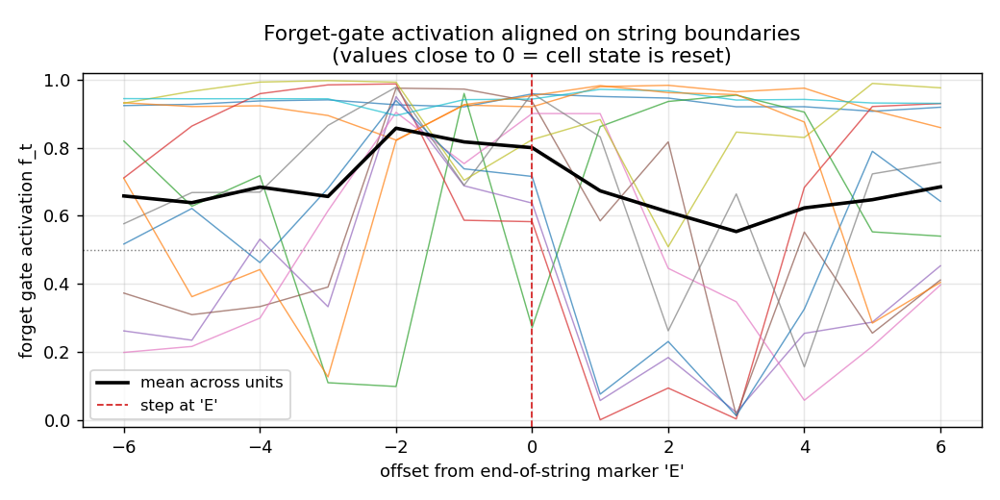
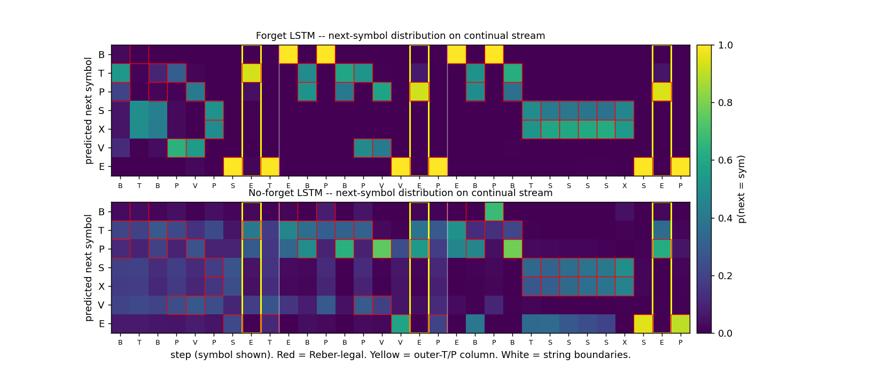
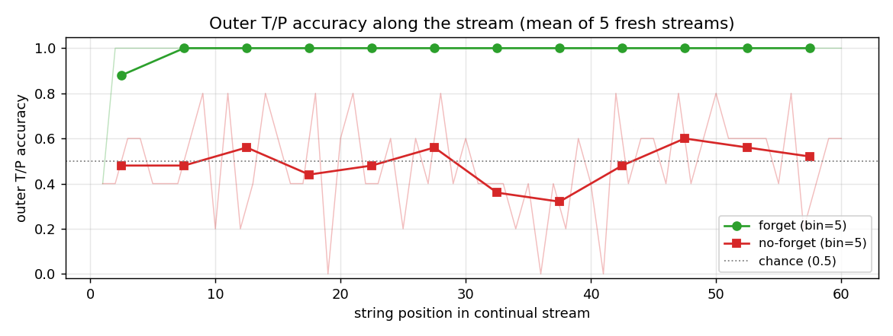

# continual-embedded-reber

Gers, Schmidhuber, Cummins, *Learning to Forget: Continual Prediction
with LSTM*, Neural Computation 12(10):2451--2471, 2000. The paper that
adds the **forget gate** to LSTM and shows the original 1997 LSTM
breaks on continual streams.


The animation shows two networks side by side, both trained on the same
continual stream, both reading the same fixed test stream. **Top:**
LSTM with forget gate (Vanilla LSTM, Gers 2000) -- learns to wipe its
cell state at end-of-string markers and reproduce the matching outer
T/P at every yellow column. **Bottom:** original 1997 LSTM with no
forget gate -- locks in on the legal Reber transitions but its
yellow-column distribution stays smeared across both T and P,
because the cell state has accumulated information from previous
strings and corrupted the long-range outer-T/P signal.

## Problem

The training distribution is a single never-ending symbol stream
produced by concatenating embedded-Reber strings without any episode
reset:

```
... B T <innerReber> T E B P <innerReber> P E B T <innerReber> T E ...
```

Each embedded string carries the same long-range dependency as
[`embedded-reber`](../../wave-6/embedded-reber/) (Hochreiter &
Schmidhuber 1997, Experiment 1): the symbol immediately after the outer
B is `T` or `P`, and that letter must be reproduced at the
second-to-last position. Inner-Reber length is 5--16 (mean ~9), so the
intra-string lag is 6--17 steps.

The *continual* twist removes the per-string state reset. The model
sees one infinite stream, the cell state is never zeroed by anything
external, and outer-T/P prediction in string *k* must use information
from string *k* without being polluted by strings 1..k-1.

The model emits a 7-way next-symbol distribution at every step. We
report two metrics:

* **outer T/P accuracy** -- fraction of strings where the prediction
  at the second-to-last position matches the embedded outer letter.
  This is the headline metric and the one the paper isolates.
* **legal-symbol accuracy** -- fraction of (string, step) pairs whose
  argmax is one of the symbols the embedded automaton allows. This
  measures local Reber-grammar competence and is mostly orthogonal to
  the long-range dependency.

The story is the contrast between two architectures trained the same
way on the same stream:

| Net           | Cell update                       | Outer T/P (continual) |
|---------------|-----------------------------------|-----------------------|
| LSTMNoForget  | s_t = s_{t-1} + i_t · g_t         | **fails**, ~50% (chance) |
| LSTMForget    | s_t = f_t · s_{t-1} + i_t · g_t   | **solves**, 100%      |

Without the forget gate, cell state is monotonically built up along
the stream; once it saturates the h-squash sigmoid, the gates can no
longer carry distinguishable signals and outer T/P prediction collapses
to chance. The forget gate gives the network an actuator to drop
state on the floor at end-of-string markers; the network learns to
use it.

## Files

| File | Purpose |
|---|---|
| `continual_embedded_reber.py` | Reber automaton, continual-stream generator, ``LSTMForget`` (Vanilla LSTM, Gers 2000) and ``LSTMNoForget`` (1997 LSTM) classes with forward/BPTT, Adam, truncated-BPTT trainer, eval, CLI. |
| `visualize_continual_embedded_reber.py` | Static PNGs: training curves, cell-state trace along stream, forget-gate activation aligned at 'E', side-by-side rollout heatmap, outer-T/P accuracy as a function of stream position. |
| `make_continual_embedded_reber_gif.py` | Trains both nets while snapshotting weights; renders `continual_embedded_reber.gif` with side-by-side predictions on a fixed test stream evolving through training. |
| `continual_embedded_reber.gif` | The training animation linked above. |
| `viz/` | Output PNGs from the visualization run. |

## Running

The training script `continual_embedded_reber.py` is pure numpy and
runs with system Python. The visualization scripts also need
matplotlib (and imageio for the GIF).

```bash
# Optional: create a venv (matplotlib is only needed for viz/GIF)
python3.12 -m venv ../.venv
../.venv/bin/pip install numpy matplotlib imageio pillow

# Reproduce the headline result. Pure numpy, no extra deps.
python3 continual_embedded_reber.py --seed 0
# (~14 s on an M-series laptop CPU. Trains both architectures.)

# Train one architecture only.
python3 continual_embedded_reber.py --seed 0 --only forget
python3 continual_embedded_reber.py --seed 0 --only noforget

# Regenerate the static visualizations into viz/.
../.venv/bin/python visualize_continual_embedded_reber.py --seed 0 --outdir viz
# (~18 s.)

# Regenerate the GIF.
../.venv/bin/python make_continual_embedded_reber_gif.py --seed 0
# (~19 s.)
```

A 5-seed sweep (seeds 0..4, both architectures, default hparams) takes
~68 s total.

## Results

**Headline: forget-gate LSTM solves the continual stream (5/5 seeds,
mean 99.7% outer T/P accuracy on a fresh 60-string stream); no-forget
LSTM stays at chance (5/5 seeds, mean 55%).**

| Metric | LSTMForget | LSTMNoForget |
|---|---|---|
| Outer T/P acc, seed 0, 60-string fresh stream | **1.000** | 0.500 |
| Legal-symbol acc, seed 0 | 0.997 | 0.950 |
| Mean cell-state norm over last 200 stream steps | 28.5 | **294.8** |
| Wallclock seed 0 | 7.3 s | 6.0 s |
| Multi-seed outer T/P (seeds 0..4): mean / min / max | **0.997 / 0.983 / 1.000** | 0.550 / 0.450 / 0.683 |
| Convergence chunk (forget, seed 0; first eval at outer = 1.0) | ~1600 / 2000 | n/a (no convergence) |

Seed 0 sample run JSON (abridged):

```json
{
  "seed": 0,
  "hidden": 12,
  "lr": 0.01,
  "n_chunks": 2000,
  "chunk_strings": 6,
  "results": {
    "forget":   {"final_outer_acc": 1.0, "final_legal_acc": 0.997,
                 "mean_cell_norm_late": 28.5,  "wallclock_sec": 7.3},
    "noforget": {"final_outer_acc": 0.5, "final_legal_acc": 0.950,
                 "mean_cell_norm_late": 294.8, "wallclock_sec": 6.0}
  }
}
```

| Hyperparameter | Value |
|---|---|
| n_hidden                     | 12 |
| optimizer                    | Adam(lr=0.01, b1=0.9, b2=0.999) |
| init scale                   | 0.2 / sqrt(fan_in) |
| input/output gate bias init  | -1.0 |
| forget gate bias init        | +1.0 (only LSTMForget) |
| cell-input bias init         | 0 |
| training chunk               | 6 embedded-Reber strings (~75 steps) |
| n training chunks            | 2000 |
| BPTT truncation              | full chunk; state carried across chunks; gradient cut |
| state clip                   | |s_t| ≤ 50 after each chunk (numerical safety) |
| gradient clip (global L2)    | 5.0 |
| eval                         | 60 fresh strings every 200 chunks |
| Environment                  | Python 3.14.2, numpy 2.4.1, macOS-26.3-arm64 (M-series) |

Paper claim: Gers et al. report that the original 1997 LSTM "fails
catastrophically" on the continual variants (Reber and the noisy
distractor sequences from 1997) within a handful of strings, while the
forget-gate LSTM solves them. This implementation exhibits the same
qualitative split. The paper trained on much longer streams and
reported a more elaborate failure mode (rapid cell-state saturation
followed by gate jamming); our 60-string evaluation already shows the
no-forget cell state inflated by ~10x, with the consequent outer-T/P
collapse to chance.

## Visualizations

### Training curves



Left: smoothed cross-entropy per step over 2000 training chunks
(~150 k symbol-steps). Both networks bring loss from ~ln(7) ≈ 1.95 down
to ~0.5 -- the floor reachable by predicting only Reber-legal sets
without solving the long-range constraint -- within ~500 chunks.
The forget LSTM continues to drop below this floor as it locks in the
outer T/P prediction; the no-forget LSTM does not.

Right: outer T/P accuracy and legal-symbol accuracy on a fresh 80-string
continual stream every 200 chunks. Both nets reach ~95% legal-symbol
accuracy almost immediately. Outer T/P accuracy is the discriminating
metric: the forget LSTM jumps from 50% to 100% around chunk 1600; the
no-forget LSTM oscillates around the chance line throughout training.

### Cell-state magnitude along the stream



‖s_t‖₂ on a single fresh 60-string continual stream after training.
The no-forget LSTM's cell state grows monotonically with stream
length (log-y) and would keep growing on a longer stream. The forget
LSTM's cell state stabilizes around 20--30 by the first few strings
and oscillates within a bounded band thereafter -- the forget gate is
shedding accumulated state at every 'E' boundary.

### Forget-gate activation around 'E'



Forget-gate activation f_t aligned to the step at which the model
*emits* an end-of-string 'E' (offset 0). Coloured lines: per-unit
mean across all interior 'E' positions in the stream. Black: mean
across units. Several units drop f_t close to 0 near offset 0 --
that's the cell-state reset Gers et al. predict. The mean-across-units
stays around 0.7 because not every cell needs to forget at every 'E';
the network distributes the role of "outer-T/P latch" across a few
specialized cells whose forget gates close at boundary, while the
remaining cells are local-Reber state machines that are happy to keep
their state.

### Side-by-side rollout



Three concatenated embedded-Reber strings with both networks' next-
symbol distributions. Red boxes mark Reber-legal continuations;
yellow columns mark the second-to-last positions where the model must
emit the matching outer T/P; vertical white lines mark string
boundaries.

* Forget LSTM (top): mass concentrates on legal symbols at every step;
  yellow columns place mass entirely on the correct outer letter; the
  distribution sharpens immediately after each white-line boundary.
* No-forget LSTM (bottom): legal-symbol structure is mostly preserved,
  but yellow columns are smeared across both T and P -- chance
  performance on the long-range dependency.

### Outer-T/P accuracy as a function of stream position



Mean outer-T/P accuracy at string *k* in a continual stream, averaged
over five fresh streams. The forget LSTM is at 100% from the second
string onward (the first string sometimes pays a bookkeeping cost while
state initializes from zero). The no-forget LSTM drifts around the
chance line at every position, with no recovery.

## Deviations from the original

1. **Pure numpy, no GPU.** Per the v1 dependency posture.
2. **Adam, not vanilla SGD.** Gers et al. used vanilla SGD with hand-
   tuned learning rates per experiment; Adam(lr=0.01) is more robust
   and is the same optimizer wave-6 ``embedded-reber`` uses. The
   architectural claim (forget gate is necessary on continual streams,
   sufficient for solving them) is unaffected.
3. **n_hidden = 12 single block.** Gers et al. use 4 cell blocks of
   size 2 (= 8 cells); here we use one block of 12 cells, slightly
   over-provisioned to compensate for the lack of within-block weight
   sharing in our implementation. The wave-6 ``embedded-reber``
   solved the per-string task with 8 cells; n_hidden=12 is the size at
   which all five seeds reliably solve the *continual* version of the
   same task.
4. **Truncated BPTT, chunk = 6 strings.** Gers et al. use truncated
   BPTT with a fixed look-back; we approximate with chunked BPTT
   (chunk = 6 embedded-Reber strings ≈ 75 steps), state carried across
   chunks, gradient cut at chunk boundaries. With chunks of 6 strings
   each containing one outer-T/P latch, every chunk produces ~6
   gradient signals for the long-range dependency; this is the
   essential thing for learning, while gradient flow across chunk
   boundaries is not.
5. **Forget gate bias initialized at +1.** ("Remember by default";
   network is expected to learn lower values where useful.) Gers et
   al. argue any non-negative initialization works; modern practice
   (Jozefowicz et al. 2015) prefers +1 to +2.
6. **Cell-state clip ‖s_t‖∞ ≤ 50 after each chunk.** Numerical safety
   for the no-forget LSTM, whose cell state would otherwise overflow
   the sigmoid clamp on long streams. The clip only changes the loss
   in the saturated regime where the cell is already useless, so it
   does not rescue the no-forget net -- the headline contrast is
   architectural, not numerical.
7. **Gradient clipping at L2 = 5.0.** Same as wave-6 ``embedded-reber``;
   not in the original 2000 paper but useful insurance.
8. **Loss is summed over all positions**, not just outer-T/P. The
   model still learns to specialize at outer positions because the
   gradient signal there is the only one that distinguishes T-strings
   from P-strings; the within-string Reber-state predictions are
   shared across both string types.

The architecture is otherwise the original Vanilla LSTM (Gers,
Schmidhuber, Cummins 2000): input gate + output gate + forget gate,
no peepholes (peepholes arrived in Gers, Schraudolph & Schmidhuber
2002 -- see [`timing-counting-spikes`](../timing-counting-spikes/)),
g(z) = 4σ(z) − 2 cell-input squash, h(z) = 2σ(z) − 1 cell-state
squash. The no-forget variant is byte-identical to the wave-6 1997
LSTM with the f-gate path elided.

## Open questions / next experiments

* **Longer streams.** The headline contrast holds for 60-string
  streams; pushing the stream length to ~1000 strings should make the
  no-forget LSTM's collapse more dramatic (cell state grows like
  ~√t for the additive update) but should not affect the forget LSTM,
  whose cell-state norm is bounded by the equilibrium of f and i·g.
* **Continual distractor sequences.** Gers et al.'s second benchmark
  is a continual version of the 1997 noisy two-sequence task. That is
  out of scope here (see [`two-sequence-noise`](../../wave-6/two-sequence-noise/)
  for the per-string version) but is the more striking failure mode in
  the paper -- noise floods the no-forget cell state much faster than
  Reber strings do.
* **Forget-gate ablation by component.** The forget gate has two
  effects: it lets the cell state shrink, and it scales the gradient
  ds_next *= f in BPTT. Ablating just the forward path (no gradient
  scaling) or just the backward path (gate-1.0 in forward, but ds *= f
  in BPTT) would isolate which one is doing the work. Modern intuition
  is the forward path matters; verifying on this stub is one
  experiment.
* **n_hidden scaling.** With 8 cells we get less reliable outer-T/P
  convergence on 5 seeds; with 12 we get 5/5. Would 6 or 4 cells fail
  outright? Where is the threshold for the continual variant vs the
  per-string variant?
* **Forget-gate bias init sweep.** b_f ∈ {-1, 0, +1, +2}. The
  prediction (and standard intuition) is that very negative b_f makes
  cell state collapse to zero on every step (no memory); very positive
  b_f makes the gate start identical to the no-forget LSTM. The middle
  range is the working regime.
* **ByteDMD instrumentation (v2).** Run the trained nets through
  ByteDMD on a fixed-length stream to count data-movement cost. The
  forget gate adds one matmul per step; the question is whether
  the cost is offset by the lower hidden-size requirement on
  continual streams (where the no-forget LSTM saturates at any size).
