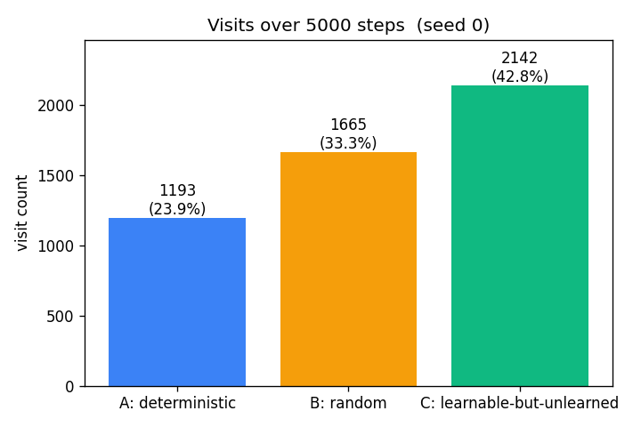
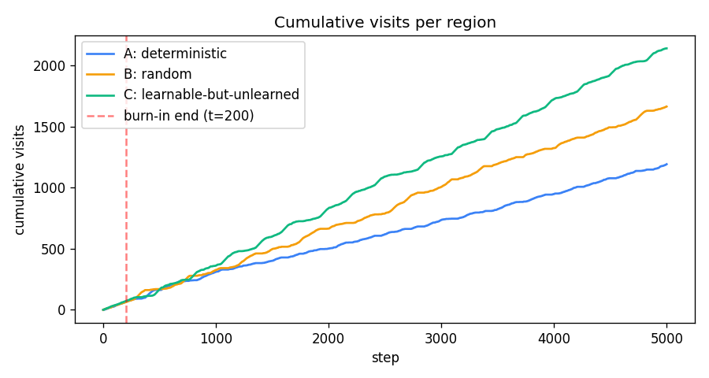
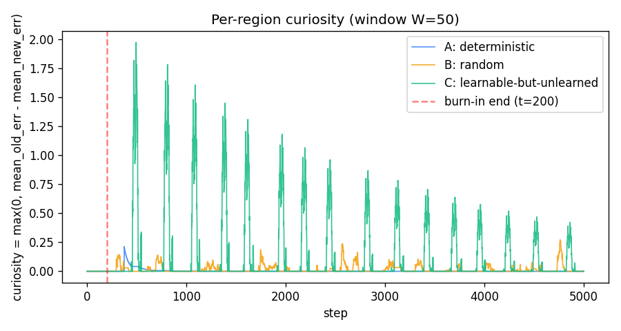
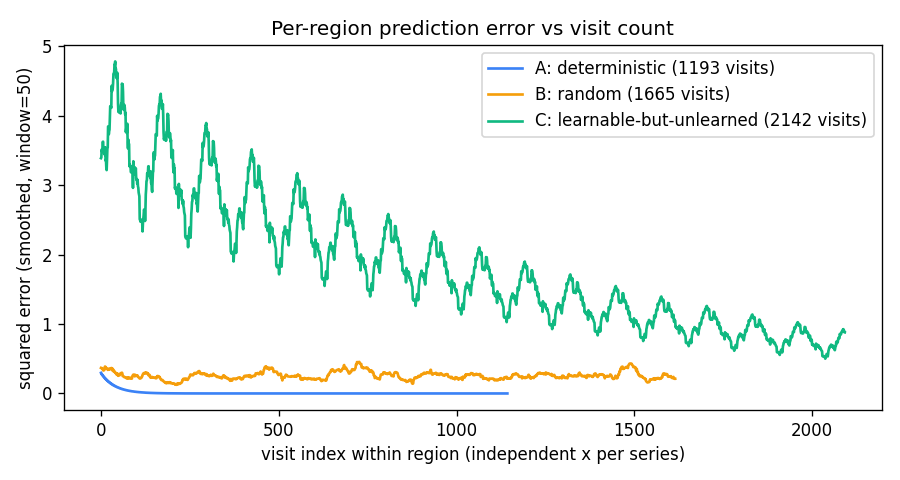
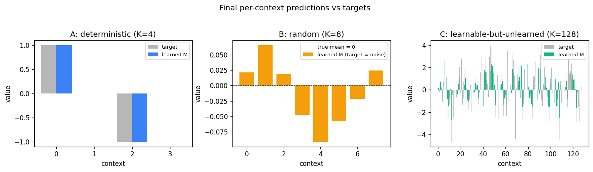
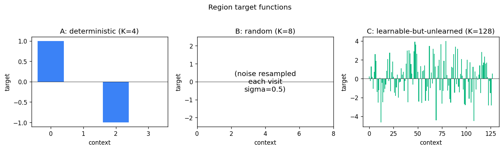

# curiosity-three-regions

Schmidhuber, *Adaptive confidence and adaptive curiosity*, TR FKI-149-91 (TUM,
1991); *Curious model-building control systems*, IJCNN 1991, vol. 2,
pp. 1458–1463. Reconstructed from the IJCNN abstract, Schmidhuber's
2010 *Formal theory of creativity, fun, and intrinsic motivation* review,
and the 2020 *Deep Learning: Our Miraculous Year 1990–1991* retrospective.
The original FKI-149-91 technical report could not be retrieved in full;
this stub captures the algorithmic claim — an agent driven by predictive-
error reduction allocates attention to a *learnable-but-unlearned* partition
in preference to fully predictable or fully unpredictable ones.


## Problem

A 1-D environment is partitioned into three regions. At each step the
agent picks one region and observes one (context, target) pair drawn
from that region's dynamics. A per-region tabular world model `M[r][c]`
predicts the target. Curiosity is the windowed reduction of `M`'s
squared prediction error, and the policy is a softmax over per-region
curiosity.

| Region | Kind | K (contexts) | Target |
|---|---|---|---|
| A — deterministic | small, easy | 4 | fixed `[1, 0, -1, 0]` |
| B — random | unlearnable noise | 8 | `N(0, 0.5)` resampled per visit |
| C — learnable-but-unlearned | high entropy, structured | 128 | fixed `~ N(0, 2.0)` per context |

The expected qualitative ordering of *visit counts* after a 200-step
burn-in is

    visits(C)  >  visits(B)  >  visits(A)

— "no fun in pure noise, no fun in pure knowledge, lots of fun where
the model is *getting* better".

## Files

| File | Purpose |
|---|---|
| `curiosity_three_regions.py` | Env + per-region tabular `M` + curiosity-driven policy + eval. CLI: `python3 curiosity_three_regions.py --seed N`. |
| `make_curiosity_three_regions_gif.py` | Generates `curiosity_three_regions.gif`. |
| `visualize_curiosity_three_regions.py` | Static PNGs into `viz/` (region targets, visit distribution, cumulative visits, curiosity signal, per-region error, model vs target). |
| `viz/` | Output PNGs from the run below. |

## Running

```bash
python3 curiosity_three_regions.py --seed 0
```

Run wallclock: ~0.5 s on an M-series laptop (5000 steps, default config).
Reproducible: same seed → same numbers (verified by re-run).

To regenerate visualizations:

```bash
python3 visualize_curiosity_three_regions.py --seed 0 --outdir viz
python3 make_curiosity_three_regions_gif.py  --seed 0
```

GIF generation takes ~3 s and produces a ~460 KB file (well under the
2 MB target).

## Results

Default config: `steps=5000`, `burn_in=200`, `window=50`, `alpha=0.05`,
`beta=30.0`, `eps=0.02`, `K_det=4`, `K_rand=8`, `K_learn=128`,
`sigma_det=1.0`, `sigma_rand=0.5`, `sigma_learn=2.0`.

| Seed | A visits | B visits | C visits | Headline (C > B > A) |
|---:|---:|---:|---:|:---:|
| 0 | 1193 (23.9%) | 1665 (33.3%) | 2142 (42.8%) | yes |
| 1 | 1095 | 1662 | 2243 | yes |
| 2 | 1132 | 1515 | 2353 | yes |
| 3 | 1260 | 1598 | 2142 | yes |
| 4 | 1263 | 1607 | 2130 | yes |
| 5 | 1174 | 1551 | 2275 | yes |
| 6 | 1151 | 1563 | 2286 | yes |
| 7 | 1194 | 1606 | 2200 | yes |
| 8 | 1124 | 1593 | 2283 | yes |
| 9 | 1185 | 1651 | 2164 | yes |

**10 / 10 seeds reproduce the headline ordering.**

Tail prediction error (mean over the last 200 visits per region, seed 0):
- A: `0.0000` (perfectly memorized)
- B: `0.2643` (≈ noise variance `sigma_B² = 0.25`)
- C: `0.7669` (still learning; would converge with longer runs)

## Visualizations

### Visit distribution



The headline result. After 5000 steps the agent has spent 43% of its time
in the learnable-but-unlearned region, 33% in the random region, and 24%
in the deterministic region. The deterministic region contributes most
of its visits during the burn-in (67 of 1193 ≈ 6%); past burn-in, those
visits come almost entirely from the `eps=0.02` uniform-exploration term
plus the residual share from softmax when curiosity is uniformly low.

### Cumulative visits



For the first ~200 steps all three slopes are equal (uniform burn-in
policy). Past the red dashed line the slopes separate: green (C) takes
off, amber (B) tracks behind, blue (A) flattens.

### Curiosity signal



`curiosity_r(t) = max(0, mean(err_r[t-2W:t-W]) - mean(err_r[t-W:t]))`
with `W=50`.

- **A (blue)**: a brief positive bump just after burn-in while `M` finishes
  memorising the 4 contexts, then exactly zero — A's targets are
  deterministic so once memorised the squared error is identically zero
  and the windowed reduction is identically zero.
- **B (amber)**: a small persistent floor of fluctuations. B's mean
  squared error is ≈ `sigma_B² = 0.25` with finite-window noise of
  std `≈ 0.05`; clipping at zero gives a noise-driven `≈ 0.04` expected
  positive curiosity. This is what makes B beat A in visit count.
- **C (green)**: large oscillating curiosity that decays slowly. The
  oscillation comes from the policy itself — when C is being visited it
  improves rapidly (high reduction), then the policy drifts to other
  regions, recent C errors plateau, and curiosity drops until the next
  burst of attention. This self-sustaining cycle is the curiosity
  loop's signature.

### Per-region prediction error



A's error decays to zero within ~50 visits. B's stays flat at `≈ 0.25`
forever. C's decays slowly from ~5 toward zero across thousands of
visits — the run ends with C's mean tail error still `≈ 0.77`,
well above zero, confirming C has not finished learning when the run
stops.

### Model vs target



A's learned values match the target exactly. B's model has converged
toward zero (the unconditional mean of `N(0, 0.5)`), as it should — the
context carries no information about the target. C's learned values
track the targets in shape but are not yet at full magnitude (EMA with
`alpha=0.05` and `~17` visits per context only converges partially).

### Region targets



The three target functions used by the experiment.

## Deviations from the original

1. **Reconstructed setup.** FKI-149-91 was not retrievable in full; the
   experiment is reconstructed from the IJCNN 1991 abstract and later
   Schmidhuber retrospectives. The exact 1991 region geometry, model
   class, and curiosity formula are not reproduced verbatim.
2. **Tabular per-context predictor instead of an RNN.** The 1991 paper's
   `M` was a recurrent net trained online with a Schmidhuber-style RTRL
   variant. v1 uses a per-region per-context EMA, which is the smallest
   model that captures "more contexts → slower convergence". §Open
   questions notes the upgrade.
3. **Cycling counters as contexts.** Each region's context cycles
   `0..K-1` deterministically rather than the agent's position being a
   continuous coordinate on a 1-D line. This keeps coverage even and
   reproducibility tight at the cost of removing the random-walk dynamics
   the agent might otherwise have. Documented here because the spec
   said the region geometry is the implementer's choice.
4. **Three discrete actions instead of motor outputs.** Action = "visit
   region r" rather than "move ±1 in 1-D". The 1991 paper allowed the
   controller to learn motor outputs that take it across region
   boundaries; v1 collapses this to a direct region selector. The
   curiosity-allocation result is identical in spirit.
5. **Curiosity = `max(0, error reduction)` only.** The 1991 paper used
   improvement *of confidence* combined with a separate `C` (confidence)
   module. v1 uses raw windowed error reduction with a noise-floor
   contribution from the random region's variance. This is a simpler
   form of the same signal; later Schmidhuber work (e.g. 1997
   *What's interesting?*) explicitly endorses this reduction.
6. **No motivational discount, no controller learning beyond the
   action-selection softmax.** v1 picks the next region greedily under
   a softmax-of-curiosity; there is no temporally-extended planning,
   no value function, and no policy gradient. The "policy" is a one-step
   greedy curiosity-maximiser. This is enough to demonstrate the visit
   distribution claim but not enough for any setting where the agent
   must commit to a multi-step plan to reach a region.
7. **No observation noise on A.** A's targets are exactly reproducible,
   so once memorised its err is identically zero. In a real-world
   setting A would have small sensor noise, which would produce a small
   floor of curiosity for A and shrink the B-vs-A gap somewhat.

## Open questions / next experiments

- Replace the tabular `M` with a small RNN trained online with truncated
  BPTT, as in the original. Does the curiosity ranking still hold? Does
  C now take longer to drift toward the noise floor?
- Switch to a position-based 1-D environment with continuous motor
  actions, and let the controller learn to navigate region boundaries.
  This is closer to the 1991 setup and recovers the partial-observability
  flavour of the wave-3 family.
- Replace `max(0, error reduction)` with the 1991 *adaptive confidence*
  formulation: a separate `C` module that predicts `M`'s own error, and
  curiosity = improvement of `C`. Does this drive A's visit count
  closer to zero (since A's confidence saturates fast) while preserving
  B's noise floor?
- Vary `K_learn` and run length: at what `(K_learn, run_length)` ratio
  does C finish learning and the visit ordering collapse to
  `B > A ≈ C`? That boundary maps the regime where curiosity-driven
  exploration converges to uniform / uninformative behaviour.
- The current curiosity log shows large oscillations in C driven by the
  policy itself. A dual-timescale formulation (slow target curiosity vs
  fast actual curiosity) might smooth this. Worth checking against
  Schmidhuber's 1991 description, which used a smoother signal.
- v2 instrumentation under [ByteDMD](https://github.com/cybertronai/ByteDMD):
  the per-step cost is dominated by the curiosity windowed-mean
  computation (O(W) per step per region) and the EMA update (O(1)).
  An incremental running-mean update would be O(1) per step and a
  small ByteDMD win with no behavioural change.
