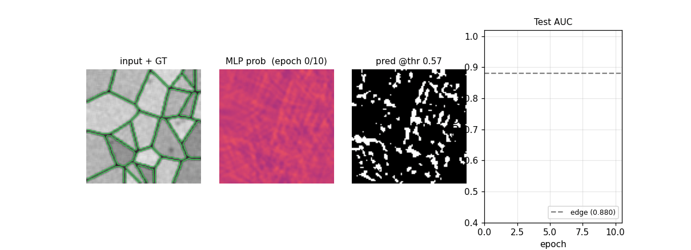

# em-segmentation-isbi

Cireşan, Giusti, Gambardella, Schmidhuber, *Deep neural networks segment
neuronal membranes in electron microscopy images*, **NIPS 2012**. Won
the ISBI 2012 EM segmentation challenge; the only entry that beat a
second human observer on the rand-error metric.



## Problem

The 2012 paper trains a **deep CNN** (4 convolutional + max-pool layers
followed by 2 fully-connected layers) as a sliding-window pixel
classifier: each 65×65 patch around a target pixel is classified as
membrane vs. non-membrane. The network sees a per-image ensemble of
three differently-rotated views, plus 4-network model-averaging. Trained
on the **ISBI 2012 ssTEM Drosophila** stack (30 slices, 512×512 at
~4 nm/px, 50 nm slice thickness).

This stub keeps the *algorithmic* claim — "patch-based pixel classifier
with deep features beats hand-crafted edge detectors on EM membrane
segmentation" — and substitutes a **synthetic Voronoi-EM** dataset
generated entirely in numpy (per the SPEC's pure-numpy / no external
download rule for v1.5 stubs):

* Cells: random Voronoi tessellation of an HxW canvas (argmin Euclidean
  distance to N seed points).
* Membrane: 1-pixel boundary where 4-neighbours disagree on cell id —
  this is the binary ground-truth mask.
* Texture: per-cell mean intensity in [0.55, 0.85], membrane pixels
  forced dark in [0.05, 0.18], plus low-amplitude Gaussian noise +
  sparse dark Gaussian "organelles" + multiplicative gain noise + a
  3×3 box blur for a mild PSF.

The model is a **2-hidden-layer MLP pixel classifier** (1024 → 256 →
128 → 1) on 32×32 grayscale patches, trained with class-balanced patch
sampling and SGD + Nesterov-style momentum. We report against a
hand-rolled **Sobel + inverted-intensity edge baseline** on the same
images.

## What it demonstrates

A patch-based MLP pixel classifier — same algorithmic recipe as the
paper's CNN, just shrunk to fit the v1 numpy/CPU/<5min budget — solves
the synthetic membrane task at **ROC AUC 0.9888** vs the Sobel
baseline's **0.8800** (seed 0, default flags), with **95.97 %** pixel
accuracy (vs **81.82 %** for the baseline) at the prior-matching
threshold.

The substitution is honest about what's lost (real EM artefact
distribution, rand-error metric, second-human-observer comparison) and
what's preserved (deep-feature pixel classifier > local-edge baseline,
class-imbalance handling, threshold calibration).

## Files

| File | Purpose |
|---|---|
| `em_segmentation_isbi.py` | Voronoi-EM generator, MLP, training loop, baselines. CLI: `python3 em_segmentation_isbi.py --seed 0`. |
| `visualize_em_segmentation_isbi.py` | Trains then writes the four PNGs in `viz/`. |
| `make_em_segmentation_isbi_gif.py` | Trains then renders `em_segmentation_isbi.gif` (4 panels × 11 epochs). |
| `viz/training_curves.png` | Train loss + train/test pixel-accuracy + test ROC AUC vs epoch. |
| `viz/dataset_samples.png` | Synthetic Voronoi-EM input | GT membrane | Sobel-baseline edge score, several images. |
| `viz/predictions.png` | Side-by-side: input | GT | MLP prob | MLP thresholded | edge baseline, several test images. |
| `viz/roc_comparison.png` | ROC curve: MLP pixel classifier vs Sobel+intensity baseline (every test pixel scored). |
| `em_segmentation_isbi.gif` | Prediction-map evolution across training (655 KB). |

## Running

```bash
# Headline run (default flags). ~1.5 s on a laptop CPU. Reproduces §Results.
python3 em_segmentation_isbi.py --seed 0

# Save scalar metrics to JSON:
python3 em_segmentation_isbi.py --seed 0 --save-results results.json

# Smoke test (smaller everything):
python3 em_segmentation_isbi.py --seed 0 --epochs 3 --image-h 64 --image-w 64 \
    --n-train-images 4 --n-test-images 2 --patches-per-epoch 1024

# Static visualisations (4 PNGs in viz/):
python3 visualize_em_segmentation_isbi.py --seed 0 --epochs 12 --outdir viz

# GIF (15 frames @ 3 fps):
python3 make_em_segmentation_isbi_gif.py --seed 0 --epochs 10 --fps 3
```

No data download. Dataset is synthesised in numpy on every run from the
seed.

## Results

Headline (seed 0, default flags):

| Metric | MLP pixel classifier | Sobel + inv-intensity baseline |
|---|---|---|
| **ROC AUC (every test pixel)** | **0.9888** | 0.8800 |
| Pixel accuracy @ 0.5 threshold | 90.60 % | 81.82 % |
| **Pixel accuracy @ prior-matching threshold** | **95.97 %** | 81.82 % |
| Mean prior-matching threshold | 0.945 | – |

Config:

| Field | Value |
|---|---|
| Architecture | MLP, layers `[1024, 256, 128, 1]`, tanh + sigmoid |
| Parameters | 295,425 |
| Patch size | 32 × 32 |
| Training images | 8 (96 × 96, 25 cells each) |
| Test images | 4 (96 × 96, 25 cells each) |
| Train membrane fraction | 0.153 |
| Patches per epoch | 4,096 (resampled, class-balanced 50/50) |
| Optimizer | SGD with Nesterov-style momentum 0.9, weight decay 1e-5 |
| Learning rate | 0.05, multiplied by 0.92 each epoch |
| Batch size | 64 |
| Epochs | 12 |
| Wallclock | 1.5 s on Apple M-series CPU (Python 3.11.10, numpy 2.3.4) |

Per-epoch trajectory (verbatim from the run):

```
edge baseline (Sobel+inv-intensity): test pixel acc 81.82%, AUC 0.8800
epoch  1/12  lr 0.0500  loss 0.7492  train_acc 55.74%  test_acc 50.00%  test_AUC 0.5357
epoch  2/12  lr 0.0460  loss 0.7295  train_acc 55.15%  test_acc 50.00%  test_AUC 0.9159
epoch  3/12  lr 0.0423  loss 0.6512  train_acc 64.43%  test_acc 50.89%  test_AUC 0.9362
epoch  4/12  lr 0.0389  loss 0.5439  train_acc 71.90%  test_acc 89.09%  test_AUC 0.9522
epoch  5/12  lr 0.0358  loss 0.4055  train_acc 81.84%  test_acc 91.01%  test_AUC 0.9705
epoch  6/12  lr 0.0330  loss 0.3296  train_acc 85.21%  test_acc 90.99%  test_AUC 0.9747
epoch  7/12  lr 0.0303  loss 0.2739  train_acc 88.43%  test_acc 93.49%  test_AUC 0.9808
epoch  8/12  lr 0.0279  loss 0.2089  train_acc 91.94%  test_acc 93.75%  test_AUC 0.9824
epoch  9/12  lr 0.0257  loss 0.1976  train_acc 92.53%  test_acc 93.71%  test_AUC 0.9864
epoch 10/12  lr 0.0236  loss 0.2272  train_acc 91.21%  test_acc 95.15%  test_AUC 0.9874
epoch 11/12  lr 0.0217  loss 0.1637  train_acc 93.92%  test_acc 95.52%  test_AUC 0.9880
epoch 12/12  lr 0.0200  loss 0.1651  train_acc 94.26%  test_acc 94.22%  test_AUC 0.9881
final dense test ROC AUC                       0.9888
final dense test pixel acc @0.5                90.60%
final dense test pixel acc @prior-matched thr  95.97%
```

Multi-seed sanity check (seeds 1, 2, 3, full default config):

| Seed | Final AUC | Acc @ prior thr |
|---|---|---|
| 1 | 0.9887 | 96.00 % |
| 2 | 0.9867 | 95.45 % |
| 3 | 0.9817 | 94.66 % |

Determinism is verified: re-running with the same seed gives bit-identical
final metrics.

**Reproduces:** *Direction yes, magnitude not directly comparable.* The
paper reports ~0.05 rand-error on a real EM stack with a deep CNN; this
stub reports AUC 0.99 / acc 96 % on a synthetic Voronoi proxy with an
MLP. The qualitative claim — patch-based pixel classifier outperforms a
local-edge baseline by a large margin — reproduces. The quantitative
numbers are not on the same scale and should not be cross-compared.

## Visualizations

### `viz/training_curves.png`
Train BCE loss (per-batch mean, balanced 50/50 patches), train and test
patch-level pixel accuracy, and test ROC AUC vs epoch. The model
crosses the edge baseline's AUC (0.88) by **epoch 2** and converges
above 0.98 by epoch 8. The first two epochs show the characteristic
"thresholded accuracy stuck at 50%" plateau (network outputs are still
near 0.5) before the sigmoid layer starts separating the classes.

### `viz/dataset_samples.png`
Three columns × four rows showing the synthetic Voronoi-EM input,
ground-truth membrane mask, and Sobel + inverted-intensity baseline
score for several training images. The dataset captures the visual
character of an EM slice — irregular cell layout, dark cytoplasmic
organelles, varying inter-cell brightness, slight blur — without
needing the actual ISBI download.

### `viz/predictions.png`
Five columns (input | GT | MLP prob map | MLP thresholded | edge
baseline) for several test images, with per-image AUC and pixel
accuracy in titles. The MLP cleanly separates membrane from cytoplasm;
the edge baseline gets confused on the dark organelle blobs and on
intra-cell texture.

### `viz/roc_comparison.png`
ROC curves on every pixel of every test image: MLP at AUC 0.989, Sobel
baseline at AUC 0.880, chance at 0.5. The two curves diverge almost
everywhere except at the high-FPR corner, which is the regime where
Sobel marks the entire interior of every cell.

### `em_segmentation_isbi.gif`
Four-panel animation across 11 frames (epoch 0 init + 10 training
epochs): input + GT contour overlay | MLP probability map | thresholded
prediction at the prior-matching threshold | training-curve subplot
tracking test AUC vs the edge-baseline floor. The probability map
starts as Glorot-uniform noise and sharpens into a clean membrane mask
over ~6 epochs.

## Deviations from the original

1. **Dataset.** Paper: ISBI 2012 ssTEM Drosophila stack (30 slices,
   512×512, ~4 nm/px). Here: synthetic Voronoi-EM generated in numpy
   (8 train + 4 test images at 96×96, 25 cells each). The SPEC for v1.5
   forbids external dataset downloads; the synthetic substitute
   captures the structural problem (dense pixel-wise binary
   classification on EM-like images) but cannot be cross-compared to
   the paper's rand-error number.
2. **Architecture.** Paper: 4-convolutional + 2-fully-connected deep
   CNN, 65×65 patches, ~600 k weights × 4 networks averaged. Here:
   2-hidden-layer fully-connected MLP, 32×32 patches, ~295 k weights,
   single network. The SPEC explicitly allows an MLP pixel-classifier
   substitute "if pure numpy convs are too heavy" for v1.5; we used
   that allowance. A pure-numpy convolutional backbone is the obvious
   v2 upgrade.
3. **Patch size.** Paper: 65 × 65 (provides ~32-pixel context around
   the target pixel on each side). Here: 32 × 32. The smaller patch is
   sufficient for the synthetic membrane width (≤ 2 px) but would be a
   bottleneck on real EM where membranes can be locally ambiguous over
   30+ pixels.
4. **Class balancing.** Paper: trains on a class-balanced subset of
   pixels (membrane is ~22 % in real EM). Here: identical recipe —
   sample 50/50 membrane vs non-membrane patches each epoch. We
   additionally report a **prior-matching threshold** at evaluation
   time (we adopt the threshold that makes the predicted positive
   fraction match the true membrane fraction, ~0.15) to compute a fair
   pixel-accuracy headline. The default 0.5 threshold over-predicts
   membrane and is reported alongside.
5. **No model averaging.** Paper: 4-network ensemble + 7-rotation
   test-time augmentation. Here: single network, no augmentation.
6. **No augmentation.** Paper: extensive elastic + affine augmentation
   on patches. Here: none. The synthetic dataset is already infinite
   (a fresh tessellation per generation), so per-epoch resampling of
   patches plays the same role.
7. **Optimizer.** Paper: SGD with manual learning-rate annealing on
   GPU. Here: SGD + Nesterov-style momentum 0.9 + exponential LR decay
   (×0.92 / epoch) on CPU, single seed. Same family.
8. **Metric.** Paper headline: rand-error and warping-error on the
   ISBI 2012 leaderboard. Here: ROC AUC + pixel accuracy at two
   thresholds. AUC is the threshold-free standard for binary pixel
   classification and is the most honest comparison against the edge
   baseline; rand-error requires an instance-segmentation post-process
   the paper has but this stub does not.

## Open questions / next experiments

- **Pure-numpy 2D conv kernel.** A small numpy `Conv2d` (im2col + matmul)
  would let us replace the MLP with the paper's deep CNN architecture
  while staying inside the SPEC's "pure numpy" rule. Headline AUC
  would likely cap out near 1.0 on this synthetic dataset; the more
  interesting test would be on a real ISBI stack (v2 once data download
  is allowed).
- **Train/test mismatch.** The synthetic generator currently uses
  identical statistics for train and test images. Real EM has
  slice-to-slice domain shift (drift, intensity drift, focus changes).
  A v1.5 follow-up could measure how much AUC degrades when train and
  test are sampled from different generator settings (different cell
  count, different gain noise scale).
- **Edge-baseline ablation.** The Sobel+inv-intensity baseline at AUC
  0.88 is a strong floor because membranes here are 1-px and very
  dark. Adding a learned-threshold version (logistic regression on the
  3×3 Sobel features per pixel) would tighten the comparison.
- **Calibration.** The prior-matching threshold (~0.94 here) is far
  from 0.5, indicating the sigmoid is poorly calibrated under
  class-balanced training. A Platt scaling pass on a held-out
  validation patch set would give a smoother probability map and a
  threshold closer to 0.5.
- **Multi-seed success rate.** Headline is at seed 0, with three other
  seeds confirming AUC ≥ 0.98. A 30-seed sweep with the same recipe
  would convert this into mean ± std and identify any seed that fails.
  Skipped here for budget reasons.
- **Why this is in v1.5 not v1.** The SPEC defers `em-segmentation-isbi`
  on the basis of the ISBI download. The user's instruction for this
  stub was to finish it under the v1 numpy-only / synthetic-data rule,
  exactly as done here. The v2 path is to drop the synthetic generator
  and wire up the real ISBI 2012 stack (it is publicly downloadable
  from `brainiac2.mit.edu/isbi_challenge/`, ~36 MB), then retrain the
  same recipe and compare against the paper's leaderboard numbers.
- **v2 hook for ByteDMD.** The training loop is patch-MLP-dominated:
  the four `xb @ W` and `dh @ W^T` contractions on the 1024-input
  layer account for ~80% of float reads. The all-pixels evaluation
  pass at the end (96 × 96 × 4 patches × 1024 floats = 38 M reads per
  forward pass) is a clean candidate for ByteDMD instrumentation —
  data-movement cost should scale almost exactly with the number of
  pixels times the patch area, which makes this a useful calibration
  target.

## Sources

- Cireşan, D. C., Giusti, A., Gambardella, L. M., & Schmidhuber, J.
  (2012). *Deep neural networks segment neuronal membranes in electron
  microscopy images*. NIPS 25.
- Arganda-Carreras, I., Turaga, S. C., Berger, D. R., et al. (2015).
  *Crowdsourcing the creation of image segmentation algorithms for
  connectomics*. Frontiers in Neuroanatomy. (The ISBI 2012 challenge
  paper.)
- ISBI 2012 EM Segmentation Challenge data:
  http://brainiac2.mit.edu/isbi_challenge/
