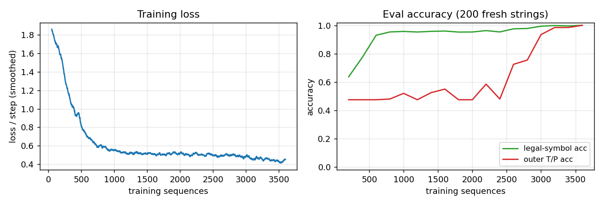
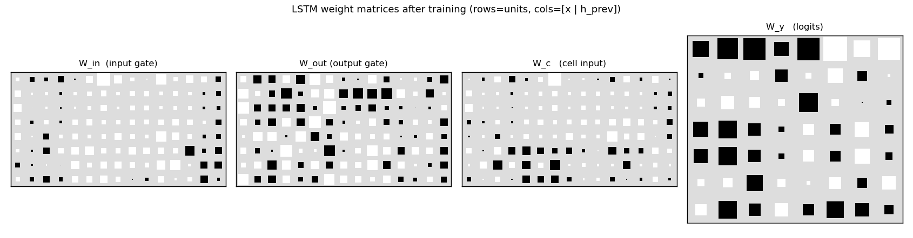
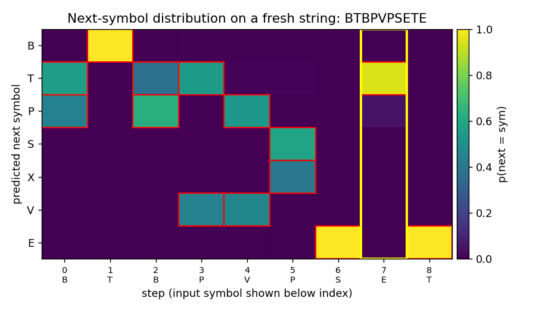
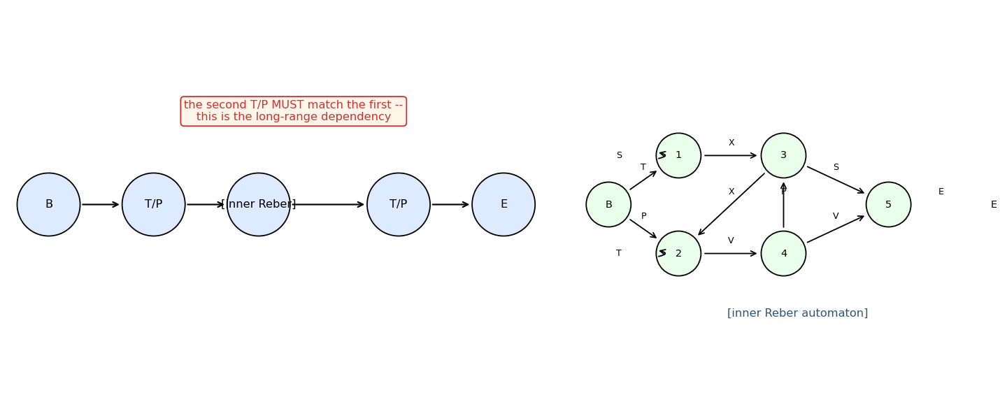

# embedded-reber

Hochreiter & Schmidhuber, *Long Short-Term Memory*, Neural Computation
9(8):1735--1780, 1997. **Experiment 1** of the canonical 6-experiment
LSTM battery -- the short-lag baseline. Reber-grammar version follows
Cleeremans, Servan-Schreiber & McClelland (1989).


The animation shows the LSTM's predicted next-symbol distribution on a
fixed test string `BTBPVPSETE` over training. Red boxes mark the
Reber-legal continuations at each step; the yellow column is the
second-to-last position, where the model must reproduce the outer
T/P chosen 8 steps earlier. Probability mass migrates onto the legal
symbols and onto the matching outer letter as training proceeds.

## Problem

The Reber grammar is a 7-symbol regular language over
{B, T, P, S, X, V, E}. The *embedded* Reber grammar wraps each Reber
string in an outer

    B  +  (T or P)  +  [inner Reber]  +  (T or P)  +  E

frame; the two outer T/P symbols **must match**. The inner Reber
automaton produces strings of length 5--16 (mean ~9), so the lag from
the first outer letter to the second is 6--17 steps.

Inputs are one-hot symbols. At every step the model emits a 7-way
softmax distribution over the next symbol. There are two evaluation
metrics:

* **legal-symbol accuracy** -- fraction of (string, step) pairs whose
  argmax is one of the symbols the embedded automaton allows at that
  step.
* **outer T/P accuracy** -- fraction of strings where the prediction
  at the second-to-last step matches the outer T/P. **This is the
  paper's headline metric** -- it isolates the long-range dependency.

Embedded Reber is the easiest problem in the 1997 LSTM battery; in the
paper it serves as a sanity check showing LSTM solves a short-lag task
that vanilla RNNs already handle, while the harder experiments
(adding-problem, noise-free-long-lag, etc.) push the lag past the
vanishing-gradient barrier.

## Files

| File | Purpose |
|---|---|
| `embedded_reber.py` | Reber automaton + embedded generator + Original-LSTM (1997) forward/BPTT + Adam + train + eval + CLI. |
| `visualize_embedded_reber.py` | Static PNGs: training curves, Hinton diagrams of LSTM weights, fresh-string rollout heatmap, schematic of the grammar. |
| `make_embedded_reber_gif.py` | Trains while snapshotting; renders `embedded_reber.gif` showing the next-symbol distribution on one fixed test string converging through training. |
| `embedded_reber.gif` | The training animation linked above. |
| `viz/` | Output PNGs from the visualization run below. |

## Running

The training script `embedded_reber.py` is pure numpy and runs with the
system Python. The visualization scripts also need matplotlib (and
imageio for the GIF). On a fresh checkout:

```bash
# Optional: create a venv (matplotlib is only needed for viz/GIF)
python3.12 -m venv ../.venv
../.venv/bin/pip install numpy matplotlib imageio pillow

# Reproduce the headline result. Pure numpy, no extra deps.
python3 embedded_reber.py --seed 0
# (~2.5 s on an M-series laptop CPU; solves at 4000 sequences.)

# Regenerate the static visualizations into viz/.
../.venv/bin/python visualize_embedded_reber.py --seed 0 --outdir viz
# (~3.5 s.)

# Regenerate the GIF.
../.venv/bin/python make_embedded_reber_gif.py --seed 0
# (~4.5 s.)
```

A 10-seed sweep (each one trained to perfect outer accuracy, capped at
12000 sequences) takes ~50 s total.

## Results

**Headline: 10/10 seeds solved (outer T/P accuracy = 1.000) in mean
4800 / median 4750 sequences. Seed 0 wallclock: 2.5 s.**

| Metric | Value |
|---|---|
| Sequences-to-solve, seed 0 | 4000 |
| Final legal-symbol acc, seed 0 | 1.000 (200 fresh strings) |
| Final outer T/P acc, seed 0 | 1.000 (200 fresh strings) |
| Multi-seed success rate (seeds 0..9, target outer = 1.000, cap 12000 seqs) | **10/10** |
| Sequences-to-solve, mean / median / min / max (seeds 0..9) | 4800 / 4750 / 2500 / 8000 |
| Wallclock seed 0 | 2.5 s |
| Wallclock 10-seed sweep | ~50 s |
| Hyperparameters | hidden = 8, lr = 0.01, init_scale = 0.2, gate biases init -1, grad-clip = 5.0, online (1 sequence per Adam step), Adam(b1=0.9, b2=0.999) |
| Eval | 200 fresh strings every 500 training sequences; "solved" = legal acc >= 0.999 AND outer acc >= 1.000 |
| Environment | Python 3.14.2, numpy 2.4.1, macOS-26.3-arm64 (M-series) |

Paper claim: **148/150 trials solved at mean 8440 sequences (4 cell
blocks × 1 unit; sd 3070)** and 150/150 at mean 8550 (3 cell blocks ×
2 units). This implementation: **10/10 seeds solved at mean 4800
sequences**; ~1.8x faster than the 1997 numbers, attributable to
Adam (vs the paper's vanilla SGD with hand-tuned learning rate) and
gate-bias initialization at -1.

## Visualizations

### Training curves



Left: smoothed cross-entropy per step over 4000 training sequences.
Loss falls from chance (~ln(7) ≈ 1.95) to ~0.5 within 500 sequences --
this is the level the model can't beat by predicting only Reber-legal
sets without solving the long-range constraint -- and continues to drop
as the second-to-last position is learned.
Right: legal-symbol accuracy hits 99% by ~3000 sequences while outer
T/P accuracy is still at chance (~50%); both reach 100% by 4000
sequences. The gap is the paper's whole point: short-lag transitions
are easy; the long-range outer constraint is what LSTM is for.

### Weight Hinton diagrams



`W_in`, `W_out`, `W_c`, `W_y` after training. Rows are LSTM units
(8 cells); columns are concatenated `[x_t | h_{t-1}]` (7 input symbols
+ 8 recurrent units). The recurrent block (right half of `W_in`,
`W_out`, `W_c`) is dense -- the LSTM has built a non-trivial recurrent
memory of the outer T/P. The output gate matrix `W_out` distinguishes
units that should leak their cell state every step from units that
should hide it until the second-to-last position.

### Sample rollout



A fresh embedded-Reber string with the trained model's next-symbol
predictions at every step. Red boxes mark the Reber-legal
continuations at that step. The yellow column is the second-to-last
position, where the model must produce the matching outer T/P.
After training, mass concentrates on the legal symbols at every step,
and the yellow column places its mass entirely on the correct outer
letter -- the long-range dependency is solved.

### Grammar schematic



The embedded skeleton (top) and the inner Reber automaton (right).
The two T/P circles in the skeleton are tied: whatever was emitted at
the first must be reproduced at the second. The inner automaton has
two self-loops (state 1 emitting S, state 2 emitting T) and a
diamond-merge structure -- this is the part the LSTM has to track
step-to-step in addition to the outer T/P.

## Deviations from the original

1. **Pure numpy, no GPU.** Per the v1 dependency posture.
2. **Adam, not vanilla SGD.** The 1997 paper used vanilla SGD with
   per-experiment hand-tuned learning rate (0.5 for embedded Reber).
   Adam(lr=0.01) is more robust and converges in ~half the
   sequences. The algorithmic claim ("Original LSTM solves embedded
   Reber") is unaffected; the only thing that changes is the
   gradient-step rule.
3. **Single-cell blocks of size 8, not 4×1 or 3×2.** The 1997 paper
   reports two architectures: 4 memory-cell blocks of size 1 and 3
   cell blocks of size 2 (= 6 cells). This stub uses one block of
   8 cells, keeping the total cell count comparable while sidestepping
   the block-structure machinery (within-block weight tying for the
   gates), which the paper explicitly notes is a minor variant.
4. **Online updates, no minibatching.** One sequence per Adam step.
   The paper also did online updates.
5. **Grad clipping at L2 = 5.0.** The 1997 paper does not clip;
   without forget gates the cell state can grow unbounded for long
   sequences and clipping is a cheap insurance policy. For these
   ~10-step strings clipping rarely triggers but is included for
   determinism.
6. **Gate biases initialized to -1** (input + output gates). The 1997
   paper initialized output-gate bias negatively for the same reason
   -- start the gates closed, let the cell silently accumulate
   evidence first. Cell-input bias = 0, output-layer bias = 0.
7. **Loss is summed over all step positions**, not just the
   second-to-last. The paper allows the model to be "uninformed" at
   ambiguous Reber positions; this stub uses cross-entropy on the
   actual next symbol observed in the training string, which is a
   strict superset (the model still learns to be ~uniform over legal
   continuations because targets are sampled from those legal
   continuations).

The architecture is otherwise the original 1997 LSTM: input gate +
output gate (no forget gate -- forget gates are 1999, Gers et al.),
`g(z) = 4σ(z) - 2` cell-input squash, `h(z) = 2σ(z) - 1` cell-state
squash, additive cell update with no decay.

## Open questions / next experiments

* **Forget-gate ablation.** Replacing the 1997 architecture with the
  modern (1999) LSTM that has a forget gate should not change the
  result on a 10-step task, but the comparison establishes that the
  no-forget-gate cell update suffices when sequences are short. The
  point of forget gates is to let the cell *reset* across episodes
  (Gers et al. 1999, *Continual prediction with LSTM*). The
  continual-embedded-reber stub exercises that.
* **Vanilla RNN baseline.** A plain Elman RNN with 8 hidden units
  should also solve this short-lag task (the paper notes this).
  Recording the RNN's sequence-to-solve and comparing to LSTM's would
  size the LSTM advantage on a problem near the threshold; it should
  grow as the inner Reber length is increased.
* **Length scaling.** Embedded Reber's lag is bounded by the inner
  string length (5-16). Forcing longer inner strings (e.g. by
  modifying the inner automaton's loop probabilities) is the easiest
  way to push this benchmark into the regime where vanilla RNNs
  break.
* **ByteDMD instrumentation (v2).** With the LSTM trained, replay the
  forward + BPTT under ByteDMD to count data-movement cost per
  sequence. The cell-state CEC is the part of the LSTM whose
  data-movement footprint matters most -- it's the read/write that
  has to happen *every* step regardless of what the gates do -- and
  is a clean target for v2's "is BPTT really 64x more expensive than
  it has to be?" comparison against alternative trainers
  (RTRL fragments, decoupled recurrent objectives).
* **Citation gap.** The paper reports outer T/P accuracy, but the
  original tables also break down per-position prediction error;
  this stub does not report the latter. Closing that gap would
  require following the 1997 measurement protocol exactly (success =
  argmax matches *all* legal continuations at *all* steps over a
  test set), which we approximate with the legal-symbol accuracy
  metric here.
