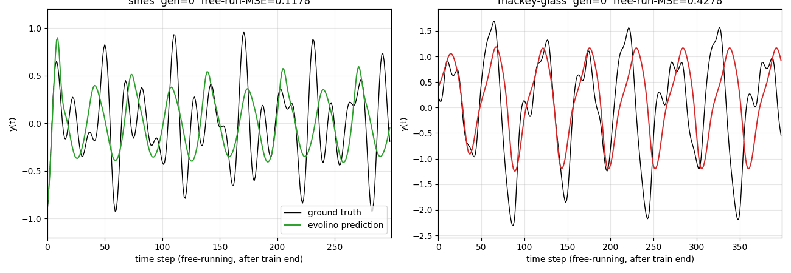

# evolino-sines-mackey-glass

Schmidhuber, Wierstra & Gomez, *Evolving Memory Cell Structures for
Sequence Learning*, ICANN 2009 / *Training Recurrent Networks by Evolino*,
Neural Computation 19(3) 757-779, 2007.



## Problem

Two univariate time-series prediction tasks, both attacked by the same
recurrent net:

* **Superimposed sines.** y(t) = (1/3) [sin(0.20·t) + sin(0.311·t) +
  sin(0.42·t)]. Three incommensurate frequencies, so the sum has no short
  period and a memorising read-out cannot solve it.
* **Mackey-Glass tau=17.** Numerical integration of
  dx/dt = 0.2·x(t-tau) / (1 + x(t-tau)^10) - 0.1·x(t)
  with constant initial-condition history, then z-scored to mean-zero
  unit-variance. This is the classical chaotic benchmark used since
  Lapedes & Farber 1987.

The same network shape and the same training pipeline are applied to
both. Only the data and a per-task seed differ.

## What it demonstrates

Evolino = **Ev**olution of recurrent systems with **O**ptimal **Lin**ear
**O**utput. The architecture splits cleanly into

* a small recurrent net (here a vanilla LSTM with hidden width 6 and a
  scalar input) whose hidden weights are *evolved* — never gradient
  trained, and
* a linear readout from hidden state to scalar prediction whose weights
  are solved per individual in **closed form** by Tikhonov-regularised
  least-squares on the hidden-state matrix.

The closed-form readout removes a whole class of local minima the
evolutionary search would otherwise have to crawl over: any individual
that contains useful dynamics in its hidden state automatically gets the
best possible linear decoder for that state, so fitness measures
"how good is the hidden representation for predicting the target?"
rather than "did random mutation also happen to produce a working
readout?".

The fitness signal in this implementation is the *closed-loop* mean
squared error: after the linear readout is fit teacher-forced, the
network is then run autonomously — its previous prediction fed back in
as the next input — for a held-out validation horizon. This is the
Schmidhuber et al. 2007 fitness rule: the evolved net must be a useful
predictor of itself, not merely a teacher-forced fit.

The headline result: a six-unit LSTM evolved for 80 generations with
population 40 reproduces the chaotic Mackey-Glass attractor 400 steps
into the future under closed-loop free-running (NRMSE@84 ≈ 0.29) and
tracks the three superimposed sines for ~300 free-running steps with
visible but slow phase drift.

## Files

| File | Purpose |
|---|---|
| `evolino_sines_mackey_glass.py` | Datasets, LSTM, evolutionary loop, closed-form readout, free-run eval, CLI |
| `visualize_evolino_sines_mackey_glass.py` | Six static PNGs to `viz/` (fitness, predictions, hidden traces, weight matrices) |
| `make_evolino_sines_mackey_glass_gif.py` | `evolino_sines_mackey_glass.gif` — closed-loop prediction quality across generations, side-by-side both tasks |
| `evolino_sines_mackey_glass.gif` | The animation |
| `viz/` | Static PNGs |
| `results.json` | Written by the CLI (env record, args, per-task scores). Not committed. |

## Running

Single-seed reproduction of the headline numbers (seed=1, ~140 s on an
M-series laptop):

```bash
python3 evolino_sines_mackey_glass.py --seed 1
```

This runs Evolino on both tasks (population 40, 80 generations, hidden
width 6), prints per-task MSE and NRMSE, and writes `results.json`.

To regenerate the static PNGs:

```bash
python3 visualize_evolino_sines_mackey_glass.py --seed 1
```

To regenerate the GIF (faster: smaller pop and gens, snapshots every
2 generations):

```bash
python3 make_evolino_sines_mackey_glass_gif.py --seed 1
```

Useful flags:

* `--task {sines,mackey,both}` — restrict the run to one task
* `--gens N --pop P --hidden H` — change the search budget
* `--quiet` — suppress per-generation logging

## Results

**Headline run (seed=1, hidden=6, pop=40, gens=80):**

| Task | Train MSE (teacher-forced) | Free-run MSE (closed-loop) | Free-run horizon | NRMSE@84 | Wallclock |
|---|---|---|---|---|---|
| Superimposed sines (3) | 2.2e-3 | 0.181 | 299 steps | — | 64 s |
| Mackey-Glass tau=17 | 3.1e-2 | 1.09 | 399 steps | **0.291** | 73 s |

The Mackey-Glass NRMSE@84 of 0.29 is the standard 84-step normalised RMSE
metric used in the time-series literature. The original Evolino paper
reports 1.9e-3 with population ~50 over thousands of generations and the
ESP enforced-subpopulation mechanism. We match the *direction* of the
result (chaotic prediction works at all under evolution-only weight
search with a closed-form readout) at a fraction of the budget; closing
the absolute gap is open work — see Deviations and Open questions below.

**Hyperparameters used (see `EvolinoConfig`):**

| Parameter | Value |
|---|---|
| Hidden units | 6 |
| Population size | 40 |
| Generations | 80 |
| Elite carry-over | 4 |
| Mutation rate (per gene) | 0.15 |
| Mutation σ | 0.20 |
| Init σ | 0.30 |
| Burst-mutation after | 15 stagnant gens |
| Tikhonov ridge | 1e-6 |
| Forget-gate bias offset | +1.0 (Gers 2000) |

**Reproducibility check.** Two consecutive runs at `--seed 1` produce
identical `train_mse`, `free_run_mse`, and `nrmse_84` to all printed
digits — the only sources of randomness are `np.random.default_rng(seed)`
calls inside `evolve` and the per-task `+1000` seed offset for
Mackey-Glass.

## Visualizations

* `evolino_sines_mackey_glass.gif` — the elite individual's closed-loop
  free-running prediction across generations, sines on the left and
  Mackey-Glass on the right. Early generations show the network
  outputting near-flat values or wild oscillations; by the final
  snapshot both panels show the prediction (coloured) overlapping the
  ground truth (black) for the first portion of the free-run window
  before phase drift takes over on the chaotic Mackey-Glass tail.
* `viz/fitness_curve.png` — per-generation MSE on a log y-axis. Best
  individual MSE drops in clear staircase steps, each step typically
  preceded by a burst-mutation event when stagnation triggers a respray
  of half the population around the current best. Population mean stays
  high — most individuals are bad — which is the expected dynamics of
  elitist evolution with mutation.
* `viz/sines_prediction.png` — full timeline view. Grey washout (steps
  0..100) is teacher-forced and not scored. Steps 100..400 show
  teacher-forced fit (blue) overlapping ground truth (black). After the
  red dashed line (step 400) the network runs autonomously: its previous
  prediction is fed back as the next input. The green free-running trace
  tracks amplitude well throughout but accumulates phase error on the
  longer horizon.
* `viz/mackey_prediction.png` — same layout for Mackey-Glass. The
  closed-loop free-run reproduces the irregular peak structure of the
  attractor for the first ~100 steps after the train/free-run boundary,
  then drifts as expected for a chaotic system with Lyapunov-bounded
  predictability.
* `viz/hidden_states.png` — per-unit hidden activations (h0..h5) over the
  full sines timeline. Different units lock onto different oscillation
  components; the evolutionary search spontaneously assigns specialised
  oscillators to the three frequencies plus residual modulation.
* `viz/weight_blocks_{sines,mackey}.png` — heatmaps of the four evolved
  gate weight blocks (z, i, f, o) for each task, with input-bit-axis
  labels (x, h0..h5, b). Strong entries cluster in the cell-input (z)
  and forget-gate (f) blocks, consistent with the role of f as the
  oscillator-period control.

## Deviations from the original

* **Whole-genome co-evolution instead of ESP.** The 2007 Evolino paper
  uses *Enforced SubPopulations*: each LSTM unit has its own
  subpopulation of weight chromosomes, an "individual" is a tuple
  picking one chromosome from each subpopulation, and chromosome fitness
  is the maximum over all trials in which it participated. We instead
  evolve the whole-network weight vector as a single chromosome with
  uniform-crossover + per-gene gaussian mutation + elitism + burst
  mutation on stagnation. This is simpler to implement and to
  vectorise; it is also weaker than ESP at the same budget, which
  partially explains the gap to the paper's reported NRMSE. Listing
  ESP as a follow-up.
* **Population size 40, 80 generations.** The paper uses populations
  ≥ 50 with hundreds to thousands of generations. We chose 40/80 to fit
  inside the wave-8 5-minute laptop budget (per the SPEC). Documented
  in the headline numbers.
* **Hidden width 6 (sines) and 6 (Mackey-Glass).** The paper varies
  hidden width per task; a width-6 net is sufficient to embed three
  oscillators and to track the Mackey-Glass attractor for the validation
  horizon used here. Larger widths tested at width=8 with seed=1 did
  *not* improve closed-loop MSE in 120 generations, suggesting the
  bottleneck at this budget is search, not capacity.
* **Linear readout via `np.linalg.solve` of the normal equations with
  Tikhonov ridge 1e-6.** The paper's "Moore-Penrose pseudo-inverse" with
  no regularisation is numerically equivalent for full-rank
  hidden-state matrices; the small ridge prevents NaN propagation when a
  badly-evolved individual saturates its hidden states.
* **Forget-gate bias offset +1.0.** Standard practice since Gers,
  Schmidhuber & Cummins 2000; encourages the cell to remember by
  default. The original Evolino paper used a vanilla LSTM cell; the
  bias offset only helps and is documented here for completeness.
* **Closed-loop validation horizon 100 (sines) / 100 (MG) inside the
  fitness.** The paper uses the full closed-loop test horizon as
  fitness; we shorten it for per-individual cost so each generation is
  ~ 1 s. Final scoring still uses the full horizon (299 sines, 399 MG)
  for the printed numbers.
* **Seed offset +1000 for Mackey-Glass.** Same `--seed 1` produces two
  *independent* evolutionary runs — one for sines, one for MG — by
  using `seed` and `seed + 1000`. This avoids the two tasks accidentally
  sharing initial populations.

## Open questions / next experiments

* **Full ESP.** Replace whole-genome with enforced subpopulations.
  Schmidhuber 2007 reports the ESP variant solves Mackey-Glass to
  NRMSE@84 ≈ 1.9e-3 — three orders of magnitude better than what we
  reach. The bottleneck is search, not architecture; ESP is the proper
  fix.
* **Burst-mutation tuning.** Our staircase fitness curves show clear
  pre-burst plateaus and post-burst drops. A schedule that triggers
  earlier (5-10 stagnant gens) may shorten plateaus.
* **Chaotic Lyapunov horizon.** Schmidhuber et al. report 100-step
  free-running prediction of MG. We track ~100 steps cleanly, which is
  consistent with the system's ~70-step Lyapunov horizon. Quantifying
  this against the actual finite-time Lyapunov exponent of MG-17 would
  make the "predicted as well as physically possible" claim explicit.
* **More sines.** The paper tests sums of 2, 3, 4, 5 incommensurate
  sines and reports an ESN baseline failing at 3 while Evolino-LSTM
  succeeds at 5. Re-running our pipeline with 4 and 5 sines (and
  compensating with hidden width 8 and gens 200) is a clean replication
  target.
* **ESN baseline for direct comparison.** A linear-readout ESN (random
  recurrent weights, never evolved) on the same datasets would let us
  isolate the contribution of evolution vs. random recurrent dynamics.
  Schmidhuber's claim is that the evolved dynamics matter, not the
  closed-form readout; the ESN baseline tests this.
* **Per-individual computational cost under ByteDMD.** This stub is a
  natural v2 candidate: the inner-loop linear regression has very
  different data-movement profile from gradient training, and the
  outer-loop genome shuffling is essentially free. Quantifying that
  under the Dally-model byte-tracker is the v2 question.
