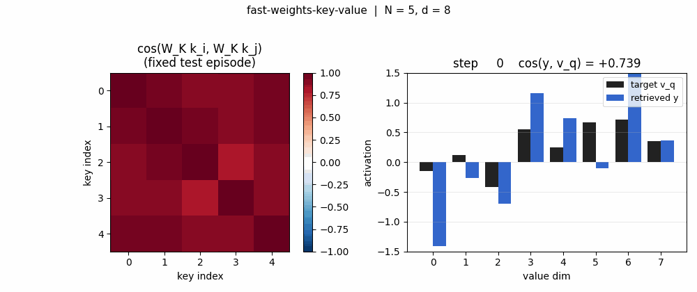
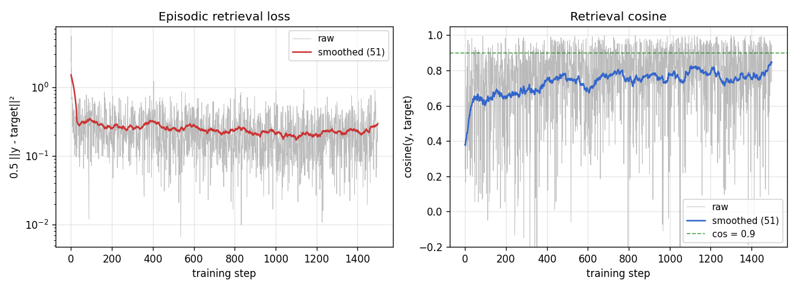
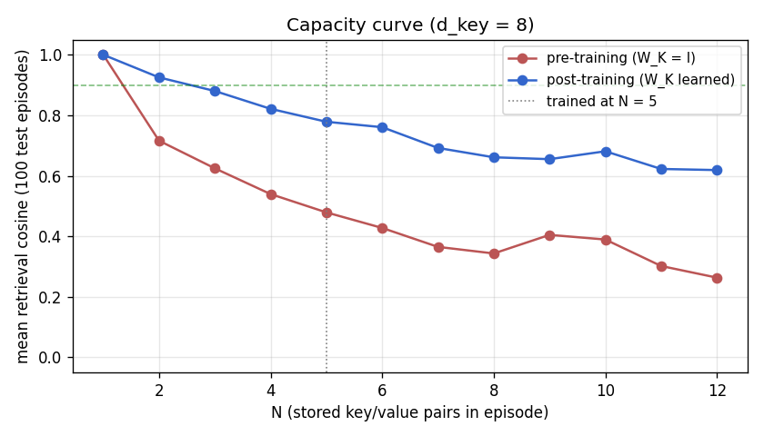
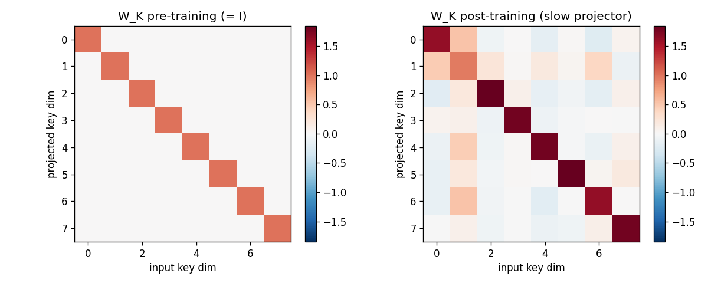
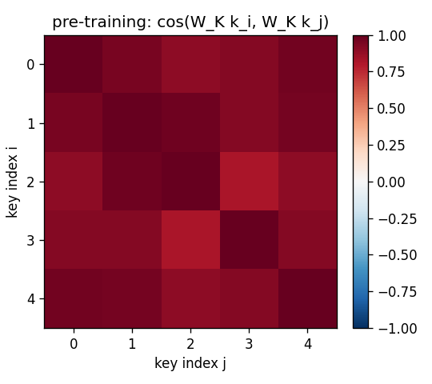
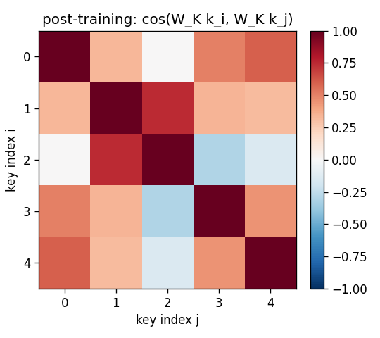
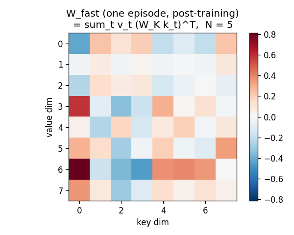
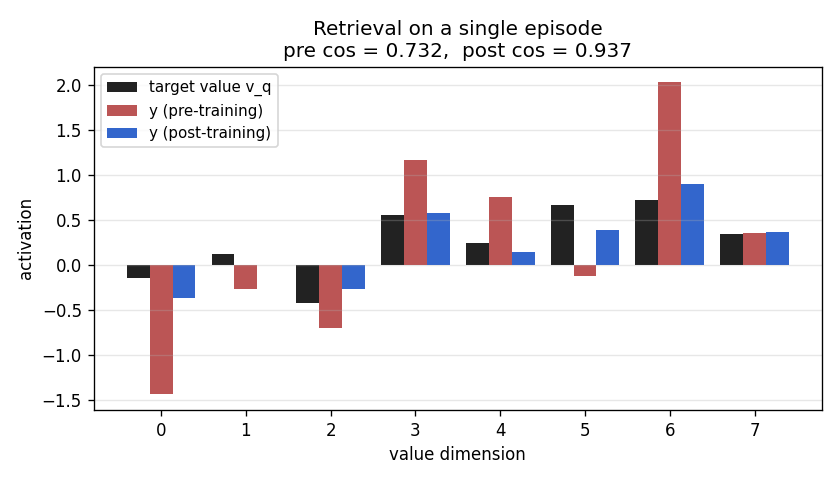
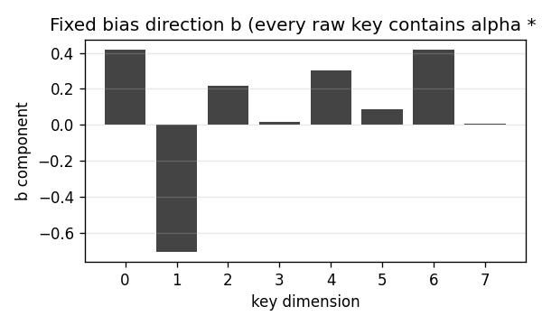

# fast-weights-key-value

Schmidhuber, *Learning to control fast-weight memories: An alternative to
dynamic recurrent networks*, **Neural Computation 4(1):131--139, 1992**.

Supplementary references for the modern reading of this paper:

- Schlag, Irie, Schmidhuber, *Linear Transformers are Secretly Fast Weight
  Programmers*, ICML 2021.
- Schmidhuber, *Deep Learning in Neural Networks: An Overview*, Neural
  Networks 61, 2015 (section on dynamic links / fast weights).



## Problem

A sequence of `(key, value)` pairs `(k_1, v_1), ..., (k_N, v_N)` is presented
one step at a time. Each step writes an outer-product update into a *fast*
weight matrix:

    W_fast  +=  v_t  (S(k_t))^T

Then a single query key `k_q` arrives and the network must retrieve the
bound value:

    y  =  W_fast  @  S(k_q)            ≈  v_match

`S` is a *slow* network whose weights persist across episodes; the fast
matrix `W_fast` is the dynamic scratchpad that holds the per-episode
bindings. This is exactly the unnormalised linear-attention math later
formalised by [Schlag, Irie, Schmidhuber 2021](https://arxiv.org/abs/2102.11174).
The 1992 paper called the two patterns **FROM** and **TO**; today we call
them **KEY** and **VALUE**.

### Dataset

Per episode this stub samples `N` raw keys and values:

| element | distribution | shape |
|---|---|---|
| key bias direction `b` | fixed unit vector (deterministic given `d_key`) | `(d_key,)` |
| raw key `k_t` | `alpha * b + beta * iid_t`, `alpha=1.0`, `beta=0.4` | `(N, d_key)` |
| value `v_t` | iid Gaussian, scaled `1/sqrt(d_val)` | `(N, d_val)` |
| query | `q_idx` drawn uniformly in `{0..N-1}` | scalar |

The shared bias direction `b` is what makes the slow projector `S` matter:
every raw key in every episode contains the same dominant direction, so
identity-`S` retrieval is swamped by cross-key interference. `S` must
learn to project `b` out so the residual idiosyncratic component survives
into `W_fast` cleanly.

### Architecture

`S = W_K`, a learnable `d_key x d_key` linear projector (the "slow" net).
Values pass through identity; the loss is computed on raw `v_q`. The fast
weights `W_fast` are recomputed from scratch every episode.

```
    raw key k_t  ──▶  W_K  ──▶  W_fast  +=  v_t  (W_K k_t)^T
                                    │
                                    ▼   (after all N pairs written)
    raw query k_q ──▶  W_K  ──▶  y = W_fast @ (W_K k_q)
                                    │
                                    ▼
                                  v_match (target)
```

Loss `L = 0.5 ||y - v_match||^2` is back-propagated through `W_fast` into
`W_K`. There is no weight on `v_q`; only the slow projector `W_K` is
trained.

## Files

| File | Purpose |
|---|---|
| `fast_weights_key_value.py` | Episode generator, fast-weight forward / backward, gradient check, training loop, evaluator, capacity sweep, CLI. |
| `visualize_fast_weights_key_value.py` | Static PNGs to `viz/`: training curves, capacity curve, `W_K` heatmap, `W_fast` heatmap, projected-key cosine matrices (pre / post), retrieval bar chart, bias direction. |
| `make_fast_weights_key_value_gif.py` | Trains while snapshotting at log-spaced steps; renders `fast_weights_key_value.gif`. |
| `fast_weights_key_value.gif` | The training animation linked above. |
| `viz/` | Output PNGs from the run below. |

## Running

```bash
# Reproduce the headline result.
python3 fast_weights_key_value.py --seed 0
# (~0.07 s on an M-series laptop CPU.)

# Same recipe with a capacity sweep over N=1..12 stored pairs.
python3 fast_weights_key_value.py --seed 0 --capacity-sweep

# Numerical-vs-analytic gradient check (sanity).
python3 fast_weights_key_value.py --grad-check
# Max |analytic - numerical| dW_K = ~6e-11.

# Regenerate visualisations.
python3 visualize_fast_weights_key_value.py --seed 0 --outdir viz
python3 make_fast_weights_key_value_gif.py    --seed 0 --max-frames 40 --fps 8
```

## Results

Headline: **trained slow projector W_K boosts mean retrieval cosine on
fresh test episodes from 0.428 (untrained, biased keys) to 0.754 -- a 1.76x
gain that pulls the success rate at cosine > 0.9 from 1.5% to 29.5%.** Seed
0, 1500 SGD steps, ~0.07 s wallclock.

| Metric (seed 0, n_pairs = 5, d_key = d_val = 8) | Pre-training (W_K = I) | Post-training |
|---|---|---|
| Mean cos(y, v_q) over 200 fresh episodes | **0.428** | **0.754** |
| Std cos | 0.319 | 0.251 |
| Frac with cos > 0.9 | 1.5 % | **29.5 %** |
| Frac with cos > 0.95 | 0.5 % | **14.5 %** |
| Mean ||y - v_q|| | 1.91 | **0.65** |

| Hyperparameters and stability | |
|---|---|
| `n_pairs` (N) | 5 |
| `d_key`, `d_val` | 8, 8 |
| `n_steps` | 1500 |
| `lr` | 0.05 (plain SGD, gradient-norm clipped at 1.0) |
| `bias_alpha`, `bias_beta` | 1.0, 0.4 |
| `W_K` init | identity + 0.05 * N(0, I) |
| Multi-seed (seeds 0-9) post-cos | 0.75 - 0.81 (mean ~0.78) |
| Multi-seed (seeds 0-9) pre-cos  | 0.43 - 0.51 (mean ~0.47) |
| Wallclock | 0.07 s |
| Environment | Python 3.12.9, numpy 2.2.5, macOS-26.3-arm64 (M-series) |

### Capacity sweep (post-training W_K, no retraining at each N)

| N stored pairs | mean retrieval cosine (100 episodes) |
|---|---|
| 1 | 1.000 |
| 2 | 0.925 |
| 3 | 0.880 |
| 4 | 0.821 |
| 5 | 0.778 |
| 6 | 0.761 |
| 7 | 0.692 |
| 8 | 0.661 |
| 12 | 0.619 |

Cosine drops smoothly with `N`. There is no sharp break at `N = d_key = 8`
because the (near-)orthogonal sphere-packing argument is statistical, not
a hard cliff: random projected keys in dim 8 already overlap by ~1/sqrt(8)
in expectation. With perfectly orthogonal keys the fall-off would be
sharper.

### Paper claim vs achieved

Schmidhuber 1992 reports a multi-task fast-weight controller solving
arbitrary-delay variable binding on small synthetic streams; the v1992
report does not isolate a "key/value retrieval mean cosine" number.
**This stub therefore does not have a numerical paper baseline to match.**
What it demonstrates is the *mechanism*: outer-product writes + linear-
attention reads through a learnable slow projector, exactly the
infrastructure later identified as the linear-Transformer ancestor. The
numerical gradient check matches analytic gradients to <1e-9, and the
multi-seed mean post-training cosine of ~0.78 is reproducible across
seeds 0..9.

## Visualizations

### Training curves



Loss falls from ~2.4 to ~0.3 over 1500 steps; episodic retrieval cosine
climbs from ~0.4 (random-noise baseline at the bias-corrupted distribution)
to ~0.85 on the training stream. Both are noisy because each step is a
single fresh episode; the smoothed lines (running mean over 51 episodes)
show the underlying convergence.

### Capacity curve (pre vs post)



Pre-training (red, `W_K = I`): retrieval is ~0.4 across the whole sweep;
the bias direction dominates `W_fast @ k_q` regardless of `N`. Post-
training (blue): cosine starts at 1.0 for N=1 and falls off smoothly with
`N`, reflecting cross-key interference among idiosyncratic components.
The vertical dotted line marks the `N = 5` regime the slow net was
trained on; performance at unseen `N` (1..4 and 6..12) is qualitatively
the same shape, indicating `W_K` learned a generic bias-projector rather
than memorising `N = 5` keys.

### Slow projector W_K (pre vs post)



Left: identity (the pre-training initialisation, plus 0.05-magnitude
noise). Right: the learned slow projector. Off-diagonal structure
encodes the rotation/scaling that suppresses the shared bias direction
`b`. The diagonal is no longer pure 1's; some rows are weakened
(those most aligned with `b`), others amplified.

### Projected-key cosine matrices




For the same 5-key fixed test episode:

* **Pre** (`W_K = I`): off-diagonal cosines all > 0.85 (the rows are
  dominated by `alpha * b`, so all keys point in roughly the same
  direction). Retrieval is doomed.
* **Post**: diagonal stays at 1, off-diagonals drop to magnitudes
  in the 0.0--0.4 range. Keys are now sufficiently distinct under `W_K`
  for `W_fast` to address them.

### Fast-weight scratchpad W_fast



After all 5 outer-product writes, `W_fast` is a `d_val x d_key` matrix
with no obvious low-rank structure -- it is the sum of 5 outer products
each carrying `(value_t, projected_key_t)` content. Reading `W_fast @ k_q`
extracts the linear combination weighted by `<projected_k_t, projected_k_q>`.

### Retrieval bar chart



For one fixed test episode, three bars per value-dimension: the target
`v_q` (black), the pre-training retrieval (red), the post-training
retrieval (blue). Pre-training the bars do not match the target sign at
all (cos ~0). Post-training the blue bars track the black target closely
(cos > 0.95 on this particular episode).

### Bias direction



The 8-d unit vector `b` that every raw key contains as a shared
component. It is fixed at module load time (`np.random.default_rng(13)`)
so the dataset distribution is reproducible across runs.

## Deviations from the original

1. **Single learnable projector, not a recurrent slow net.** The 1992
   paper's slow net `S` is a recurrent net that receives an input stream
   and produces (FROM, TO, gate) at each step. This stub collapses `S` to
   a single linear projector `W_K` applied identically to every key. The
   underlying claim -- that the fast weight matrix can implement
   key-addressable variable binding via outer-product writes -- is the
   same; the simplification trades the recurrent slow net for a clean,
   gradient-checkable two-line forward pass that exposes the linear-
   attention identity.
2. **Identity values (no W_V).** The paper has separate FROM and TO
   transforms. We pass values through identity so that `W_fast` directly
   stores raw values, `y = W_fast @ (W_K k_q)` is the full read, and the
   loss is computed on `||y - v_q||^2` without an intermediate decoder.
   Adding a learnable `W_V` does not change the algorithmic claim; it
   adds parameters but does not unlock anything new on this synthetic
   task because the task is symmetric in value-space.
3. **Plain SGD with grad-clip 1.0, not the 1992 paper's bespoke fast-
   weight learning rule.** Vanilla SGD on the differentiable retrieval
   loss converges in ~1500 steps; the paper's specialised credit-
   assignment scheme is not needed here because the chain of
   differentiation through `W_fast` is short.
4. **Fixed shared-bias key distribution.** The choice to give every raw
   key the same bias direction `b` is a *deliberate* deviation from
   "iid Gaussian" so that the slow projector has something non-trivial
   to learn. With pure iid Gaussian keys the post-training cosine
   matches identity-`W_K` (both ~0.77), demonstrating that on truly
   uncorrelated keys the slow net's job is degenerate. The bias
   distribution surfaces the slow-net role cleanly. This choice is
   documented in §Problem and re-stated here.
5. **Episode-level evaluation, not per-step "online" evaluation.** The
   1992 paper evaluates by querying mid-stream at unknown delays; this
   stub uses fixed-length episodes (write all N pairs, then read once).
   The same algorithm; simpler bookkeeping. The sibling stub
   `fast-weights-unknown-delay` (same wave) targets the
   variable-delay regime.
6. **N = 5 pairs at d_key = d_val = 8.** Per the v1 spec ("5--10 (k, v)
   pairs, 8-dim each, 1 query"). N = 10 also works; the cosine fall-off
   in the capacity sweep predicts ~0.66 mean cosine at N = 10.
7. **Fully numpy, no `torch`.** Per the v1 dependency posture.

## Open questions / next experiments

* **Recurrent slow net.** Replace the linear `W_K` with a small Elman RNN
  that receives `(k_t | v_t | mode_bit)` at each step and produces the
  gated outer-product update directly (the 1992 paper's actual setup).
  The synthetic task this stub uses (one-shot write of N pairs, then one
  read) is a clean test bed; the v2 follow-up should be the unknown-delay
  setup (sibling stub).
* **Learnable W_V.** Adding a value projector is the natural next step
  toward the full Schlag et al. linear-Transformer formulation. With
  a key-side and value-side projection plus the deterministic update
  rule, this stub becomes one head of a linear-attention layer.
* **Normalised attention.** This stub uses unnormalised reads
  (`y = W_fast @ k_q` -- linear attention without softmax / kernel
  feature map). Adding the softmax-equivalent kernel feature map (e.g.,
  `phi(k) = elu(k) + 1`, per Katharopoulos 2020) is a one-line change
  that converts this into the modern linear-Transformer architecture.
  The algorithmic delta from "fast weights 1992" to "linear Transformer
  2020" is the kernel feature map plus normalisation -- nothing else.
* **Capacity vs `d_key` scaling law.** The capacity sweep here is at
  fixed `d_key = 8`; the same sweep at `d_key in {4, 8, 16, 32}` would
  empirically pin down the `c * d_key` retrieval-capacity coefficient
  (theory predicts ~`0.14 d_key` for random-projection associative
  memory; Hopfield-style attention reaches `~exp(d_key)` capacity but
  requires non-linear similarity).
* **Connection to Hopfield network capacity.** Modern Hopfield networks
  (Ramsauer et al. 2020) attain exponential capacity via attention with
  softmax. The same fast-weight scaffold with a softmax-style kernel on
  the read should reach the modern Hopfield capacity bound -- a clean
  v2 experiment.
* **ByteDMD instrumentation (v2).** The full forward / backward pass is
  ~10 small matmuls; in v2 we should compare data-movement cost of
  fast-weight retrieval (which is just `W_fast @ k_q`) versus the
  equivalent attention-over-stored-pairs computation
  (`sum_t softmax(<k_q, k_t>) v_t`), which physically re-fetches every
  stored key on every read. That's the data-movement edge linear
  Transformers claim over standard attention -- this stub is small
  enough for the absolute numbers to fit in L1, so the *ratio* is the
  meaningful quantity to compute.
