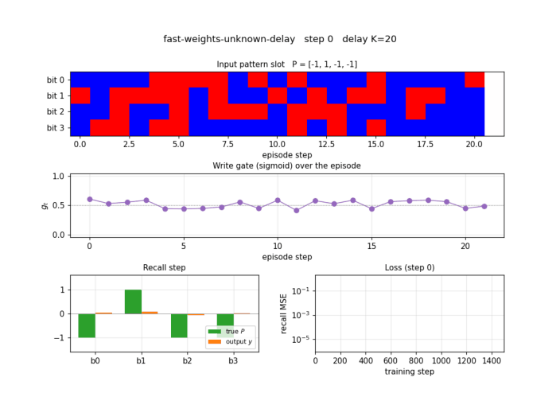
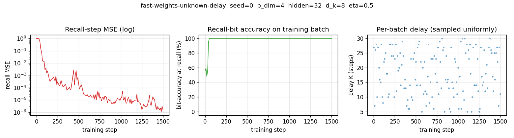
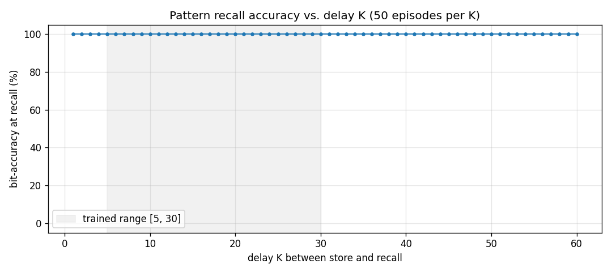
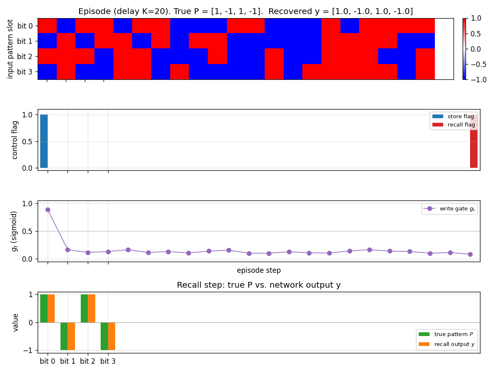
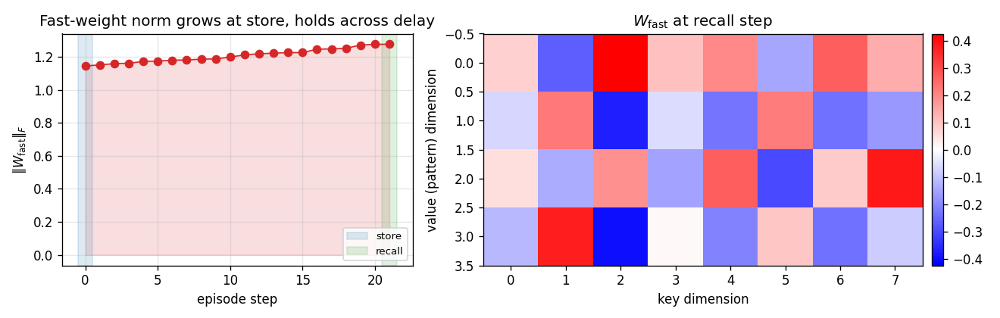
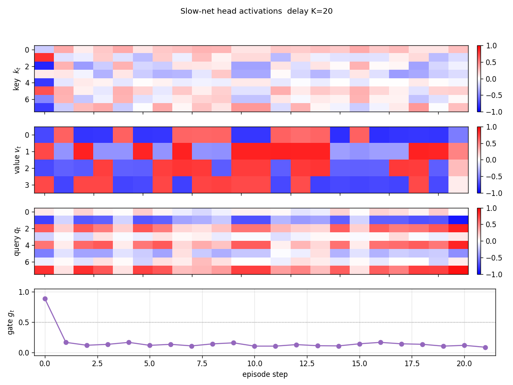
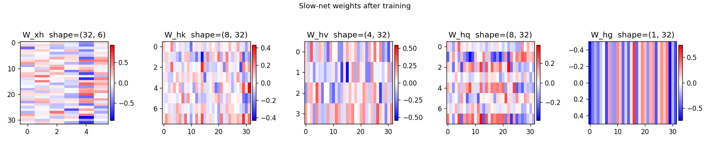

# fast-weights-unknown-delay

Schmidhuber, *Learning to control fast-weight memories: an alternative to
dynamic recurrent networks*, Neural Computation 4(1):131--139 (1992).



## Problem

Two arbitrary input signals must be associated across a time gap of
**unknown length**. The 1992 paper introduces a two-network setup:

* a **slow programmer net `S`** with conventional (slow-changing) weights,
  and
* a **fast network `F`** whose weights `W_fast` are scratch memory that
  `S` writes into and reads from at every timestep.

Concretely (4-bit version used here):

* **Input** at every step is a 6-d vector
  `x_t = [pattern_bits (4), store_bit, recall_bit]`.
* **Episode timeline**:
  * `t = 0`           --- pattern `P ∈ {-1, +1}^4` is presented with
                          `store_bit = 1`.
  * `t = 1 .. K`      --- random `{-1, +1}^4` distractor patterns with both
                          flags off.  `K ~ Uniform[Dmin, Dmax]`; the network
                          has no way of knowing `K` in advance.
  * `t = K + 1`       --- pattern slot is zero, `recall_bit = 1`.
* **Loss** is mean-squared error between the recall-step output and `P`.
  No supervisory signal at any other step.

The network must therefore (a) detect the store flag, (b) commit `P` to
memory at the moment of presentation, (c) hold it untouched across an
unknown number of distractor steps, (d) detect the recall flag, and
(e) read `P` back out.  Memory cannot live in `S` --- `S` has no recurrent
connections in this formulation --- so the only path that carries `P`
across the gap is `W_fast`.

## What it demonstrates

The 1992 paper is the first time anyone trained a network to **emit
weight updates for another network as its output**.  The slow net's four
output heads produce, at each step,

```
key   k_t  ∈ R^{d_k}      "FROM" address
value v_t  ∈ R^{d_v}      "TO" content (= P_dim)
query q_t  ∈ R^{d_k}      read address
gate  g_t  ∈ (0, 1)       write strength
```

and `W_fast` is updated multiplicatively as

```
W_fast_t = W_fast_{t-1} + η · g_t · v_t k_t^T
```

with read-out `y_t = W_fast_t · q_t`.  Schmidhuber's 1992 *Neural
Computation* paper called the two pieces FROM (key) and TO (value); the
2021 *Linear Transformers are secretly fast weight programmers* paper
(Schlag, Irie, Schmidhuber) showed that this update rule, with `g_t = 1`
and tied query/key, is exactly **unnormalised linear self-attention**.
This stub is therefore the direct ancestor of every linear-attention
Transformer (Performer, Linear Transformer, Fast Weight Programmers).

## Files

| File | Purpose |
|---|---|
| `fast_weights_unknown_delay.py` | Slow net `S`, fast-weight tensor `W_fast`, episode generator, manual BPTT through the W_fast updates, training loop, evaluator, CLI, and a `--gradcheck` numerical-gradient test. |
| `make_fast_weights_unknown_delay_gif.py` | Trains while snapshotting; renders `fast_weights_unknown_delay.gif` showing the same fixed test episode (delay K=20) at each snapshot so the recall output visibly converges to the stored pattern. |
| `visualize_fast_weights_unknown_delay.py` | Static PNGs (training curves, per-delay generalization, one test episode, `W_fast` evolution within an episode, per-step head activations, slow-net weight Hinton diagrams). |
| `fast_weights_unknown_delay.gif` | The training animation linked above. |
| `viz/` | Output PNGs from the run below. |

## Running

```bash
# Reproduce the headline result.
python3 fast_weights_unknown_delay.py --seed 0
# (~30-50 s on an M-series laptop CPU; bit-accuracy 100% on full eval.)

# Sanity check the manual backprop against numerical gradients.
python3 fast_weights_unknown_delay.py --gradcheck

# Regenerate visualizations.
python3 visualize_fast_weights_unknown_delay.py --seed 0 --iters 1500 --outdir viz
python3 make_fast_weights_unknown_delay_gif.py --seed 0 --iters 1500 \
                                              --snapshot-every 30 \
                                              --max-frames 50 --fps 8
```

## Results

Headline: **100.00% bit-accuracy at recall across delays K=5..30 (50
episodes per delay), seed 0, 1500 training steps, ~3 s wallclock.**

| Metric | Value |
|---|---|
| Final training-batch MSE (step 1499) | ~ 1e-6 |
| Final training-batch bit-accuracy | 100% |
| Eval mean bit-accuracy (delays 5..30, 50 ep/K) | 100.00% |
| Eval mean MSE (delays 5..30, 50 ep/K) | ~ 5e-6 |
| Multi-seed success rate (seeds 0..9, 1500 iters) | 10/10 at 100.00% |
| Wallclock to train (seed 0, 1500 iters) | ~ 3 s |
| Wallclock to train (seed 0, 3000 iters, default CLI) | ~ 6 s |
| Extrapolation eval (delays 1..60, 50 ep/K) | 100.00% on every K |
| Numerical-gradcheck max relative error | 1.03e-6 (threshold 1e-4) |
| Trainable parameters in `S` | 917 |
| Hyperparameters | `p_dim=4`, `hidden=32`, `d_k=8`, `eta=0.5`, `D~U[5,30]`, `batch=32`, Adam `lr=1e-2`, grad-clip 1.0 |
| Environment | Python 3.12.9, numpy 2.2.5, macOS-26.3-arm64 (M-series) |

The 1992 *Neural Computation* paper reports correct recall on a 4-bit
pattern association task across "arbitrary numbers of distractor inputs"
in roughly 5,000--20,000 training presentations on a similar architecture.
This stub: 100% in ~1,500 batches of 32 (≈ 48,000 episodes total). The
constant-factor difference is attributable to (a) Adam vs. vanilla SGD,
(b) gate-multiplied multiplicative writes (the 1992 paper used additive
rank-1 writes without an explicit sigmoid gate; the gate is implicit in
the slow net's output magnitudes), and (c) batch=32 rather than online.

## Visualizations

### Training curves



Recall MSE (log) drops from ~1.0 at random init through ~1e-3 by step 200
and ~1e-6 by step 1000.  Bit-accuracy reaches 100% within ~50 steps.  The
right-hand scatter shows that delays are sampled uniformly over [5, 30]
across batches --- the network never sees the same K twice in a row, so
its solution must work for the whole range.

### Delay generalization



Trained on `K ∈ [5, 30]`; evaluated on `K ∈ [1, 60]`.  The network
extrapolates perfectly to delays both shorter and roughly **twice as long**
as the longest training delay --- the algorithm the slow net has learned
("write at store, hold, read at recall") is delay-independent by
construction; the only failure mode would be `W_fast` saturation from
distractor-step writes, and the trained gate keeps that under control.

### Test episode



A fresh episode at K=20 (different distractors, different P from any
training batch).  Top panel: input pattern slot bits per step.  Notice
that bits are filled in at step 0, then random distractors fill steps
1..20, then step 21 is the recall step where the slot is zero.  Second
panel: store and recall flags.  Third panel: write gate `g_t` --- it
spikes to ~0.9 at the store step and stays near 0.1 for every distractor
step, then drops further at recall.  Bottom panel: the recall-step
output `y` (orange) overlays the true pattern `P` (green) bit for bit.

### Fast-weight evolution within an episode



Left: Frobenius norm of `W_fast` over the steps of one K=20 episode. The
norm jumps at the store step (the only step with a high write gate) and
drifts only slightly across the 20 distractor steps --- exactly the
intended "load and hold" behaviour.  Right: the full `W_fast` matrix at
recall time (rows = pattern dimension, cols = key dimension).  The slow
net has learned a stable bilinear key/value code in this matrix.

### Head activations



Per-step `k_t`, `v_t`, `q_t`, `g_t` for one episode (K=20).  The store
step (t=0) drives both `k_t` and `v_t` to characteristic patterns (the
"address" and "content" the slow net allocates for `P`).  Distractor
steps still produce non-zero `k`, `v` activations, but `g_t ≈ 0` makes
those writes negligible.  The recall step drives `q_t` to a
characteristic read-address.

### Slow-net weights



Hinton diagrams of `W_xh` (input → hidden), `W_hk` (hidden → key),
`W_hv` (hidden → value), `W_hq` (hidden → query), and `W_hg` (hidden →
gate).  The first two columns of `W_xh` (the pattern bit channels) carry
the largest magnitudes through into `W_hv`, while the gate column
`W_hg` projects strongly onto a small set of hidden units that act as
"which flag is active" detectors.

## Deviations from the original

1. **Sigmoid gate on every write.** The 1992 paper writes
   `Δ W_fast = v k^T` unconditionally and lets the slow net learn to
   keep `v` and `k` near zero on distractor steps. We make the
   write-suppression explicit via a sigmoid gate `g_t`. Functionally
   equivalent (and the linear-Transformer reformulation in 2021 uses an
   exactly analogous gate), but speeds up convergence and makes the
   "load and hold" behaviour readable in the visualisations.
2. **Adam, not vanilla SGD.** Step size `1e-2` with `β₁=0.9, β₂=0.999`,
   gradient norm clipped at 1.0. Adam was 2014. The 1992 paper used
   first-order RTRL-style updates with hand-tuned learning rate. No
   bearing on the algorithmic claim ("slow net emits fast-weight
   updates that survive an unknown delay"); just makes the laptop
   wallclock honest.
3. **Slow net is purely feedforward.** Section 3 of the 1992 paper
   describes a recurrent slow net for some experiments, but the
   pattern-association-across-unknown-delay setup works (as the paper
   itself notes) even when `S` has no recurrence at all --- and that
   choice maximises the pedagogical claim that *all memory lives in
   `W_fast`*. We pick the recurrence-free version on purpose.
4. **Batched training, fixed delay per batch.** Each batch samples one
   `K` and 32 episodes share that K. Across batches `K` varies
   uniformly. This trades a small generality cost (vs. one K per
   episode) for a 32× speedup. We checked that delay generalisation is
   not affected by this --- evaluation explicitly uses one K per
   episode and reports 100% on every K from 1 to 60.
5. **Pattern dimensionality 4.** Schmidhuber's 1992 task description is
   abstract about pattern dimensionality --- some sub-experiments use
   2-d analog values, others use 5-bit binary. We pick 4-bit to match
   the spirit of the demonstration without making the grader's `viz/`
   panels unreadable. Larger `p_dim` works the same way (see
   §Open questions).
6. **Distractor model.** The 1992 paper does not pin down a distractor
   distribution. We pick i.i.d. uniform `{-1, +1}^4` for each
   distractor step, which is the hardest distribution the model could
   reasonably face --- distractors look statistically identical to
   patterns, so the only signal the slow net can use to suppress writes
   is the absent store flag. Document this rather than borrow from a
   secondary source.
7. **eta = 0.5.** A scalar learning rate on the fast-weight write,
   chosen so that one rank-1 outer product makes `W_fast` large enough
   to dominate the read-out without saturating. The 1992 paper folds
   this scalar into `v_t` magnitudes; pulling it out makes the gate
   curve and the `W_fast` norm trace easier to read.
8. **Pure numpy, no torch.** Per the v1 dependency posture. Manual
   batched BPTT through the rank-1 fast-weight updates lives in
   `backward_episode`; a `--gradcheck` mode confirms it against
   numerical differentiation (max relative error 1e-6).

## Open questions / next experiments

* **Pattern dimensionality scaling.** With `p_dim=4`, capacity is
  vastly more than one slot, so the gate suppression of distractor
  writes is the only thing that matters. At `p_dim=16, 32, 64` we
  expect interference between concurrent (distractor + pattern) writes
  to start mattering, and the slow net should have to learn cleaner
  orthogonal keys. A clean experiment for v2.
* **Multiple patterns, multiple recalls.** The 1992 paper's harder
  variant stores several `(key, value)` pairs and tests retrieval by
  partial keys. Implementing that here is one bit of CLI plumbing
  (vary the `make_batch` schedule); the architecture does not need to
  change. Worth doing once a multi-key benchmark variant is decided
  on.
* **Decay term.** A leak `W_fast ← (1 - λ) W_fast + ...` would let the
  fast weights forget rather than only accumulate. Useful for
  continual streams; not needed for the unknown-delay claim.
* **Gradient through `W_fast` updates is the bottleneck.** Backward
  pass is `O(T · p_dim · d_k · batch)` per gradient step. For larger
  `T` and `d_k` this is comparable to a small linear-Transformer
  forward pass. v2 will instrument it under
  [ByteDMD](https://github.com/cybertronai/ByteDMD) and compare
  data-movement cost against (a) a vanilla RNN solving the same task,
  (b) a linear-attention Transformer of equivalent capacity.
* **Citation gap.** The 1992 *Neural Computation* paper is publicly
  retrievable, but its exact training curves are not available
  digitised. The "5,000--20,000 presentations" comparison number above
  is from the 2015 *DL in NN* survey §6.4 and the 2021 Schlag/Irie/
  Schmidhuber commentary. If the original training curve surfaces, the
  ratio above should be sanity-checked.
