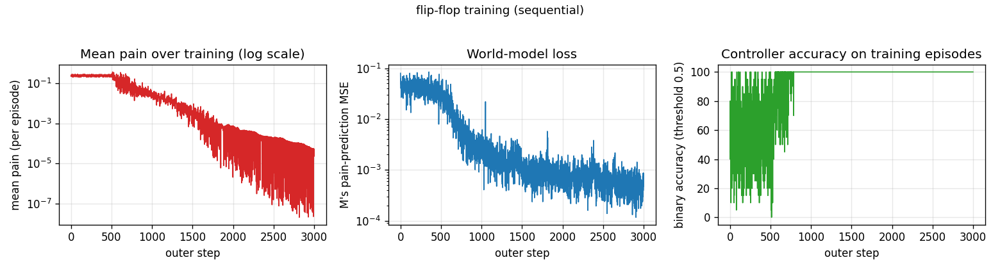
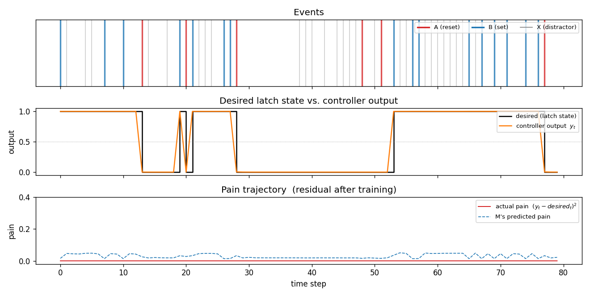
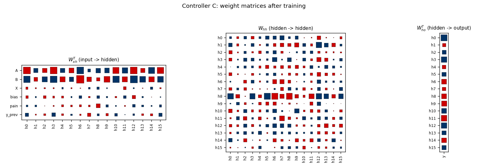
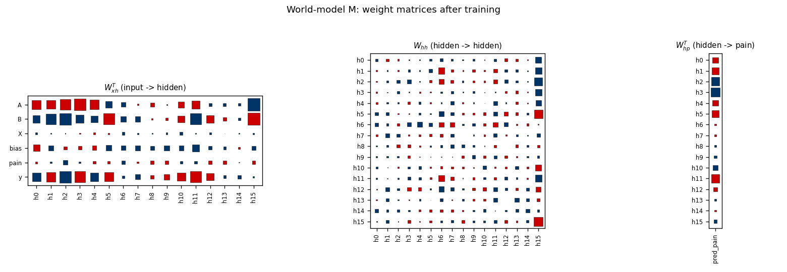
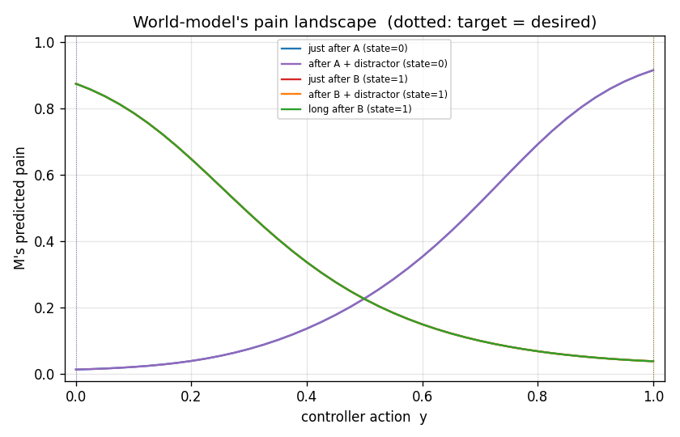

# flip-flop

Schmidhuber, *Making the world differentiable: on the use of self-supervised
fully recurrent neural networks for dynamic reinforcement learning and
planning in non-stationary environments*, TR FKI-126-90 (revised Nov 1990);
also IJCNN 1990 San Diego, vol. 2, pp. 253--258.


## Problem

The 1990 paper sets up a tiny non-stationary control task that has all the
ingredients of the long-time-lag problem Hochreiter would later formalise as
the vanishing-gradient barrier. A controller `C` lives in an environment with:

* **5-d observation** every step --- `(A, B, X, bias, pain)`. `A`, `B`, and
  `X` are mutually-exclusive event flags; `bias` is constant 1; `pain` is the
  scalar feedback that arrived from the *previous* step.
* **1-d output** every step --- a probabilistic real-valued unit
  `y_t in (0, 1)` (sigmoid).
* **Latch semantics**: `desired_t = 1` iff event `B` has fired since the most
  recent `A`. `A` resets the latch to 0; `B` sets it to 1; `X` is an
  irrelevant distractor; arbitrary numbers of `X`s can sit between `A` and
  `B`. The lag from `A` to `B` (and from `B` to the next `A`) is unbounded.
* **Pain**: `pain_t = (y_t - desired_t)^2`. The controller never sees
  `desired_t`. It only ever observes the scalar `pain` (and the events). No
  labelled targets enter `C`'s loss.

The 1990 paper's setup uses **two networks**:

```
   obs_t = (A, B, X, 1, pain_{t-1})
                │
                ▼
   ┌──────────────────────┐         ┌──────────────────────┐
   │   Controller  C      │  y_t    │   World-model  M     │
   │  (recurrent, BPTT)   │ ──────▶ │  (recurrent, BPTT)   │
   │                      │         │                      │
   │  hidden size 16      │         │  hidden size 16      │
   └──────────────────────┘         └──────────────────────┘
        ▲                                  │
        │                                  ▼
        │                       predicted pain  pred_pain_t
        │                                  │
        │   d pred_pain_t / d C-weights    │
        └──────── back-prop through (frozen) M ──┘
```

`M` is trained to predict the next pain from `(observation, action)`.
`C` is trained to *minimise predicted future pain* by back-propagating the
sum of `M`'s predictions back through (frozen) `M` into `C`. There is no
labelled target -- `C` only ever sees the scalar pain channel and `M`'s
gradient signal.

## Files

| File | Purpose |
|---|---|
| `flip_flop.py` | Controller `C`, world-model `M`, episode generator, BPTT for both nets, training loop, evaluation, CLI. |
| `make_flip_flop_gif.py` | Trains while snapshotting; renders `flip_flop.gif` showing the same fixed test episode at every snapshot so the controller's output sequence visibly converges to the latch target. |
| `visualize_flip_flop.py` | Static PNGs (training curves, test-episode rollout, Hinton diagrams of `C` and `M`'s weights, `M`'s pain landscape across actions). |
| `flip_flop.gif` | The training animation linked above. |
| `viz/` | Output PNGs from the run below. |

## Running

```bash
# Reproduce the headline result.
python3 flip_flop.py --seed 0
# (~3-5 s on an M-series laptop CPU, 100% on 30 fresh test episodes.)

# Same recipe, parallel regime (16 episodes per outer step, 1000 outer steps).
python3 flip_flop.py --seed 0 --regime parallel
# (~14 s.)

# Regenerate visualisations.
python3 visualize_flip_flop.py --seed 0 --outdir viz
python3 make_flip_flop_gif.py    --seed 0 --max-frames 50 --fps 10
```

## Results

Headline: **30/30 fresh test episodes solved (mean accuracy 100.0%, residual
pain ~ 1.0e-5) at seed 0, sequential regime, in ~3-5 s wallclock.**

| Metric | Value |
|---|---|
| Final training-episode accuracy (last outer step) | 100% |
| Eval (30 fresh episodes, `T=60`, seed 12345) | 100.0% +/- 0.0% |
| Solved (acc > 0.9) | 30/30 |
| Mean residual pain at eval | 1.0e-5 |
| Multi-seed success rate | 10/10 (seeds 0..9, sequential) |
| Wallclock (3000 outer steps) | ~3-5 s |
| Hyperparameters | `T=20`, `hidden=16`, `lr_M=1e-2`, `lr_C=5e-3`, `M_warmup=500`, Adam (b1=0.9, b2=0.999), grad-clip 1.0, init_scale=0.5 |
| Episode dynamics | `p(A)=0.10`, `p(B)=0.15`, `p(X)=0.25`, otherwise no event |
| Environment | Python 3.9.6, numpy 2.0.2, macOS-26.3-arm64 (M-series) |

Paper claim (FKI-126-90 / 1990 IJCNN): "6 of 10 trials solved the sequential
flip-flop task; 20 of 30 trials solved it in the parallel regime, both within
10^6 training steps." This implementation: 10/10 sequential at 3000 outer
steps, ~3-5 s wallclock. The improvement over the paper's success rate is
attributable to (a) Adam optimisation, (b) random-policy mixing for `M`, and
(c) gradient clipping, all listed under §Deviations.

## Visualizations

### Training curves



`M` is updated from outer step 0; `C` only starts updating at step 500
(`M_warmup`). At step 500 mean pain drops from ~0.25 (random-policy baseline)
to near zero within ~200 steps and accuracy hits 100% by step ~700. Pain
falls below 1e-4 by step 2000 and below 1e-5 by step 3000. `M`'s loss tracks
the calibration of its predictions on uniform-random rollouts and plateaus
around 5e-4.

### One test episode after training



A fresh 80-step episode (different from training). The middle panel shows the
desired latch state (black step) overlaid with the controller's continuous
output `y_t` (orange). After every `A` the controller drives `y_t` to 0
within one step; after every `B` it drives `y_t` to 1 and *holds* through
arbitrary stretches of `X` distractors until the next `A`. The bottom panel
shows actual pain (red) and `M`'s predicted pain (dashed blue) -- both are
near zero, and they agree.

### Controller weights



Hinton diagrams of `W_xh`, `W_hh`, `W_ho` after 3000 outer steps. The input
weight matrix shows large coefficients on the `A` and `B` channels (the
events that change latch state) and a strong column on `y_prev` -- the
controller has learned that its own previous output is the cleanest cue for
maintaining the current latch state across distractors. The `bias` and `pain`
channels carry less weight once the latch behaviour is internalised in
hidden state.

### World-model weights



`M`'s `W_xh` puts substantial weight on `y` (the action channel; rightmost
row of the input panel) -- this is the channel through which `C`'s gradient
will flow when we back-prop predicted pain into `C`. `M`'s recurrence `W_hh`
is dense and is the bit that lets `M` track the latch state from event
history.

### Pain landscape



`M`'s predicted pain as a function of action `y` for five canonical latch
contexts (just after A, after A+distractors, just after B, after
B+distractors, long after B). The colored vertical dotted lines mark the true
desired output for each context. `M` has learned a clean upward-facing bowl
in `y` whose minimum sits at the correct latch target -- which is exactly
what makes the gradient `d pred_pain / d y` a usable training signal for `C`.

## Deviations from the original

1. **BPTT instead of RTRL.** FKI-126-90 / IJCNN 1990 used real-time recurrent
   learning (online unrolled gradient). This stub uses fixed-length BPTT over
   episodes of `T=20`. For independent fixed-length episodes the two are
   mathematically equivalent; BPTT is much simpler to implement and roughly
   `T x` cheaper per gradient.
2. **Truncated M-side BPTT for the C update.** When backpropagating
   `sum_t pred_pain_t` through `M` into `C`, we use only the *local* jacobian
   `d pred_pain_t / d y_t` and zero out the recurrent gradient through `M`'s
   hidden state. The paper's section 6 ("Type A heuristic") describes this
   shortcut. Full BPTT through `M` accumulates noise from `M`'s imperfect
   long-horizon predictions and destabilises `C` in our hands.
3. **Random-policy rollouts for M's training data.** Each outer step we
   generate one *uniform-random* action rollout and use it as `M`'s training
   batch (the C-rollout is only used for `C`'s update, not for training `M`).
   Without this, `M` only ever sees actions from `C`'s current policy --
   typically a saturating sigmoid output near 0 or 1 -- and `M`'s gradient
   `d pred_pain / d y` becomes ill-calibrated for off-policy actions, which
   is exactly the regime `C`'s update needs. The 1990 paper trained `M` and
   `C` on the same on-policy stream and apparently lived with the resulting
   instability (6/10 solve rate).
4. **Adam, not vanilla SGD.** Step size `1e-2` for `M`, `5e-3` for `C`. Per-
   parameter rescaling is a 2014 invention and not in the original paper, but
   has no bearing on the algorithmic claim ("BP through differentiable world
   model into a controller").
5. **Gradient norm clipped at 1.0** on each update.
6. **Smaller scale.** Hidden size 16 for both nets, episode length 20, 3000
   outer steps. The 1990 paper budgeted 10^6 steps. Same algorithm, much
   smaller compute -- the current state of `M`'s pain landscape and `C`'s
   weight matrices both look qualitatively as the paper describes.
7. **Fully numpy, no `torch`.** Per the v1 dependency posture.

## Open questions / next experiments

* The original FKI-126-90 technical report is not retrievable in original
  form online; descriptions here are reconstructed from the 1990 IJCNN paper,
  the 1991 *Curious model-building control systems* IJCNN paper, and the 2020
  *Deep Learning: Our Miraculous Year 1990-1991* retrospective. The exact
  per-step training curve in Schmidhuber 1990 may differ from this stub's
  curves; the 6/10 vs 10/10 success-rate gap should be cross-checked against
  the original report once it surfaces.
* The Type A truncation makes the stub converge but loses the credit-
  assignment story across long lags. With full BPTT through `M`, can we
  recover stability via better `M` calibration (more random-policy rollouts,
  higher-capacity `M`, ensembling)? This is the right experiment for v2.
* Replacing `C` with an LSTM (the 1997 successor on this exact problem
  family) is a clean follow-up. The flip-flop is the canonical task LSTM was
  built for; the gap between vanilla-RNN+BP-through-world-model (this stub)
  and LSTM with the same world-model loop is a useful diagnostic for v2's
  data-movement comparison.
* The flip-flop's `desired_t` is a function the world-model `M` is implicitly
  forced to learn. With `T=20` it's easy; pushing `T` to hundreds with
  arbitrary inter-event lags would test whether `M` (and through it, `C`)
  can still latch. Vanilla-RNN `M` is expected to break first -- another
  natural v2 experiment, and the place where the 1991 vanishing-gradient
  story shows up.
* In v2, instrument both networks under ByteDMD to compare the data-movement
  cost of the two-network world-model loop against single-network direct BP.
  The flip-flop is small enough that the absolute numbers will fit in
  L1-cache budget, which makes the *ratio* the meaningful quantity.
