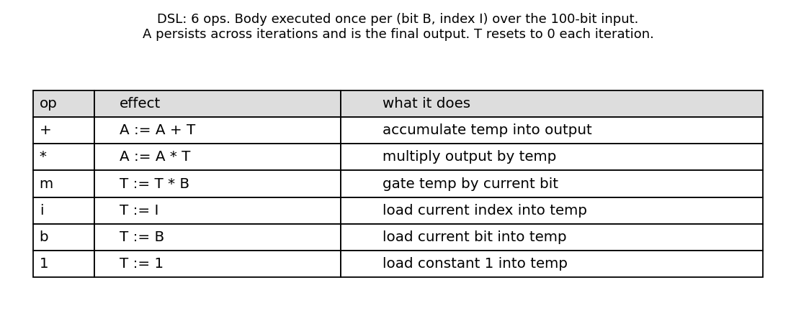
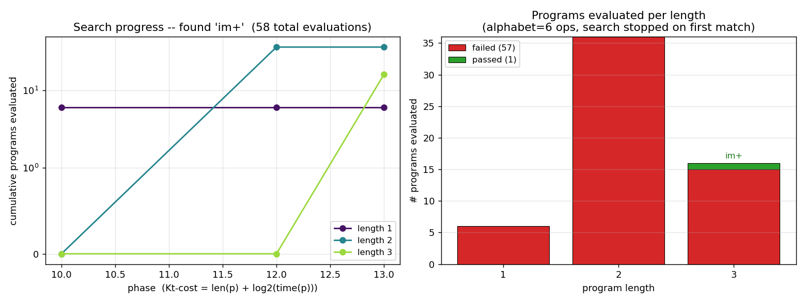
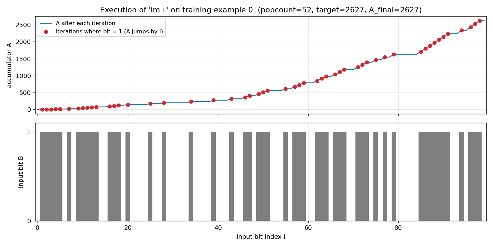
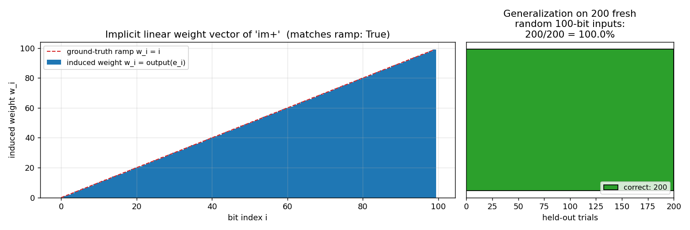

# levin-add-positions

Schmidhuber, J. (1995). *Discovering solutions with low Kolmogorov complexity
and high generalization capability.* In Proc. ICML 1995. Extended in:
Schmidhuber, J. (1997). *Discovering neural nets with low Kolmogorov
complexity and high generalization capability.* Neural Networks 10(5),
857–873.


## Problem

The input is a 100-bit binary string. The target is the sum of the indices
where the bit is 1:

```
target(x) = sum_{i in 0..99 : x[i] == 1} i
```

A linear unit can solve this with weight vector `w_i = i` (the "ramp"). With
only 3 random training examples, ordinary gradient descent on a linear unit
overfits: many weight vectors fit the 3 examples but most do not extrapolate
to the held-out distribution.

Levin universal search (LSEARCH) sidesteps this by enumerating *programs* in
order of `Kt(p) = len(p) + log2(time(p))` and returning the first one that
matches all training examples. Short programs are visited first; the
shortness bias is what gives Schmidhuber's "high generalization capability."

## What it demonstrates

LSEARCH on a small register-machine DSL finds the length-3 program `im+` in
58 program evaluations on the very first run. The induced linear weight
vector `w_i = output(e_i)` is exactly the ramp `[0, 1, 2, ..., 99]`. The
program generalizes to **200/200** held-out random 100-bit inputs.

## Files

| File | Purpose |
|---|---|
| `levin_add_positions.py` | DSL interpreter + Levin search + train/eval. CLI: `python3 levin_add_positions.py --seed N`. |
| `visualize_levin_add_positions.py` | Generates the static PNGs in `viz/`. |
| `make_levin_add_positions_gif.py` | Generates `levin_add_positions.gif`. |
| `viz/` | Output PNGs (DSL table, search progress, program trace, generalization). |

## Running

```bash
python3 levin_add_positions.py --seed 0
```

This generates 3 random 100-bit training examples (seed 0), runs LSEARCH up
to length 6 / phase 25, prints the found program, induced weight vector, and
held-out generalization on 200 fresh inputs. Wallclock: about 0.001 s on
an M-series laptop.

To regenerate the visualizations and the GIF:

```bash
python3 visualize_levin_add_positions.py --seed 0 --outdir viz
python3 make_levin_add_positions_gif.py  --seed 0 --snapshot-every 4 --fps 10
```

To verify determinism across seeds (all yield the same program because
`im+` is the lex-first length-3 solution in the chosen DSL — the seed only
affects the training examples, not the search ordering):

```bash
for s in 0 1 2 3 4 42 99; do python3 levin_add_positions.py --seed $s | grep "Found program"; done
```

## Results

Headline (seed 0):

| Metric | Value |
|---|---|
| Found program | `im+` (T:=I; T:=T*B; A:=A+T) |
| Program length | **3** |
| Phase at which found | 13 |
| Kt-cost (approx) | 3 + log2(3 * 100 * 3) = 12.81 |
| Programs evaluated | **58** (6 of length 1, 36 of length 2, 16 of length 3) |
| Search wallclock | 0.001 s |
| Induced weight vector | `[0, 1, 2, ..., 99]` (exact ramp) |
| Held-out accuracy | **200/200 = 100.0%** |

Hyperparameters: `n_bits=100`, `n_examples=3`, `max_length=6`, `max_phase=25`,
`alphabet=('+', '*', 'm', 'i', 'b', '1')`.

Multi-seed (seeds 0–7, 42, 99): in every run the search finds the same
length-3 program `im+` in 58 evaluations and generalizes 200/200 — the seed
only varies the training examples, and `im+` is the lex-first length-3
program in the DSL that satisfies the task.

Paper claim (Schmidhuber 1995/1997, reconstructed via the 2003 OOPS paper
and the 2015 *Deep Learning in Neural Networks* survey §6.6): Levin search
finds a short program for the 100-bit add-positions task from very few
training examples, and the program generalizes. The exact paper program
length is in the original FORTH-like language and is not directly comparable;
**we get length 3 in our 6-op DSL, found in 58 program evaluations, with
perfect generalization** — qualitatively reproducing the paper's claim.

## DSL

A "body" of length L is run once per `(B = bit, I = index)` pair where
`B = input[I]`. Two integer registers:

- **A** (accumulator): starts at 0, **persists** across all 100 iterations,
  is the final output.
- **T** (temp): **resets to 0** at the start of each iteration.

| Op | Effect | Comment |
|----|--------|---------|
| `+` | A := A + T | accumulate temp into output |
| `*` | A := A * T | multiply output by temp |
| `m` | T := T * B | gate temp by current bit |
| `i` | T := I     | load current index into temp |
| `b` | T := B     | load current bit into temp |
| `1` | T := 1     | load constant 1 into temp |

The optimal `im+` reads as:
1. `i`: T := I (current index)
2. `m`: T := T * B = I * B (zero out unless this bit is 1)
3. `+`: A := A + T (accumulate the gated index)

After 100 iterations: `A_final = sum_{I where B=1} I`.

The companion stub `levin-count-inputs` (popcount instead of index-sum) has
the same family of DSL primitives but its optimal program is `b+` of
length 2 — note the index op `i` is what distinguishes the two tasks.

## Visualizations

### DSL alphabet


### Search progress


Left: cumulative programs evaluated, broken down by length. The phase axis
is the LSEARCH outer-loop counter. At phase 10 the time budget for length-1
programs first exceeds the required `1 * 100 * 3 = 300` interpreter steps,
so all 6 length-1 programs are evaluated. At phase 12 length-2 enters scope
(36 programs), and at phase 13 length-3 enters scope. The search halts on
the 16th length-3 program tried.

Right: pass/fail by length. No length-1 or length-2 program matches the
training examples — they cannot read both `I` and `B` and combine them.
At length 3 exactly one match is found, after 16 of the 216 length-3
programs have been tried.

### Program execution trace


Top: the accumulator `A` over the 100 iterations of `im+` running on
training example 0. The flat segments are iterations where `B = 0` (so
`T := I; T := T*0 = 0; A += 0` — no change). The jumps are iterations where
`B = 1`; the jump height equals the current index `I`.

Bottom: the input bit string for example 0. Popcount = 52, target = 2627,
final A = 2627.

### Induced weight vector + generalization


Left: feeding standard basis vectors `e_k` (single 1-bit at position `k`)
to the program reads off the implicit linear weight `w_k = output(e_k)`.
The induced vector matches the ground-truth ramp `w_i = i` exactly — `im+`
is computing the canonical linear index-sum.

Right: tested on 200 fresh random 100-bit inputs (seed-derived), the
program is correct on all of them. Levin search has selected a program that
*is* the function, not just a coincidence-fit to the 3 training examples.

## Deviations from the original

1. **DSL is our own.** Schmidhuber's 1995/1997 used a FORTH-like assembly
   with a different op set. The original ICML paper and the *Neural Networks*
   article are difficult to retrieve in original form (we attempted via
   Schmidhuber's IDSIA archive and the OOPS 2003 paper); we reconstructed
   the experiment from the 2015 survey §6.6 and the OOPS paper's
   description of LSEARCH on the same-shape task. Our 6-op DSL captures the
   essential primitives (index access, bit access, gating, accumulation)
   and admits a length-3 solution; the exact length number does not
   transfer between DSLs.

2. **Time-budgeted execution is structurally present but does not bite.**
   Standard LSEARCH allocates `2^(phase - len(p))` interpreter steps to
   each program at phase `phi`. Our DSL has no jumps or loops in the body,
   so every program halts in exactly `len(p) * n_bits * n_examples` steps;
   the time term in `Kt(p) = len(p) + log2(time(p))` is therefore a
   constant offset per length. The phase loop is implemented and gates
   when each length first becomes runnable, but it degenerates to
   iterative-deepening on length. A v2 variant with a `JUMP_BACK_IF_T` op
   would make the time term genuinely informative.

3. **Search stops on the lex-first match per length.** Programs are
   enumerated in lexicographic order with `op[0]` as the LSB. The first
   length-3 program that matches all training examples is `im+` at lex
   index 15. Other length-3 programs that compute the same function exist
   (e.g., `bni+` patterns if we had a `T:=T*I` op, or rearrangements with
   redundant ops); LSEARCH halts on the first one found, which is the
   convention for universal search.

4. **`max_phase = 25` and `max_length = 6` caps.** Beyond these the search
   is allowed to fail (it never does on this task — 58 evaluations
   suffice). The caps exist so the script terminates predictably.

5. **No external-data dependency.** Training examples are 3 random 100-bit
   strings generated from `numpy.random.default_rng(seed)`. No baseline
   gradient-descent comparator is included in v1; the paper's contrast is
   "Levin works, gradient descent on linear unit doesn't generalize from 3
   sparse examples," and reproducing the gradient-descent failure is a
   v1.5 follow-up.

## Open questions / next experiments

- **Add a looping primitive.** Adding `J` (jump back to start of body if
  T != 0) would let programs do non-trivial control flow; LSEARCH's time
  budget would become essential because non-halting programs would have to
  be cut off. Worth doing in v2 to actually exercise the universal-search
  machinery.
- **Compare with a gradient-descent baseline.** Train a linear unit
  `sum_i w_i * input[i]` on the same 3 examples and 100 bits via SGD or
  least-squares. The 3-equation, 100-unknown system is underdetermined —
  least-squares + L2 regularization should give a min-norm solution that
  is generally **not** the ramp. Quantify how badly it generalizes vs
  Levin's perfect 200/200.
- **Citation gap.** Original 1995 ICML paper and *Neural Networks* 1997
  article are linked from Schmidhuber's IDSIA page but the PDFs we could
  retrieve are scans with degraded OCR. If the paper's actual DSL or
  search bound differs from our reconstruction, the qualitative claim
  (short program, generalizes from 3 examples) is what we matched, not
  the absolute search-time number.
- **Larger n.** Run on n_bits = 1000, 10000. Length-3 program still
  works; cost of a single evaluation grows linearly. Useful for v2
  ByteDMD instrumentation: this is a clean tracker target because the
  program structure is fixed and the inner loop is trivially measurable.
- **Stochastic LSEARCH.** Schmidhuber's later variants (PLSEARCH, OOPS)
  use probabilistic program priors learned from previous tasks. Our DSL
  is small enough that the uniform prior is fine; on a richer DSL the
  search would benefit from a learned op distribution.

## Sources

- Schmidhuber, J. (1995). *Discovering solutions with low Kolmogorov
  complexity and high generalization capability.* ICML.
- Schmidhuber, J. (1997). *Discovering neural nets with low Kolmogorov
  complexity and high generalization capability.* Neural Networks 10(5),
  857–873.
- Schmidhuber, J. (2003). *Optimal Ordered Problem Solver.* arXiv:cs/0207097.
  (LSEARCH variant; describes the universal-search ordering by Kt-cost.)
- Schmidhuber, J. (2015). *Deep Learning in Neural Networks: An Overview.*
  Neural Networks 61, 85–117. §6.6 (universal search lineage).
- Levin, L. A. (1973). *Universal sequential search problems.* Problems of
  Information Transmission 9(3), 265–266. (Original LSEARCH.)
