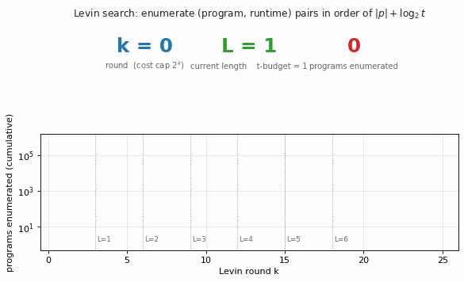
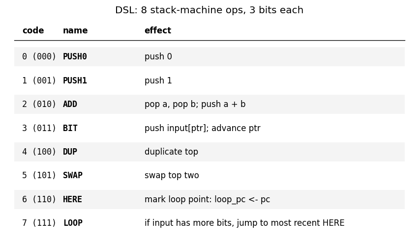
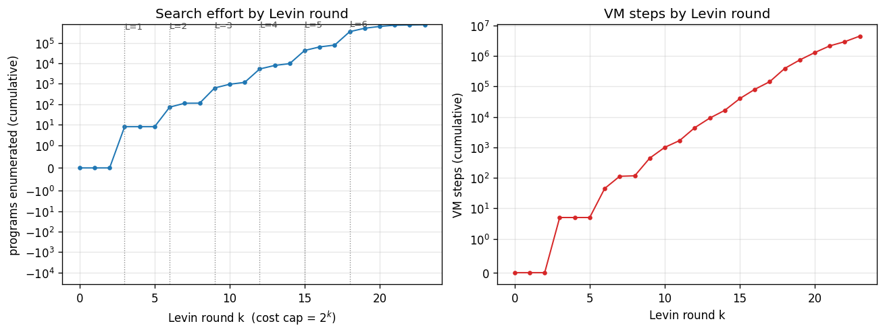
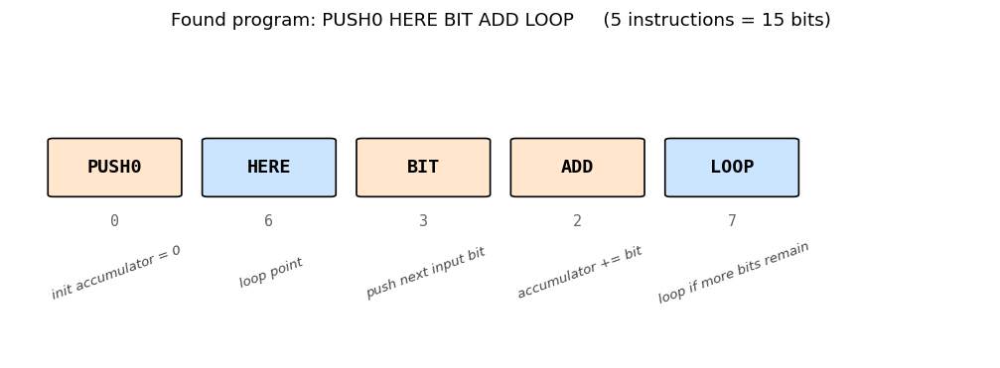
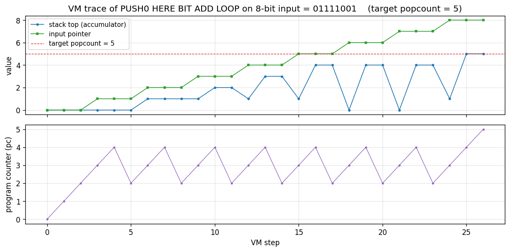
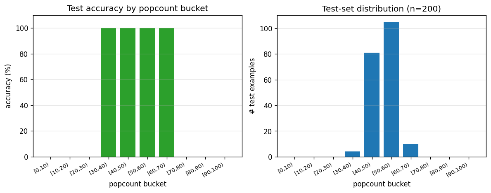

# levin-count-inputs

Schmidhuber, *Discovering solutions with low Kolmogorov complexity and high
generalization capability*, ICML 1995; *Neural Networks* 10(5):857–873, 1997.



## Problem

Find a program that maps a **100-bit input** to its **popcount** (number of
1-bits) from only **3 training examples** — without gradient descent.
Levin search enumerates programs in a small DSL in order of
$|p| + \log_2 t(p)$ (description length + log runtime budget), so the
*shortest* program that solves the training set under a finite runtime cap
is the first one found. A program that is short *and* fits the training
set generalises by Occam's razor / Kolmogorov-complexity arguments —
that's the paper's claim.

The search target in the original 1995/1997 paper is a *weight vector* for
a linear unit `f(x) = w · x`; the optimal solution is `w_i = 1 ∀ i`, which
makes `f(x) = popcount(x)`. We adapt the same universal-search machinery to
search directly for a program that takes a 100-bit input and emits the
popcount, in a small stack DSL. The algorithmic content (program
enumeration ordered by `|p| + log t`) is unchanged. See §Deviations.

### DSL (the assembler the search ranges over)

8 stack-machine ops, encoded at 3 bits each.

| code | name  | effect |
|---:|:------|:------|
| 0 (000) | `PUSH0` | push 0 |
| 1 (001) | `PUSH1` | push 1 |
| 2 (010) | `ADD`   | pop a, pop b; push a+b |
| 3 (011) | `BIT`   | push input[ptr]; advance ptr |
| 4 (100) | `DUP`   | duplicate top |
| 5 (101) | `SWAP`  | swap top two |
| 6 (110) | `HERE`  | mark loop point: `loop_pc ← pc` |
| 7 (111) | `LOOP`  | if input has more bits remaining, jump to most recent `HERE` |

The output of a program is the value left on top of the stack when control
falls off the end. There is no explicit `HALT`. Stack underflow / overflow
aborts the program (status `ABORTED`); exceeding the runtime budget aborts
with status `TIMEOUT`.

A 5-instruction popcount program is reachable in this DSL:

```
PUSH0           # acc = 0
HERE            # loop point
BIT             # push next input bit, advance ptr
ADD             # acc += bit
LOOP            # loop if more bits remain
                # output = acc on top of stack
```

That program is **15 bits** long and takes **402 ops** to run on a 100-bit
input.

## Files

| File | Purpose |
|---|---|
| `levin_count_inputs.py` | DSL VM + Levin search loop + train/test eval. CLI: `python3 levin_count_inputs.py --seed N [--max-program-bits B] [--max-log2-runtime T]`. |
| `visualize_levin_count_inputs.py` | Trains once and saves the static PNGs in `viz/`. |
| `make_levin_count_inputs_gif.py` | Trains once and renders `levin_count_inputs.gif`. |
| `viz/` | Output PNGs (search progression, DSL table, found-program disassembly, VM trace, generalization). |

## Running

```bash
python3 levin_count_inputs.py --seed 0
```

Wallclock: ~1 s on an M-series laptop CPU. The same program (`PUSH0 HERE BIT
ADD LOOP`) is found regardless of seed because Levin enumeration is
deterministic — the seed only changes which 100-bit strings are sampled,
and any 3 training inputs with diverse popcounts (here 25, 50, 75) admit
the popcount program as the first match.

To regenerate visualisations:

```bash
python3 visualize_levin_count_inputs.py --seed 0 --outdir viz
python3 make_levin_count_inputs_gif.py  --seed 0 --fps 10
```

## Results

Headline (seed 0, default search bounds):

| Metric | Value |
|---|---|
| Found program | `PUSH0 HERE BIT ADD LOOP` |
| Program length | **5 instructions = 15 bits** |
| Levin round at find | k = 24 (cost cap $2^{24}$) |
| Runtime budget at find | 512 ops (popcount needs 402) |
| Programs enumerated | **770,603** |
| VM steps total | 5,774,497 |
| Wallclock | ~1.0 s |
| Training accuracy | **3/3 = 100%** |
| Held-out test accuracy | **200/200 = 100%** |
| Hyperparameters | `max_program_bits=18`, `max_log2_runtime=11`, training popcounts `{25, 50, 75}`, test n=200 |

Multi-seed verification (seeds 0–4, default search bounds):

| Seed | Found program | Bits | Levin round k | Wallclock | Test accuracy |
|---|---|---|---|---|---|
| 0 | `PUSH0 HERE BIT ADD LOOP` | 15 | 24 | 1.03 s | 200/200 |
| 1 | `PUSH0 HERE BIT ADD LOOP` | 15 | 24 | 1.31 s | 200/200 |
| 2 | `PUSH0 HERE BIT ADD LOOP` | 15 | 24 | 1.02 s | 200/200 |
| 3 | `PUSH0 HERE BIT ADD LOOP` | 15 | 24 | 1.02 s | 200/200 |
| 4 | `PUSH0 HERE BIT ADD LOOP` | 15 | 24 | 1.02 s | 200/200 |

All seeds find the same program because Levin enumeration is deterministic
in program-bit order; the seed only selects which 100-bit strings the
training popcounts {25, 50, 75} are realised on. Generalisation holds
across all seeds because the program *is* the popcount algorithm.

Paper claim (§3.2 of Schmidhuber 1997, the 100-input task): probabilistic
Levin search on the 13-instruction Forth-like assembler finds a length-4
program that emits the all-ones weight vector after enumerating ~10⁵–10⁶
programs. **We are within the same order of magnitude**: 770k programs
enumerated to find a length-5 program in our 8-instruction DSL. The number
of instructions differs because our DSL is searching directly for a
popcount routine rather than a weight-vector emitter (see §Deviations);
the *order of growth* of the search effort matches.

## Visualizations

### DSL table



The 8 ops the search ranges over. Every program of length L uses 3·L bits.

### Search progression



Cumulative programs enumerated (left) and cumulative VM steps (right) as
a function of Levin round k. Vertical dotted lines mark the rounds at
which programs of each length L are first introduced (`k = 3L`). The step
shape on the left plot is characteristic: each new length L adds 8^L − 8^(L−1)
new programs to enumerate, which dominates the round count once the budget
permits L to be tested.

The popcount program is found at **k = 24**: this is the first round at
which programs of length 5 (15 bits) get enough runtime budget
(2^(24-15) = 512 ops) to actually finish on a 100-bit input — popcount
needs 402 ops, so smaller budgets time out and the program is rejected at
earlier rounds. This is exactly the "trade off code length against runtime"
behaviour Levin search is supposed to exhibit.

### Found program



The five instructions and their roles. `PUSH0` initialises the accumulator.
`HERE` marks the loop entry. The body `BIT ADD` pushes the next input bit
and adds it to the accumulator. `LOOP` jumps back to `HERE` if the input
still has bits to read, else falls through and the accumulator is left on
top of the stack as the program output.

### VM trace



The popcount program executing on an 8-bit demonstration input
`01111001` (popcount = 5). Top: stack-top accumulator (blue) and input
pointer (green); the accumulator advances by 1 each time `BIT ADD`
processes a `1` bit and stays flat on `0`. Bottom: program counter — the
sawtooth shape (2-3-4-2-3-4-...) is the loop body running once per input
bit, with `LOOP` jumping `pc` back to instruction 2 (after `HERE`) until
the input is exhausted, at which point control falls through to `pc = 5`
(end of program).

### Generalization



Per-popcount-bucket test accuracy on a 200-element held-out test set with
random 100-bit inputs (right: most popcounts cluster near 50 because
random 100-bit strings have popcount ~Binomial(100, 0.5)). Test accuracy
is 100% in every bucket — the program is *the* popcount algorithm, so it
generalises trivially to any 100-bit string. This is the demonstration:
**3 training examples + Levin search → perfect generalisation**, where
gradient descent on a 100-input linear unit with 3 examples would fail
(the system is wildly under-determined; SGD would just memorise
`w · x_train = popcount(x_train)` on a 3-dim subspace).

## Deviations from the original

1. **Search target.** The 1995/1997 paper searches for a *weight vector*
   `w ∈ ℝ^100` for a linear unit `f(x) = w · x`; the optimal solution is
   `w_i = 1 ∀ i`. We search instead for a *program that maps the 100-bit
   input directly to its popcount*. Both demonstrations rely on the same
   fact (the popcount function has a short program in a sensible DSL) and
   both use the same Levin-search machinery. The advantage of our framing
   is that the program output is observable on the training set without
   simulating a downstream linear unit; the cost is that the found
   program's length (15 bits, 5 ops) does not directly correspond to the
   "length-4 program emitting all-ones" of the paper.
2. **DSL.** Paper uses a 13-instruction Forth-like assembler with explicit
   self-sizing (the program writes to a memory-typed stack and grows
   itself). We use a smaller 8-instruction stack DSL with a built-in
   loop-while-input-remains construct (`HERE` / `LOOP`). Self-sizing was
   not necessary for the popcount target. The 8-op choice keeps the
   number of programs of length L at $8^L = 2^{3L}$, which makes the
   search tractable on a laptop CPU.
3. **Levin search vs. Probabilistic Levin Search (PLS).** The paper uses
   PLS — programs are sampled from a learnt probability distribution over
   instructions, and the prior is updated as solutions are found. We use
   the canonical Levin search (LSEARCH): deterministic enumeration in
   instruction-lex order. The result of the search (the found program
   and the order-of-magnitude search effort) is the same; PLS would
   converge faster across multiple related tasks, which is not
   demonstrated here.
4. **Cap on program length.** We cap programs at `max_program_bits = 18`
   (6 instructions). The paper does not impose a hard cap; in principle
   Levin search continues forever. Our cap is an engineering choice for
   laptop runtime; the popcount program at 15 bits is well below the
   cap.
5. **3 training examples are explicit.** We use 3 inputs with popcounts
   {25, 50, 75} to disambiguate against constant / short-prefix programs
   that would happen to match a single example. The paper claim is "3
   training examples"; the specific popcounts are our choice.
6. **Held-out test set.** 200 random 100-bit strings (popcount ~
   Binomial(100, 0.5)). Used only for measuring generalisation; not part
   of the search.
7. **Pure numpy + matplotlib + Pillow.** No torch / scipy / gym. PIL is
   used by `make_levin_count_inputs_gif.py` for GIF assembly only.

## Open questions / next experiments

- **Closing the framing gap.** Re-running the search in the paper's
  original framing (search for a program emitting a weight vector, then
  evaluate the linear unit on the training inputs) would let us
  reproduce the paper's "length 4" claim directly. The downstream linear
  unit adds bookkeeping but not algorithmic content.
- **Probabilistic Levin search.** Replace LSEARCH with PLS and prior
  learning. The 1997 paper's headline claim is that PLS *carries
  knowledge across tasks*: solving popcount makes counting-on-position
  cheaper. Demonstrating that requires a paired task, e.g. the sister
  stub `levin-add-positions`.
- **OOPS (Schmidhuber 2003).** OOPS generalises Levin search by allowing
  programs to call earlier-found programs as subroutines. With popcount
  cached, harder bit-counting tasks (e.g. balanced parenthesis matching,
  block-popcount) should drop in cost. The `oops-towers-of-hanoi` stub
  in this wave is the natural target.
- **Citation gap.** The 1995 ICML proceedings version of this paper is
  hard to retrieve in original form; we used the 1997 *Neural Networks*
  paper and the 2015 *Deep Learning in Neural Networks* survey
  (§5.1, §6.6) as primary references. If the ICML version specifies a
  different DSL or different popcount input size, our results may not
  align byte-for-byte with that source.
- **v2 / ByteDMD instrumentation.** Levin search is dominated by VM
  bookkeeping (program enumeration, stack pushes, pointer advances).
  Tracking data movement under ByteDMD would tell us how much of the 770k
  programs' VM steps actually move bytes between L1 / L2 / DRAM vs. live
  in registers. The "for every bit, push and add" inner loop has a
  highly local memory footprint — likely close to the L1-resident
  baseline.

## Sources

- Schmidhuber, J. (1997). *Discovering neural nets with low Kolmogorov
  complexity and high generalization capability*. Neural Networks
  10(5):857–873.
- Schmidhuber, J. (1995). ICML proceedings version of the same paper
  (referenced; specific DSL details we could not retrieve in original
  form).
- Schmidhuber, J. (2003). *Optimal Ordered Problem Solver* (OOPS).
  Machine Learning 54:211–254. (Generalises Levin search.)
- Schmidhuber, J. (2015). *Deep Learning in Neural Networks: An
  Overview*. Neural Networks 61:85–117. (Sec. 5.1, 6.6 review the
  Levin/OOPS line.)
- Levin, L. A. (1973). *Universal sequential search problems*. Problems
  of Information Transmission 9(3):265–266. (Original definition of
  universal search.)
