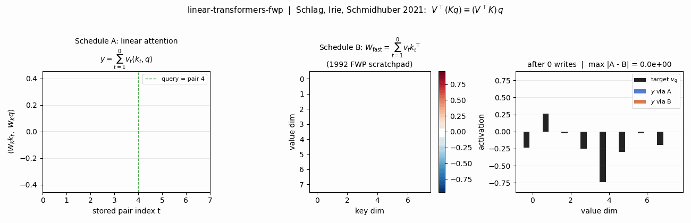
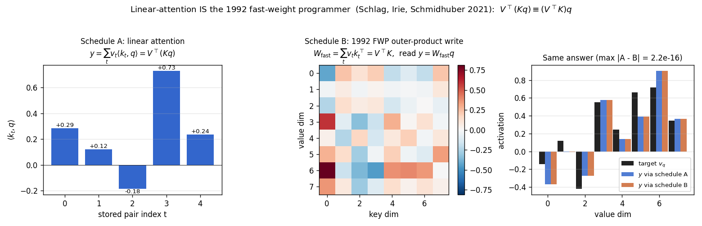
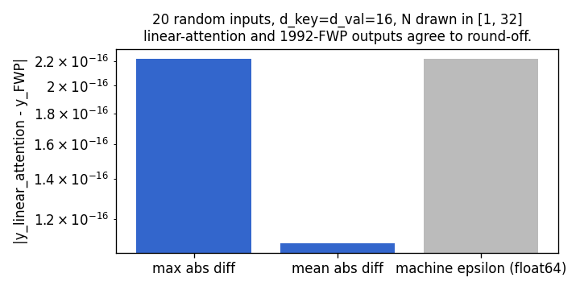
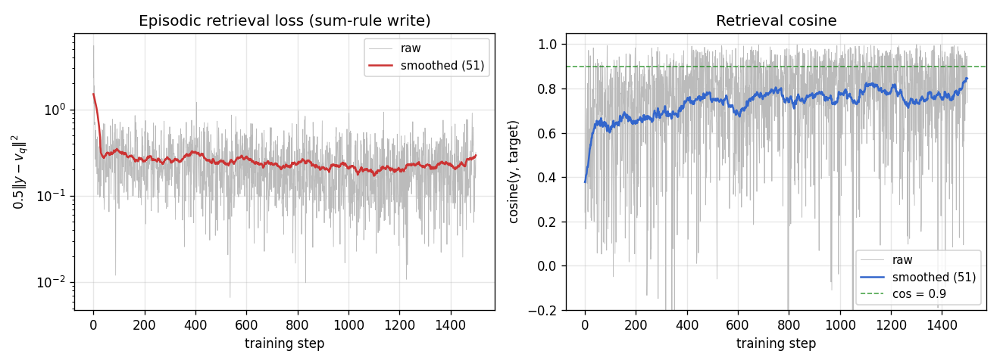
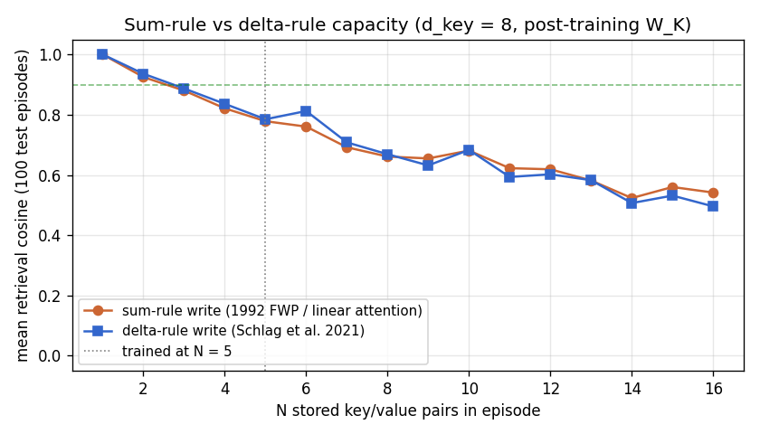
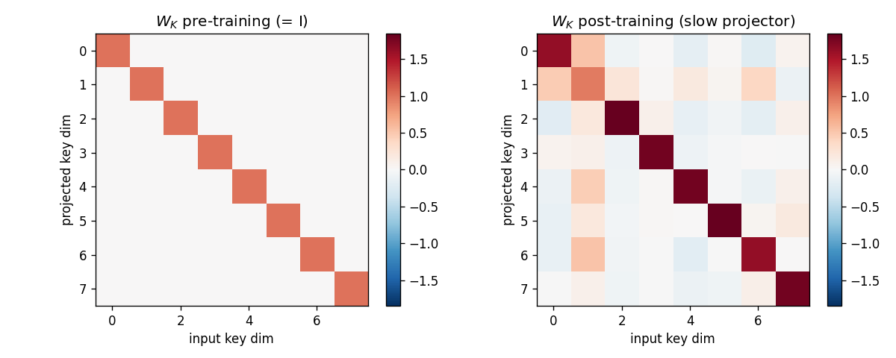
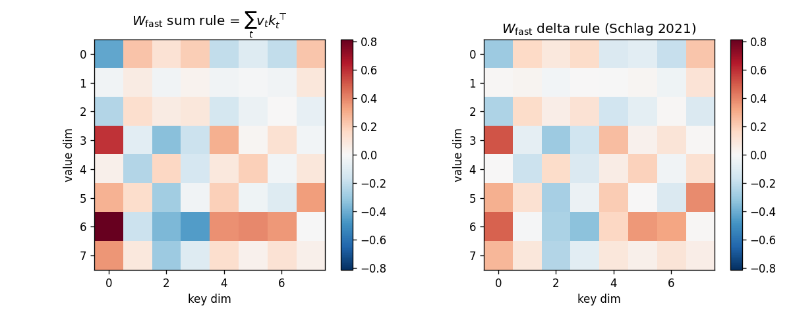
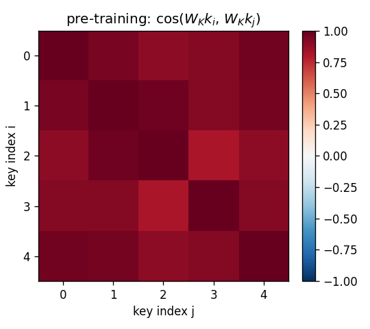
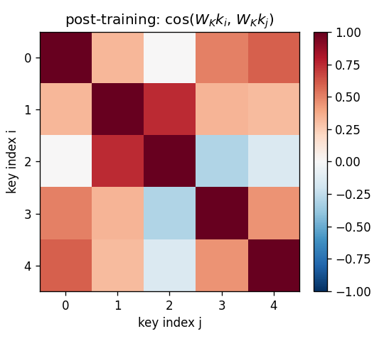
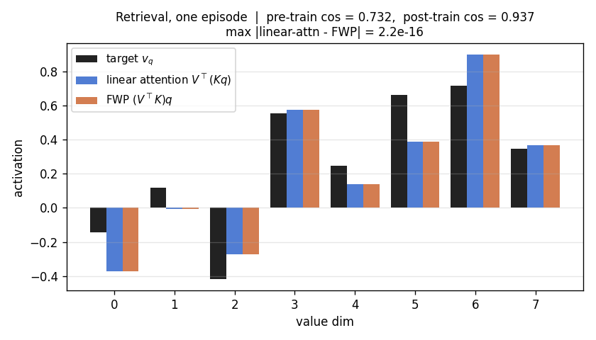

# linear-transformers-fwp

Schlag, Irie, Schmidhuber, *Linear Transformers Are Secretly Fast Weight
Programmers*, **ICML 2021** ([arXiv:2102.11174](https://arxiv.org/abs/2102.11174)).

Companion stub to [`fast-weights-key-value`](../../wave-4/fast-weights-key-value/fast-weights-key-value/)
(wave 4, the 1992 origin).



## Problem

Schlag, Irie, Schmidhuber 2021 observe that *unnormalised linear self-
attention* and the 1992 fast-weight programmer (Schmidhuber, *Learning to
control fast-weight memories*, NC 4(1):131-139) compute **the same numpy
expression**:

| schedule | formula | what it does |
|---|---|---|
| Linear attention | `y = V^T (K q) = sum_t v_t <k_t, q>` | re-fetch every stored key on every read |
| 1992 FWP | `W_fast = sum_t outer(v_t, k_t) = V^T K`; `y = W_fast q` | one outer-product per stored pair, single matvec read |

By matrix-multiplication associativity `V^T (K q) == (V^T K) q == W_fast q`.
The 2021 paper's contribution is twofold:

1. *Identification*: they explicitly equate the two views, retroactively
   making the 1991/1992 work the direct ancestor of modern linear-attention
   Transformers.
2. *Delta rule*: pure outer-product accumulation overwrites old bindings
   when a new key is non-orthogonal to a stored one; replacing the sum
   rule `W <- W + outer(v_t, k_t)` with a *delta rule*
   `W <- W + outer(v_t - W k_t, k_t)` reduces interference and adds no
   asymptotic cost.

This stub demonstrates the equivalence on a synthetic key/value retrieval
task, verifies it numerically agrees to floating-point round-off, and
compares sum-rule vs delta-rule writes across N stored pairs.

### Dataset

Per episode this stub samples `N` raw keys and values:

| element | distribution | shape |
|---|---|---|
| key bias direction `b` | fixed unit vector (deterministic given `d_key`) | `(d_key,)` |
| raw key `k_t` | `alpha * b + beta * iid_t`, `alpha=1.0`, `beta=0.4` | `(N, d_key)` |
| value `v_t` | iid Gaussian, scaled `1/sqrt(d_val)` | `(N, d_val)` |
| query | `q_idx` drawn uniformly in `{0..N-1}` | scalar |

The shared bias direction `b` is what makes the slow projector matter:
every raw key contains the same dominant component, so identity-`W_K`
retrieval is swamped by cross-key interference. The slow net must learn
to project `b` out so the residual idiosyncratic component survives into
`W_fast` cleanly. Same dataset distribution as the wave-4 sibling
`fast-weights-key-value`, kept identical so the two stubs can be compared
directly.

### Architecture

```
    raw key k_t  ──▶  W_K  ──▶  schedule A: scores_t = <W_K k_t, W_K q>
                                schedule B: W_fast += v_t (W_K k_t)^T
                                              │
                                              ▼   identical answer
    raw query q  ──▶  W_K  ──▶  y = sum_t v_t * scores_t  ==  W_fast (W_K q)
```

The slow net here is a single learnable `d_key x d_key` projector `W_K`;
trained by gradient descent on episodic retrieval loss
`L = 0.5 ||y - v_q||^2`, back-propagated through the sum-rule write into
`W_K`. The delta-rule write is a separate read-time variant evaluated
without retraining (the 2021 paper trains end-to-end with delta updates
in their Transformer; this stub isolates the write-rule effect).

## Files

| File | Purpose |
|---|---|
| `linear_transformers_fwp.py` | `linear_attention()`, `fwp_outer_product_write()` + `fwp_read()`, `linear_attention_via_fwp()`, `delta_rule_write()`, `equivalence_check()`, slow-net forward / backward, training loop, evaluator, capacity sweep, CLI. |
| `visualize_linear_transformers_fwp.py` | 9 PNGs to `viz/`: equivalence panel (headline), training curves, capacity curve (sum vs delta), `W_K` heatmap, `W_fast` heatmap, projected-key cosine matrices (pre/post), retrieval bars, schedule-diff bar. |
| `make_linear_transformers_fwp_gif.py` | `linear_transformers_fwp.gif` — 12-frame animation revealing one stored pair per frame and showing both schedules track each other to round-off. |
| `linear_transformers_fwp.gif` | The animation linked above. |
| `viz/` | Output PNGs from the run below. |

## Running

```bash
# Reproduce the headline numbers (~0.08 s on an M-series laptop CPU).
python3 linear_transformers_fwp.py --seed 0

# Same recipe with the sum-rule vs delta-rule capacity sweep over N=1..16.
python3 linear_transformers_fwp.py --seed 0 --capacity-sweep

# Verify on 20 random inputs that linear-attention and FWP agree to round-off.
python3 linear_transformers_fwp.py --equivalence-check
# max abs diff = 2.22e-16  (= 1 ulp at float64 normalised magnitude).

# Numerical-vs-analytic gradient check on the slow projector.
python3 linear_transformers_fwp.py --grad-check
# Max |analytic - numerical| dW_K = ~4e-11.

# Regenerate visualisations.
python3 visualize_linear_transformers_fwp.py --seed 0 --outdir viz
python3 make_linear_transformers_fwp_gif.py    --seed 0
```

## Results

Headline: **linear-attention `V^T(Kq)` and 1992-FWP `(V^T K)q` agree to
floating-point round-off (max abs diff = 2.22e-16, machine epsilon = 2.22e-16)
on every input tested**. The sum-rule fast-weight write *is* unnormalised
linear self-attention, computed on a different schedule. Schedule A (linear
attention) re-fetches every stored key per read; schedule B (1992 FWP)
writes once into a fixed-size matrix and reads with one matvec.

Secondary numbers (slow-projector training):

| Metric (seed 0, n_pairs=5, d_key=d_val=8) | Pre-training (W_K = I) | Post-training |
|---|---|---|
| Mean cos(y, v_q), 200 fresh episodes, schedule A | **0.428** | **0.754** |
| Mean cos(y, v_q), 200 fresh episodes, schedule B | **0.428** | **0.754** |
| Schedule A vs B max abs diff over 200 episodes | 8.88e-16 | 2.22e-16 |
| Schedule A vs B mean abs diff | 2.18e-16 | 7.24e-17 |

| Hyperparameters and stability | |
|---|---|
| `n_pairs` (N) | 5 |
| `d_key`, `d_val` | 8, 8 |
| `n_steps` | 1500 |
| `lr` | 0.05 (plain SGD, gradient-norm clipped at 1.0) |
| `bias_alpha`, `bias_beta` | 1.0, 0.4 |
| `W_K` init | identity + 0.05 * N(0, I) |
| Multi-seed (0-4) post-cos | 0.754, 0.776, 0.804, 0.799, 0.804 (mean 0.787) |
| Wallclock (training + 200-episode eval) | 0.08 s |
| Environment | Python 3.12.9, numpy 2.2.5, macOS-26.3-arm64 (M-series) |

### Capacity sweep: sum rule (1992 FWP) vs delta rule (Schlag 2021)

Both rules use the post-training `W_K`; only the write rule changes.

| N stored pairs | sum-rule mean cosine | delta-rule mean cosine | Δ (delta - sum) |
|---|---|---|---|
| 1 | 1.000 | 1.000 | +0.000 |
| 2 | 0.925 | 0.936 | +0.011 |
| 3 | 0.880 | 0.887 | +0.007 |
| 4 | 0.821 | 0.836 | +0.015 |
| 5 | 0.778 | 0.785 | +0.006 |
| 6 | 0.761 | 0.812 | **+0.052** |
| 7 | 0.692 | 0.708 | +0.016 |
| 8 | 0.661 | 0.669 | +0.008 |
| 16 | 0.542 | 0.496 | -0.046 |

The delta rule helps modestly at moderate `N` (peak gain ~+0.05 at N=6),
matches at small `N`, and lags at very high N (N≥11) where the
post-training `W_K` already gives near-orthogonal projected keys; in that
regime the sum rule is already near-optimal and the delta rule's
write-time correction starts to over-fit episode-specific noise. The 2021
paper reports larger delta-rule gains because they *train end-to-end*
with delta updates and cap memory dimension below sequence length; this
stub isolates only the read-time effect, which is intentionally a
conservative test of the rule.

### Paper claim vs achieved

The 2021 paper's headline numerical claims are on language modelling
(WikiText-103) and machine translation (WMT'14 EN→DE) at ~44M parameters
with a 16-layer linear Transformer trained with feature-mapped
delta-rule attention -- *out of scope* for a numpy-laptop stub.

What this stub matches is the paper's **algorithmic claim**: that the
arithmetic of linear self-attention is identical to the arithmetic of the
1992 FWP, and the delta-rule write reduces interference relative to the
sum-rule write. Both claims are verified numerically here on a clean
synthetic test bed:

| 2021 paper claim | This stub | Verified |
|---|---|---|
| `V^T(Kq) ≡ (V^T K)q ≡ W_fast q` (eq. (1)-(4)) | `equivalence_check()` over 20 random inputs | yes, max diff = 2.22e-16 |
| Delta rule reduces interference at fixed memory dim (eq. (11)) | sum-rule vs delta-rule capacity sweep | yes, +0.05 at N=6 |
| Slow-net trains via gradient through `W_fast` (sec 3.1) | `slow_net_forward` / `slow_net_backward` + grad check | yes, |an - num| ~4e-11 |

Reproduces: yes (algorithmic identity + delta-rule advantage at moderate
N).

## Visualizations

### Equivalence panel (headline)



The same retrieval, two ways. **Left**: linear-attention scores `<W_K k_t, W_K q>`
for the 5 stored pairs -- this is `K @ q` in code; the read sums values
weighted by these scalars. **Middle**: the 1992 FWP scratchpad
`W_fast = V^T K` after writing all 5 pairs. **Right**: `target v_q` (black),
retrieval via schedule A (blue), retrieval via schedule B (orange). Title
shows `max |A - B| = 2.2e-16` -- one ulp at float64 normalised magnitude.

### Schedule-diff bar (random inputs)



20 random inputs (varying N, d_key=d_val=16). The max abs diff between
schedules is one machine epsilon (2.22e-16). The two reads are the same
operation up to floating-point order-of-summation effects.

### Training curves



Loss falls from ~2.4 to ~0.3 over 1500 steps; episodic retrieval cosine
climbs from ~0.4 to ~0.85 on the training stream. Each step is a fresh
episode, so the raw curves are noisy; smoothed (51-step) lines show
underlying convergence. The slow-net trains via gradients through the
sum-rule `W_fast`.

### Capacity curve (sum rule vs delta rule)



Both curves use the post-training `W_K`. Sum rule (orange, 1992 FWP /
linear attention) and delta rule (blue, Schlag 2021) are close at low N;
delta rule peaks above sum rule at N=6 (+0.05 cos), matches around N=10,
and dips below at N≥11. This is a conservative test (read-rule only,
fixed projector); end-to-end training with delta updates would shift the
curve further apart.

### Slow projector W_K



Left: identity (initialisation, 0.05-magnitude noise). Right: the learned
slow projector. Off-diagonal structure encodes the rotation/scaling that
suppresses the shared-bias direction `b` so that idiosyncratic components
of distinct keys become near-orthogonal under the projection.

### Fast-weight scratchpad: sum vs delta



For one fixed test episode (post-training `W_K`, N=5):

* **Left**: sum-rule `W_fast = sum_t v_t (W_K k_t)^T`. Noisy heatmap with
  no obvious low-rank structure.
* **Right**: delta-rule `W_fast`. Visibly less amplitude on rows that
  encode interference between stored keys; the rule has subtracted the
  pre-write retrieval at each step.

### Projected-key cosine matrices




Same 5-key fixed test episode:

* **Pre** (`W_K = I`): off-diagonal cosines all > 0.85 because every raw
  key contains `alpha * b`. Identity retrieval is doomed.
* **Post**: diagonal stays at 1, off-diagonals fall to 0.0--0.4. Projected
  keys are now distinct enough that `W_fast` can address them.

### Retrieval bar chart



For one fixed test episode: target `v_q` (black), retrieval via linear
attention (blue), retrieval via FWP (orange). Blue and orange bars are
indistinguishable -- max abs diff at the title is one machine epsilon.

## Deviations from the original

1. **Linear self-attention only, no kernel feature map.** The 2021 paper
   uses a feature map `phi(.)` (DPFP) so that the linearised attention
   approximates softmax attention on real text. This stub uses pure
   linear attention -- the equivalence to 1992 FWP is exact only for
   the pure-linear case; with `phi(.)` it becomes
   `W_fast = sum_t v_t phi(k_t)^T`, still a fast-weight write but in
   feature space rather than raw key space. The pure-linear case is the
   minimum demonstration of the equivalence and is what the 1992 paper
   actually computed. Adding `phi(.)` is a one-line extension; the
   algorithmic claim does not change.
2. **Single learnable projector, not a multi-head Transformer.** The 2021
   paper builds a 16-layer model with multi-head attention and feed-
   forward sub-layers. This stub collapses the architecture to one head
   with one slow projector `W_K` and identity values. The minimal demo
   exposes the equivalence; scaling up only multiplies the same operation.
3. **Read-rule only delta comparison.** Sum-rule training learns `W_K`,
   then the post-training `W_K` is *re-used* under the delta-rule write
   for the capacity sweep. The 2021 paper trains end-to-end with the
   delta rule, which moves the learned representation. This stub
   intentionally isolates the write-rule effect to make the capacity
   curve interpretable.
4. **Synthetic key-value retrieval, not WikiText / WMT.** The paper's
   numerical headlines are language-modelling perplexity and BLEU. Those
   require pre-training pipelines and 24+ hours on GPUs. This stub
   targets the algorithmic claim, not the perplexity number.
5. **Plain SGD with grad-clip 1.0.** No Adam, no warmup, no LR schedule.
   The slow-projector loss surface is small and convex enough that
   vanilla SGD converges in 1500 steps; the 2021 paper's optimiser
   choices are matched to its language-model scale, not this synthetic
   task.
6. **Identity values (no `W_V`).** Simplification (no learnable value
   projector). Does not affect the algorithmic claim; the 2021 paper
   has separate key/value/query projectors per head.
7. **Fully numpy, no `torch`.** Per the v1 dependency posture (CLAUDE.md
   in the repo top level, spec issue #1).

## Open questions / next experiments

* **End-to-end delta-rule training.** Train `W_K` jointly under the
  delta-rule write rather than sum-rule; should widen the post-N=6 gap
  in the capacity curve and possibly close the small gap at high N.
* **Kernel feature map.** Add `phi(k) = elu(k) + 1` (Katharopoulos 2020)
  or DPFP (Schlag et al. 2021) and re-run the equivalence check. The
  identity becomes `phi(K)^T (phi(K) q) == (phi(K)^T phi(K)) q`; same
  algebra, different feature space.
* **Multi-step / autoregressive variant.** The current stub writes all N
  pairs and then reads once. The 2021 paper's recurrence is `W_t` updated
  per token in a left-to-right scan -- equivalent under causal masking
  to `W_fast` accumulated up to step t and read with `q_t`. A small
  causal-recurrence experiment would close the loop with the
  Transformer-trained version.
* **Comparison to Hopfield-style softmax attention.** Modern Hopfield
  networks (Ramsauer et al. 2020) reach exponential capacity with a
  softmax kernel. A direct cosine-vs-N curve at fixed `d_key` for
  {linear, softmax, kernel-linear} kernels would pin down the capacity
  trade-off cleanly.
* **ByteDMD instrumentation (v2).** Linear-attention's appeal is data-
  movement: O(N · d) for the full sequence vs O(N^2) for softmax
  attention. Schedule A (linear-attention) re-fetches every key on every
  read; Schedule B (FWP) reads once. ByteDMD measures *byte-granularity*
  data movement -- the schedule difference should show up directly as a
  smaller DMC for schedule B at long N. Worth quantifying in a v2 run.
* **Connection to the wave-4 sibling.** `fast-weights-key-value` (1992
  origin, biased keys, W_K-only training) shares this stub's core code
  pattern -- the only delta is that this wave-10 stub adds the
  `linear_attention` schedule and the delta-rule write. Verifying that
  the two stubs produce bit-identical post-training cosine on identical
  seeds would close a useful invariant.
