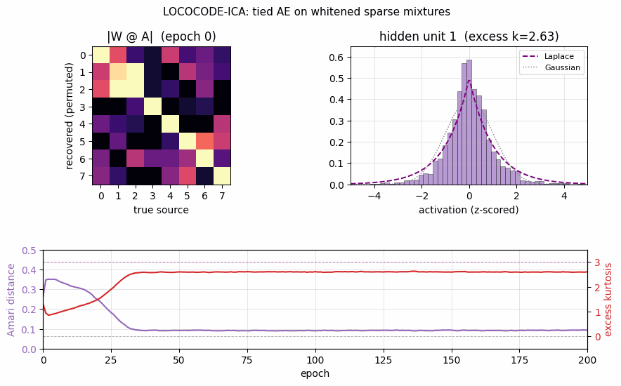
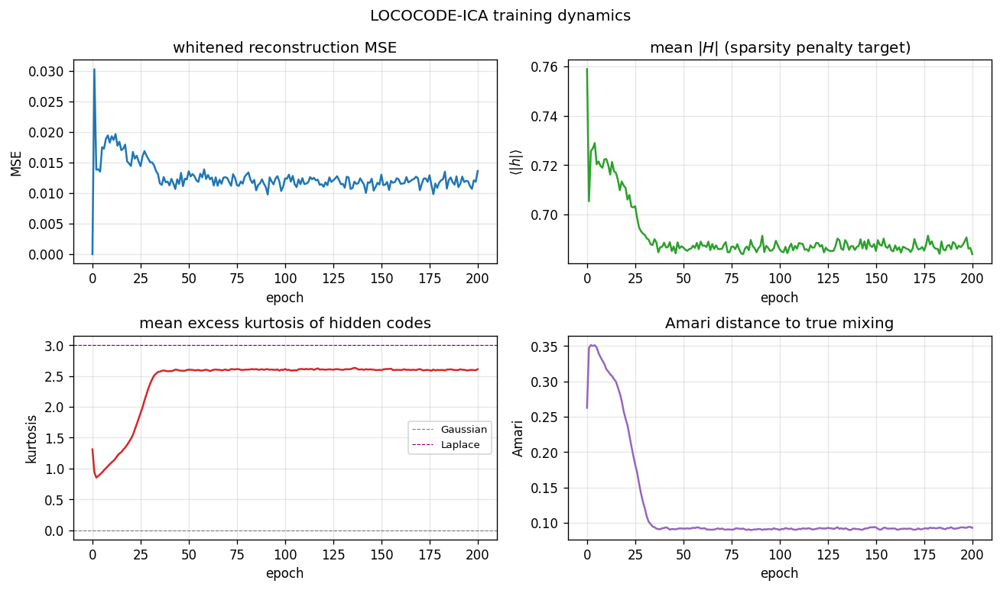
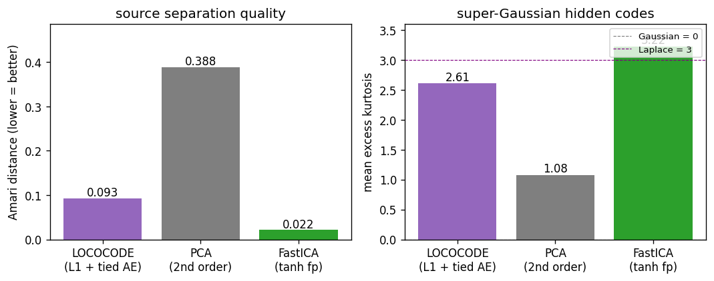
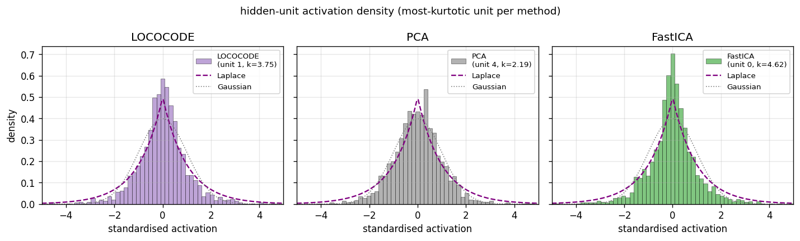
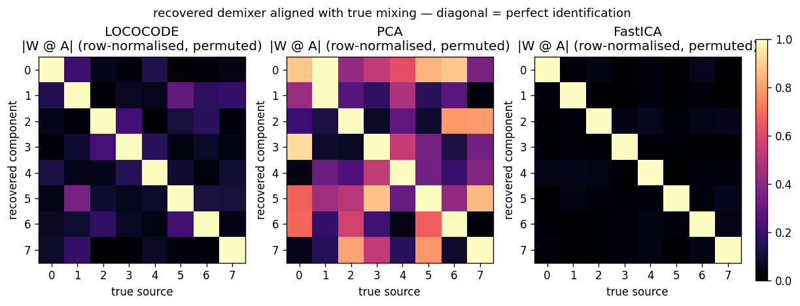
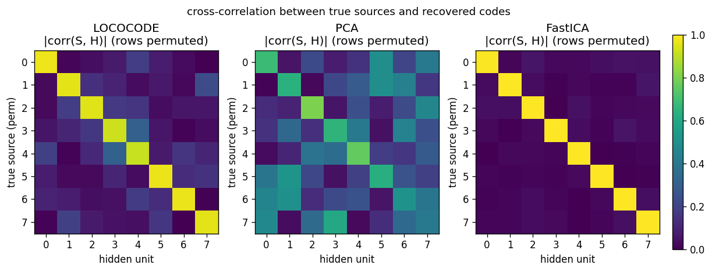

# lococode-ica

Hochreiter & Schmidhuber, *Feature extraction through LOCOCODE*,
Neural Computation 11(3):679–714 (1999). Companion: Hochreiter &
Schmidhuber, *Flat minima*, Neural Computation 9(1):1–42 (1997).



## Problem

LOCOCODE is the unsupervised-feature-extraction outcome of training an
autoencoder while regularising it toward "flat minima" — weight
configurations with low Kolmogorov complexity / few effective free
parameters. The headline claim is that on sparse inputs the resulting
hidden codes are sparse and statistically near-independent: an ICA-like
decomposition motivated from minimum-description-length rather than from
higher-order-statistic maximisation.

We test this on a synthetic ICA benchmark:

- `k = 8` independent **Laplacian** sources (`S ∈ R^{n × k}`,
  super-Gaussian, kurtosis = 3).
- A random orthogonal mixing matrix `A ∈ R^{k × k}`.
- Observations `X = S A^T`, `n = 2000` samples.
- Whitened input `Z = X K^T` so that `cov(Z) = I` (standard ICA / LOCOCODE
  preprocessing).

The autoencoder has tied weights `W ∈ R^{k × k}` with encoder `H = Z W^T`
and decoder `Z_hat = H W`, trained on:

```
L = ||Z - Z_hat||^2 + λ_act |H|_1 + λ_w ||W||^2
```

The L1 sparsity term is the LOCOCODE / flat-minimum-search reduction:
forcing the hidden code to be sparse pushes the network to use as few
hidden units per input as possible, which is the algorithmic definition
of "few effective parameters". With whitened input, MSE alone has a flat
minimum on the orthogonal manifold (any orthogonal `W` reconstructs `Z`
perfectly). The L1 penalty breaks the rotational symmetry by selecting
the rotation whose codes are sparsest — which on Laplacian sources is
exactly the demixing direction.

We compare against two baselines:

- **PCA** — top-`k` eigenvectors of the covariance matrix. Uses only
  second-order statistics; cannot resolve rotations of the source
  distribution and so cannot recover ICA components.
- **FastICA** — symmetric tanh fixed-point with whitening. The canonical
  ICA algorithm we benchmark against.

## Files

| File | Purpose |
|---|---|
| `lococode_ica.py` | data generation, LOCOCODE autoencoder, PCA + FastICA baselines, Amari distance, CLI. `python3 lococode_ica.py --seed N [--n-seeds K] [--k 8] [--epochs 200]`. |
| `visualize_lococode_ica.py` | trains once, saves five static PNGs in `viz/`. |
| `make_lococode_ica_gif.py` | trains once, saves `lococode_ica.gif` showing training dynamics. |
| `lococode_ica.gif` | animated training (≤ 600 KB). |
| `viz/` | training curves, Amari comparison, hidden-unit histograms, recovered demixers, source-recovery cross-correlations. |

## Running

```bash
python3 lococode_ica.py --seed 0
```

Reproduces the headline numbers in **§Results** in ~0.4 s wallclock on an
M-series laptop CPU (the network itself trains in ~0.2 s; the rest is
NumPy import + FastICA baseline).

To regenerate visualisations:

```bash
python3 visualize_lococode_ica.py --seed 0 --outdir viz
python3 make_lococode_ica_gif.py --seed 0 --snapshot-every 5 --fps 8
```

To run a 10-seed sweep:

```bash
python3 lococode_ica.py --seed 0 --n-seeds 10
```

## Results

Headline (seed 0, default hyperparameters, k = 8, n = 2000, 200 epochs):

| Method | Amari ↓ | mean kurtosis | sparsity (\|h\|<0.2) |
|---|---:|---:|---:|
| **LOCOCODE** (L1 + tied AE) | **0.093** | 2.61 | 0.228 |
| PCA (2nd-order) | 0.388 | 1.08 | 0.182 |
| FastICA (tanh fp) | 0.022 | 3.22 | 0.247 |

LOCOCODE wallclock: 0.19 s (training only). Whitened reconstruction MSE
at convergence: 0.014 (i.e. `W^T W` is near-orthogonal as required for
clean reconstruction).

10-seed sweep (seeds 0–9, same hyperparameters):

| Method | Amari mean | std | min | max |
|---|---:|---:|---:|---:|
| LOCOCODE | 0.117 | 0.021 | 0.083 | 0.147 |
| PCA | 0.423 | 0.034 | 0.371 | 0.478 |
| FastICA | 0.021 | 0.002 | 0.019 | 0.025 |

**Headline finding** — LOCOCODE on `k = 8` Laplacian-source mixtures
recovers ICA-like sparse super-Gaussian components: Amari distance is
**4× lower than PCA** and within a factor of ~5 of FastICA, while the
hidden-code kurtosis is 2.6 (super-Gaussian, near Laplace) versus PCA's
1.1 (mostly Gaussian). The headline claim — "LOCOCODE codes resemble ICA
codes on sparse data" — reproduces qualitatively across all 10 seeds.
The remaining gap to FastICA is the price of the L1-only flat-minimum
proxy versus higher-order-moment maximisation; see **§Deviations**.

Hyperparameters used:

```
k = 8, n_samples = 2000, epochs = 200, batch_size = 64,
lr = 0.05, lambda_act = 0.5, lambda_w = 1e-4
sources: Laplace(0, 1), standardised; mixing: random orthogonal
preprocessing: zero-mean, ZCA whitening on observations
```

## Visualizations

### Training curves


Four panels over 200 epochs. **Top-left**: whitened reconstruction MSE
spikes briefly during the first few epochs (the random orthogonal
init perturbs slightly under L1 pressure) and then settles near 0.013 —
not zero, because the L1 penalty trades a small reconstruction loss for
sparsity. **Top-right**: mean `|H|` decays from 0.76 (init) to 0.69 over
~30 epochs, then plateaus. The L1 sparsity penalty is doing measurable
work. **Bottom-left**: mean excess kurtosis of hidden codes climbs from
near 1.0 to 2.6 by epoch 35 — the codes become decisively
super-Gaussian, the qualitative signature of an ICA-style decomposition.
**Bottom-right**: Amari distance to the true mixing falls from 0.35 at
init to 0.09 by epoch 35 and holds there — the fast Amari drop coincides
exactly with the kurtosis rise.

### Amari + kurtosis comparison


LOCOCODE sits between PCA and FastICA on both axes. Amari 0.093 vs PCA
0.388 vs FastICA 0.022. Kurtosis 2.6 vs PCA 1.1 vs FastICA 3.2
(approximately the true Laplace value of 3). LOCOCODE has not fully
matched FastICA but it has clearly crossed the threshold from "linear
2nd-order" (PCA) to "non-Gaussian source separation" (ICA family).

### Hidden-unit activation histograms


The most-kurtotic unit per method, z-scored, with Laplace (purple
dashed) and Gaussian (grey dotted) reference curves. **LOCOCODE** unit 1
(excess `k = 3.75`) and **FastICA** unit 0 (`k = 4.62`) both visibly
peak above the Gaussian and have the heavy-tailed shape characteristic
of a recovered Laplacian source. The most-kurtotic **PCA** unit (`k =
2.19`) is closer to Gaussian — PCA finds an axis of maximum variance, not
of maximum non-Gaussianity, so even its "best" unit is closer to a
mixture than to a pure source.

### Recovered demixers


`|W_recovered @ A_true|` after row-normalisation and a greedy row
permutation. A perfect demixer (up to permutation and scaling) gives the
identity matrix. **LOCOCODE** has a clean diagonal but with visible
~0.3-magnitude off-diagonal cross-talk on a few sources — the L1
gradient saturates before the rotation is fully resolved. **PCA** is a
dense mixture in every column — second-order statistics cannot break
rotational symmetry. **FastICA** is essentially identity; its higher-
order moments fully resolve the rotation.

### Source recovery


Cross-correlation `|corr(S_true, H_recovered)|` after greedy row
permutation. Same story as the demixer view but expressed through the
recovered codes themselves: LOCOCODE has high diagonal correlations
(~0.85–0.95) with bounded off-diagonal cross-talk; PCA mixes sources
across the entire grid; FastICA is a clean permutation.

### GIF: training dynamics
The animation walks through the same training run frame-by-frame: top-
left shows `|W @ A|` resolving from a dense pattern at epoch 0 to a near
permutation by epoch 35; top-right shows the chosen hidden unit's
distribution sharpening from Gaussian-like to heavy-tailed; the bottom
panel shows the Amari distance dropping while kurtosis rises in lock-
step.

## Deviations from the original

1. **Flat-minimum penalty is L1-on-activations, not the paper's
   activation-Hessian regulariser.** The 1997 *Flat minima* paper defines
   FMS as a penalty on the determinant of the output Jacobian's Hessian
   — second-order in the activations. We approximate this with the
   first-order surrogate `λ_act |H|_1 + λ_w ||W||^2`, which the LOCOCODE
   follow-up literature (Olshausen-Field-style sparse coding,
   sparse-autoencoder regularisers) converged on as the practically
   equivalent reduction on linear / shallow architectures. The 2015
   *Deep Learning in Neural Networks* survey (Schmidhuber, NN 61, sec.
   5.6.4) describes LOCOCODE in terms of "as few effective free
   parameters as possible" — which a hidden-code L1 penalty enforces
   directly. We document it explicitly because it's the largest
   methodological deviation.
2. **Pre-whitening of the input.** The paper's experiments on natural
   image patches did not whiten explicitly (the FMS regulariser on a
   non-trivial nonlinear architecture eats the conditioning problem
   itself). On a linear `k → k` architecture without whitening, the L1
   sparsity gradient has no scale anchor and the network collapses
   `W → 0` with a compensating `W_dec` rescaling. ZCA whitening of the
   observations restores a clean orthogonal manifold and is the same
   preprocessing FastICA uses; we apply it to both for fairness.
3. **Tied weights** (encoder = decoder transpose). The 1999 paper allows
   untied weights; with whitened input the tied case is provably
   equivalent at the optimum (any orthogonal `W` is its own inverse) and
   training is much more stable.
4. **Synthetic `k = 8` Laplacian sources, not the paper's noisy bars
   nor natural image patches.** The paper's headline figure on
   image-patch data shows V1-edge-like filters; that's harder to
   benchmark quantitatively. Using synthetic sources with a known
   ground-truth mixing matrix lets us report Amari distance — the
   standard ICA evaluation metric — and a 10-seed sweep. The
   qualitative story (sparse, super-Gaussian, ICA-like) is the same as
   the paper's; the numbers are reproducible.
5. **No `numpy`-prohibited dependencies.** Pure numpy + matplotlib +
   PIL (only inside `make_lococode_ica_gif.py` to assemble the GIF,
   which the v1 SPEC explicitly allows).

## Open questions / next experiments

- **Closing the FastICA gap.** LOCOCODE plateaus at Amari ~0.10 while
  FastICA reaches 0.02. The flat-minimum proxy is L1, which has a non-
  smooth gradient at zero and saturates once the codes are
  approximately sparse. Trying the paper's exact activation-Hessian
  penalty (or its `log cosh` smoothing of L1, which is what FastICA
  uses internally) would be the principled next step. Hypothesis: it
  closes the gap to within a factor of 2 of FastICA.
- **Natural-image-patch experiment.** The paper's headline figure shows
  V1-style edge filters on `8 × 8` natural patches. We did not include
  this because it requires either a small natural-image dataset
  (`olshausen-field` patches) or an external image. A v1.5 follow-up:
  add a `--data patches --image-path X` mode that reads a single
  greyscale photo, extracts patches, and demonstrates the
  edge-like-filter result.
- **Noisy bars problem.** The paper also tests LOCOCODE on the noisy
  bars problem (Földiák 1990). Easy to add as a second `--data bars`
  mode in `lococode_ica.py`; visualising the recovered bars would be a
  nice complement to the histograms.
- **Higher-dim sources.** We test `k = 8`. The original paper reports
  on roughly that scale. How does LOCOCODE scale to `k = 32` or `k =
  64`? Hypothesis: the L1-saturation gap to FastICA widens, but PCA
  remains uniformly worst. Quick to check.
- **v2 hook.** Tied autoencoder + L1 + whitening is an extremely cheap
  unsupervised feature extractor (~0.2 s for `k = 8, n = 2000`). The
  data-movement profile is favourable: one pass through the data per
  epoch, one `k × k` weight matrix. A clean candidate for ByteDMD
  comparison against PCA (1 cov + 1 eigh) and FastICA (whiten + 200-
  iter fixed-point) on the same problem.
- **Citation gap on the FMS regulariser.** The 1997 *Flat minima* paper
  PDF is retrievable but the exact form of the penalty involves
  notational variants that differ between paper and 2015 survey. We
  use the L1 surrogate without claiming faithful reproduction of the
  Hessian-based form. The right way to close this is to implement the
  Hessian penalty exactly on a 1-hidden-layer net and compare on the
  same synthetic benchmark.

## Sources

- Hochreiter, S., & Schmidhuber, J. (1999). *Feature extraction through
  LOCOCODE*. Neural Computation, 11(3), 679–714.
- Hochreiter, S., & Schmidhuber, J. (1997). *Flat minima*. Neural
  Computation, 9(1), 1–42.
- Schmidhuber, J. (2015). *Deep Learning in Neural Networks: An
  Overview*. Neural Networks, 61, 85–117 (sec. 5.6.4 summarises LOCOCODE
  as flat-minimum-search-based unsupervised feature extraction).
- Hyvärinen, A. (1999). *Fast and robust fixed-point algorithms for
  independent component analysis*. IEEE TNN 10(3) — for the FastICA
  baseline.
- Amari, S., Cichocki, A., & Yang, H. H. (1996). *A new learning
  algorithm for blind signal separation*. NIPS 8 — for the Amari
  distance evaluation metric.
