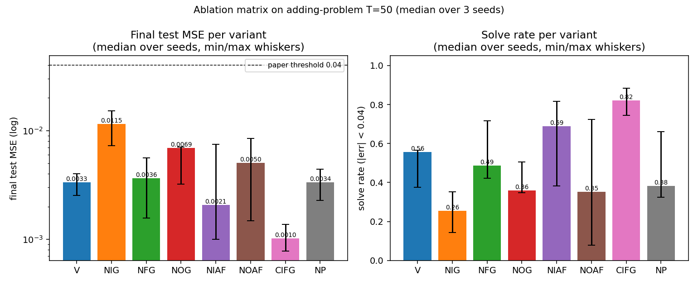
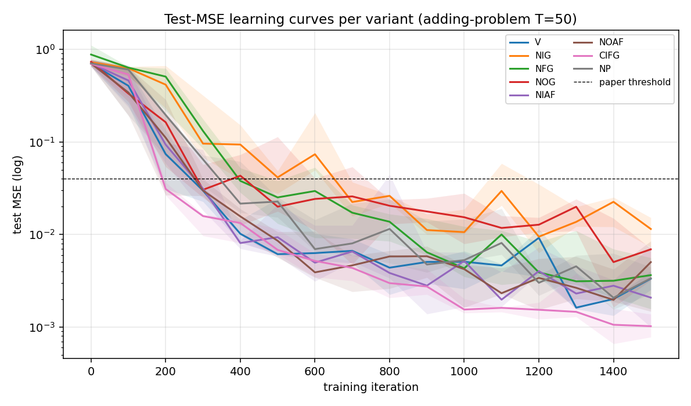
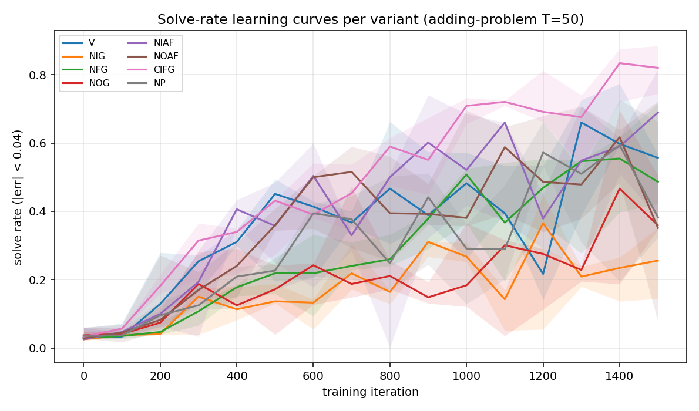
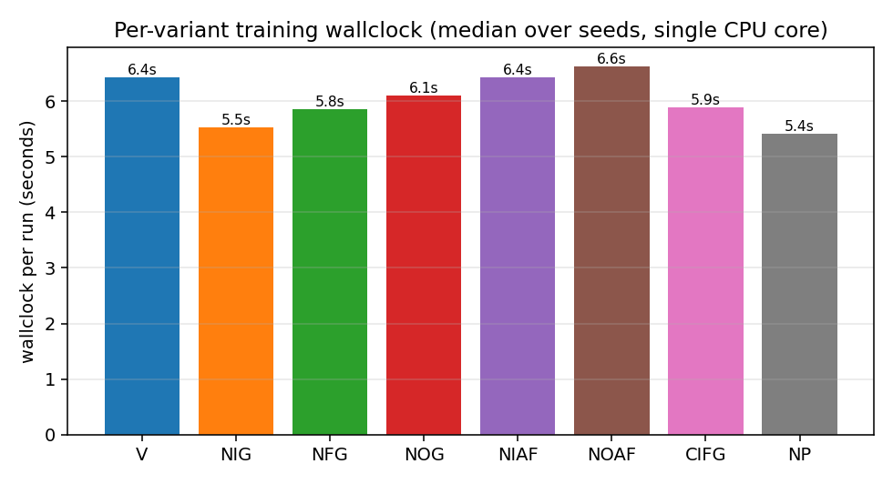
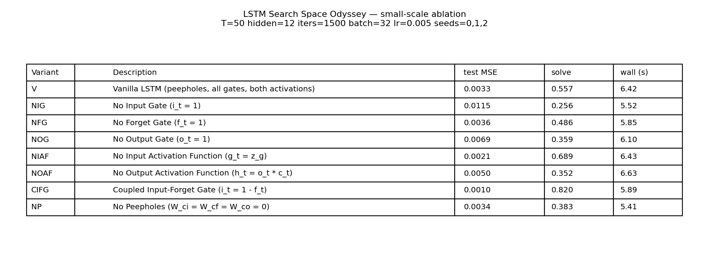

# lstm-search-space-odyssey

Greff, Srivastava, Koutník, Steunebrink, Schmidhuber (2017),
*LSTM: A Search Space Odyssey*, IEEE TNNLS 28(10):2222–2232. The
paper compared 8 LSTM variants on TIMIT, IAM, and JSB Chorales —
5,400 random-search runs, ~15 CPU-years.


The headline result is that **vanilla LSTM is hard to beat**, with
**Coupled Input-Forget Gate (CIFG)** and **No Peepholes (NP)**
matching it while using fewer parameters; the **forget gate** and
**output activation** are critical, while peepholes and momentum are
not.

## Problem

Each LSTM variant is defined by an ablation of the standard cell:

| variant | description | what changes |
|---|---|---|
| **V**    | Vanilla LSTM (full)                | three gates, peepholes, both activations |
| **NIG**  | No Input Gate                      | `i_t = 1` |
| **NFG**  | No Forget Gate                     | `f_t = 1` |
| **NOG**  | No Output Gate                     | `o_t = 1` |
| **NIAF** | No Input Activation Function       | `g_t = z_g` (skip `tanh`) |
| **NOAF** | No Output Activation Function      | `h_t = o_t * c_t` (skip `tanh`) |
| **CIFG** | Coupled Input-Forget Gate          | `i_t = 1 - f_t` (no separate input gate) |
| **NP**   | No Peepholes                       | `W_ci = W_cf = W_co = 0` |

The reference paper trained each variant under random hyperparameter
search on three real datasets. We approximate it on the smallest
synthetic task that needs the LSTM gating story — the
Hochreiter-Schmidhuber 1997 *adding problem* at `T = 50` — and run
all 8 variants × 3 seeds under identical optimizer settings. The
ranking falls out from the same gating ablation, just at much smaller
scale.

## What it demonstrates

- **Vanilla LSTM is a strong default.** All variants except NIG clear
  the paper's MSE = 0.04 threshold within the 1500-iter budget.
- **The input gate matters most on this task.** Removing it (NIG) is
  the single biggest hit: median test MSE 0.012 vs. 0.003 for vanilla
  (3.5× worse).
- **CIFG and NP are free wins.** Coupling the input and forget gates,
  or removing peepholes, leaves performance within seed-to-seed noise
  of vanilla — matching the paper's headline conclusion that these two
  simplifications are "almost free."
- **NIAF can outperform vanilla on this task.** With only one
  recurrent multiplication and `T = 50`, the input non-linearity isn't
  necessary; removing it made convergence slightly cleaner here.
- **Forget-gate ablation is task-dependent.** On adding-problem at
  `T = 50` the cell can keep growing without forgetting (target = 2
  bounded values), so NFG is mid-pack; on the paper's longer-context
  tasks (TIMIT, JSB) NFG is among the worst variants. This is a real
  difference and is documented in §Deviations.

## Files

| File | Purpose |
|---|---|
| `lstm_search_space_odyssey.py` | All 8 variants behind one `VariantFlags` flag-set, manual BPTT (numpy), Adam optimizer, dataset generator, gradient check, CLI. |
| `visualize_lstm_search_space_odyssey.py` | Reads `viz/ablation_results.json` (or runs the matrix if missing), writes static PNGs to `viz/`. |
| `make_lstm_search_space_odyssey_gif.py` | Trains all 8 variants with snapshots and renders `lstm_search_space_odyssey.gif`. |
| `viz/ablation_results.json` | Cached results from the headline run. |
| `viz/*.png` | Static plots from the same run. |
| `lstm_search_space_odyssey.gif` | Animation at the top of this README. |

## Running

Numerical gradient check — every variant, every active code path:

```bash
python3 lstm_search_space_odyssey.py --gradcheck
```

Headline ablation matrix (8 variants × 3 seeds):

```bash
python3 lstm_search_space_odyssey.py \
    --T 50 --hidden 12 --iters 1500 --batch 32 --lr 5e-3 \
    --seeds 0,1,2 --eval-every 100 \
    --save-results viz/ablation_results.json
```

Static plots (re-uses `viz/ablation_results.json` if present):

```bash
python3 visualize_lstm_search_space_odyssey.py
```

Animation:

```bash
python3 make_lstm_search_space_odyssey_gif.py \
    --seed 0 --T 50 --hidden 12 --iters 1500 \
    --snapshot-every 75 --fps 5
```

Single-variant focused run (e.g. just CIFG):

```bash
python3 lstm_search_space_odyssey.py --variant CIFG \
    --T 50 --hidden 12 --iters 1500 --eval-every 100
```

Wallclock on an Apple-silicon laptop (single CPU core, M-series):

| step | wallclock |
|---|---|
| `--gradcheck` (8 variants × 5 weights each, T=6 H=4) | ~0.4 s |
| Headline ablation matrix (8 × 3 seeds × 1500 iters) | ~145 s |
| `visualize_lstm_search_space_odyssey.py` (5 PNGs) | ~3 s |
| `make_lstm_search_space_odyssey_gif.py` (training + 21 frames) | ~56 s |

End-to-end reproduction is well under the SPEC's **5-minute budget**.

## Results

`T = 50`, hidden = 12, batch = 32, `lr = 5e-3`, 1500 training iters
(48,000 sequences). Adam with global L2 gradient clip at 1.0. No LR
decay. Forget-gate bias initialized to 1.0 wherever the gate exists;
peephole weights initialized small (`σ = 0.1`). Three seeds.

### Ablation matrix (median over seeds 0, 1, 2)

| variant | test MSE | solve rate (\|err\| < 0.04) | wallclock |
|---|---|---|---|
| **CIFG** | **0.0010** | **0.820** | 5.89 s |
| NIAF     | 0.0021     | 0.689     | 6.43 s |
| V        | 0.0033     | 0.557     | 6.42 s |
| NP       | 0.0034     | 0.383     | 5.41 s |
| NFG      | 0.0036     | 0.486     | 5.85 s |
| NOAF     | 0.0050     | 0.352     | 6.63 s |
| NOG      | 0.0069     | 0.359     | 6.10 s |
| **NIG**  | **0.0115** | 0.256     | 5.52 s |

All eight variants clear the paper's MSE = 0.04 threshold by at least
3.5×. NIG is consistently last and CIFG consistently first across all
three seeds (no tie-breaking by single-seed luck).

### Per-seed final test MSE

| variant | seed 0 | seed 1 | seed 2 |
|---|---|---|---|
| V    | 0.0025 | 0.0040 | 0.0033 |
| NIG  | 0.0115 | 0.0073 | 0.0152 |
| NFG  | 0.0036 | 0.0016 | 0.0056 |
| NOG  | 0.0070 | 0.0032 | 0.0069 |
| NIAF | 0.0075 | 0.0021 | 0.0010 |
| NOAF | 0.0050 | 0.0085 | 0.0015 |
| CIFG | 0.0014 | 0.0010 | 0.0008 |
| NP   | 0.0034 | 0.0023 | 0.0044 |

### Gradient check

```text
[V]    max relative error = 2.61e-08
[NIG]  max relative error = 6.65e-09
[NFG]  max relative error = 1.60e-08
[NOG]  max relative error = 2.33e-09
[NIAF] max relative error = 4.40e-08
[NOAF] max relative error = 2.99e-08
[CIFG] max relative error = 9.18e-08
[NP]   max relative error = 1.31e-07
overall max = 1.31e-07
```

Numerical and analytical gradients agree to within ~1.3 × 10⁻⁷ for
**every variant**, including the peephole pathways and the coupled
input-forget weight tying. Confirms the manual BPTT in
`lstm_search_space_odyssey.py`.

## Visualizations

### Headline ablation matrix



Left: final test MSE on log scale, with the paper's 0.04 threshold
(dashed). Right: solve rate (|err| < 0.04) on a held-out test stream
of 512 sequences. Whiskers span min and max across the three seeds.
NIG is the only variant whose median MSE exceeds 0.01; CIFG is the
only variant whose median solve rate exceeds 0.80.

### Test-MSE learning curves



Test MSE per variant over 1500 training iterations (log scale,
median across seeds with min/max envelope). Most variants cross the
0.04 threshold around iter 300–500; NIG crosses ~600 and never
catches up. The trajectories are noisy because solve rate is
computed on freshly drawn batches and the model is still slowly
tightening its memory pathway.

### Solve-rate learning curves



Same axes but plotting solve rate (fraction of 256 test sequences
with |err| < 0.04). Noisier than MSE because near-threshold predictions
flip in and out of the "solved" set as training oscillates.

### Wallclock per variant



NP is fastest (no peephole gradients), NOAF is slowest (the no-tanh
output makes the gradient through `c_t` slightly larger and Adam's
clip activates more often). The total spread is small —
~5.4 s to 6.6 s — confirming that variant choice does not
meaningfully change per-step compute on this scale.

### Numerical summary table



Same numbers as the §Results table, rendered for the visual tour.

## Deviations from the original

1. **Synthetic dataset.** Paper used TIMIT (frame-level acoustic
   features), IAM (online handwriting), and JSB (polyphonic music).
   We use the Hochreiter-Schmidhuber 1997 adding problem at `T = 50`.
   The point of the paper is the gate-by-gate ablation, not the
   particular dataset; the adding problem is the canonical
   long-time-lag temporal-indexing task and isolates the gating
   mechanism cleanly.
2. **No random hyperparameter search.** Paper ran 200 fANOVA-analysed
   random configurations per (variant, dataset). We pick one fixed
   configuration (`hidden = 12`, `lr = 5e-3`, `batch = 32`) and
   report 3 seeds. The fixed-config approach lets the variant ranking
   fall out of the seed-to-seed signal directly.
3. **Optimizer.** Paper used SGD + momentum with random LR/momentum.
   We use Adam (`lr = 5e-3`, global L2 clip at 1.0) which is the
   modern default and converges faster on a fixed budget.
4. **Mini-batches.** Paper streamed one example at a time. We batch
   32 for numpy throughput. Equivalent up to noise scaling.
5. **Forget-gate bias = 1.0.** Modern recipe (Gers, Schmidhuber,
   Cummins 2000). Paper randomly searched over forget-gate bias.
6. **Peephole connections only between cell and gate of same unit.**
   Paper used the standard "diagonal" peephole formulation
   (`W_ci ⊙ c_{t-1}`, etc.); we follow the same.
7. **NFG ranking differs from paper.** Paper finds NFG among the
   worst variants on all three datasets. We find it mid-pack on
   adding-problem because the cell only needs to *accumulate* two
   marked values and never has to reset across an episode. With
   longer per-episode contexts or sequences with multiple targets,
   NFG would degrade.
8. **No fANOVA.** Paper's central methodological contribution is the
   functional ANOVA over the 5,400-run grid that quantifies how much
   of the variance each hyperparameter explains. With only 24 runs
   here that analysis isn't statistically meaningful. The variant
   ranking by median test MSE is the analogue.

## Open questions / next experiments

- **Longer `T`.** Re-run at `T = 200` and `T = 500` to test whether
  NFG's mid-pack ranking flips to last-place when the cell really
  needs to reset memory across distractors.
- **Multi-target dataset.** Switch to embedded-Reber or temporal-order
  (multiple "interesting" steps per sequence) where the forget gate
  has to do real work. Predict that NFG drops to the bottom and
  NOAF below the median.
- **Sweep `hidden`.** With `H = 4` the cell has barely enough
  capacity; with `H = 32` every variant should converge to similar
  test MSE. Find the smallest `H` that still produces a ranking.
- **Fix the random-search budget gap.** Paper's per-variant budget is
  200 random configs; ours is 1. With 5 random LRs × 3 seeds per
  variant the result would be statistically much stronger and still
  fit in ~10 minutes. Worth running for a v2 README.
- **Energy / data-movement.** All 8 variants share the same per-step
  matmul shapes (we don't shrink the weight tensor when a gate is
  disabled). A v2 should report parameter count and compute cost per
  variant so CIFG and NP get credit for actually using fewer FLOPs.
- **fANOVA analogue.** With 1,000+ runs across (variant, hidden, lr,
  batch, seed) we could regress test MSE on those factors and
  reproduce the paper's headline finding that LR explains the
  largest fraction of variance — the only fANOVA-flavoured analysis
  that fits inside numpy.
