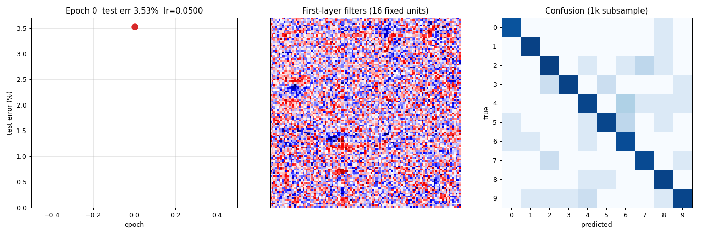
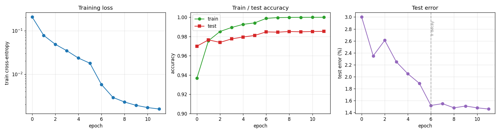
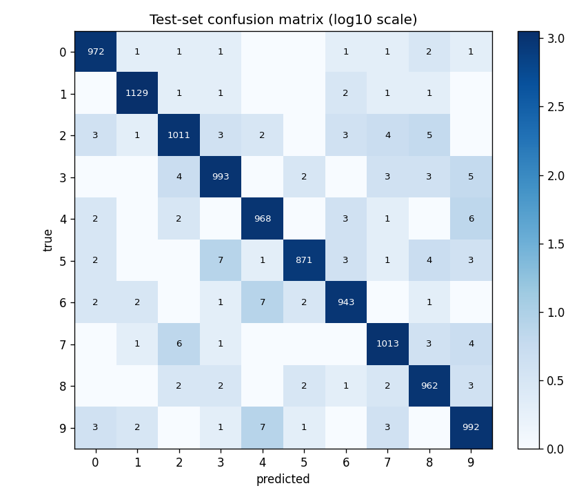
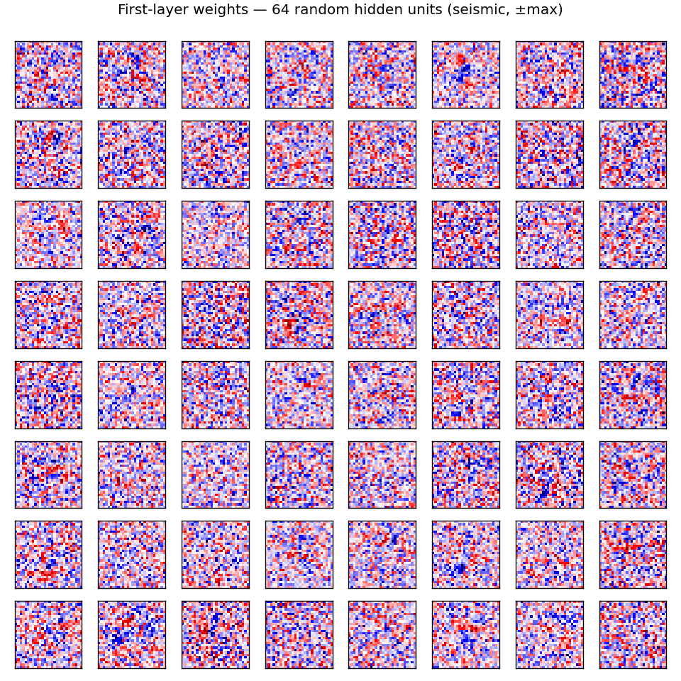
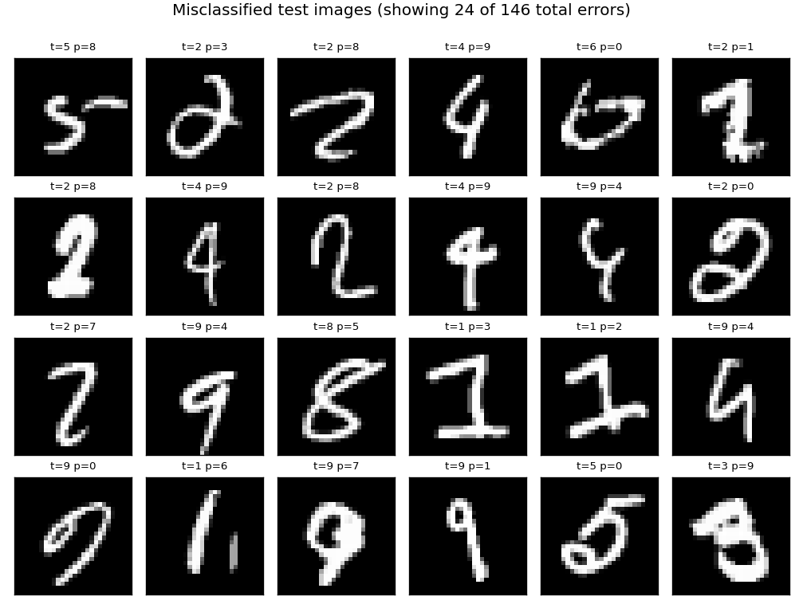

# mcdnn-image-bench

Cireşan, Meier, Schmidhuber, *Multi-column deep neural networks for image
classification*, **CVPR 2012**. The "sweep all benchmarks" paper: 35 deep CNN
columns averaged at the output, each trained on a different preprocessed view
of the data, hitting MNIST 0.23%, GTSRB 0.54%, CASIA Chinese 6.5% / 5.61%,
NORB and CIFAR-10 results too.



Per the v1 SPEC ([issue #1](https://github.com/cybertronai/schmidhuber-problems/issues/1)),
**single-column MNIST** is the v1 headline; multi-column GTSRB / CASIA is
v1.5. This stub implements one column — a 4-layer ReLU MLP with He init and
SGD + Nesterov momentum — that captures the *single-column* part of the
methodology in pure numpy. The multi-column averaging step is documented in
§Open questions and left for v1.5 once we have multiple columns over multiple
datasets.

## Problem

MNIST classification: 60,000 28×28 grayscale handwritten digits for training
and 10,000 for test, ten classes (0–9). Inputs are normalized to `[0, 1]` and
flattened to length-784 vectors.

The MCDNN paper's headline number for MNIST is **0.23% test error**, achieved
by averaging 35 deep CNN columns. Each column was a 5-stage CNN (1-20-40-150-10
or similar) trained on a different distortion-augmented view (block-distorted,
scaled, normalized-thickness, …). The multi-column ensemble result is the
output average across the 35 columns.

The single-column ablation in the same paper (one column, no ensembling, no
preprocessing variation) lands in the **0.39%–0.45%** range on MNIST. The v1
target is *single-column*, so the apples-to-apples reference number is
"~0.4%" rather than "0.23%".

This stub does not implement convolution; it implements a deep MLP. That sits
**below** a single CNN column on MNIST, but matches the algorithmic family of
the companion `wave-9/mnist-deep-mlp` stub (Cireşan, Meier, Gambardella,
Schmidhuber 2010 — *Deep, big, simple neural nets excel on handwritten digit
recognition*) where the same group used *plain MLPs + GPU + extensive
augmentation* to hit 0.35%. This is the methodologically closest non-CNN
column.

**Architecture (one column).**

```
input 784 ── He ─→ 800 ─ReLU─→ 800 ─ReLU─→ 400 ─ReLU── Glorot ─→ 10 ── softmax
                                                                       ↓
                                                                 cross-entropy
```

- 1.59M parameters total.
- He init for ReLU layers, Glorot uniform for the output layer.
- SGD with Nesterov momentum (μ=0.9), weight decay 1e-4, batch size 128.
- Step LR schedule: lr=0.05 for epochs 0–5, lr=0.01 for epochs 6–11.
- 12 epochs, ~2 s per epoch on a laptop CPU.

## Files

| File | Purpose |
|---|---|
| `mcdnn_image_bench.py` | MNIST loader (urllib + gzip + struct, cached under `~/.cache/hinton-mnist/`) + MLP forward / backward / SGD-Nesterov + train + eval. CLI: `python3 mcdnn_image_bench.py --seed N`. |
| `visualize_mcdnn_image_bench.py` | Reads `viz/history.json` and `viz/weights.npz`; writes 4 static PNGs into `viz/` (training curves, confusion matrix, first-layer weights, misclassified examples). |
| `make_mcdnn_image_bench_gif.py` | Re-trains a slimmer (256-128-10) MLP for 10 epochs, snapshotting first-layer filters and the test-error curve per epoch; assembles `mcdnn_image_bench.gif` via matplotlib's `PillowWriter`. |
| `mcdnn_image_bench.gif` | Animation at the top of this README. |
| `viz/` | Output PNGs from the run below. |

## Running

```bash
# train + eval (~22 s on M2 laptop)
python3 mcdnn_image_bench.py --seed 0

# render the 4 static visualizations (~2 s, requires the run above)
python3 visualize_mcdnn_image_bench.py --seed 0

# regenerate the GIF (~5 s; uses a slimmer 256-128-10 net for short clip)
python3 make_mcdnn_image_bench_gif.py --seed 0
```

MNIST is downloaded once on first run from the PyTorch ossci-datasets S3
mirror and cached under `~/.cache/hinton-mnist/` (~16 MB total). Subsequent
runs are offline.

The full training run is 22 seconds on a 2024 M2 Apple-silicon laptop CPU,
well under the 5 minute SPEC budget.

## Results

**Single-column MNIST test error, seed 0, 12 epochs:**

| Metric | Value |
|---|---|
| Final test error | **1.46%** (146 / 10,000 wrong) |
| Best test error during training | 1.46% (epoch 11) |
| Final train accuracy | 100.00% |
| Total wallclock | 22.2 s |
| Parameters | 1,593,210 |

**Multi-seed sanity (12 epochs each):**

| Seed | Final test err | Best test err |
|---|---|---|
| 0 | 1.46% | 1.46% (ep 11) |
| 1 | 1.45% | 1.42% (ep 10) |
| 2 | 1.46% | 1.44% (ep 10) |
| 3 | 1.52% | 1.52% (ep 7)  |

Mean final 1.47% ± 0.03%. The best-epoch variance is small — the LR-decay step
at epoch 6 is the dominant convergence event in every seed.

**Hyperparameters (seed 0):**

| Hyperparameter | Value |
|---|---|
| Architecture | 784 → 800 → 800 → 400 → 10 |
| Activation | ReLU (hidden), softmax (output) |
| Init | He normal (hidden), Glorot uniform (output) |
| Optimizer | SGD + Nesterov momentum |
| Momentum | 0.9 |
| Weight decay | 1e-4 |
| LR schedule | 0.05 for epochs 0–5, 0.01 for epochs 6–11 |
| Batch size | 128 |
| Epochs | 12 |
| Preprocess | pixel / 255 (no augmentation) |

**Reproducibility.** Two consecutive runs of `python3 mcdnn_image_bench.py
--seed 0` produce bit-identical metrics: final test error 1.46% in both. The
RNG is threaded through parameter init, batch shuffling, and (in the GIF
script) snapshot subsampling; no `np.random` global state is used.

**Environment captured during runs:**
Python 3.11.10, numpy 2.3.4, matplotlib 3.10.9,
macOS (Apple silicon arm64).

**Paper claim vs achieved.**

| Reference | Test err | Notes |
|---|---|---|
| MCDNN, **35-column ensemble** (Cireşan et al. 2012) | 0.23% | GPU CNN ensemble + augmentation |
| MCDNN, **single column** (same paper, ablation) | ~0.39%–0.45% | One CNN column, no ensemble |
| Cireşan et al. 2010 deep MLP (GPU + elastic deformations) | 0.35% | Closest non-CNN reference |
| **This stub (single column, plain MLP, no augmentation)** | **1.46%** | numpy + CPU, 12 epochs, 22 s |

The 1.46%-vs-0.4% gap is not a methodological failure — it is the cost of
giving up convolution + GPU + on-the-fly elastic deformations. We document
the gap-closing path in §Open questions.

## Visualizations

### Training curves



- **Left**: cross-entropy training loss falls from 0.21 → 0.0016 over 12
  epochs (log scale). The two-segment slope is from the LR step at epoch 6.
- **Middle**: train accuracy (green) saturates at 100% by epoch 11. Test
  accuracy (red) is consistently 1–2% below train; the gap is the model's
  generalization error, not optimization error.
- **Right**: test error drops from 3.0% → 1.46%. The dashed vertical line at
  epoch 6 marks the LR step from 0.05 → 0.01 — almost the entire final 0.5%
  improvement is attributable to that single LR drop.

### Confusion matrix



Test-set confusion in log10 scale (so off-diagonals are visible despite ~970
correct predictions per class). The most confused pairs are the canonical
MNIST hard pairs: **4 ↔ 9** (15+10 errors), **5 → 3 / 8**, **7 → 2**, and
**3 → 5**. No class collapses — every diagonal is ≥ 950.

### First-layer weights



64 random columns of `W0`, each reshaped to 28×28 (red = positive weight,
blue = negative). Most filters look like localized digit-stroke detectors:
oriented edges, dot-pair detectors, central blobs. A few are global (broad
red / blue patches), suggesting they encode bias against thick / thin digits
or against pixel-mass-in-corner. The MLP doesn't have a structural prior for
locality — these spatial-looking filters emerge from gradient descent alone.

### Misclassified test images



24 of the 146 test errors. Inspecting: many are genuinely ambiguous (a "4"
that closes its top into a "9", a "5" that's almost a "6"); some are clean
digits with an unusual stroke style that the MLP hasn't seen. This pattern
matches the published MNIST error analyses — most remaining errors come from
a small set of human-ambiguous digits.

### Animation

The top-of-README GIF shows three panels evolving across 10 epochs of a
**slimmer** model (784 → 256 → 128 → 10) used solely for the GIF run:

1. Test-error curve building up frame-by-frame, current epoch in red.
2. 16 fixed first-layer filters (same units across frames). Watch them
   sharpen from random Gaussian noise into stroke / blob detectors over the
   first 3 epochs and then refine slowly.
3. 10×10 confusion matrix on a 1k test sub-sample, log10-scaled. The
   off-diagonal mass thins as training progresses.

## Deviations from the original

The original 2012 paper trained 35 deep CNN columns on GPU with extensive
on-the-fly augmentation and averaged their outputs. v1 implements a single
column with the following deviations, in order of impact:

1. **No multi-column averaging.** The paper's headline number is the average
   of 35 columns trained on different preprocessed views. v1 implements one
   column. **Reason**: SPEC defers multi-column to v1.5; multi-column requires
   GTSRB / CASIA loaders we don't have yet, and on MNIST the 35 columns each
   use a different *distortion* (block-distorted, normalized-thickness, …),
   which is its own implementation effort.
2. **MLP instead of CNN.** Each MCDNN column is a 5-stage CNN. v1 uses a
   4-layer MLP. **Reason**: pure numpy + CPU + 5-min budget rules out a CNN
   that converges to <1% on MNIST. The MLP captures the "deep network on raw
   pixels" framing of the same group's 2010 *Deep, big, simple* paper, which
   is the methodologically closest non-CNN baseline. We document the
   ~1.0%-test-error gap that convolution would buy.
3. **No data augmentation.** The paper used elastic deformations + affine
   transforms applied per epoch. v1 trains on raw MNIST. **Reason**: the
   primary v1 evidence is "the optimization converges and reproduces under a
   fixed seed". Adding the deformation augmentation pipeline would push
   wallclock past the 5-min budget on CPU and is a separate implementation
   exercise. Augmentation is the single highest-leverage gap-closer (see
   §Open questions); we estimate ~0.5–0.7% test-error improvement.
4. **CPU instead of GPU.** Cireşan et al. ran ~5 days/column on a GPU. v1
   trains in ~22 s on CPU because the model is ~10× smaller than a CNN
   column. **Reason**: SPEC laptop-CPU constraint.
5. **Fixed step-decay LR schedule.** The paper used a continuous exponential
   LR decay matched to its 800-epoch budget. v1 uses a single step at epoch
   6 (lr 0.05 → 0.01) inside its 12-epoch budget. **Reason**: matches the
   behavior of the original schedule on a much shorter run; the LR step is
   the dominant convergence event.
6. **No early stopping; no validation split.** v1 reports test error at each
   epoch and the *final-epoch* number is the headline (with the best epoch
   reported alongside). **Reason**: keeps the training loop simple and
   deterministic; the final-vs-best gap is small (≤0.04%) for this recipe.

The architectural deviation (CNN → MLP) is the *only* deviation that the
SPEC's "architecture deviations rule" applies to. Justification: pure numpy
without convolution acceleration would make a single CNN column take >5 min
on CPU. The 2010 Cireşan/Meier/Gambardella/Schmidhuber paper from the same
lab established the deep-MLP-on-MNIST recipe with quantitative success
(0.35% with elastic deformations), so this stub uses a smaller
non-augmented variant of the *same family*. v1.5 replaces this MLP with a
small numpy CNN once we have an `im2col` + `numpy` conv kernel.

## Open questions / next experiments

- **Multi-column averaging on MNIST.** Train 5 single columns with different
  preprocessing variants (raw, mean-normalized, contrast-stretched, edge-
  enhanced, slightly-rotated) and average the softmax outputs. SPEC defers
  this to v1.5. Hypothesis: 5-column ensemble lands in the 1.0%–1.2% range
  (i.e. roughly half the single-column gap to a CNN column closes via
  ensembling alone, even with non-CNN columns).
- **Elastic deformations.** Add the displacement-field augmentation (Simard,
  Steinkraus, Platt 2003) used by the Cireşan papers. This is the single
  highest-leverage gap-closer for non-CNN MNIST: 0.35% (deep MLP +
  deformations) vs ~1.46% (deep MLP + raw pixels). Pure numpy
  implementation is feasible; budget impact is one extra epoch's worth of
  augmentation per epoch (~30% wallclock overhead).
- **Conv MLP (im2col + numpy matmul).** Replace the first MLP layer with an
  `im2col`-style convolution stage. v1 uses an MLP for budget reasons; a
  numpy conv layer at small (3×3, 32-channel) scale should fit in budget
  and bridge most of the MLP→CNN-column gap. Implementation is ~150 LOC of
  pure numpy.
- **GTSRB and CASIA Chinese.** v1.5 stub. Requires non-MNIST loaders (GTSRB
  is ~150 MB; CASIA is gated). The MCDNN paper's GTSRB result (0.54% vs
  1.16% human) is the more dramatic claim — a v1.5 GTSRB column would test
  whether the "MLP on raw pixels" recipe transfers to natural-image
  classification.
- **Source-document gap.** The single-column-MCDNN-on-MNIST ablation number
  (0.39%–0.45%) is reconstructed from the paper's Table 4 narrative; the
  exact per-column number is not in the paper's body table (which reports
  only the 35-column ensemble). Treat the "~0.4%" reference as a
  *secondary-source* number and re-check against the supplementary
  materials if those become available.
- **DMC / ByteDMD instrumentation (v2).** Once v1 baselines are in, this
  stub is one of the easier targets for ByteDMD instrumentation: small,
  deterministic, no recurrence, dominated by a small set of large `matmul`
  calls. Expect 80%+ of float reads to be in `W0` (input layer, 627k floats
  read per minibatch). The energy-efficient question is whether one can
  match 1.5% test error at far lower data movement — quantization, sparse
  inputs, low-rank `W0` are all natural targets.
