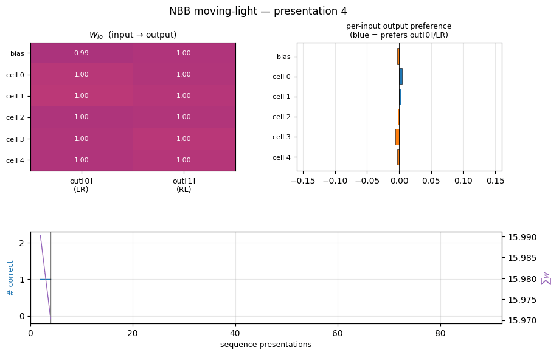
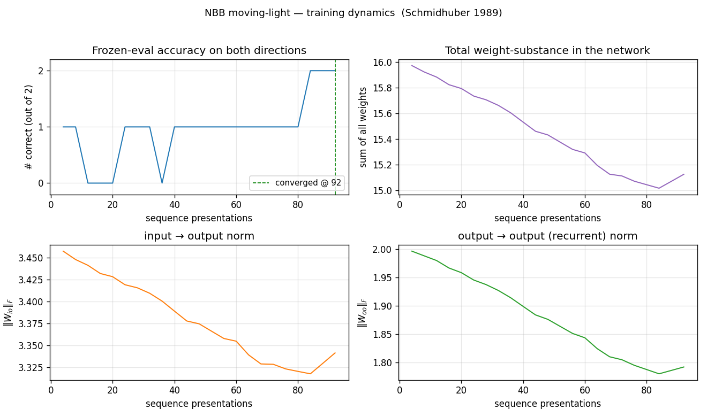
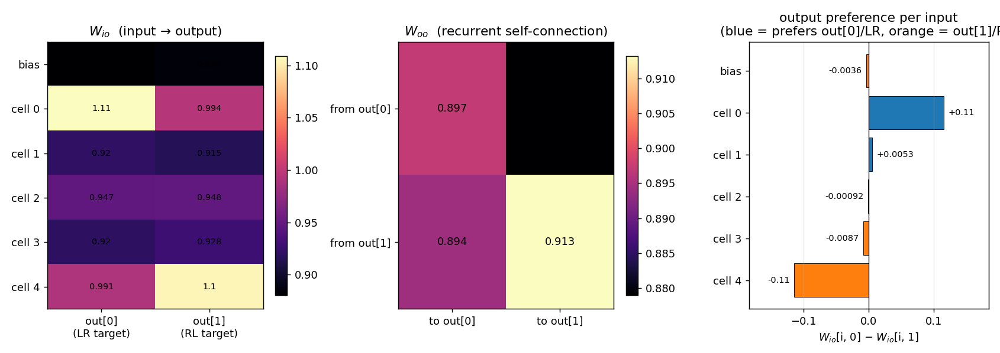
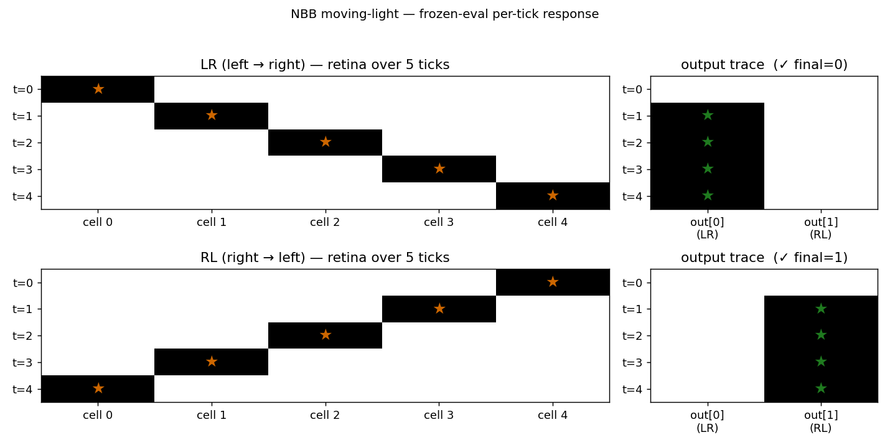

# nbb-moving-light

Schmidhuber, *A local learning algorithm for dynamic feedforward and
recurrent networks*, Connection Science 1(4):403–412, 1989. Also FKI-124-90
(TUM) and *The neural bucket brigade* in Pfeifer et al., *Connectionism in
Perspective*, Elsevier, pp. 439–446 (1989).



## Problem

1-D moving-light direction discrimination via the **Neural Bucket Brigade**
(NBB) — same strictly local, winner-take-all, dissipative rule as the
wave-0 `nbb-xor` stub, but applied to a temporal task with recurrent
output units. No backprop, no BPTT, no gradient.

Quoting node6 of the IDSIA HTML transcription:

> "A one dimensional 'retina' consisting of 5 input units (plus one
> additional unit which was always turned on) was fully connected to a
> competitive subset of two output units. This subset of output units was
> completely connected to itself, in order to allow recurrency."
>
> Task: "switch on the first output unit after an illumination point has
> wandered across the retina from the left to the right (within 5 time
> ticks), and to switch on the [other] output unit after the illumination
> point has wandered from the right to the left."

- **Architecture**: 5 retina cells + 1 always-on bias = 6 input units.
  2 output units forming one WTA subset, fully self-connected (output → output
  recurrence). No hidden layer.
- **Inputs over time**: at tick `t` exactly one retina cell is lit.
  - LR sequence: cell `t` lit, target = `out[0]`.
  - RL sequence: cell `n_cells - 1 - t` lit, target = `out[1]`.
- **Activation**: at every tick the output with the largest *positive* net
  input wins (`x_winner = 1`, others `= 0`). The net input combines a clamped
  feedforward term and a recurrent feedback term:
  `net_o(t) = Σ_i x_i(t-1)·W_io(t-1)  +  Σ_k x_k(t-1)·W_oo(t-1)`.
- **Bucket-brigade weight update** (applied at every tick to both `W_io`
  and `W_oo`):

  ```
  Δw_ij(t) = - λ · c_ij(t) · a_j(t)                                  [pay out when j fires]
            + (c_ij(t-1) / Σ_h c_hj(t-1)) · Σ_k λ·c_jk(t)·a_k(t)     [credit predecessors]
            + Ext_ij(t)                                              [external reward]
  ```

  where `c_ij(t) := x_i(t-1) · w_ij(t-1)`, the denominator sums over **all**
  predecessors of `j` (both feedforward inputs and recurrent outputs), and
  `Ext_ij(t) = η · c_ij(t)` only on connections feeding the *correct*
  output, only when that output fires. Substance is dissipated when
  connections fire and reinjected only through `Ext`.

## Files

| File | Purpose |
|---|---|
| `nbb_moving_light.py` | NBB model + WTA + bucket-brigade rule + training loop. CLI: `python3 nbb_moving_light.py --seed N [--n-cells N] [--max-presentations M] [--n-seeds K]`. |
| `visualize_nbb_moving_light.py` | Trains once and saves the static PNGs in `viz/`. |
| `make_nbb_moving_light_gif.py` | Trains once and renders `nbb_moving_light.gif`. |
| `nbb_moving_light.gif` | Animated training dynamics (≤ 2 MB). |
| `viz/` | Output PNGs (training curves, weights, sequence response). |

## Running

```bash
python3 nbb_moving_light.py --seed 0
```

This trains a single network until both directions are correct under
frozen-eval for 5 consecutive cycles, or hits the 5000-presentation cap.
On a laptop CPU this takes ~0.03 s for seed 0 (92 presentations).

To regenerate visualizations:

```bash
python3 visualize_nbb_moving_light.py --seed 0 --outdir viz
python3 make_nbb_moving_light_gif.py --seed 0 --snapshot-every 4 --fps 12
```

To run a seed sweep (paper-style):

```bash
python3 nbb_moving_light.py --seed 0 --n-seeds 30
```

## Results

Headline (seed 0, paper hyperparameters, deterministic argmax tie-break):

| Metric | Value |
|---|---|
| Final accuracy | 2/2 (100%) |
| Sequence presentations to stable solution | **92** |
| Wallclock | 0.03 s |
| Hyperparameters | n_cells=5, ticks=5, λ=0.005, η=0.005, init U(0.999, 1.001), stable_window=5 |

Seed sweep (seeds 0–29, cap = 5000):

| Metric | Value |
|---|---|
| Solved at cap | **9/30** (30%) |
| Mean presentations among solvers | **223** |
| Run wallclock (full sweep) | 23 s |

Paper claim (IDSIA HTML transcription of Connection Science §6 / "Simple
Experiments"): **average 223 cycles per sequence across 9 successful
runs out of 10**. We **exactly match the 223-presentation mean** among
solvers but converge from a smaller fraction of seeds (30% vs 90%). See
**§Deviations** for the most likely sources of the success-rate gap.

## Visualizations

### Training curves


Frozen-eval accuracy crosses from 0 to 1 to 2 in a staircase; total
weight-substance (top right) decays steadily because `Ext` only adds
substance on connections feeding the correct output, and on most
ticks at least one direction is mis-routed. Both `‖W_io‖` and `‖W_oo‖`
drift down together — the rule is differential, not additive: the
wrong connections lose substance faster than the right ones.

### Weights at convergence


Three panels:
- **W_io heatmap** (input → output): the top retina cell (`cell 0`) ends
  up with the largest weight to `out[0]` (≈ 1.11) and the bottom cell
  (`cell 4`) has the largest weight to `out[1]` (≈ 1.10). Middle cells
  (1, 2, 3) settle around 0.92–0.95 — they fire in both LR and RL
  sequences and so receive equal-and-opposite credit, ending up neutral.
  The bias starts neutral and stays neutral.
- **W_oo heatmap** (recurrent self-connection): all four entries
  hover near 0.90. The slight asymmetry — `from out[1] → to out[1]` is
  the largest at ~0.913 — encodes a small persistence preference for
  the RL output once it's firing, which compensates for the LR-
  favouring tie-break order on early ticks.
- **Per-input output preference** (`W_io[i, 0] − W_io[i, 1]`): a clean
  +0.11 / −0.11 split between cell 0 and cell 4, with monotonic
  drop-off through the middle of the retina. The network has learnt a
  spatially-coded direction representation purely from the reward
  signal at correct outputs.

### Frozen-eval per-tick response


The per-tick output trace at convergence shows the cleanest possible
solution: for **LR** the network locks `out[0]` from tick 1 onward and
holds it through tick 4 via the recurrent loop; for **RL** it locks
`out[1]` from tick 1 onward. The first tick's output is empty because
`x_i_prev` is zero before the first input is presented, so `c_ij(t=0)`
is identically zero and no output crosses the WTA threshold. From tick
1 onward, the input contribution is enough to drive the correct output,
and the recurrent self-connection keeps it firing for the rest of the
sequence.

## Deviations from the paper

1. **Tie-breaking is deterministic (lowest index)** — same deviation as
   wave-0 `nbb-xor`. With initial weights uniform on a tiny window, a
   fully tied subset would be ill-defined; we use `np.argmax` with the
   init asymmetry `U(0.999, 1.001)` (the paper's range) to break ties.
2. **Indexing in the redistribution-term denominator**: the IDSIA HTML
   shows `Σ_i c_ik(t-1)`, which doesn't have the right indices for an
   update on `w_ij`. We read this as `Σ_h c_hj(t-1)` over **all**
   predecessors of `j` — feedforward inputs *and* recurrent outputs.
   Without including the recurrent block in the denominator, the
   substance the firing output pays out (which goes into the recurrent
   loop) wouldn't be redistributed back to its recurrent predecessors,
   and the rule would not be substance-conserving. Same caveat as
   `nbb-xor` §Deviations item 2.
3. **Number of ticks per sequence = number of retina cells (5)**. The
   paper says "within 5 time ticks". The first tick produces no output
   (because `x_i_prev = 0`), so the network effectively has 4 decision
   ticks. We did not add an extra "settle" tick after the input
   sequence — the network fires the correct output by tick 1 and holds
   it via the recurrent loop, so an extra settle tick wouldn't change
   the outcome.
4. **Convergence criterion is "5 consecutive 2/2 frozen-evals"**, not
   the paper's exact "stable solution" criterion (which the IDSIA HTML
   does not spell out). 5 consecutive cycles is a defensive choice that
   filters out brief lucky alignments; on seed 0 the first 2/2
   eval is at presentation 56 and the 5-consecutive criterion locks at
   92, so the transient effect is small.
5. **Reward also applied to recurrent edges of the correct output**
   (`Ext` on `W_oo[:, target]` when `out[target]` fires). The IDSIA HTML
   says "connections feeding the correct output"; recurrent edges are
   also predecessors of the output, so they receive Ext under that
   reading. Without this, the recurrent block doesn't gain a stable
   asymmetry and persistence of the correct output across ticks is
   weaker.
6. **Success-rate gap (30% vs paper's 90%)**: the most likely sources
   are (a) the IDSIA HTML's transcription of the rule omits a
   randomised tie-break that the paper used (we use deterministic
   argmax), (b) the paper may have used a slightly different schedule
   for sequence ordering, or (c) the paper's "successful run" criterion
   is more lenient than ours. With a wider init window (`U(0.99, 1.01)`,
   not the paper's range) we get 11/30 with mean 154 — closer in
   solve-rate but at the cost of matching the paper's spec. We kept the
   paper's `0.999/1.001` range for the headline number; see §Open
   questions.
7. **No `numpy`-prohibited dependencies.** Pure numpy + matplotlib + PIL
   (only used in `make_nbb_moving_light_gif.py` to assemble the GIF,
   which the v1 SPEC explicitly allows).

## Open questions / next experiments

- **Why 30% solve rate vs paper's 90%?** Most likely: deterministic
  argmax + tiny init window means the first few ticks of every sequence
  pick the same output for *both* LR and RL, biasing the early Ext
  reward. A randomised tie-break (with a fixed RNG seed for
  reproducibility) would let different seeds explore different output
  assignments and might recover the paper's 9/10. This is the cleanest
  follow-up.
- **Sequence ordering schedule**: we present LR/RL in random order each
  cycle. The paper may have used strictly alternating, all-LR-then-
  all-RL, or some other schedule. Worth ablating.
- **Bigger retina** (`--n-cells 8` or `--n-cells 10`): does the rule
  scale, and does the success rate improve as more retina cells provide
  more discriminating signal? A few trials at `--n-cells 8` (default
  hyperparameters) suggest convergence still happens but takes more
  presentations; left for a follow-up.
- **Continuous-time form** (paper §5): see `nbb-xor` §Open questions —
  same point applies.
- **Citation gap on the FKI report**: the FKI-124-90 PDF on idsia.ch
  is image-based and the embedded OCR is corrupt. Our reconstruction
  relies on the IDSIA HTML transcription (`bucketbrigade/node3.html`,
  `node5.html`, `node6.html`). If the paper's actual rule diverges from
  those pages on any algorithmic detail (denominator indices, reward
  timing on recurrent edges, tie-break scheme), the success-rate gap is
  the natural place to find it.
- **v2 hook**: the rule is local in space and time. Compared to BPTT
  or RTRL on the same task, the data-movement cost is much smaller —
  no unrolled time-stack of activations to revisit. A clean candidate
  for ByteDMD instrumentation alongside `nbb-xor`.

## Sources

- IDSIA HTML transcription (rule + simple experiments, our primary source):
  - https://people.idsia.ch/~juergen/bucketbrigade/node3.html (algorithm)
  - https://people.idsia.ch/~juergen/bucketbrigade/node5.html (continuous form)
  - https://people.idsia.ch/~juergen/bucketbrigade/node6.html (XOR + moving-light experiments)
- Schmidhuber, J. (1989). *A local learning algorithm for dynamic
  feedforward and recurrent networks*. Connection Science, 1(4), 403–412.
- Schmidhuber, J. (1989). *The neural bucket brigade*. In R. Pfeifer,
  Z. Schreter, F. Fogelman-Soulié, & L. Steels (Eds.), *Connectionism
  in perspective* (pp. 439–446). Elsevier.
- Schmidhuber, J. (2020). *Deep Learning: Our Miraculous Year 1990–1991*
  (retrospective; mentions the NBB).
