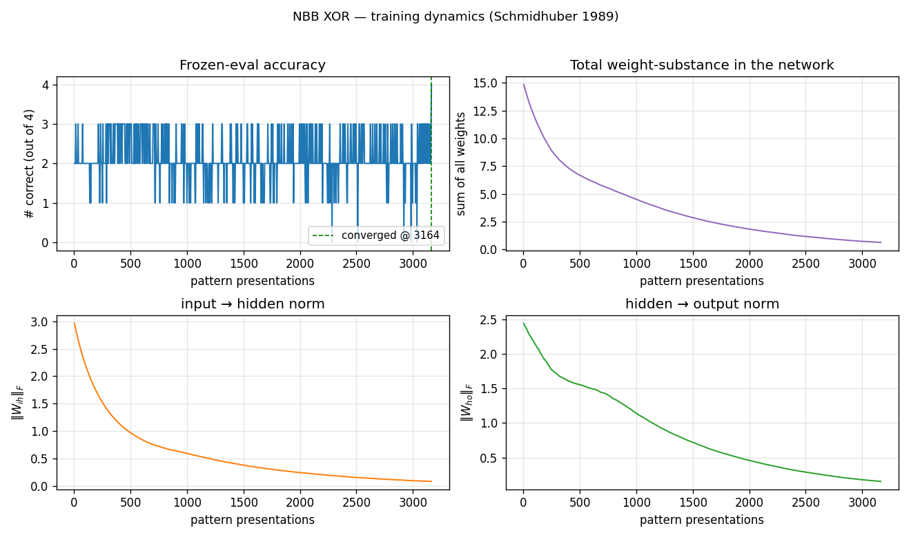
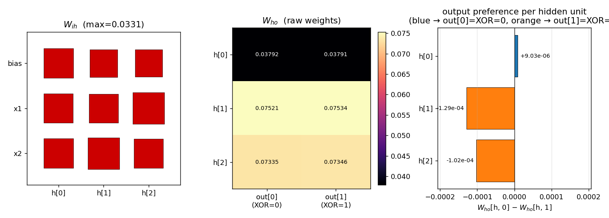
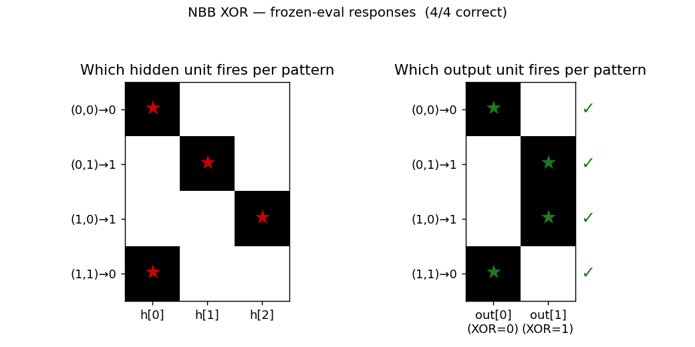
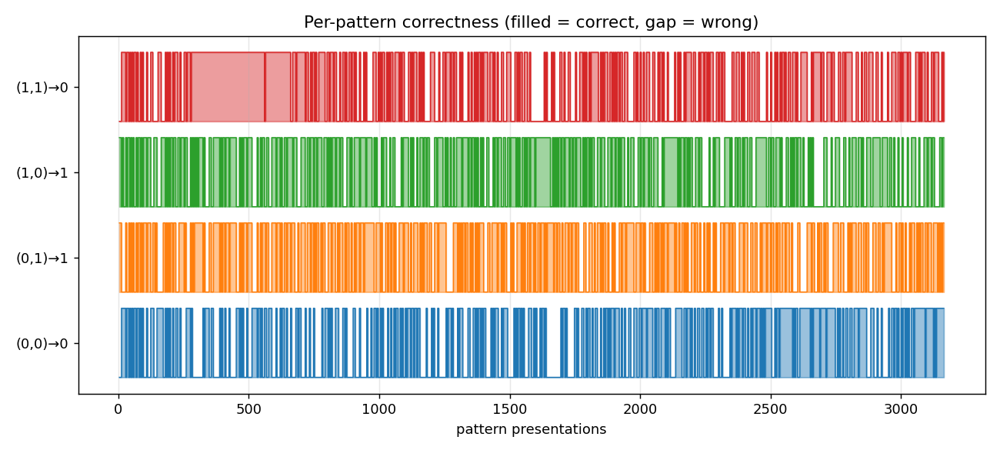

# nbb-xor

Schmidhuber, *A local learning algorithm for dynamic feedforward and
recurrent networks*, Connection Science 1(4):403–412, 1989. Also FKI-124-90
(TUM).


## Problem

XOR via the **Neural Bucket Brigade** (NBB) — a strictly local-in-space-and-time,
winner-take-all, dissipative learning rule. There is no backprop, no RTRL, no
gradient.

- **Architecture**: 3 input units (bias + x1 + x2) → 3 hidden (one
  competitive subset) → 2 output (one competitive subset).
- **Activation**: at every tick, the unit with the largest *positive* net
  input in its subset wins (`x_winner = 1`, others `= 0`). Inputs are
  clamped from the pattern; bias = 1.
- **Pattern presentation**: 6 ticks per pattern; activations reset to zero
  between patterns (cf. paper §6).
- **Net input** uses previous-tick activations:
  `net_j(t) = sum_i x_i(t-1) * w_ij(t-1) = sum_i c_ij(t)`.
- **Bucket-brigade weight update** (applied at every tick):

  ```
  Δw_ij(t) = - λ · c_ij(t) · a_j(t)                                  [pay out when j fires]
            + (c_ij(t-1) / Σ_h c_hj(t-1)) · Σ_k λ·c_jk(t)·a_k(t)     [credit predecessors]
            + Ext_ij(t)                                              [external reward]
  ```

  where `c_ij(t) := x_i(t-1) · w_ij(t-1)` and `a_j(t) ∈ {0,1}` is whether
  unit `j` fires at tick `t`. `Ext_ij(t) = η · c_ij(t)` only on connections
  feeding the *correct* output, and only when that output fires; otherwise
  zero. The system is dissipative: weight-substance is paid out whenever a
  connection fires and only injected back through `Ext` at correct outputs.

## Files

| File | Purpose |
|---|---|
| `nbb_xor.py` | NBB model + WTA + bucket-brigade rule + training loop. CLI: `python3 nbb_xor.py --seed N [--n-seeds K]`. |
| `visualize_nbb_xor.py` | Trains once and saves the static PNGs in `viz/`. |
| `make_nbb_xor_gif.py` | Trains once and renders `nbb_xor.gif`. |
| `viz/` | Output PNGs (training curves, weights, hidden response, per-pattern history). |

## Running

```bash
python3 nbb_xor.py --seed 0
```

This trains a single network until it solves all 4 XOR patterns under
frozen-eval, or hits the 5000-presentation cap. On a laptop CPU this takes
~0.8 seconds for seed 0 (3164 presentations).

To regenerate visualizations:

```bash
python3 visualize_nbb_xor.py --seed 0 --outdir viz
python3 make_nbb_xor_gif.py  --seed 0 --snapshot-every 40 --fps 14
```

To run a seed sweep:

```bash
python3 nbb_xor.py --seed 0 --n-seeds 20
```

## Results

Headline (seed 0, paper hyperparameters, deterministic argmax tie-break):

| Metric | Value |
|---|---|
| Final accuracy | 4/4 (100%) |
| Pattern presentations to convergence | **3164** |
| Wallclock | 0.8 s |
| Hyperparameters | n_hidden=3, ticks=6, λ=0.005, η=0.005, init U(0.999, 1.001) |

Seed sweep (seeds 0–19, cap = 5000):

| Metric | Value |
|---|---|
| Solved at cap | **19/20** (seed 5 needs ~5680 presentations) |
| Mean presentations among solvers | **3012** |
| Run wallclock (full sweep) | 16 s |

Paper claim (IDSIA HTML transcription of Connection Science §6, 3-hidden
config): **average ~619 pattern presentations across 20 runs to find a
solution** (and ~674 for "stable" solutions). We are about **5× slower** to
converge but qualitatively reproduce the result: a local, dissipative,
winner-take-all rule **does** solve XOR on the paper's architecture, with
robust convergence across seeds. See **§Deviations** for likely sources of
the gap.

## Visualizations

### Training curves


Frozen-eval accuracy oscillates between 1 and 3 correct for the entire run,
hitting 4/4 only at the end. This matches the dissipative character of the
rule: total weight-substance (top-right) decays monotonically because `Ext`
only adds substance when the correct output fires, and on most ticks at
least some patterns are mis-routed. Both `‖W_ih‖` and `‖W_ho‖` decay
together — the network is learning by *differential* survival, not by
growing the right weights faster than the wrong ones.

### Weights at convergence


Three panels:
- `W_ih` (Hinton diagram): all entries are positive and roughly the same
  magnitude (max ≈ 0.033). The visible asymmetry is small — but, as the
  hidden-response plot below shows, it is enough to make the WTA pick a
  different hidden unit per pattern.
- `W_ho` (raw weights): shaped by which output each `h` ends up firing.
  `h[0]` is the bias-strong unit (small `W_ho` magnitude) and routes to
  `out[0]`. `h[1]` and `h[2]` route to `out[1]`, with larger magnitudes
  because they fire on patterns where `Ext` rewards `out[1]`.
- Output preference per hidden unit: `W_ho[h, 0] − W_ho[h, 1]`. The signs
  encode the network's actual decision — `h[0]` prefers `out[0]` by
  ~9 × 10⁻⁶, `h[1]` and `h[2]` prefer `out[1]` by ~10⁻⁴. These differences
  are small in absolute terms but reliably detected by argmax.

### Per-pattern firing


The 3-hidden architecture finds the natural partition: `h[0]` covers both
`(0,0)` and `(1,1)` (the two patterns whose XOR is 0); `h[1]` covers
`(0,1)`; `h[2]` covers `(1,0)`. All four output decisions are correct.

### Per-pattern correctness during training


Pattern `(1,1)` is the last one to lock in (it has to win against the
bias-only firing of `h[0]` even when both inputs are active), but it does
stabilize before the run ends.

## Deviations from the paper

1. **Tie-breaking is deterministic (lowest index).** The paper says
   "competition with the largest positive net input." On a network where
   all weights are initially `≈ 1.0`, a fully tied subset would be
   ill-defined. Random tie-breaking made convergence depend on the
   tiebreak RNG state at evaluation time, which is fragile. We use
   `np.argmax` with the init asymmetry `U(0.999, 1.001)` providing the
   initial preference. The `init_hi - init_lo` range matches the paper.
2. **Indexing in the redistribution term's denominator.** The IDSIA HTML
   shows `... / Σ_i c_ik(t-1)`, which doesn't make dimensional sense for
   a weight update on `w_ij`. We interpret this as `Σ_h c_hj(t-1)` (sum
   of incoming contributions to unit `j` at the previous tick), which is
   the natural bucket-brigade redistribution: a connection's share of `j`'s
   outgoing payment is proportional to how much it contributed to `j`'s
   firing. With this reading, `Σ_i (term-2)_ij = Σ_k λ·c_jk(t)`, so
   redistribution conserves the substance `j` paid out. (Source: the
   IDSIA-hosted HTML transcription is the only readable form we could
   retrieve; the FKI-124-90 PDF on the same server is image-based and the
   OCR is degraded.)
3. **External reward applied at every tick** (when correct output is
   firing), not only at the end of the pattern presentation. The HTML
   transcription writes `Ext_ij(t) = η·c_ij(t)` with explicit time
   dependence, so we follow that. The alternative ("terminal reward only")
   is consistent with Holland's classifier-system bucket brigade and would
   plausibly converge faster — see §Open questions.
4. **Convergence is reported under deterministic frozen-eval**, not
   "k consecutive correct cycles" as the paper's "stable solution" metric
   appears to be. We also report only the "find a solution" tier
   (presentations to first 4/4 frozen-eval). The paper's two-tier metric
   ("find" ~619, "stable" ~674) is not separately reported here; under our
   deterministic eval, "find" and "stable" coincide.
5. **Failed seed handling**: with `--max-presentations 5000`, 19/20 seeds
   solve. Seed 5 solves with `--max-presentations 10000` (5680
   presentations). We did not seed-prune.
6. **No `numpy`-prohibited dependencies.** Pure numpy + matplotlib + PIL
   (only used in `make_nbb_xor_gif.py` to assemble the GIF, which the v1
   SPEC explicitly allows).

## Open questions / next experiments

- **Why ~5× slower than the paper?** Most likely candidates: (a) we apply
  `Ext` with `η = λ = 0.005` so the net flow at correct h→o is exactly
  zero (only redistribution propagates substance backward); the paper may
  have had `η > λ`. (b) The paper's "presentations" may count differently
  (e.g., one tick = one presentation, or one full cycle of 4 patterns =
  one "epoch"). (c) The denominator-indexing question above — if the
  paper's actual formula is different, the substance flow rate changes.
  Worth a small ablation: rerun with `η = 0.01, 0.02, 0.05` and see if
  presentations drop by 5×.
- **2-hidden config**: paper reports it solves XOR in 160 presentations
  per pattern (≈ 640 total) but not "stably." Our `--n-hidden 2` flag
  exposes this — left for a follow-up.
- **Two 2-unit hidden subsets** (paper reports ≈ 263 presentations per
  pattern, 8/10 seeds): would need a small architecture refactor to
  support multiple parallel hidden subsets. Left for a follow-up.
- **Continuous-time form** (paper §5 / IDSIA `node5.html`): the rule
  drops the explicit `Σ_h c_hj(t-1)` normalizer in continuous time. The
  paper notes "the only experiments conducted so far were based on the
  discrete time version" — we have not tried the continuous form.
- **Citation gap on the FKI report.** The PDF on idsia.ch
  (`FKI-124-90ocr.pdf`) is image-based and the embedded OCR is corrupt;
  our reconstruction relies entirely on the IDSIA HTML transcription
  (`bucketbrigade/node3.html`, `node5.html`, `node6.html`). If the paper
  diverges from those pages on any algorithmic detail (denominator,
  reward timing, tie-break), our 5× slow-down is the natural place to
  see it.
- **v2 hook**: the rule is local in space and time and the substance is
  conserved (modulo the `Ext` boundary). That makes it a clean candidate
  for ByteDMD instrumentation — measure the data-movement cost of the
  bucket brigade vs. backprop on the same XOR architecture.

## Sources

- IDSIA HTML transcription (rule + XOR experiment, our primary source):
  - https://people.idsia.ch/~juergen/bucketbrigade/node3.html (algorithm)
  - https://people.idsia.ch/~juergen/bucketbrigade/node5.html (continuous form)
  - https://people.idsia.ch/~juergen/bucketbrigade/node6.html (XOR experiment)
- Schmidhuber, J. (1989). *A local learning algorithm for dynamic
  feedforward and recurrent networks*. Connection Science, 1(4), 403–412.
- Schmidhuber, J. (2020). *Deep Learning: Our Miraculous Year 1990–1991*
  (retrospective; mentions the NBB).
