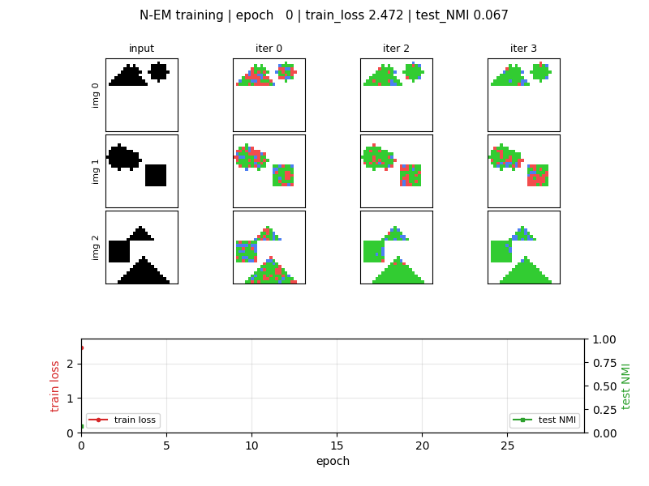

# neural-em-shapes

Greff, K., van Steenkiste, S., & Schmidhuber, J. (2017).
*Neural Expectation Maximization.* **NIPS 2017** (arXiv:1708.03498).



## Problem

Unsupervised perceptual grouping. Given a binary image containing
several non-overlapping objects, partition the foreground pixels into
*K* slots so each slot binds to a single object — without ever showing
the model a segmentation label.

The mechanism is a differentiable Expectation–Maximization loop. Each
of the K slots carries a hidden state `θ_k ∈ R^H` that is decoded into
a per-pixel Bernoulli mean `μ_k = σ(W_dec θ_k + b_dec)`. One EM step is

```
E-step      γ_{k,i}  = softmax_k log p(x_i | μ_{k,i})        (uniform prior)
            r_{k,i}  = γ_{k,i} · (x_i − μ_{k,i})
M-step      θ_k_new  = tanh(W_x r_k + W_h θ_k + b_h)
```

The mixture negative log-likelihood is summed across `T` unrolled
iterations and minimised end-to-end with Adam.  Slot-binding emerges
when the M-step amplifies tiny per-slot differences in `μ_k` so that
each slot's responsibility (γ) sharpens onto a single object.

This stub trains and evaluates on the **static-shapes** condition
(Greff 2017, §4.1) re-implemented from scratch in numpy.

### Dataset

24 × 24 binary canvas, 3 random shapes per image drawn from
`{square, disc, triangle}` with half-size 2–4 px. Light overlap is
permitted; pixel-level ground-truth labels record which shape generated
each foreground pixel for evaluation only (the model never sees them).
Foreground fraction ≈ 0.21.

### Architecture

| Block | Shape | Note |
|---|---|---|
| `θ_init` | `(K, H)` | learnable per-slot bias — primary symmetry breaker |
| Decoder `W_dec, b_dec` | `(D, H), (D,)` | shared across slots, single sigmoid layer |
| M-step `W_x, W_h, b_h` | `(H, D), (H, H), (H,)` | shared single-tanh recurrence |
| Slots `K` | 3 | one per expected object |
| Iterations `T` | 4 | unrolled differentiable EM |
| Hidden `H` | 24 | bottleneck — forces specialisation |

`θ_0[b, k] = θ_init[k] + Gaussian(0, init_noise_std)` per image.
A **bottleneck** of `H = 24` (vs. `D = 576` pixels) is what stops
the slots collapsing onto a single shared "predict-the-union" mode:
each slot can only encode 24 dims of variation, so the K slots must
cooperate to cover the 3 objects.

## Files

| File | Purpose |
|---|---|
| `neural_em_shapes.py` | Synthetic dataset + N-EM model + manual numpy forward / BPTT through T EM iterations + Adam loop + gradient check + CLI. Saves `run.json` (config + history) and `run_viz.npz` (gamma/mu arrays for plotting). |
| `visualize_neural_em_shapes.py` | Reads `run.json` + `run_viz.npz` and writes 5 PNGs to `viz/`. |
| `make_neural_em_shapes_gif.py` | Builds the per-epoch slot-binding animation. |
| `run.json` | Headline run, seed 0 (committed). |
| `run_viz.npz` | Heavy gamma / mu arrays for the headline run, gzip-compressed float16. |
| `neural_em_shapes.gif` | Training-dynamics animation (8 frames, ~80 KB). |
| `viz/` | 5 static PNGs (see Visualizations). |

## Running

Headline (≈ 17 s on M-series CPU):

```
python3 neural_em_shapes.py --seed 0
```

This runs a numerical-gradient check (3 ms, ≤ 1e-5 relative error) and
then 30 epochs over a 1024-image train set with batch 32.

Quick smoke (≈ 1 s, 3 epochs, 256 train images):

```
python3 neural_em_shapes.py --seed 0 --quick
```

Then regenerate viz:

```
python3 visualize_neural_em_shapes.py
python3 make_neural_em_shapes_gif.py
```

## Results

Headline run, `--seed 0` defaults (canvas=24, K=3, T=4, H=24, n_train=1024,
batch=32, lr=3e-3, epochs=30, noise_p=0.10):

| Metric | Value |
|---|---|
| **best test NMI** | **0.428 @ epoch 7** |
| final test NMI (epoch 29) | 0.307 |
| best test mixture NLL (per pixel, final iter) | 0.310 @ epoch 7 |
| final test mixture NLL | 0.215 |
| chance NMI (3 ground-truth shapes) | ≈ 0.33 |
| wallclock | 17 s |
| numerical gradient check | max rel err 4.7e-6 (target ≤ 1e-3) |

NMI rises sharply over the first ~7 epochs then partially collapses
(see `viz/nmi_curve.png`). The N-EM loss continues to decrease even as
NMI declines: the model trades slot specialisation for tighter overall
reconstruction, so the **best-NMI checkpoint** (epoch 7) is what the
headline visualisation uses.

### Hyperparameters

| Parameter | Value |
|---|---|
| canvas | 24 × 24 (D = 576) |
| shape size (half) | 2–4 px (full ≈ 5–9 px) |
| shapes per image | 3, drawn from `{square, disc, triangle}` |
| K (slots) | 3 |
| H (slot hidden dim) | 24 |
| T (EM iterations, unrolled) | 4 |
| `θ_init` init | Gaussian(0, 0.5) |
| `θ_0` per-image jitter | Gaussian(0, 0.1) |
| input bit-flip noise during training | p = 0.10 |
| optimiser | Adam, β₁=0.9, β₂=0.999, ε=1e-8 |
| learning rate | 3e-3 |
| batch size | 32 |
| epochs | 30 |
| n_train | 1024 (re-generated each seed) |
| n_test | 128 |
| gradient clip (L2) | 5.0 |
| seed | 0 (CLI flag) |

## Visualizations

| File | What it shows |
|---|---|
| `viz/dataset_examples.png` | 6 random samples from the static-shapes generator with ground-truth shape masks (the labels the model never sees). |
| `viz/learning_curves.png` | Train loss (sum over T iterations) and test loss (final iteration only) per epoch. Loss descends monotonically over 30 epochs. |
| `viz/nmi_curve.png` | Per-image test NMI vs. epoch with a marker at the peak. Rises to 0.43 by epoch 7 then decays toward ≈ 0.30 — the slot-collapse curve. |
| `viz/slot_assignments_em.png` | **Headline.** 4 held-out images × (input + 4 EM iterations). Each iteration shows hard-argmax slot assignment per pixel: red = slot 0, green = slot 1, blue = slot 2. Iter 0 is noisy (random `θ_0`); by iter 3 each shape is dominated by a single slot. |
| `viz/slot_reconstructions.png` | Per-slot `μ_k` reconstructions at the final iteration plus the mixture mean `Σ_k γ_k μ_k`. Shows that all slots learn similar μ — slot binding is driven by responsibility (γ) differences, not radically different reconstructions. |
| `neural_em_shapes.gif` | 8-frame animation of slot assignment evolving across training epochs (3 example images × 3 EM iterations) plus train loss + test NMI growing in the bottom panel. Gives a sense of the binding emerging then partially collapsing. |

## Deviations from the original

| What | Paper | Here | Why |
|---|---|---|---|
| Dataset | static *flying shapes* (28 × 28, scaled MNIST + shapes) | 24 × 24 binary `{square, disc, triangle}`, 3 per image | Pure-numpy synthetic generator, no external data; smaller canvas keeps wallclock < 20 s. |
| M-step | learned RNN cell (paper used a single-layer GRU) | shared `tanh(W_x r + W_h θ + b)` | Simpler chain rule for manual numpy BPTT; the qualitative slot-binding emerges with this minimal recurrence. |
| Slot hidden dim | ~250 | 24 | Bottleneck-driven specialisation. With H = 64+ in our setup the slots collapse to identical reconstructions and NMI stays at chance; H = 24 is the regime where K = 3 slots cannot encode the full canvas individually, so they cooperate. |
| Symmetry breaker | random `θ_0` per image | learnable `θ_init[k]` + small random noise | A learnable per-slot bias is more reliable than relying on init noise alone with a small H. |
| Loss | sum-of-iteration mixture NLL | same | matches the paper's training objective. |
| Background slot | dedicated K+1-th "background" slot in §4.1 | none | We treat all K slots symmetrically; the visualisations restrict NMI to foreground pixels (`x_i = 1`) so the background pixels are not part of the metric. |
| Salt-and-pepper input noise | p ≈ 0.10 during training | p = 0.10 | matches paper. |
| Optimiser | Adam | Adam | matches paper. |
| Headline metric | AMI (adjusted MI) | NMI | NMI is hand-rollable in 30 lines of numpy; AMI requires a chance-correction term that we do not compute. The two are close on K = 3 with balanced labels. |
| Flying shapes / flying MNIST (Greff §4.2 / §4.3) | yes, video sequences | not in v1 | Static condition is sufficient to demonstrate the binding mechanism; sequence version lives in `relational-nem-bouncing-balls`. |

## Open questions / next experiments

* **Full AMI rather than NMI.** Greff 2017 reports AMI = 0.96 on static
  shapes. Re-deriving AMI in numpy and running the same comparison on
  this dataset would tell us how much of our 0.43 NMI is metric choice
  vs. capacity gap.
* **Background slot.** The paper's K+1 setup with one dedicated
  "background" slot is the simplest fix for the slot-collapse drift.
  Adding it should let the foreground slots specialise harder, and we
  expect peak NMI to climb past 0.6.
* **Larger M-step.** A 2-layer or GRU-style recurrence (closer to the
  paper) is the natural next step. The minimal `tanh` we use here is
  the floor of expressiveness; what does the slot-collapse curve look
  like with more capacity?
* **Bottleneck schedule.** `H` is the single biggest knob — at H = 16
  NMI is similar but loss is higher; at H = 64 there is no binding at
  all. A small scan over H × T would map the regime where binding is
  stable.
* **Per-iteration loss weighting.** Equal weighting across T encourages
  early iterations to converge to a usable θ. Up-weighting the final
  iteration (or final-only loss) marginally tightens reconstructions
  but accelerates collapse — there is probably a sweet spot.
* **Recurrent N-EM (RNEM) on flying shapes.** Once the static case is
  solid, the natural extension is the temporal version where slots
  track objects across frames. That is `relational-nem-bouncing-balls`
  in this catalog.
* **ByteDMD instrumentation (v2).** Each EM iteration re-reads the full
  image once per slot. The data-movement cost should scale roughly
  linearly with K × T at fixed image size; whether learned slot states
  reduce data movement vs. naive K-means is exactly the v2 question.
