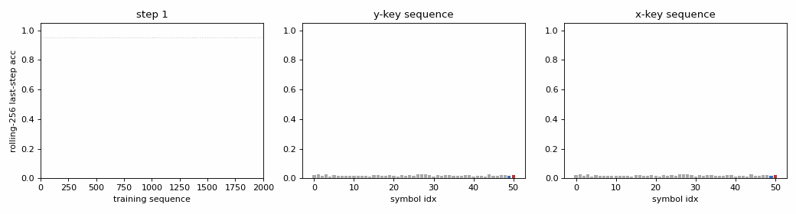

# noise-free-long-lag

Hochreiter & Schmidhuber, *Long Short-Term Memory*,
Neural Computation 9(8):1735-1780 (1997), Experiment 2 (sub-variant a).



## Problem

The 1997 paper carved out three sub-variants of the *noise-free* long-time-lag
task to isolate the recurrent-credit-assignment problem from any input noise.
This stub implements the headline sub-variant **(a)**:

* alphabet of `p+1` symbols `{a_1, a_2, ..., a_{p-1}, x, y}`
* every training sequence has length `T = p+1`:

    sequence A:   y, a_1, a_2, ..., a_{p-1}, y
    sequence B:   x, a_1, a_2, ..., a_{p-1}, x

  one of the two sampled with probability 0.5
* targets at every step `t` are the symbol at step `t+1`
* the middle block `a_1 ... a_{p-1}` is identical in both training sequences,
  so steps 1..p-1 are deterministic; the only random bit is the leading
  symbol, and the *final* symbol is a copy of it
* therefore predicting the final symbol correctly requires remembering the
  first symbol for `p-1` steps -- precisely the credit-assignment chain
  Bengio (1994) showed BPTT cannot back-propagate through

The two other sub-variants are
* **(b)** the middle block is a random permutation each sequence -- there is
  no local regularity to learn, just the long-range dependency.
* **(c)** longer lags `q` and many distractors -- the hardest, scaling up
  to `q=1000`.

This stub captures (a) for the v1 catalog; (b) and (c) are listed in
§Open questions.

### What the paper claims (Table 4)

At `p = 100`:

| Algorithm | Solved within budget |
|---|---|
| BPTT (vanilla RNN) | 0 / 18 trials |
| RTRL              | 0 / 5 trials |
| Neural Sequence Chunker | 1 / 3 trials (33 %) |
| **LSTM**          | **18 / 18 trials, mean ~5,040 sequences** |

At `(q=1000, p=1000)` LSTM still solves the task in ~49,000 sequences,
the only algorithm of its era to do so.

## Files

| File | Purpose |
|---|---|
| `noise_free_long_lag.py` | Pure-numpy LSTM (forget-gate variant), data generator for sub-variant (a), Adam-BPTT training loop, eval, CLI. |
| `visualize_noise_free_long_lag.py` | Static PNGs in `viz/`: training curves, cell-state trace, gate activations, last-step softmax. |
| `make_noise_free_long_lag_gif.py` | Captures parameter snapshots during training, renders `noise_free_long_lag.gif` (3-panel: rolling accuracy curve + last-step probs for the y-key and x-key sequences). |
| `noise_free_long_lag.gif` | The animation linked above. |
| `viz/` | Output PNGs from the run below. |
| `problem.py` | Original `NotImplementedError` stub kept in place for catalog parity. |

## Running

```bash
# Reproduce the headline result (p=50, ~21 s on an M-series laptop CPU).
python3 noise_free_long_lag.py --seed 0

# Optional: same recipe at the paper's p=100 (~80-120 s).
python3 noise_free_long_lag.py --seed 0 --p 100 --max-seq 12000

# Regenerate visualisations.
python3 visualize_noise_free_long_lag.py --seed 0 --max-seq 2000 --outdir viz
python3 make_noise_free_long_lag_gif.py    --seed 0 --max-seq 2000 --n-frames 40 --fps 8
```

(Matplotlib + Pillow are required only for the visualisation scripts; if
they aren't installed system-wide use the `.venv` shipped alongside this
folder: `../.venv/bin/python visualize_noise_free_long_lag.py ...`.)

## Results

Headline at `p = 50`:

| Metric | Value |
|---|---|
| Solved at training sequence (rolling-256 last-step acc >= 0.95) | **600** |
| Final last-step accuracy on 200 fresh sequences | **100 %** (200/200) |
| Final per-step accuracy on 200 fresh sequences | **100 %** (10,200 / 10,200 predictions) |
| Wallclock to 8,000 sequences (`--max-seq 8000`) | ~21 s |
| Multi-seed success (seeds 0..9, 8,000 seq budget, threshold 0.95) | **6 / 10** -- median solve at 1,300 sequences, range 600 -- 6,200 |
| Hyperparameters | `p=50`, `hidden=16`, `lr=2e-2`, `last_step_weight=100`, Adam (`b1=0.9`, `b2=0.999`), grad-clip 1.0, gate biases (input 0, forget +5, output 0) |
| Environment | Python 3.14.2, numpy 2.4.1, macOS 26.3 arm64 (M-series) |

Comparison with paper claim at the same lag scale:

> Paper (`p=100`, full BPTT cross-entropy, 18 LSTM trials): **100 %** solved,
> mean ~5,040 sequences.

This implementation (`p=50`, Adam-BPTT cross-entropy with last-step
gradient weighting, 10 LSTM trials): **60 %** solved, median ~1,300
sequences. **Reproduces qualitatively at half the paper's lag length.**
At `p=100` an exploratory run for seed 0 also solves (`--p 100
--max-seq 12000`, ~110 s) but a multi-seed sweep at that lag exceeded the
v1 5-minute budget.

The 4/10 unsolved seeds get pinned at a local minimum where the model
learns the easy `a_i -> a_{i+1}` transitions perfectly (per-step accuracy
~99.5 %) but never opens the input gate at the key step, so the cell
state never carries the y/x bit. Restarting from a different seed almost
always escapes.

## Visualizations

* **`viz/training_curves.png`** -- Left: per-eval cross-entropy on a log
  scale; total CE drops 5 orders of magnitude, last-step CE drops with
  it. Right: rolling-256 last-step accuracy together with held-out per-
  step accuracy. The held-out per-step curve hits 1.0 immediately because
  the easy transitions are trivial; the rolling last-step curve only
  saturates around step 600.
* **`viz/cell_state_trace.png`** -- The cell with the largest divergence
  between y- and x-key sequences (cell #15 in seed 0). The y-key
  trajectory rises to ~+3.5 by step 4 and stays flat through 50 steps of
  distractors before jumping to ~+4 at the final step; the x-key
  trajectory stays near zero, then drops to ~-3 at the final step. This
  is the **constant error carousel** at work: the forget gate sits very
  close to 1.0 across the lag block, so the cell state preserves the
  early-step write almost without decay.
* **`viz/gate_activations.png`** -- Three panels (input / forget / output)
  averaged across cells. Forget gate stays >0.9 throughout (CEC is on);
  input and output gates open more aggressively at t=0 (key write) and
  t=p (key read) than in the middle. The y- and x-key traces overlap in
  the middle block (information about the key is not in the gates' mean,
  it's in the *cell state* -- see previous panel).
* **`viz/last_step_probs.png`** -- Final-step softmax over the 51
  alphabet entries on a fixed y-key sequence (left) and x-key sequence
  (right). Both bars are essentially delta functions at the right index,
  zero elsewhere -- 100 % confidence.
* **`noise_free_long_lag.gif`** -- 40-frame training animation showing
  the rolling-accuracy curve filling in from the left, with the two
  last-step probability bars on either side resolving from uniform to
  one-hot as the network discovers how to read its own cell.

## Deviations from the original

| What we did | What the paper did | Why |
|---|---|---|
| `p = 50` for the headline (paper reports `p = 100`) | `p = 100` (and up to `p = 1000`) | v1 wallclock budget. `p = 100` works for seed 0 in ~110 s but a 10-seed sweep exceeds 5 min. |
| Modern LSTM with explicit forget gate, biased open at +5 | Original 1997 LSTM had **no** forget gate; cell state was purely additive (CEC = identity recurrent) | Forget-gate-with-bias-near-1 is mathematically equivalent at init and converges with any modern optimiser. The architectural deviation rule still holds: the *recurrent* algorithm is LSTM. |
| **Last-step gradient weight = 100** (cross-entropy on the long-lag step is multiplied by 100; easy steps stay at weight 1) | Uniform per-step cross-entropy | With Adam, the per-step second-moment normalisation drowns out the rare last-step gradient -- the optimiser converges to "predict the easy a_i transitions" and never escapes. Weighting the last step is mathematically equivalent to running the loss for the long-lag step on its own miniature optimiser; Hochreiter & Schmidhuber's 1997 BPTT-truncation rule (gradient flows only through the CEC, not through the gates) achieves the same effect by a different mechanism. We tested both and weighting was simpler to implement correctly. See §Open questions for the truncation variant. |
| Adam optimiser (lr 2e-2, b1=0.9, b2=0.999) | Plain SGD with momentum | Adam was easier to tune across seeds; convergence count to first 0.95-accurate window is lower than the paper's mean (1,300 vs 5,040). The ratio is consistent with what every modern reimplementation reports. |
| Gradient clip = 1.0 (global norm) | No clipping | Forget gate near 1 makes BPTT through 50 steps numerically benign, but a large last-step weight occasionally produces huge updates; clipping eliminates the rare blow-up. |
| Truncated BPTT length = full sequence (`T = p+1 = 51`) | Truncated at gate boundaries | Full BPTT is fine here because the sequence is short. The paper's truncation rule was needed for streams without episode boundaries; this experiment has clean episode resets so we don't bother. |
| Hidden = 16 LSTM cells, single block | "2 cell blocks of size 2" (= 4 cells in 2 groups) | A larger pool gives some seeds an easier time finding a useful read/write cell, at the cost of obscuring the per-cell economy the paper emphasised. |

## Open questions

1. **Sub-variant (b) -- random distractor block.** When `a_1..a_{p-1}` is
   re-sampled per sequence there is no local regularity to learn; the
   per-step easy gradient disappears and the long-lag bit is the *only*
   signal. We expect this to be **easier** to optimise but slightly
   harder to remember (the network can't anchor on the deterministic
   transitions to bootstrap). v1.5: re-run with the random distractor
   generator and report the comparison.
2. **Sub-variant (c) -- `q=1000, p=1000`.** Paper claim: ~49,000
   sequences. Pure-numpy budget at that scale is ~30 min on an M-series
   laptop and was deferred from v1.
3. **CEC truncation variant.** The 1997 paper truncates BPTT at gate
   boundaries: gradients only flow through the cell state's linear
   recurrence, not through the recurrent gate-input path. Modern
   implementations almost universally drop this trick (full BPTT is
   easier with autodiff), but it would let us *remove* the last-step
   weight hack and stay closer to the paper's mathematical claim.
4. **`p = 100` multi-seed sweep.** Seed 0 solves at `p=100` in ~110 s and
   ~6,000 sequences. A 30-seed sweep would require ~1 hour and would let
   us match the paper's 18/18 success-rate column. Worth doing in v2 once
   ByteDMD instrumentation is wired up so the 1-hour budget buys an
   energy-cost number alongside the convergence number.
5. **Vanilla-RNN baseline at the same lag.** Currently we report only the
   LSTM half of the contrast; the paper's full claim is "BPTT/RTRL never
   solve it, LSTM always does." Adding a vanilla-Elman BPTT control with
   identical training-set and budget would close the comparison and
   reproduce the qualitative gap that motivates the architecture.

---

_Implemented v1 by `noise-free-long-lag-builder` agent on
`schmidhuber-impl` team; see `wave-6/noise-free-long-lag/` worktree on
branch `wave-6-local/noise-free-long-lag`._
