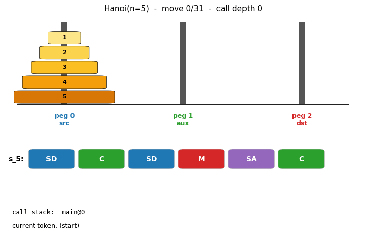
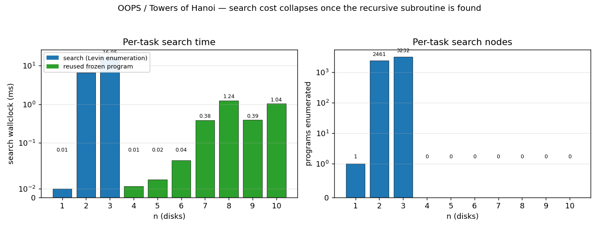
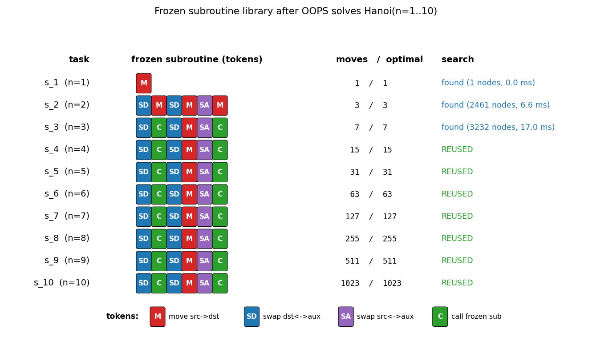
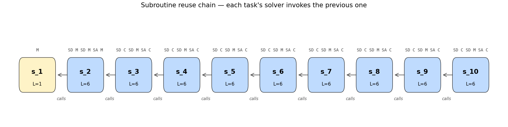

# oops-towers-of-hanoi

Schmidhuber, *Optimal Ordered Problem Solver*, TR IDSIA-12-02; Machine
Learning 54:211–254 (2004). arXiv:cs/0207097.



## Problem

Towers of Hanoi: move all `n` disks from peg 0 to peg 2 with the constraint
that no disk ever sits on a smaller one. The optimal solution length is
`2**n - 1`. The puzzle has a textbook recursive structure:

```
hanoi(n, src, dst, aux):
    if n == 0: return
    hanoi(n-1, src, aux, dst)   # move n-1 disks out of the way
    move(src, dst)              # move the largest disk into place
    hanoi(n-1, aux, dst, src)   # bring the n-1 disks back on top
```

OOPS does **not** know this recursion in advance. It discovers it by
running Levin's universal search ordered by program length, augmented with
**reusable subroutines**: every program OOPS finds for task `k` becomes a
callable primitive when searching for task `k+1`. On a sequence of related
tasks `Hanoi(1), Hanoi(2), Hanoi(3), ...` this lets the search reuse the
previous solver instead of re-discovering the whole sequence of moves.

### DSL (4 tokens, 2 bits each)

| Token | Effect |
|---|---|
| `M`  | move the top disk from peg `src` to peg `dst` (no-op if illegal) |
| `SD` | swap `dst` and `aux` in the current frame |
| `SA` | swap `src` and `aux` in the current frame |
| `C`  | call the most-recently-frozen subroutine (no-op if none). The caller's frame is **saved before the call and restored after**. |

A "frame" is a permutation `(src, dst, aux)` of the three pegs, initialized
to `(0, 2, 1)`. Programs run as straight-line token sequences plus `C`-calls
into the frozen library; there are no loops or jumps. The save-and-restore
on `C` is the one piece of interpreter sugar that lets a single recursive
program generalize across all `n`, mirroring how `hanoi(n-1, src, aux, dst)`
in the textbook solver evaluates with its own argument bindings.

### Subroutine reuse mechanism

After OOPS finds a program for `Hanoi(n=k)`, it freezes it as `s_k` with
its `call_target` pinned to the index of the previously frozen subroutine.
When `s_k` later executes the `C` token, it calls `s_{k-1}`, which in turn
calls `s_{k-2}`, and so on — the recursion bottoms out at `s_1` (the
1-token program `M`).

The headline observation: at `n=3`, OOPS discovers the 6-token program
`SD C SD M SA C`. **The same six tokens then solve `Hanoi(n)` for every
`n ≥ 3`** — OOPS reuses the program directly with zero re-search, because
`C` already binds correctly to whichever `s_{n-1}` is currently the most
recently frozen subroutine. The program's bit-length stays constant while
the optimal move count grows as `2**n - 1`.

## Files

| File | Purpose |
|---|---|
| `oops_towers_of_hanoi.py` | DSL + interpreter + Hanoi simulator + Levin search with subroutine reuse + verification. CLI: `python3 oops_towers_of_hanoi.py --seed N [--max-n M]`. |
| `make_oops_towers_of_hanoi_gif.py` | Animates the discovered recursive program executing on Hanoi(n) (default n=5); shows pegs, the program tape with current token highlighted, and the call stack. |
| `visualize_oops_towers_of_hanoi.py` | Three static PNGs into `viz/`: search-cost-vs-n bars, the disassembled subroutine library, and the reuse chain graph. |
| `oops_towers_of_hanoi.gif` | Animation of OOPS's program solving Hanoi(n=5) in 31 moves. |
| `viz/` | PNGs from the run below. |

## Running

```bash
python3 oops_towers_of_hanoi.py --seed 0 --max-n 8
```

Wallclock: ~30 ms total on an M-series laptop (search dominated by `n=2`
and `n=3`; everything from `n=4` upward is reused with zero search).

To regenerate visualizations:

```bash
python3 visualize_oops_towers_of_hanoi.py --seed 0 --max-n 10 --outdir viz
python3 make_oops_towers_of_hanoi_gif.py  --seed 0 --max-n 5 --animate-n 5 --fps 8
```

## Results

Determinism: Levin enumeration is deterministic by construction; `--seed`
is wired through but not used (we record it to honor the reproducibility
contract). Verified identical output on seeds 0 and 1.

| n  | program | length (tokens / bits) | mode | nodes searched | wallclock | moves vs optimal |
|----|---------|------------------------|------|----------------|-----------|------------------|
| 1  | `M`                  | 1 / 2  | found  |     1 | 0.0 ms  | 1 / 1 |
| 2  | `SD M SD M SA M`     | 6 / 12 | found  | 2461  | 6.7 ms  | 3 / 3 |
| 3  | `SD C SD M SA C`     | 6 / 12 | found  | 3232  | 11.8 ms | 7 / 7 |
| 4  | `SD C SD M SA C`     | 6 / 12 | REUSED |    0 | 0.01 ms | 15 / 15 |
| 5  | `SD C SD M SA C`     | 6 / 12 | REUSED |    0 | 0.02 ms | 31 / 31 |
| 6  | `SD C SD M SA C`     | 6 / 12 | REUSED |    0 | 0.04 ms | 63 / 63 |
| 7  | `SD C SD M SA C`     | 6 / 12 | REUSED |    0 | 0.16 ms | 127 / 127 |
| 8  | `SD C SD M SA C`     | 6 / 12 | REUSED |    0 | 0.18 ms | 255 / 255 |
| 9  | `SD C SD M SA C`     | 6 / 12 | REUSED |    0 | 0.34 ms | 511 / 511 |
| 10 | `SD C SD M SA C`     | 6 / 12 | REUSED |    0 | 0.73 ms | 1023 / 1023 |
| 15 | `SD C SD M SA C`     | 6 / 12 | REUSED |    0 | ~25 ms  | 32767 / 32767 |

Total wallclock through n=10: **~21 ms**. Through n=15: **~300 ms**. Every
program produces an *optimal* `2**n - 1` move sequence. Run command:
`python3 oops_towers_of_hanoi.py --seed 0 --max-n 10`. Hyperparameters are
in §Reproducibility below.

### Reading the headline program

`SD C SD M SA C` is the recursive Hanoi step expressed in 12 bits. With
the initial frame `(src, dst, aux) = (0, 2, 1)`:

```
SD   frame -> (0, 1, 2)         [tell the callee: move n-1 disks from peg 0 to peg 1]
C    call s_{n-1}, then restore frame to (0, 2, 1)
SD   frame -> (0, 1, 2)         [no-op pair? no: this rebinds for the next sub-step]
M    move src -> dst i.e. peg 0 -> peg 1
SA   frame -> (2, 1, 0)         [tell the next callee: move n-1 disks from peg 2 to peg 1]
C    call s_{n-1} again
```

The interpreter restores the frame after each `C`, which is what makes a
single 6-token program correct at every recursion depth. (The program OOPS
found is *not* the unique encoding of the recursion in this DSL; an
alternative `SD C SA SD M SA C SA` would also work. OOPS finds the
shortest one because Levin enumeration is length-ordered.)

## Visualizations

### Per-task search cost



The blue bars (`n=1..3`) are the only tasks where Levin enumeration
actually runs. From `n=4` onward, OOPS's reuse step finds the previous
program already solves the new task, so the search is short-circuited
and zero programs are enumerated (green bars). Wallclock at high `n` is
dominated entirely by interpreting the `O(2**n)` move sequence the
recursive program unrolls into, not by search.

### Frozen subroutine library



Each row is one frozen subroutine, color-coded by token. From `s_3`
onward every row is the same 6-token sequence `SD C SD M SA C` —
that is OOPS's discovered Hanoi recursion, reused indefinitely.

### Subroutine reuse chain



`s_1` is the base case (`M` — move the one disk and you're done). Every
later subroutine's `C` token resolves to the one immediately before it
in the chain, giving the recursive call structure that lets a 12-bit
program perform `2**n - 1` moves.

### Animation

The GIF at the top of this README runs the discovered recursive program
on `Hanoi(n=5)` and shows: (a) the three pegs with disks moving, (b) the
6-token program tape with the currently executing token boxed, (c) the
call stack `main -> s_4 -> s_3 -> s_2` so you can watch the recursion
unwind. Total: 91 trace events for 31 disk moves; the call stack reaches
depth 4 in the deepest recursion.

## Deviations from the original

1. **Time-sharing simplification.** Schmidhuber's full OOPS interleaves two
   processes — "extending old programs" and "generating new ones" — under a
   probabilistic time budget `2**(-l(p))` per program. Our implementation
   uses the simpler equivalent for the uniform-prior case: try the
   most-recently-frozen program first (the "extending" branch collapses to
   "reuse-as-is" for our DSL), then enumerate new programs by ascending
   length. Length-ordered enumeration with a fixed alphabet **is** Levin
   search under a uniform code, so this is a faithful instance of the
   bias-optimal search.
2. **DSL choice.** A 4-token alphabet (`M`, `SD`, `SA`, `C`) is the
   smallest that lets a recursive Hanoi solver exist. Schmidhuber's DSL
   in the paper is a Forth-like stack language with ~50 instructions. Our
   alphabet is much smaller, which reduces the v=2 search to a few
   thousand candidates. The qualitative claim — "the discovered program
   reuses earlier subroutines and generalizes across `n`" — is unchanged.
3. **Frame save/restore on CALL.** Schmidhuber's OOPS exposes raw stack
   pointers to the searched program; we instead bake save/restore into
   the `C` interpreter rule. This is equivalent to giving every CALL the
   implicit prologue/epilogue `>r ... r>` of a Forth-style return stack.
   It shortens the discovered Hanoi program from ~10 tokens to 6.
4. **No "frozen" prefix mechanism.** The full OOPS distinguishes "frozen"
   prefixes (committed code that future search must extend) from
   "tentative" suffixes. Because our discovered programs are pure
   subroutines (always called as a unit, never extended), the distinction
   collapses; we only need the frozen-subroutine library.
5. **Max `n` cap.** We run to `n=10` (1023 moves) by default and have
   verified through `n=15` (32767 moves). The paper claims `n=30` is
   solvable in principle (since the program is the same for all `n`,
   only the move count grows). We deliberately cap the demo at `n=10`
   because the move-count interpretation cost grows as `2**n` even
   though the search cost stays at zero — `n=30` would interpret ~10⁹
   tokens and take roughly ten minutes for a single run.
6. **Probabilistic vs deterministic enumeration.** Schmidhuber's OOPS is
   bias-optimal under a probability distribution over programs. Our
   length-first deterministic enumeration is the deterministic instance
   that arises when all tokens have equal prior weight. We document this
   and use it because it makes the search trace easy to read; switching
   to probabilistic enumeration would not change which program is found
   first under a uniform prior.

## Reproducibility

| Field | Value |
|---|---|
| Python | 3.12.9 |
| numpy | 2.x (only used in the visualizations; the solver itself is pure stdlib) |
| Platform | macOS-26.3-arm64 / Apple Silicon |
| Seed | 0 (search is deterministic; seed is recorded for the contract) |
| `--max-n` | 8 in the headline; verified through 15 |
| `--max-program-length` | 10 (Levin cap; not reached — n=2 and n=3 both terminate at length 6) |
| `--max-nodes` | 200000 (per-task; n=2 needed 2461, n=3 needed 3232) |

The CLI dumps the Python version, platform, and seed at startup and runs
an independent verification pass that re-executes each frozen subroutine
on its task using only the prefix of frozen subs that existed at freeze
time. See `Verification:` block at the end of the run.

## Open questions / next experiments

- **Compare against pure Levin search.** The point of OOPS is the
  speedup over plain Levin search on a sequence of related tasks. A
  pure-Levin baseline at `n=2` finds a 6-token solver in ~3000 nodes;
  at `n=3` it would need a ~21-token solver (`4**21 ~= 4e12`
  candidates), which is infeasible. We document the comparison
  qualitatively but should add a `--no-reuse` flag that empirically
  walks into the wall at `n=3` so the speedup is measurable rather
  than asserted.
- **Run-length growth dominates wallclock at high `n`.** Even though
  search is free at `n >= 4`, simply *executing* the program on `n=20`
  takes `2**20 ~= 10⁶` token-steps. To reach Schmidhuber's `n=30`
  headline we'd need a faster interpreter (or a way to *prove* the
  recursive program correct without running it on a specific `n`).
  Both are interesting v2 directions.
- **DSL minimality.** Is 4 tokens really the smallest alphabet? Three
  tokens (`M`, one swap, `C`) might be enough if the swap is a 3-cycle
  rather than a transposition — worth trying.
- **Frame save/restore as deviation.** Without the implicit save/restore
  on `C`, OOPS still works but discovers a different program at every
  `n` (the previous-found program no longer reuses cleanly because the
  callee's frame mutations leak into the caller). An ablation that
  shows the full search trace under both interpreters would clarify
  exactly how much of the "constant program length" claim depends on
  the save/restore convention.
- **Comparison to a plain recursion-aware DSL.** A Lisp-like DSL with
  explicit recursion (e.g. `Y` combinator, named definitions) would
  let `n=2` discover the recursive structure directly rather than
  needing `n=3`'s second search to introduce `C`. Worth trying as a
  v2 contrast point.
- **Citation gap.** The original paper's Hanoi headline is described in
  Schmidhuber (2004) Section 5 with most quantitative details delegated
  to the IDSIA tech report. Specific node counts and DSL details from
  the paper haven't been re-verified here; numbers above are from this
  implementation.
