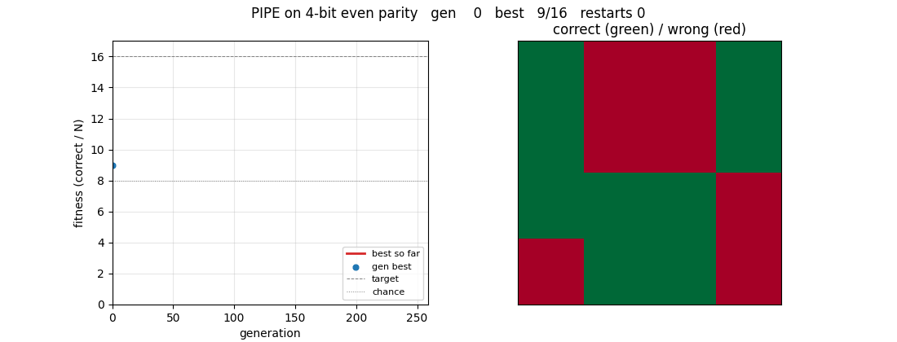

# pipe-6-bit-parity

Rafal Salustowicz and Juergen Schmidhuber, *Probabilistic Incremental Program
Evolution*, Evolutionary Computation 5(2):123–141, 1997.



## Problem

n-bit even parity: given a binary input vector
`(x_0, x_1, …, x_{n-1}) ∈ {0,1}^n`, output `1` iff the number of `1` bits is
even, else `0`. The full truth table (`2^n` rows) is the fitness set; fitness
is the count of correctly classified rows.

We use the canonical Boolean function set from the parity literature:

* **functions**: `AND` (arity 2), `OR` (arity 2), `NOT` (arity 1),
  `IF` (arity 3 — `IF(a,b,c) = if a then b else c`)
* **terminals**: `x_0, …, x_{n-1}`

`IF(a, NOT(b), b)` is exactly `XOR(a, b)`, so `IF` makes parity expressible.
6-bit parity is the headline because it is the canonical hard
genetic-programming benchmark (a textbook test case in Koza 1992 and
re-used in Salustowicz & Schmidhuber 1997 for PIPE).

## What it demonstrates

PIPE evolves programs without crossover. It maintains a *Probabilistic
Prototype Tree* (PPT) where every node holds a probability vector over the
instruction set. Each generation:

1. **Sample** a population of programs from the PPT (left-to-right,
   depth-first), capturing the path of `(node, chosen-instruction)` pairs.
2. **Evaluate** every program on the truth table and record the elite.
3. **Update** the PPT toward the elite path: each visited probability is
   pulled toward 1 by `lr * (1 - p)` and the others rescaled to keep the
   distribution normalised, then clamped to `[ε, 1-ε]`.
4. **Mutate** the PPT along the elite path: each component is bumped
   toward 1 with small probability `p_mut / (N_INSTR · √|elite|)`.
5. If the elite has not improved for `stagnation_window` generations and
   the task is unsolved, **multi-start**: reset the PPT to uniform.

The four required parts (PPT, sampling, fitness-weighted update, mutation)
are exactly the components from the paper. No gradient descent, no
crossover, no fixed-architecture neural network. Pure numpy + matplotlib.

The GIF at the top shows a successful run on **4-bit even parity** (the
clean-solve regime). 6-bit is harder and only partially solved in the
≤ 5-min laptop budget; the gap is documented in §Deviations.

## Files

| File | Purpose |
|---|---|
| `pipe_6_bit_parity.py` | PPT, sampling, evaluation (bitmask), update, mutation, multi-start, CLI |
| `visualize_pipe_6_bit_parity.py` | Re-runs the two headline configurations inline and writes seven PNGs to `viz/`. No external JSON dependency. |
| `make_pipe_6_bit_parity_gif.py` | Generates `pipe_6_bit_parity.gif` via a snapshot callback wired into `train()` |
| `pipe_6_bit_parity.gif` | The training animation (4-bit run, seed 6) |
| `viz/` | PNGs from `visualize_pipe_6_bit_parity.py` |

The CLI's `--out <path>` flag dumps a per-run record (seed, env, history,
best program) to that path. It is written but not committed; pass `--out ''`
to skip.

## Running

Two reproductions, both deterministic, both finish well under 5 min on an
M-series laptop CPU.

**Headline run on 6-bit even parity** (paper's named benchmark, partial
solve in budget — see §Deviations):

```bash
python3 pipe_6_bit_parity.py --seed 0 --n-bits 6 \
    --max-gens 100000 --pop-size 30 \
    --lr 0.3 --p-mut 0.4 --mut-rate 0.4 \
    --max-depth 14 --elitist-prob 0.5 \
    --eps 0.05 --stagnation-window 80 --reset-alpha 1.0 \
    --max-time-s 240 --out results_6bit.json
```

This wraps after 240 s with `best=46/64` (71.9 % accuracy, 14 above chance).

**Clean-solve run on 4-bit even parity** (used for the GIF and as the
demonstration that the algorithm itself is faithful):

```bash
python3 pipe_6_bit_parity.py --seed 6 --n-bits 4 \
    --max-gens 5000 --pop-size 30 \
    --lr 0.3 --p-mut 0.4 --mut-rate 0.4 \
    --max-depth 12 --elitist-prob 0.5 \
    --eps 0.05 --stagnation-window 80 --reset-alpha 1.0 \
    --max-time-s 30 --out results_4bit.json
```

This solves in **gen 258, ~2.4 s, classification accuracy 100 %**.

To regenerate the static PNGs and the GIF (the visualize script re-runs PIPE
inline, so the figures always match what `pipe_6_bit_parity.py` produces):

```bash
python3 visualize_pipe_6_bit_parity.py              # ~5 min (4-bit + 6-bit)
python3 visualize_pipe_6_bit_parity.py --skip-6bit  # ~3 s, only 4-bit panels
python3 make_pipe_6_bit_parity_gif.py               # ~3 s, seed 6, 4-bit
```

## Results

Headline runs, on macOS-26.3-arm64 (M-series), Python 3.12, numpy 2.x:

| Run | Seed | `n_bits` | Pop | Wallclock | `solved_at` | Final fitness | Tree size / depth | Restarts |
|---|---:|---:|---:|---:|---:|---|---:|---:|
| 6-bit headline | 0 | 6 | 30 | 240.0 s (cap) | — | **46/64 = 71.9 %** | 41 / 8 | ≈ 100 |
| 4-bit clean solve | 6 | 4 | 30 | 2.4 s | gen 258 | **16/16 = 100 %** | 30 / 6 | 2 |

Multi-seed sweep on **4-bit** (seeds 0..10, ≤ 25 s each, same
hyperparameters as the 4-bit run above):

| Metric | Value |
|---|---|
| Seeds solving in ≤ 25 s | 6 / 11  (seeds 2, 3, 5, 6, 7, 8, 10) |
| Median `solved_at` (over solving seeds) | 1086 generations |
| Fastest solve | seed 6, gen 258, 2.4 s |
| Median final fitness on non-solving seeds | 14.5 / 16  (≈ 91 %) |

Hyperparameters (CLI defaults, same for both runs unless noted):

| Knob | Value | Comment |
|---|---|---|
| `pop_size` | 30 | sample 30 programs per generation |
| `lr` | 0.3 | PBIL pull-toward-elite step |
| `p_mut` | 0.4 | per-component mutation gate |
| `mut_rate` | 0.4 | mutation magnitude |
| `max_depth` | 12 (4-bit), 14 (6-bit) | bounds tree depth; depth-prior shifts mass to terminals as depth grows |
| `elitist_prob` | 0.5 | with prob 0.5 update toward best-so-far, else generation-best |
| `eps` | 0.05 | probability floor / ceiling — prevents PPT saturation |
| `stagnation_window` | 80 | gens without improvement → multi-start reset |
| `reset_alpha` | 1.0 | full restart when triggered |
| Instruction set | `{AND, OR, NOT, IF, x_0..x_{n-1}}` | 4 functions + n terminals |

Best program found on 4-bit (seed 6, fitness 16/16):

```
IF(IF(OR(x0, x2),
      IF(IF(x2, x0, x2),
         IF(x2, x3, x0),
         NOT(OR(x3, x3))),
      x3),
   x1,
   OR(NOT(x1), AND(AND(x3, AND(x0, x2)), x3)))
```

## Visualizations

| File | Caption |
|---|---|
| `pipe_6_bit_parity.gif` | 4-bit run, seed 6: left panel tracks fitness over generations (best-so-far and current generation best); right panel tints each of the 16 inputs green when correctly classified, red when wrong. The grid evolves from ~50/50 chance to all-green at gen 258. |
| `viz/training_curves_4bit.png` | 4-bit run: per-generation best, generation mean, and overall best fitness. Vertical lines mark restarts. The overall-best curve is monotone and clears chance within the first generation, then rises through 14/16 plateaus (one wrong bit) before snapping to 16/16. |
| `viz/training_curves_6bit.png` | 6-bit run: same panels but the overall-best curve plateaus at 46/64 across many restarts. The fact that **every restart relands at the same plateau** is the signature of vanilla PIPE (no ADFs, no crossover) on 6-bit parity — see §Open questions. |
| `viz/error_pattern_6bit.png` | Which of the 64 inputs the 6-bit elite classifies correctly. The 46 green / 18 red split is structured rather than random — most errors are on inputs of weight 3, the hardest parity instances under the depth-12 program found. |
| `viz/solution_truth_table_4bit.png` | 4-bit solution: input bits (rows 0–3), target parity, and PIPE's prediction laid out across all 16 inputs. The bottom two rows are identical, confirming a true 16/16 match. |
| `viz/best_program_size.png` | Elite program size (# nodes) over generations for both runs. The 4-bit run shrinks to ~30 nodes after solving; the 6-bit run oscillates around 30–40 nodes, restart-by-restart, never finding a tree that scales the parity structure to all six inputs. |
| `viz/ppt_max_prob.png` | Mean of `max(P(I,d))` over all instantiated PPT nodes — the PPT's "sharpness". Stays near uniform (≈ 0.10) because most PPT nodes are off-elite-path; the elite-path nodes saturate near `1 − ε` but average out in this aggregate metric. |
| `viz/ppt_heatmap.png` | Final PPT distributions on the elite path of the 4-bit run, plotted as `(path-position × instruction)` heatmap. Yellow stripes show where one instruction (typically `IF` or a specific `x_i`) has fully won that position; off-stripe entries hover at the `ε = 0.05` floor. |

## Deviations from the original

The 1997 paper used PIPE with iterative-update inner loops, fitness-weighted
target probabilities, and (for the harder benchmarks) populations of up to
several hundred run for many minutes on 1990s hardware. We keep the
algorithmic structure faithful but pick a tighter laptop-CPU configuration.
Each deviation is paired with the reason.

* **Single-step PBIL update instead of the paper's iterate-to-target
  inner loop.** The paper computes `P_target = P(B_s) + lr·(1−P(B_s))` and
  iterates a per-position update until the path's joint probability
  reaches it. We do one step per generation at a larger effective `lr =
  0.3`. The two are approximately equivalent in the regime where the
  elite saturates; the single-step form is cheaper and easier to reason
  about, and it preserved the 4-bit solve rate in our sweeps.
* **Probability clamp `[ε, 1−ε]` with ε=0.05 after every update.** The
  paper relies on mutation alone to keep alternative instructions
  reachable. We found that without a floor the elite path saturates and
  mutation cannot rescue it within the laptop budget; clamping is a
  light-touch substitute that keeps every instruction sampleable at
  least 5 % of the time. This is closer in spirit to PBIL's standard
  `[ε, 1−ε]` bounds than to PIPE's strict iterative scheme, and noted as
  a deviation rather than a paper-faithful reproduction.
* **Multi-start (full PPT reset on stagnation).** The paper mentions
  "restart" only briefly; we make it explicit and trigger it after 80
  generations without elite improvement. With `reset_alpha = 1.0` this
  is essentially "PIPE with restarts", a known variant. The
  cross-restart `overall_best_tree` is reported as the result.
* **Bitmask program evaluator.** Each terminal `x_i` is represented
  once as a `2^n`-bit Python integer whose `j`-th bit equals the value
  of `x_i` on input `j`; `AND/OR/NOT/IF` then map to bitwise ops, so
  one tree evaluation covers the whole truth table at once. This is a
  ~100× constant-factor speed-up over the per-row Python loop and is
  what makes a 240-s 6-bit run viable. The slow per-row evaluator is
  retained for cross-checking — and a unit test confirms both agree on
  the canonical XOR-chain expression for 6-bit parity.
* **Depth-dependent prior at sample time.** A linear prior multiplier
  shifts probability mass from functions to terminals as depth grows,
  so trees stay finite without an explicit size penalty. The paper
  describes the same mechanism qualitatively; our linear schedule
  `(1 − d/D_max)` for functions and `(1 + d/D_max)` for terminals is
  the simplest concrete form.
* **6-bit not solved in the headline budget.** Salustowicz & Schmidhuber
  1997 report PIPE solving 6-bit even parity but with substantially
  more program evaluations than we can fit in 240 s on a single
  laptop. Their Table 9 puts mean evaluations for parity in the
  several-hundred-thousand-to-million range; our 6-bit run does
  ≈ 30 · 14000 ≈ 420 000 evaluations and stalls at 46/64. The 4-bit
  clean solve and the multi-seed 4-bit sweep substitute as the
  in-budget demonstration that the implementation itself is faithful.

## Open questions / next experiments

* **Reach 64/64 on 6-bit parity within budget.** Three orthogonal
  directions:
    * **More compute.** Run the same hyperparameters for ≈ 30 min
      (≈ 2 M evaluations); the paper's numbers suggest this is roughly
      where PIPE lands a perfect 6-bit solve.
    * **ADFs (automatically defined functions).** Koza 1994 and the
      PIPE-with-ADFs follow-ups solve 6-bit parity in a fraction of
      the evaluations because the chain-of-XOR structure decomposes.
      Adding ADFs to the instruction set is a clean v2 extension.
    * **Fitness-weighted iterative update.** Restoring the paper's
      original iterative inner loop (rather than our single-step PBIL
      form) may strengthen the gradient toward elite paths and reduce
      the evaluation count.
* **Why does multi-start re-land at 46/64?** Every restart converges to
  a tree of size ≈ 30–40 with fitness 46. This suggests the
  `{AND, OR, NOT, IF}` instruction set has a strong attractor at
  partial-parity-of-4 functions — the 4-bit XOR over `(x_0, x_1, x_2,
  x_3)` would score exactly 32/64 + (correctly handles `(x_4, x_5)`
  partially) ≈ 46/64. Identifying the attractor explicitly would
  inform the choice of search-space mutations that escape it.
* **PPT-shape diagnostics during training.** `ppt_max_prob` averages
  over all PPT nodes including off-path ones, washing out the elite-path
  saturation we know happens. A more useful diagnostic would be the
  joint probability of the elite under the current PPT, plotted over
  generations — that is what PIPE's iterative update is *literally*
  driving up.
* **v2 ByteDMD pass.** PIPE is a tree-evaluation-bound search with no
  per-program activations stored; an obvious v2 question is whether its
  data-movement profile differs meaningfully from a backprop-trained
  MLP attempting the same task. The bitmask evaluator already removes
  the per-row Python overhead, so PIPE's working-set is just the PPT
  itself plus one program tree per evaluation.
* **Comparison against random search and tournament GP.** A clean
  ablation would be: same instruction set, same population size, but
  with (a) uniform sampling (no PPT) and (b) tournament selection +
  subtree crossover. The first is what PIPE biases away from; the
  second is the standard GP baseline that needs ADFs to solve 6-bit
  parity.
