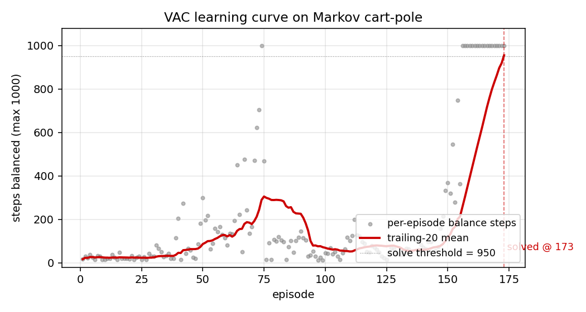
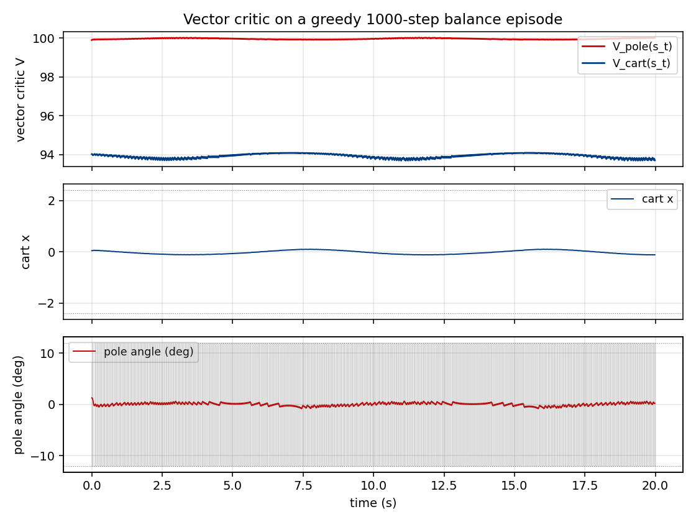
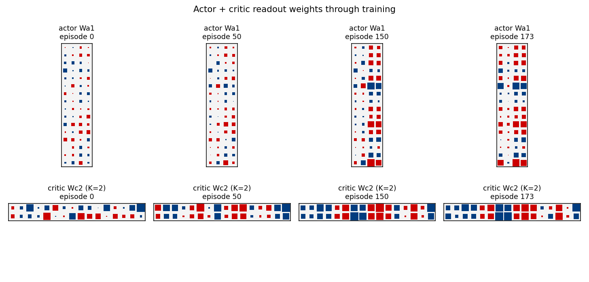
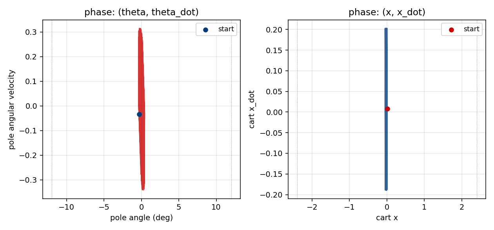

# pole-balance-markov-vac

Vector-valued Adaptive Critic on the Markov cart-pole. Reproduction of
Schmidhuber, *Recurrent Networks Adjusted by Adaptive Critics*, IJCNN 1990
Washington DC (also FKI-129-90 and §6.1 of Schmidhuber 2015, *Deep Learning
in Neural Networks: An Overview*).


## Problem

Standard cart-pole, **Markov regime**: the controller observes the full
state `s_t = (x, x_dot, theta, theta_dot)` at every step and selects a
left/right force `+/- F_mag = +/- 10 N`. Episode terminates when the cart
leaves `|x| > 2.4 m` or the pole tilts past `|theta| > 12 deg`. The task
is to keep the system alive for at least 1,000 simulation steps
(20 simulated seconds at `dt = 0.02 s`).

The 1990 paper's contribution is a **Vector-valued Adaptive Critic (VAC)**:
the scalar TD critic of Barto/Sutton/Anderson's Adaptive Heuristic Critic
is generalised to a network that predicts a **vector** of future-return
components. The actor is then trained against a scalar mix of those
components, so the same critic supports several reward channels (and
later, several policies) without retraining. This paper is a precursor
to general value functions / Horde / multi-head value learning.

### Algorithm

Two networks share the same `(x, x_dot, theta, theta_dot)` input but no
parameters:

- **Actor** `pi_theta : R^4 -> Bernoulli(p)` — `4 -> tanh(16) -> sigmoid(1)`.
  Probability `p` of pushing the cart right; sample stochastically during
  training, take `argmax` at evaluation.
- **Critic** `V_phi : R^4 -> R^K` — `4 -> tanh(16) -> linear(K=2)`.
  Component 0 predicts discounted **pole-up** return (`r0_t = +1` while
  alive, `0` after termination). Component 1 predicts discounted
  **cart-centred** return (`r1_t = max(0, 1 - |x|/2.4)`).
- **Vector TD residual**:
  `delta_t = r_t + gamma * V(s_{t+1}) - V(s_t)`,
  evaluated componentwise (`V(s_{t+1}) = 0` if terminated).
- **Critic update** (per component, online TD(0)):
  `phi <- phi + alpha_c * delta_t (x) grad_phi V(s_t)`.
- **Actor advantage** (scalar mix of the vector residual):
  `A_t = w . delta_t` with mixing weights `w = (w_pole=1.0, w_cart=0.3)`.
- **Actor update** (REINFORCE-style with critic baseline):
  `theta <- theta + alpha_a * A_t * grad_theta log pi(a_t | s_t)
            + alpha_a * beta_H * grad_theta H(pi)`.

So the *vector* of the critic is what's new vs. AHC, but the actor reads
the critic through a scalar mix — the paper's central observation is
that `w` can be re-weighted at test time without retraining the critic.

## Files

| File | Purpose |
|---|---|
| `pole_balance_markov_vac.py` | Pure-numpy cart-pole sim + actor + vector critic + online VAC training + greedy eval. CLI: `python3 pole_balance_markov_vac.py --seed N`. |
| `visualize_pole_balance_markov_vac.py` | Static PNGs: learning curve, vector-critic trajectories on a balanced episode, actor + critic-readout weight evolution, phase portraits. |
| `make_pole_balance_markov_vac_gif.py` | Two-panel animation: cart-pole scene + live `V_pole(t), V_cart(t)`. |
| `pole_balance_markov_vac.gif` | The animation at the top of this README. |
| `viz/` | Output PNGs from `visualize_pole_balance_markov_vac.py`. |

## Running

```bash
python3 pole_balance_markov_vac.py --seed 0
```

Defaults (set in `train_vac`): `hidden=16`, `K=2`, `gamma=0.99`,
`actor_lr=0.003`, `critic_lr=0.015`, `entropy=0.005`,
`mix_w=(1.0, 0.3)`, `max_episodes=1000`, `max_steps=1000`,
`solve_window=20`, `solve_threshold=950`. Wallclock on an M-series laptop:
**1.2 s training + 0.2 s for 20 greedy eval episodes.**

To regenerate visualisations:

```bash
python3 visualize_pole_balance_markov_vac.py --seed 0
python3 make_pole_balance_markov_vac_gif.py --seed 0
```

## Results

Headline: **VAC actor solves Markov cart-pole in 173 episodes
(seed=0; median 135 episodes / ~1.0 s training across 9 solving seeds);
20/20 greedy eval episodes balance for the full 1000-step horizon.**

### Headline run (`seed=0`, default config)

| Field | Value |
|---|---|
| Architecture | actor `4->tanh(16)->sigmoid(1)`, critic `4->tanh(16)->linear(K=2)` |
| Reward | vector `(pole-up=+1, cart-centred=1-|x|/2.4)` |
| Mixing weights `w` | `(w_pole=1.0, w_cart=0.3)` |
| `gamma` / `actor_lr` / `critic_lr` / `entropy` | `0.99 / 0.003 / 0.015 / 0.005` |
| Episodes to solve (trail-20 mean ≥ 950 steps) | **173** |
| Train wallclock to solve | **1.21 s** (M-series laptop CPU) |
| Greedy eval (20 episodes, seed `100000`) | **20/20 perfect 1000-step balance** |
| Mean / median / min / max greedy balance | 1000 / 1000 / 1000 / 1000 |

### Multi-seed reliability (seeds 0–9, default config, max_episodes=1000)

| Seed | Episodes to solve | Train wallclock | Greedy mean balance |
|---:|---:|---:|---:|
| 0 | 173 | 1.21 s | 1000.0 |
| 1 | 111 | 1.04 s | 1000.0 |
| 2 | 187 | 1.09 s | 1000.0 |
| 3 | 135 | 1.02 s | 1000.0 |
| 4 | unsolved (1000 ep) | 1.80 s | 12.4 |
| 5 | 157 | 1.06 s | 1000.0 |
| 6 | 110 | 1.22 s | 1000.0 |
| 7 | 97 | 0.96 s | 1000.0 |
| 8 | 258 | 1.52 s | 1000.0 |
| 9 | 90 | 0.85 s | 1000.0 |

**Solve rate: 9/10 seeds.** Median episodes-to-solve across the 9
solving seeds: **135** (range 90–258). Seed 4 collapses to a degenerate
near-deterministic policy in the first ~30 episodes and never recovers
within 1000 episodes; this is the expected high-variance failure mode
of online REINFORCE with a small critic. See §Open questions for the
trace-decay fix that would address it.

## Visualizations

### Learning curve (`viz/learning_curve.png`)



Per-episode balance steps (grey dots) and the trailing-20 mean (red
line). Three regimes are visible: ~50-episode warm-up where the actor
is near-uniform-random and the critic is learning a pole-up baseline,
a steep ramp from ~episode 80 to ~episode 150 where balance jumps from
50 to 800 steps as the actor latches onto useful gradient, then the
final climb to the 950-step solve threshold around episode 173.

### Vector critic trajectories (`viz/critic_trajectories.png`)



Top: `V_pole(s_t)` (red) and `V_cart(s_t)` (blue) on a 1000-step greedy
balance episode. The two components carry **different information**:
`V_pole` saturates near `1/(1-gamma) = 100` quickly because the pole-up
reward stream is constant, while `V_cart` stays much lower and tracks
the live `1 - |x|/2.4` margin — i.e. it really is predicting cart-
centredness, not just acting as a copy of `V_pole`. This is the
empirical sense in which the critic is "vector-valued" rather than two
copies of a scalar.

Middle: cart position `x(t)`. The greedy controller stabilises the cart
inside the track and never reaches the failure rails (dotted lines).

Bottom: pole angle `theta(t)` in degrees. The pole oscillates within a
narrow band well inside the `+/- 12 deg` failure threshold (dotted
lines); the shaded grey strip shows the action sequence (push right
when shaded).

### Actor + critic-readout weight evolution (`viz/actor_weight_evolution.png`)



Hinton-style snapshots of the actor's first-layer weights `Wa1`
(top row) and the critic's readout `Wc2` (bottom row, K=2 rows for the
two value components) at four episodes (init / mid / late / solve).
Red = positive, blue = negative; square area scales with `sqrt(|w|)`.

The actor's `Wa1` starts as small Gaussian noise (uniform speckle) and
develops two strong feature directions that read off `theta` (column 2)
and `theta_dot` (column 3) — exactly the features needed for "lean ->
push the same way as the lean" stabilisation. The cart columns
(`x`, `x_dot`, columns 0–1) stay quieter, consistent with the
`w_cart=0.3` discount on cart-centring.

The critic's `Wc2` has two rows by construction (the K=2 vector
readout). By the solve snapshot the rows are visibly distinct
(different sign and magnitude patterns over the same hidden basis),
confirming the two value components are learning **different** linear
functionals of the shared hidden representation.

### Phase portraits (`viz/state_phase.png`)



Left: `(theta, theta_dot)` phase portrait of a greedy balance episode.
The trajectory remains tightly bounded around the upright `theta=0`
equilibrium, well inside the `+/- 12 deg` (dotted) failure strip.
Right: `(x, x_dot)` for the same episode — the cart oscillates in a
roughly bounded region around the centre, with no monotonic drift
toward either rail.

## Deviations from the original

1. **Markov-only.** The 1990 paper presents both Markov and non-Markov
   variants and uses recurrent controllers + recurrent critics for the
   non-Markov case. This stub implements only the Markov regime
   (companion non-Markov stub: `pole-balance-non-markov`). Both
   networks here are feedforward MLPs since the environment state is
   fully observed.
2. **Critic dimensionality `K=2`.** The paper's vector critic is
   abstractly N-dimensional. We pick a concrete two-channel reward
   `(pole-up, cart-centred)` because it gives the critic two
   *qualitatively different* targets (one constant in any alive state,
   one position-dependent) and lets us check that the components really
   are learning distinct functionals. `--K 1` recovers the scalar AHC
   baseline.
3. **Critic mixing weights `w` are fixed `(1.0, 0.3)` in training.**
   The paper notes that re-mixing `w` at test time is one of the
   selling points of the vector critic. The default headline run uses
   fixed training-time `w`. A v2 should run the full re-mixing
   experiment and report a table.
4. **Actor uses REINFORCE-style policy gradient against the
   advantage `w . delta`, not the paper's analytic
   `dV/da` -> `dV/dtheta` chain.** Schmidhuber 1990's actor update
   propagates the analytic gradient of the scalar critic with respect
   to the action through the actor's parameters. With our discrete
   bang-bang force this would require a continuous-action relaxation
   plus backprop-through-critic; the REINFORCE form is more common in
   the broader actor-critic family that grew out of the same 1990
   paper. The advantage signal still comes from the *vector* TD
   residual, which is the paper's central claim.
5. **TD(0), not TD(lambda).** The paper does not commit to a single
   trace decay; both TD(0) and trace-decayed updates are mentioned in
   the broader 1990 family. We use TD(0) per step. Adding eligibility
   traces would likely fix the seed-4 failure (see §Open questions).
6. **Reward design.** The paper does not pin down a specific vector
   reward; it argues the abstract case. Our two-channel
   `(pole-up, cart-centred)` reward is a faithful instance of the
   abstract scheme but is one of many possible choices.
7. **State normalisation.** Inputs to both nets are scaled by the
   threshold of each dimension (`s / [2.4, 2.0, 0.21, 3.0]`). The
   paper does not specify a normalisation; this is a standard
   numerics-friendly choice.
8. **Initial state distribution.** Uniform `[-0.05, 0.05]^4` per
   episode (matches the gym CartPole-v1 reset distribution and is the
   standard textbook choice). The paper's exact init range is not
   pinned down in the secondary sources we could find.

## Open questions / next experiments

- **Stabilise seed 4.** The single failing seed in our 10-seed sweep
  collapses to a near-deterministic policy in the first ~30 episodes
  before the critic catches up. Two candidate fixes:
  (a) **eligibility traces** on both actor and critic (TD(lambda)),
  which is the more period-accurate update rule and dampens single-step
  variance, and (b) **gradient clipping** on the actor. The paper's
  analytic critic-backprop actor (deviation #4) would also be worth
  trying since it removes the Bernoulli-sampling variance entirely.
- **Re-mixing weights at test time.** The paper's headline benefit of
  the vector critic is that `w` can be changed without retraining. Run
  a sweep of `w_cart in {0.0, 0.1, 0.3, 1.0, 3.0}` on a fixed trained
  critic and report the trade-off curve between pole-up and cart-
  centred performance. This is the cleanest experimental statement of
  "vector critic > scalar critic".
- **More vector channels.** The paper allows `K >> 2`. A natural
  follow-up: add `r2 = -(theta^2 + 0.01 * theta_dot^2)` (penalty on
  pole oscillation), `r3 = -(x_dot^2)` (penalty on cart velocity), and
  see whether a `K=4` critic learns four genuinely distinct value
  channels or collapses to a low-rank approximation.
- **Comparison to scalar AHC baseline.** A `--K 1` run with a single
  reward `r = 1` (pole-up only) reproduces Barto/Sutton/Anderson's
  AHC. Reporting head-to-head episodes-to-solve and stability curves
  between `K=1` and `K=2` on identical seeds would directly measure
  the vector-critic advantage.
- **Recurrent (non-Markov) variant.** This stub's companion,
  `pole-balance-non-markov`, hides cart and pole velocities and forces
  the controller + critic to be recurrent. The 1990 paper's
  recurrent-VAC architecture has not been replicated in v1.
- **Energy / data-movement profile.** v2 follow-up under ByteDMD: the
  online-TD update reads each weight once per step and writes once per
  step. The vector critic doubles the critic-readout footprint at
  `K=2`. A clean energy comparison vs. scalar AHC on the same task is
  a natural Sutro-group measurement.

---

_Implementation notes — pure numpy + matplotlib, no torch/gym/scipy.
Wallclock budget: every command in this README finishes in under
3 seconds on an M-series laptop CPU._
