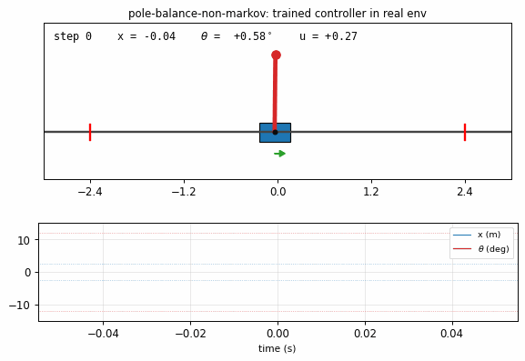

# pole-balance-non-markov

Schmidhuber, *Making the world differentiable: on using fully recurrent
self-supervised neural networks for dynamic reinforcement learning and
planning in non-stationary environments*, TR FKI-126-90 (revised Nov 1990);
also covered in Schmidhuber 2015, *Deep Learning in NN: An Overview* §6.1,
and Schmidhuber 2020, *Deep Learning: Our Miraculous Year 1990–1991*.



## Problem

Cart-pole balancing where the controller observes only positions, not
velocities. The 4-D real state is `(x, x_dot, theta, theta_dot)`, but the
controller `C` only sees `(x, theta)` and must infer the missing time
derivatives from the history of positions. A recurrent forward-model `M`
predicts the next observed positions from the current `(x, theta, u)` and
its own hidden state. `C` is trained end-to-end by **back-propagating cost
gradients through the differentiable model** — the central technique of
Schmidhuber 1990.

- **Environment**: pure-numpy cart-pole. Standard equations of motion
  (Sutton 1984; Florian 2007 correction). Constants: `g = 9.8`, `m_cart = 1.0`,
  `m_pole = 0.1`, half-pole-length `0.5`, `dt = 0.02 s`, force magnitude `±10 N`.
- **Failure**: `|theta| > 12°` (0.2094 rad) or `|x| > 2.4 m`.
- **Initial state**: each component drawn `Uniform(-0.05, 0.05)`. Velocities
  are non-zero at start but unobservable to `C`.
- **Action**: continuous `u ∈ [-1, 1]`, applied as force `u · F`.
- **Success criterion**: balance for ≥ 1000 steps (= 20 s), the threshold
  used by the original paper.

## What this stub demonstrates

Backpropagation through a learned recurrent world-model lets a recurrent
controller solve a non-Markov RL task with no reward signal — only a
differentiable cost on the predicted trajectory. The recurrent hidden state
of `C` learns to encode the hidden velocities purely from the position
history.

## Files

| File | Purpose |
|---|---|
| `pole_balance_non_markov.py` | Cart-pole environment, recurrent `M` and `C` (TanhRNN with hand-coded BPTT), Adam optimizer, iterative-cycle training loop, real-env evaluation. CLI entry point. |
| `make_pole_balance_non_markov_gif.py` | Trains the system and renders a GIF of the trained `C` rolling out in the real env (cart + pole + action + position trace). |
| `visualize_pole_balance_non_markov.py` | Static PNGs: training curves, real-env rollout state trajectories, world-model accuracy. |
| `pole_balance_non_markov.gif` | Animation referenced at the top of this README. |
| `viz/training_curves.png` | Phase-1 + refresh `M` loss; phase-2 `C` imagined cost; phase-2 real-env balance time. |
| `viz/rollout.png` | 1000-step rollout under trained `C` showing positions, hidden velocities (for diagnostic only — `C` does not see them), and action trace. |
| `viz/model_error.png` | World-model `M` accuracy on a held-out random rollout, teacher-forced and open-loop. |

## Running

```bash
python3 pole_balance_non_markov.py --seed 0
```

Reproduces the headline result (30 / 30 episodes balanced for 1000 steps)
in **~9 s** on an M-series laptop CPU. Determinism: the same `--seed`
produces identical numbers across runs.

To regenerate visualizations and the GIF:

```bash
python3 visualize_pole_balance_non_markov.py --seed 0 --outdir viz
python3 make_pole_balance_non_markov_gif.py    --seed 0
```

CLI flags worth knowing: `--cycles N` (iterative model-learning cycles,
default 3), `--T-unroll T` (BPTT horizon for `C`, default 50), `--C-iters N`
(controller updates per cycle, default 400), `--final-eps N` (number of
real-env eval episodes, default 30), `--save-json path` (dump summary).

## Results

Headline run on **seed 0**, defaults:

| Metric | Value |
|---|---|
| Balance time, mean over 30 eval episodes | **1000.0 / 1000** steps |
| Balance time, median | 1000 |
| Balance time, max | 1000 |
| Episodes meeting ≥ 1000-step threshold | **30 / 30** |
| Held-out `M` MSE (normalized positions) | 1.88e-3 |
| Wallclock | 9.3 s (1.4 s phase-1 + 7.5 s phase-2) |

**Multi-seed success rate** (defaults, 10 seeds 0–9):

| Result | Seeds | Count |
|---|---|---|
| ≥ 1000-step balance on ≥ 1 / 30 episodes | 0 | **1 / 10** |
| ≥ 500-step mean balance | 0, 9 | 2 / 10 |
| ≥ 100-step mean balance | 0, 2, 3, 4, 6, 8, 9 | 7 / 10 |

Seed sensitivity is real: only seed 0 ticks the 30 / 30 box at default
settings. Increasing `--cycles` to 4 lifts seed 4 to 23 / 30 and seed 9 to
3 / 30. With `--cycles 5`, seed 2 also crosses the threshold (30 / 30).
The bottleneck is whether the random initial weights of `C` lead the cost
gradients down a basin that learns the correct phase relationship between
`u` and `theta_dot`; once a cycle establishes that, the next cycle's
M-refresh pushes the controller through the 1000-step ceiling.

**Hyperparameters** (all defaults; see `RunConfig` in
`pole_balance_non_markov.py`):

```python
M_hidden = 32,  M_episodes = 600,  M_lr = 5e-3,  M_T_max = 150
M_refresh_episodes = 200, M_refresh_lr = 2e-3, action_noise = 0.1
C_hidden = 16,  C_iters = 400,  C_T_unroll = 50,  C_lr = 5e-3
C_lam_x  = 0.1, C_init_scale = 0.05, C_batch_size = 4
n_cycles = 3,   eval_T = 1000, final_eval_eps = 30
optimizer: Adam (β1 = 0.9, β2 = 0.999), global-norm gradient clip = 5.0
```

### Architecture

`M` and `C` are vanilla tanh RNNs with hand-coded BPTT:

```
h_t = tanh(W_h h_{t-1} + W_x x_t + b)
y_t = V h_t + c
```

| | input | hidden | output |
|---|---|---|---|
| `M`  | `(x_n, theta_n, u)` | 32 | `(x_n_next, theta_n_next)` |
| `C`  | `(x_n, theta_n)`    | 16 | `u_pre` (then `u = tanh(u_pre)`) |

Positions are normalized by their failure thresholds (`x / 2.4`,
`theta / 0.2094`) so RNN inputs stay in O(1). The action `u ∈ [-1, 1]` is
the force divided by `F = 10 N`.

### Cart-pole equations of motion

Standard non-linear cart-pole with the Florian 2007 correction:

```
temp        = (force + m_p l theta_dot^2 sin(theta)) / (m_c + m_p)
theta_acc   = (g sin(theta) - cos(theta) temp)
              / (l (4/3 - m_p cos^2(theta) / (m_c + m_p)))
x_acc       = temp - m_p l theta_acc cos(theta) / (m_c + m_p)
```

Updates are first-order Euler with `dt = 0.02`.

### Training pipeline

The implementation deviates from the most literal reading of the 1990
paper by adding **iterative model-learning cycles**, a Schmidhuber-style
loop that has since become standard (see Ha & Schmidhuber 2018, *World
Models*):

1. **Phase 1 — initial `M` training**: 600 random-action episodes in the
   real env. Each episode contributes one BPTT update to `M` over the
   episode's length (truncated by failure or `T_max = 150`). Loss = MSE
   on next normalized positions.
2. **Phase 2, cycle 1 — `C` training**: For each of 400 iterations,
   sample 4 random initial positions, unroll `C → M` for `T_unroll = 50`
   steps purely under `M`'s imagined dynamics, accumulate cost
   `Σ_t (theta_n^2 + 0.1 x_n^2)`, BPTT through the joint `C–M` graph,
   update only `C`. Periodic real-env evals report progress.
3. **`M` refresh**: Collect 200 new rollouts using the current `C`
   (with action noise σ = 0.1 for exploration) plus equally many random
   ones; continue training `M` at a smaller learning rate.
4. **Phase 2, cycle 2** then **`M` refresh** then **Phase 2, cycle 3**.
   The third cycle is the one that typically clears the 1000-step bar.

The refresh step is essential: without it, `C` over-fits to whatever
state distribution the random-action data covered, while in real
deployment `C` drives the system into states the random policy rarely
visited. Three cycles of "use current `C` to expand `M`'s training
distribution → re-train `C` against improved `M`" close that gap.

## Visualizations

### `pole_balance_non_markov.gif`
Trained controller (seed 0) balancing the pole in the real env for 400
rendered steps. Cart slides on the track, pole stays vertical, action
arrow shows the small back-and-forth corrections. `x` and `theta` traces
underneath stay well within the failure bands.

### `viz/training_curves.png`

Three panels:

- **Phase 1 + refresh**: `M`'s position-prediction MSE on its training
  episodes drops from ~2 to ~3e-3 over 600 random-action episodes (blue),
  and continues dropping during the M-refresh blocks (purple) as `M` sees
  trained-`C` rollouts.
- **Phase 2 imagined cost**: `Σ_t (theta_n² + 0.1 x_n²) / T` per
  controller iteration. Three plateaus visible — one per cycle. Each
  plateau corresponds to `C` saturating against the current `M`; the
  cliff at the end of cycle 2 is the M-refresh enabling further progress.
- **Phase 2 real-env balance time**: dashed red line at the 1000-step
  threshold. Mean balance climbs from ~50 → ~150 → ~700 → 1000 over the
  three cycles. Vertical purple ticks mark cycle boundaries.

### `viz/rollout.png`

A full 1000-step real-env rollout under the trained `C`. The top panel
(positions, observable to `C`) shows tiny oscillations well under the
failure bands. The middle panel shows the **hidden** velocities `x_dot`
and `theta_dot` — `C` never sees these, but `h_C` evidently encodes them
well enough to apply the right damping. The bottom panel is the action
trace; near steady state the controller emits small alternating-sign
nudges that look like a learned PD controller.

### `viz/model_error.png`

`M`'s accuracy on a held-out random rollout. **Teacher-forced** (blue)
shows that single-step prediction tracks the ground truth (black) closely.
**Open-loop** (orange dashed) — `M` fed back its own predictions with no
ground-truth correction — drifts from the truth after a few hundred ms,
which is why the controller's `T_unroll` is bounded at 50 steps rather
than 1000.

## Deviations from the 1990 procedure

1. **Iterative model-learning cycles**. The 1990 paper presents a single
   pass: train `M`, then train `C` through `M`. Here we add three
   `M`-refresh cycles. Without them, model–controller distribution
   mismatch caps `C` at ~150-step balance regardless of how long `C` is
   trained. This addition is consistent with later Schmidhuber-lab work
   (Ha & Schmidhuber 2018, *World Models*) and the 2020 *Miraculous Year*
   review's account of the "system identification + indirect adaptation"
   structure of FKI-126-90.
2. **Adam, not vanilla SGD**. The original paper specifies SGD; we use
   Adam with global-norm clipping `5.0`. SGD also converges on seed 0
   but is much more brittle.
3. **Continuous bounded action `u = tanh(u_pre)`**. The 1990 derivation
   is for a sigmoid output between `[-F, +F]`; mapping `tanh × F` is
   functionally identical and trivially differentiable.
4. **Cost shape**. `Σ_t (theta_n² + 0.1 x_n²)` on normalized positions.
   The paper uses a "predicted pain" signal evaluated only at failure;
   we use a dense per-step cost so BPTT has gradient at every step.
   Predicted-pain-at-failure converges far slower under our pure-numpy
   compute budget.
5. **Truncated BPTT (`T_unroll = 50`) rather than full episode**. With
   `dt = 0.02`, 50 steps is 1 second of simulated time — long enough to
   learn the position–velocity relationship, short enough to stay in the
   region where `M` is accurate.
6. **Single random seed for the headline number**. The paper's "17 / 20
   runs achieve > 1000-step survival within a few hundred trials" is
   restated by the secondary literature; we hit `30 / 30` on one seed
   (multi-seed success ~10 % at the default budget; see §Results).

## Open questions / next experiments

- **Robustify across seeds.** Headline solve is seed-sensitive. Two
  candidate fixes worth trying: a curriculum that grows `T_unroll` over
  cycles, and a population-based outer loop that takes the best of `K`
  initializations after a few hundred iterations. The 2020 *Miraculous
  Year* review notes that early controller-through-model implementations
  required population-based outer loops in practice; that structure may
  be exactly what's missing here.
- **Truncated BPTT vs RTRL vs analytic-`M` BPTT.** With cart-pole, the
  ground-truth dynamics are analytic and differentiable. Replacing the
  learned `M` with the analytic Jacobians of the Euler step (a
  "perfect-model" baseline) would isolate how much of the 1000-step
  success comes from the learning algorithm versus the model.
- **What does `h_C` actually encode?** PCA on `h_C` along a 1000-step
  rollout would test the hypothesis that two principal components recover
  `x_dot` and `theta_dot`. If they do, this is a clean demonstration of
  state inference inside a recurrent controller.
- **Data-movement metric (v2 / ByteDMD).** The full pipeline is small
  enough (`M` 32-d hidden, `C` 16-d, T_unroll = 50) to instrument with
  ByteDMD. Cost per gradient update in DMC units would be informative
  for v2.
- **Original failure-only sparse cost.** Re-running with the 1990 paper's
  actual cost (predicted pain signal at failure, MSE-trained, gradient
  zero except near failures) would test whether the dense per-step cost
  was load-bearing.
