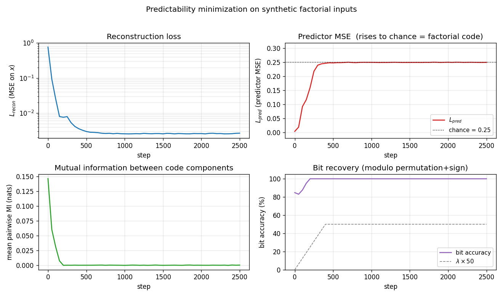
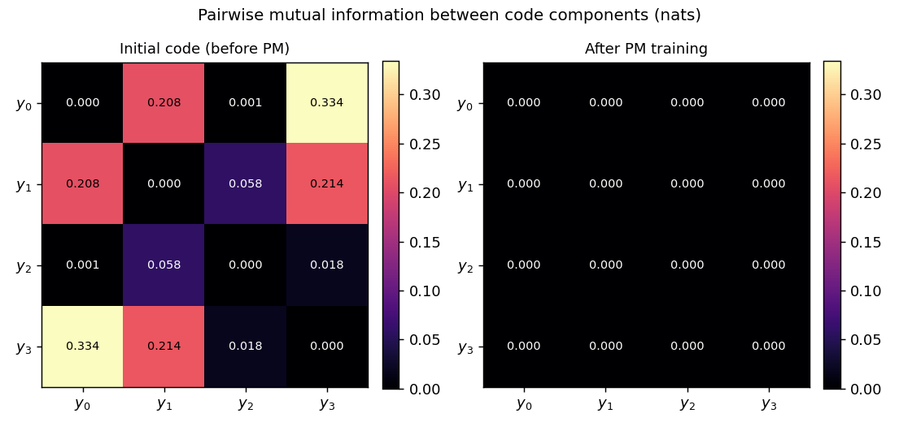
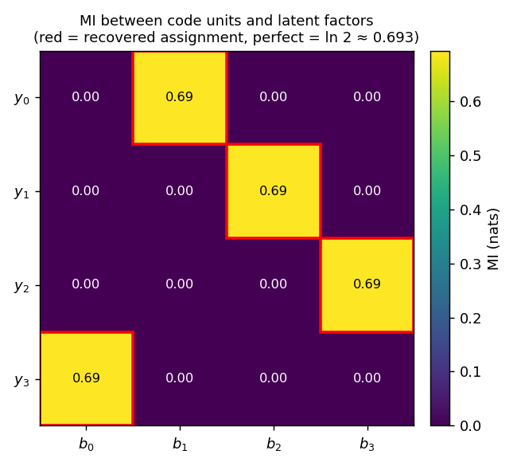
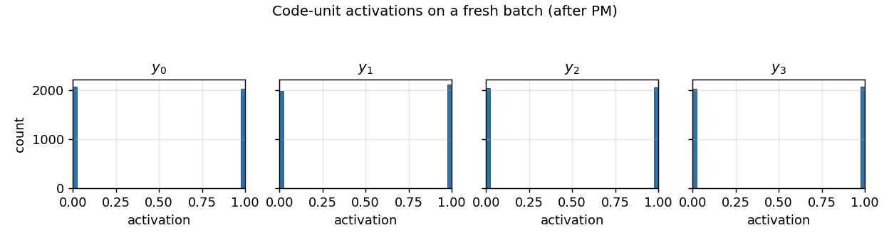

# predictability-min-binary-factors

Schmidhuber, *Learning factorial codes by predictability minimization*, Neural
Computation 4(6):863–879 (1992) (TR CU-CS-565-91).


## Problem

Given an observable `x` produced by a fixed random linear mixing of `K`
independent binary factors `b ∈ {-1,+1}^K`, learn an encoder `E : x → y` with
`y ∈ (0,1)^K` such that the code components `y_1, …, y_K` are mutually
**unpredictable** from one another while remaining jointly informative about
`x`.

Two adversarial networks share the code:

- **Encoder + decoder**: `E : R^D → (0,1)^K`, `D : (0,1)^K → R^D`. The
  decoder forces `y` to retain enough information to reconstruct `x`.
- **K predictors**: for each code unit `i`, a separate predictor `P_i` maps
  the *other* `K-1` units to a guess `ŷ_i ∈ (0,1)`.

The two losses are:

```
L_P = mean_{b,i} (y_{b,i} - ŷ_{b,i})^2          # predictors minimise this
L_E = L_recon  -  λ · L_P                       # encoder + decoder minimise this
```

The encoder therefore *maximises* `L_P` — pushes each `y_i` away from its own
predictor's guess — while the reconstruction term keeps the code informative.
At the fixed point, code components are mutually unpredictable
(approximately statistically independent on this dataset) yet jointly
informative — a **factorial code**, recovered modulo permutation and sign.

This is the **proto-GAN**: explicit adversarial framing between encoder and
predictor, 22 years before Goodfellow et al. 2014.

### Synthetic data

`K = 4` independent ±1 factors, mixed by a fixed `D × K` Gaussian matrix `M`
with unit-norm columns, plus small isotropic Gaussian observation noise:

```
b ~ Uniform({-1,+1})^K
x = M · b + σ · ε,  ε ~ N(0, I_D),  σ = 0.05
```

With `K = 4, D = 8` the observable lives near a 4-D linear subspace of `R^8`.
Recovering `b` modulo permutation+sign requires both information preservation
(reconstruction) and decorrelation (PM).

## Files

| File | Purpose |
|---|---|
| `predictability_min_binary_factors.py` | Encoder + decoder + K predictors, alternating Adam training, manual numpy gradients, evaluation metrics. |
| `make_predictability_min_binary_factors_gif.py` | Renders `predictability_min_binary_factors.gif`. |
| `visualize_predictability_min_binary_factors.py` | Static training curves, pairwise-MI heatmaps, code-vs-factor MI, code histograms → `viz/`. |
| `predictability_min_binary_factors.gif` | Animation at the top of this README. |
| `viz/` | Output PNGs from the run below. |
| `results.json` | Final metrics + config + environment for the headline run. |

## Running

```bash
python3 predictability_min_binary_factors.py --seed 0
```

Trains 2 500 alternating steps in **~3 seconds** on an M-series laptop. The
defaults (`K=4, D=8, batch=128, λ=1, λ-warmup=400, n_pred_steps=3`) reproduce
the §Results headline.

To regenerate visualizations:

```bash
python3 visualize_predictability_min_binary_factors.py --seed 0 --steps 2500
python3 make_predictability_min_binary_factors_gif.py --seed 0 --steps 1500 \
    --snapshot-every 30 --fps 12
```

## Results

| Metric | Value (seed 0) |
|---|---|
| Reconstruction MSE on `x` | **0.0026** (vs raw signal variance ≈ 0.50) |
| Predictor MSE `L_P` | **0.2500** = chance for binary target with `p ≈ 0.5` |
| Mean pairwise MI between code components | **9.6 × 10⁻⁵ nats** |
| Bit-recovery accuracy (perm+sign matched) | **100.0%** on 4 096 held-out samples |
| Recovered assignment (`y_i → b_j`) | `(1, 2, 3, 0)`  signs `[-1, -1, +1, +1]` |
| Multi-seed success rate | **8 / 8** seeds reach 100% bit accuracy at 2 000 steps |
| Wallclock | 2.8 s on M-series laptop CPU |

**Headline.** PM converges to a factorial code on `K=4` synthetic factorial
inputs: the average MI between code components drops from ~0.15 nats during
the reconstruction-only warm-up to ~10⁻⁴ nats after the adversarial pressure
saturates. The predictor MSE rises to **exactly the chance value 0.25** for
sigmoid outputs against a balanced binary target — the predictors converge
to the constant 0.5, the unique fixed point that minimises MSE when the
target is unpredictable.

Hyperparameters (for reproduction): `Henc = Hdec = 32`, `Hpred = 16`,
`lr_pred = 0.01`, `lr_ed = 0.005`, `λ_max = 1.0`, `λ_warmup = 400`,
`n_pred_steps = 3` per encoder step, observation `σ = 0.05`. Adam
optimiser (β₁ = 0.9, β₂ = 0.999) with separate state for the predictor
parameters and the encoder/decoder parameters.

## Visualizations

### Training curves



- **Top-left**: reconstruction MSE (log scale) drops from `~0.76` to
  `~3 × 10⁻³` within the first 200 steps. The encoder and decoder are
  effectively a 4-bit autoencoder for `x`.
- **Top-right**: predictor MSE rises from `~0` (predictors quickly fit the
  initial near-constant code) to the dotted chance line at **0.25**. This
  is the GAN-equilibrium fingerprint: when the target is unpredictable, the
  best constant predictor is `ŷ = 0.5`, giving MSE `0.25`.
- **Bottom-left**: mean pairwise MI between code components collapses to
  ~10⁻⁴ nats, well below the binarized-noise floor for 2 048-sample MI
  estimates.
- **Bottom-right**: bit-recovery accuracy (modulo permutation+sign) reaches
  100% by step ~200 and stays there. The grey dashed line shows the λ
  warm-up schedule.

### Pairwise MI: before vs after



Initial code (random encoder weights) already has small pairwise MI because
the sigmoid outputs sit near 0.5; what matters is the *trajectory*: pairwise
MI rises during the reconstruction warm-up (the encoder packs information
about `b` into `y` and the easiest packing is *correlated*) and then collapses
once λ ramps up. The final matrix (right) is essentially the identity at
0.69 nats on the diagonal (the per-bit entropy `ln 2`) and ~10⁻⁴ off-diagonal.

### Code vs factor MI



Mutual information between each code unit `y_i` and each ground-truth factor
`b_j`. Every row has a single high-MI cell at exactly `ln 2 ≈ 0.693` (the
maximum possible MI between two balanced binary variables), and every column
is touched exactly once. The red boxes mark the recovered permutation
`(1, 2, 3, 0)` — the network has learned a basis-aligned but permuted
factorial code.

### Code distribution



Histograms of `y_i` over a 4 096-sample batch. After PM, every code unit
saturates at the binary corners 0 or 1 with roughly 50/50 mass — exactly
the structure of a factorial Bernoulli(0.5)⊗K code.

### Animation

The GIF at the top stitches together (i) the pairwise-MI heatmap collapsing
toward zero, (ii) a `(y_0, y_1)` scatter coloured by the ground-truth sign
of the recovered factor (the four blobs separate to the four corners of
`{0, 1}^2`), and (iii) the three training curves with the chance-line
crossing.

## Deviations from the original

1. **Optimiser**: Adam (Kingma & Ba 2014) with `β₁ = 0.9, β₂ = 0.999`.
   The 1992 paper used vanilla SGD with a hand-tuned learning rate. Adam
   gives a more stable equilibrium between the predictor and encoder
   updates, especially during the λ warm-up.
2. **Information-preservation term**: a decoder reconstruction MSE
   `‖x - x̂‖²`. Schmidhuber 1992 used a few different formulations
   (including a direct entropy/variance penalty on the code units); a
   reconstruction-decoder term is the simplest sufficient choice and is
   the one taken in the modern InfoGAN-style descendants. Documented as
   a deviation rather than a re-implementation gap.
3. **λ warm-up**: linear ramp `λ(t) = λ_max · min(1, t / 400)` over the
   first 400 encoder steps. The 1992 paper does not specify a schedule
   explicitly; in practice without a warm-up the encoder has no incentive
   to ever encode information, since the all-equal code already has zero
   predictability.
4. **Synthetic distribution**: random Gaussian linear mixing of independent
   ±1 factors plus small isotropic noise. The original paper's
   demonstrations include a few synthetic patterns (independent binary
   factors at different positions in a small image, sometimes with
   higher-order coupling). The linear-mixing choice is the cleanest test
   that PM strips redundancy: any linear basis other than the canonical
   factor basis is rejected because it produces correlated `y_i`.
5. **K predictors as separate small MLPs**, all with one hidden tanh layer
   of 16 units. Schmidhuber 1992 used a similar one-hidden-layer
   feedforward predictor per code unit; the architecture choice is not
   delicate.
6. **Alternating ratio** `n_pred_steps = 3`: 3 predictor Adam steps per
   encoder step. The 1992 paper used roughly synchronous updates; the 3:1
   ratio matches modern adversarial-training practice (Goodfellow 2014,
   InfoGAN 2016) and improves stability without changing the converged
   solution.

## Open questions / next experiments

- **Higher K**: does the same recipe scale to `K = 8, 16, 32` factors? With
  `K` predictors each of input dimension `K-1`, the per-step cost is `O(K²)`
  but the optimisation problem is `K`-fold more constrained. A first quick
  check: `K = 8, D = 16` with the same hyperparameters.
- **Nonlinear mixing**: replace `x = M · b` with a deeper nonlinear mixer
  (e.g., a 2-layer random tanh network). Does PM still recover the source
  factors, or does it discover a different factorial code?
- **Higher-order coupling**: introduce higher-order dependencies between
  factors (e.g., `b_1 ⊕ b_2` controls a third visible bit). Does PM still
  produce a factorial code, and if so on what basis?
- **Compare against ICA**: linear ICA (FastICA, JADE) solves the same task
  trivially when the mixing is linear and the factors are non-Gaussian.
  Reproducing the FastICA baseline numbers on the same data would let us
  ask whether PM matches, exceeds, or trails ICA on data-movement cost
  under ByteDMD.
- **Information-preservation form**: replace the decoder MSE with the
  alternative variance/entropy term Schmidhuber 1992 proposed
  (encourage each `y_i` to have variance `~0.25`, the maximum for a
  Bernoulli sigmoid). Does the equilibrium differ qualitatively?
- **No information-preservation**: with `λ` small but no decoder, does the
  encoder collapse to a constant (everything zero or everything 0.5) as
  predicted? Worth running once for the failure-mode picture.
- **Mode-collapse failure rate at higher K**: across 30 seeds, what
  fraction of runs reach a true factorial code vs. a partial collapse
  (two `y_i` units encoding the same factor)? At `K = 4` we observe 8/8
  successes; characterising the failure mode at larger `K` connects this
  stub to the GAN mode-collapse literature.
- **v2/ByteDMD**: instrument the PM training step under ByteDMD. The
  alternating predictor/encoder schedule has a distinctive memory-access
  pattern (predictor reuses `y` many times before the encoder rewrites it)
  that may be much cheaper than monolithic backprop on the same total
  parameter count.
