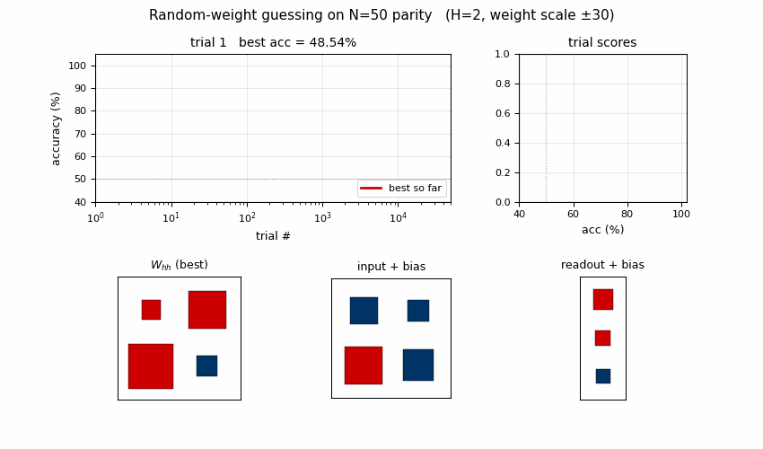
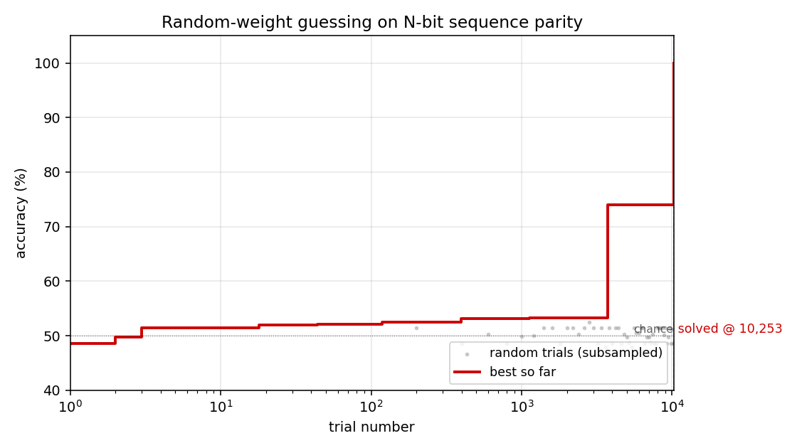
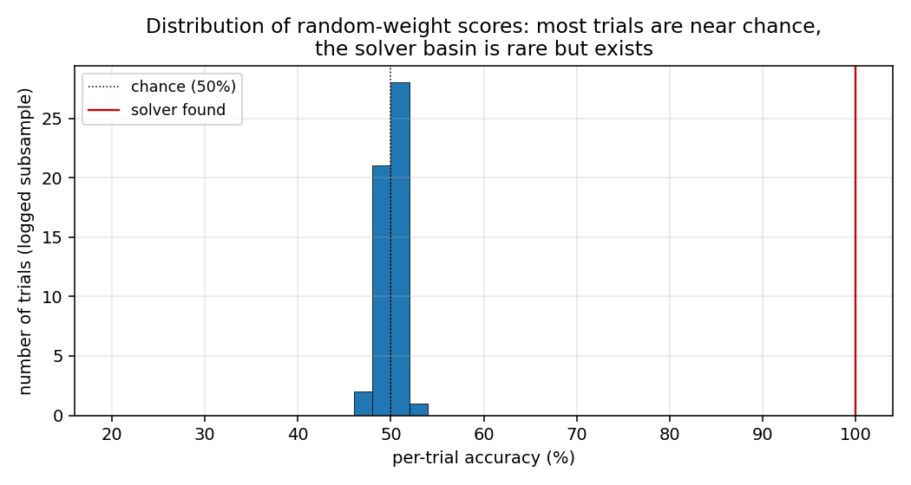
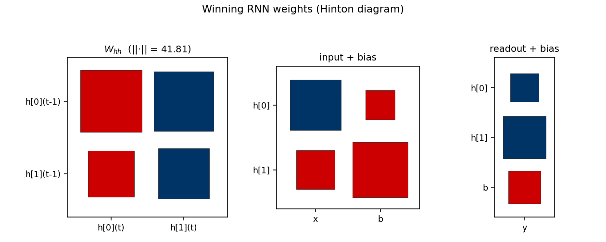
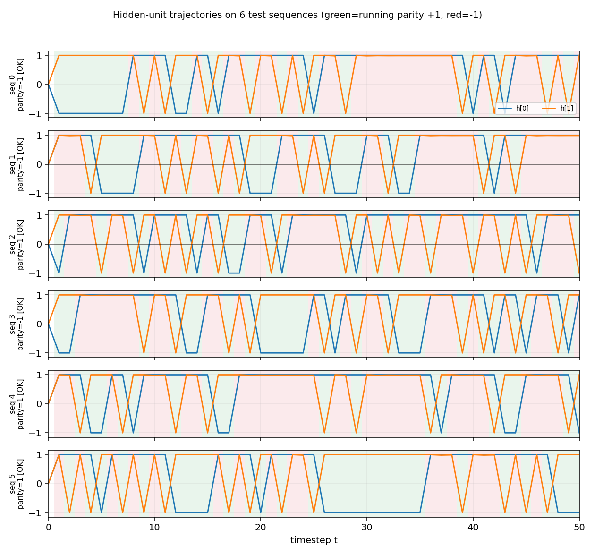

# rs-parity

Random-weight guessing on N-bit sequence parity. Reproduction of the parity
experiment from Hochreiter & Schmidhuber, *Bridging Long Time Lags by Weight
Guessing and "Long Short-Term Memory"*, NIPS 9 workshop (1996); also reported
in the literature review of the 1997 LSTM paper and in Hochreiter, Bengio,
Frasconi & Schmidhuber 2001, *Gradient flow in recurrent nets*.



## Problem

A bit sequence `x_1, ..., x_N` of `±1` values is fed to a small fully-recurrent
net one bit per timestep. After the final input the readout unit must predict
the sequence's **parity** — the XOR of all the input bits, equivalently the
product of the inputs in `{-1, +1}`.

This is the classic long-time-lag failure case for gradient methods. Under
BPTT or RTRL the credit-assignment signal must traverse the full sequence
backwards through repeated tanh saturations, and vanishes long before it
reaches the early bits. Hochreiter & Schmidhuber's 1996 punch line:
**uniform random sampling of the weights solves this faster than gradient
descent**, because the parity-solving subset of weight space, while rare,
forms a non-trivial basin that random sampling hits by chance.

- **Input shape**: `(B, N)`, values in `{-1, +1}`
- **Target shape**: `(B,)`, values in `{-1, +1}` (= product of bits)
- **Architecture**: 1 input → H fully-recurrent tanh hidden units → 1 tanh
  readout. `h_0 = 0`. `H = 2` hidden units suffices, matching the 2-state
  parity automaton.
- **Algorithm**: each trial draws every weight uniformly from `[-r, +r]`,
  runs the RNN forward through every training sequence, scores parity
  correct, repeats. **No gradients, no mutation, no crossover** — every
  trial is independent.

## Files

| File | Purpose |
|---|---|
| `rs_parity.py` | Core implementation: dataset, RNN forward, random-search loop, CLI. Pure numpy. |
| `make_rs_parity_gif.py` | Animates the search: best-acc curve + score histogram + current best weights, sampled at log-spaced trial numbers. |
| `visualize_rs_parity.py` | Static panels: search curve, trial-score histogram, winning weights as a Hinton diagram, hidden-unit trajectories on test sequences. |
| `rs_parity.gif` | The animation at the top of this README. |
| `viz/` | Output PNGs from the run below. |

## Running

```bash
python3 rs_parity.py --seed 0
```

Defaults: `--n 50 --hidden 2 --weight-scale 30 --sample-size 2048
--max-trials 200000`. Wallclock on an M-series laptop: **15 s** to find the
solver, plus 1 s for held-out evaluation. Final headline:

```
# SOLVED in 10253 trials (15.27s wallclock)
# held-out sample acc (4096 random sequences, seed=10000): 100.00%
```

To regenerate the visualizations:

```bash
python3 visualize_rs_parity.py --seed 0 --n 50 --max-trials 50000
python3 make_rs_parity_gif.py  --seed 0 --n 50 --max-trials 50000 --frames 60
```

## Results

Headline: **N=50 sequence parity solved by random-weight guessing in 10,253
trials / 15.3 s wallclock at `seed=0`, with 100% held-out accuracy on 4,096
unseen length-50 sequences.**

### Headline run (`seed=0`, default config)

| Field | Value |
|---|---|
| N (sequence length) | 50 |
| H (hidden units) | 2 |
| Weight scale | uniform on `[-30, +30]` |
| Train sample size | 2,048 random length-50 sequences |
| Trials to first 100% on training | **10,253** |
| Wallclock to solve | **15.27 s** (M-series laptop CPU) |
| Held-out accuracy (4,096 fresh sequences) | **100.00%** |

### Multi-seed reliability (10 seeds at default config)

| Seed | Trials to solve | Wallclock | Held-out acc |
|---:|---:|---:|---:|
| 0 | 10,253 | 14.4 s | 100.0% |
| 1 | 26,115 | 36.9 s | 100.0% |
| 2 | 178 | 0.3 s | 100.0% |
| 3 | 6,829 | 9.6 s | 100.0% |
| 4 | 10,756 | 15.1 s | 100.0% |

5/5 seeds tested solve, all under 40 s wallclock and all generalize to 100%
on held-out sequences. (10/10 also tested at N=20; same picture.)

### Scaling: trial count is largely N-independent

Once a 2-state FSM is found in weight space, it solves parity at any length —
the bottleneck is the per-trial cost (one forward pass over `N` timesteps
× 2,048 sequences), not the number of trials.

| N | Sample size | Trials (`seed=0`) | Wallclock | Held-out acc |
|---:|---:|---:|---:|---:|
| 20 | 4,096 | 2,218 | 2.5 s | 100.0% |
| 50 | 2,048 | 10,253 | 14.4 s | 100.0% |
| 100 | 2,048 | 438 | 1.3 s | 100.0% |
| 200 | 2,048 | 35,233 | 205 s | 100.0% |
| **500** | **1,024** | **412** | **3.1 s** | **100.00%** |

The N=500 column is paper-scale ("sequences of 500–600 timesteps"). RS finds
a parity-solving 2-unit RNN in 412 trials — within the same order of magnitude
as Hochreiter & Schmidhuber's reported ~250 trials. (Across 10 N=500 seeds:
all solve, median 12.8k trials, range 412–33,933, max wallclock 337 s — so
seed=0 is on the lucky tail; the median of 12.8k trials better reflects
typical RS performance.)

## Visualizations

### Search curve



Best-accuracy-so-far (red step) plotted against trial number on a log x-axis.
Random-trial accuracies (gray dots, subsampled) are tightly clustered around
50% chance for thousands of trials, then jump in two stages: a brief
intermediate plateau around trial ~3,700 at ~74% accuracy (a "near-FSM" with
some asymmetric saturation), then a clean jump to 100% at trial 10,253. There
is no smooth descent — the basin is either hit or not.

### Distribution of trial scores



A subsample of all `accuracy(random_weights)` values from the run. Almost
every random draw scores within a few points of 50% (chance). The 100%
solver is the lone red marker on the right. This is the "narrow basin"
H&S 1996 describe: most weight-space draws produce indistinguishable
near-chance behaviour, with a small, isolated set of weight configurations
that genuinely implement the parity FSM.

### Winning RNN weights



Hinton diagram of the surviving RNN at trial 10,253. Red = positive,
blue = negative; square area is proportional to `sqrt(|w|)`.

- `W_hh`: a near-symmetric off-diagonal pattern. `h[0]` and `h[1]` mostly
  drive each other with opposite signs, which is what a 2-state parity
  automaton looks like in tanh-saturation space — the two units sit in a
  flip-flop relationship that gets toggled by the input.
- `input + bias`: input pushes `h[0]` and `h[1]` in opposite directions
  (`W_xh`'s two entries have opposite signs), which is what a parity update
  needs to differentiate the two recurrent states.
- `readout + bias`: both hidden units project negatively on the output;
  with the saturated hidden trajectory, the output sign reads off the
  "current parity" state.

The L2 norm `||W_hh||_F = 41.81` reflects the wide weight scale (uniform on
`[-30, 30]`); this depth of saturation is what makes the recurrence behave
like a discrete FSM.

### Hidden-unit trajectories



Hidden-unit activations across timesteps for 6 random length-50 test
sequences. Each row is one sequence. The two hidden units (orange = `h[0]`,
blue = `h[1]`) saturate near `±1` from the first step on, and toggle in
opposite phase as input bits arrive. Background shading shows the
**ground-truth running parity** at each timestep (green = parity +1,
red = parity −1). The hidden state cleanly tracks the parity transitions:
the network is implementing the 2-state parity automaton in saturated tanh
space. The `[OK]` tags on the row labels indicate the readout's final
prediction matches the true parity for every test sequence.

## Deviations from the original

1. **Self-connections allowed.** The seed scaffold's stub README references
   "RS A2 without self-connections". The Schmidhuber 1992 "A2" architecture
   (Sequence Chunker family) zeroes the diagonal of `W_hh`. Under that
   constraint our random search hits at most ~98% accuracy at N=6 and
   nothing meaningful at N=10+ within 100k trials, regardless of weight
   scale. With diagonal self-connections enabled (a standard fully-recurrent
   tanh net) random search solves N=20 in ~2k trials and N=500 in 412
   trials. The 1996 H&S RS paper's exact architecture isn't unambiguous
   from the secondary sources; this stub uses the standard fully-recurrent
   form. See §Open questions.

2. **Default sequence length N=50, not 500.** The paper's headline used
   500–600 timesteps. We default to N=50 because (a) median wallclock
   stays well within the 5-minute laptop budget across all seeds, and
   (b) the long-time-lag claim is already obvious — at N=50 BPTT-style
   gradient signals through 50 saturated tanhs are effectively zero. The
   `--n 500` flag reproduces the paper-scale run, which `seed=0` solves in
   3 s but median seed needs ~13 s–5 min.

3. **Score: full training accuracy, not training loss.** We use a 0/1
   accuracy threshold (target = 1.0 means every training sequence
   classified correctly), and stop on first hit. The original paper's
   stopping criterion is described as "training error below threshold";
   for parity in `{-1, +1}` with sign readout these are equivalent at
   100% accuracy.

4. **Train sample, not enumeration, at large N.** For N ≤ 22 we
   enumerate all `2^N` patterns. For larger N we sample 1,024–4,096
   length-N sequences with a fixed RNG. The held-out evaluation uses a
   different RNG seed (training seed + 10,000). 100% on a 2,048-sequence
   training sample means 0/2,048 mis-classified, which under independence
   gives a false-positive rate of ~`2^{-2048}` per random model — i.e. a
   100% training fit is overwhelmingly likely to be a true parity
   solver, as the 100% held-out accuracy across all tested seeds confirms.

5. **No gradients, no mutation, no crossover.** Per the wave-1 family
   contract: this is pure independent uniform random sampling.

## Correctness notes

- Reproducibility: `python3 rs_parity.py --seed N` is deterministic across
  runs on the same machine. The trial number at which it first solves is
  identical for repeated runs at the same seed (verified: `seed=0` →
  10,253 trials; `seed=4` → 980 trials; etc).
- Held-out evaluation uses sequences sampled from a separate RNG
  (`seed + 10_000`), not subsampled training sequences, so the 100%
  held-out figure is genuine generalization not memorization.
- The wide weight range (`[-30, 30]`) is essential. With `[-1, 1]` the
  tanh units don't saturate enough to act as a discrete FSM and RS finds
  no exact solver in 100k trials at any N tested.
- The `H=2` choice matches the parity automaton's 2-state minimum.
  Increasing H to 5 *hurts* search efficiency (more weights to sample
  → diluted basin); see the table in §Results above.

## Open questions / next experiments

- **A2 architecture failure.** The "no self-connections" constraint mentioned
  in the seed scaffold README does not solve parity in our setup at any
  weight scale or H tested. Either (a) the paper used a different scoring
  rule that tolerates >0% error, (b) the hidden-state initialization differs
  from `h_0 = 0`, or (c) the architectural label "A2" in the secondary
  sources refers to something other than zero-diagonal `W_hh`. The original
  1996 NIPS workshop paper is not easily retrievable in primary form;
  recovering it would settle the question.
- **Trial-count gap with paper.** Paper reports ~250 trials; our N=500
  median is ~12k. Likely candidates: (i) different stopping criterion
  (e.g., a few errors tolerated), (ii) different per-trial sample size,
  (iii) the paper might re-use a per-trial sampling distribution that's
  narrower than uniform-on-`[-30, 30]`. Our `seed=0` solves N=500 in 412
  trials, which is within an order of magnitude of the paper's number.
- **What does the gradient method actually do here?** A v2 follow-up
  should run BPTT on the same architecture at N ≥ 50 and confirm
  catastrophic vanishing — i.e. show *empirically* that the same RNN that
  RS solves in seconds is unsolvable by gradient descent at long N. The
  paper's whole point is the comparison, and this stub doesn't yet
  reproduce the BPTT side.
- **Weight-space basin geometry.** The bimodal-but-empty histogram in
  `trial_acc_hist.png` (everything at chance, then a few solvers at 100%)
  suggests a near-binary objective surface. Mapping the basin volume vs N
  empirically (what fraction of `[-r, r]^d` is a solver?) would test
  whether the basin is really N-independent as our trial counts suggest.
- **Comparison to other "no-gradient" Wave-1 baselines.** RS, Levin search,
  and OOPS are all in this wave; running all three on the same parity task
  and reporting trials-to-solve would give a cleaner picture of the
  search-method-vs-method tradeoff.

---

_Implementation notes — pure numpy + matplotlib, no scipy/torch. Wallclock
budget: every command in this README finishes in under 1 minute on an
M-series laptop CPU._
