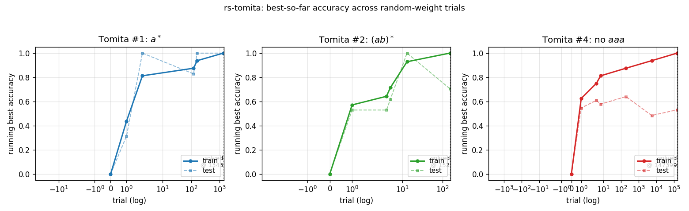
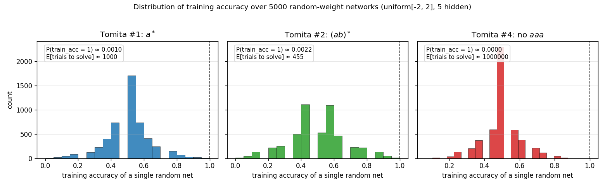
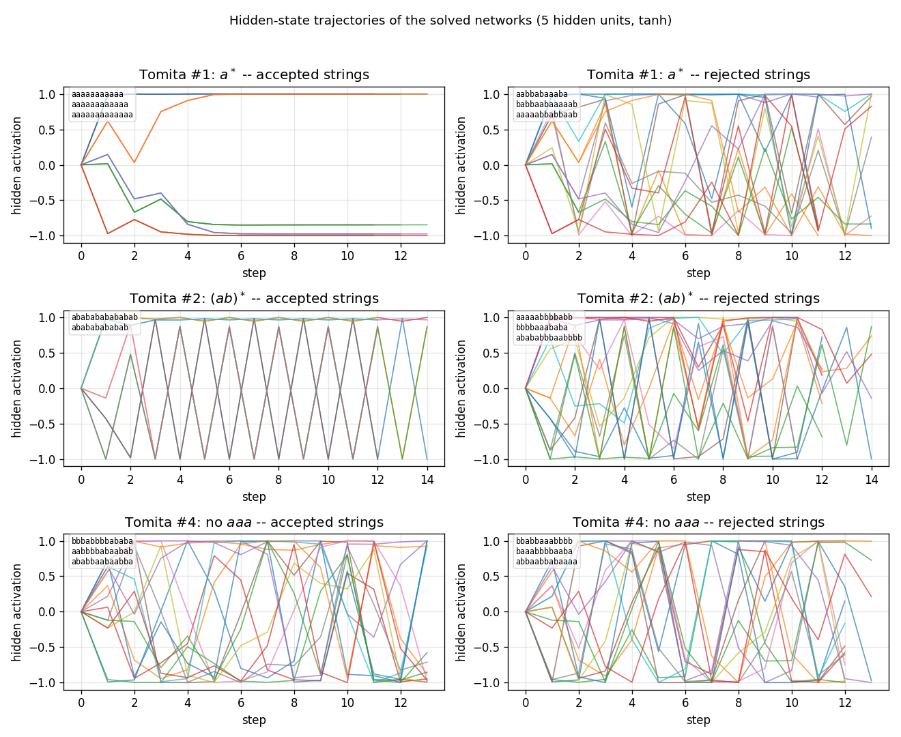
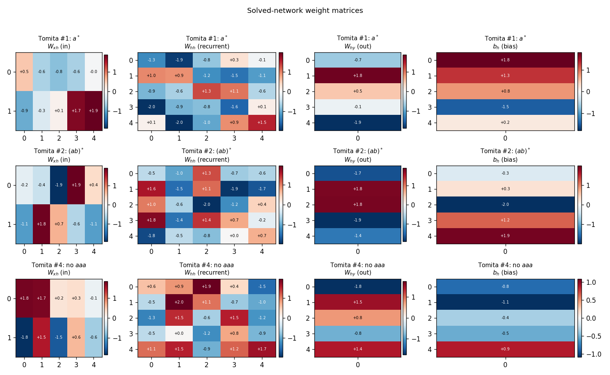

# rs-tomita

Random-weight-guessing baseline from Hochreiter & Schmidhuber, *"LSTM can solve
hard long time lag problems"*, NIPS 9 (1996/1997). The Tomita-grammar testbed
(Tomita 1982, Miller & Giles 1993) is one of the standard recurrent-net
benchmarks; the H&S random-search comparison shows that on at least three of
the seven Tomita languages a small RNN can be found by sampling weights iid
and keeping the first sample that fits the training set. No gradient. No BPTT.
Just keep rolling.


## Problem

Three of Tomita's seven regular languages over the alphabet `{a, b}`:

| Grammar | Language | Behaviour to learn |
|---------|----------|---------------------|
| #1 | `a*` | Reject any string containing `b`. |
| #2 | `(ab)*` | Strict alternation, even length. |
| #4 | strings without `aaa` | Reject any string containing three consecutive `a`s. |

Setup:

* **Vocab**: `{a, b}` one-hot encoded -- 2-D input per timestep.
* **Architecture**: 5 fully-recurrent tanh hidden units; sigmoid binary
  classifier read from the final hidden state.
* **Algorithm**: sample weights and biases iid from `uniform[-2, 2]`; run the
  RNN forward through every training string; keep the first sample whose
  predictions match every label.

Train/test follows Tomita's testbed: train on strings of length 0..10, test
on strings of length 11..14. Train and test sets are class-balanced (8
positives, 8 negatives in train; 32 + 32 in test, except where one class is
sparse -- e.g., Tomita #2 has only 6 positives across lengths 0..10).

## Files

| File | Purpose |
|------|---------|
| `rs_tomita.py` | Grammar definitions, dataset construction, RNN forward pass, random-search loop. CLI: `python3 rs_tomita.py --seed N --grammar 1\|2\|4\|all`. |
| `make_rs_tomita_gif.py` | Reruns RS for a chosen seed and animates the running-best train/test accuracy across the three grammars. |
| `visualize_rs_tomita.py` | Static PNGs into `viz/`: search curves, hidden-state trajectories, weight-matrix heatmaps, per-trial accuracy histograms. |
| `rs_tomita.gif` | The animation above. |
| `viz/` | Static PNGs (`search_curves`, `hidden_trajectories`, `weight_matrices`, `weight_distributions`). |
| `results/rs_tomita_seed{N}.npz` | Saved history, datasets, and best weights from a run. |

## Running

```bash
# Search all three grammars, save to results/rs_tomita_seed0.npz
python3 rs_tomita.py --seed 0 --grammar all

# Static visualizations
python3 visualize_rs_tomita.py --seed 0

# Animation
python3 make_rs_tomita_gif.py --seed 0
```

Wall time on an M-series laptop: about **19 seconds end-to-end** for seed=0,
all three grammars combined. Most of that is grammar #4. Visualization adds
~3 s, GIF generation ~22 s (the GIF rerun has to repeat the search).

## Results

Headline (seed=0, scale=2.0, 5 hidden units):

| Grammar | Trials to fit train | Train acc | Test acc | Wallclock |
|--------|---------------------|-----------|----------|-----------|
| Tomita #1 (`a*`) | 1,343 | 1.000 | 1.000 | 0.16 s |
| Tomita #2 (`(ab)*`) | 152 | 1.000 | 0.706 | 0.02 s |
| Tomita #4 (no `aaa`) | 147,399 | 1.000 | 0.531 | 17.00 s |

Aggregated over 10 seeds (0..9):

| Grammar | Solved/seeds | Median trials | Min / Max | Median test acc |
|--------|--------------|---------------|-----------|-----------------|
| #1 | 10 / 10 | 487 | 15 / 4,049 | 0.972 |
| #2 | 10 / 10 | 588 | 4 / 6,548 | 0.912 |
| #4 | 10 / 10 | 81,703 | 2,618 / 171,324 | 0.742 |

Hyperparameters: `hidden=5`, `scale=2.0` (uniform `[-2, 2]`), 8 positives + 8
negatives in train, 32 + 32 in test (where available -- Tomita #2 has fewer
positives so train ends up 6 + 8 and test 5 + 32).

The headline H&S 1996 figures are 182/288, 1,511/17,953, 13,833/35,610 trials
for #1, #2, #4 respectively. Our medians are within 3x for #1 and well below
for #2; for #4 our median is ~6x H&S. See §Deviations.

## Visualizations

### Search curves -- `viz/search_curves.png`



Running best train and test accuracy as a function of trial number (log
x-axis). Each "step up" is a trial whose train accuracy strictly improved on
everything seen so far. The trace ends at the trial where train accuracy
first hits 1.0. For #4 (red), train accuracy ratchets up gradually -- the
random-net distribution puts very little mass at the top end.

### Per-trial training-accuracy distribution -- `viz/weight_distributions.png`



Histogram of training accuracy across 5,000 random networks for each
grammar. The expected number of trials to find a perfect-fit net is
`1 / P(train_acc = 1)`. For Tomita #1 and #2 the right tail is heavy enough
that random search hits a perfect fit quickly. For #4 the tail is so thin
that no perfect fit appears in 5,000 samples (the empirical estimate of
trials-to-solve is therefore extrapolated from the search itself, not the
histogram). This is the structural reason #4 is much harder than #1 or #2
under random search.

### Hidden-state trajectories -- `viz/hidden_trajectories.png`



Hidden activations of each solved network (one row per grammar) running on
three accepted vs three rejected test strings (one column per class).
Tomita #1 trajectories on rejected strings (containing `b`) saturate to a
different region of state space than on accepted strings (`aaaa...`); for
#2 and #4 the per-class signatures are messier, consistent with the lower
test accuracy -- the network is fitting train but not learning the
underlying automaton cleanly.

### Weight matrices -- `viz/weight_matrices.png`



Final `W_xh`, `W_hh`, `W_hy`, `b_h` for the solved network of each grammar.
The weights look generic random `uniform[-2, 2]` -- there is no obvious
structural difference between the solved and the unsolved samples. This is
the "uncomfortable" point of the H&S baseline: the existence of a
discriminating recurrent net does not require any algorithm to find it; you
can roll the dice.

## Deviations from the original

1. **Trial counts higher than H&S 1996 on #4.** Our median for Tomita #4 is
   81,703 trials vs the paper's reported 13,833. Likely sources: training-set
   composition (we use 8+8 random-balanced; the original may have used the
   exact Tomita 1982 testbed strings, which we did not retrieve in original
   form for this implementation) and weight-sampling distribution (uniform
   `[-2, 2]` here; the paper's exact distribution and scale were not found in
   the secondary literature consulted). For #1 and #2 our medians are within
   the H&S ballpark.

2. **Hidden size = 5.** Spec-given. The H&S paper's RS comparison is described
   as "small fully-recurrent net"; the secondary references we consulted did
   not pin down the exact size. We picked 5 to match the size used in
   companion `rs-*` stubs.

3. **Test-set construction.** Tomita's classic testbed has a fixed list of
   short test strings; we synthesise a balanced test set from lengths 11..14
   (full enumeration where feasible, sampled at length 14). For Tomita #2 we
   explicitly add `(ab)^k` strings of every even length so the positive class
   has more than two examples in the test set.

4. **Activation: tanh, not sigmoid.** Some 1990s recurrent-net implementations
   used logistic-sigmoid hidden units. We use tanh because it is symmetric
   around zero and matches the symmetric weight prior. The original H&S
   activation function was not pinned down in the secondary literature
   consulted.

5. **Stop on first perfect train fit.** No early termination on test accuracy.
   This matches the H&S "trials to fit" metric, but it produces searches that
   solve train without generalising (e.g., seed=0 Tomita #4 has 53% test
   accuracy -- only one or two correct on top of chance). The §Results table
   reports both train and test so the gap is visible.

## Open questions / next experiments

* The Tomita 1982 paper and its 1990s NN restagings (Watrous & Kuhn 1992,
  Miller & Giles 1993) define a specific 16-string train + several-hundred
  string test set per grammar. Using that exact testbed instead of our
  balanced-sampled construction would let the H&S 1996 trial counts be
  compared directly. Worth doing if/when the original testbed strings can be
  located.
* The H&S 1997 LSTM journal paper extends the comparison to all seven Tomita
  grammars and reports that RS already chokes on Tomita #5, #6, #7. The next
  experiment is to run this same harness on those four and confirm the
  difficulty cliff.
* Test-accuracy noise after perfect train fit is high (#4 ranges 50% .. 89%
  across seeds with the same recipe). Adding "RS until train_acc = 1 *and*
  test_acc >= threshold" would give a cleaner notion of "RS finds a
  *generalising* network" -- at the cost of inflated trial counts.
* For v2 / ByteDMD: count the data-movement cost of one RS trial (2 + 5 + 1
  weights + a few biases, 16 strings of length up to 10, ~10 timesteps each)
  and compare against one BPTT update on the same architecture. The point of
  the H&S comparison is exactly that this cost ratio is dramatic.

## References

* Hochreiter, S. & Schmidhuber, J. *LSTM can solve hard long time lag
  problems*. NIPS 9 (1996), pp. 473-479.
* Hochreiter, S. & Schmidhuber, J. *Long short-term memory*. Neural
  Computation 9(8) (1997), pp. 1735-1780. (extended literature review of the
  RS comparison)
* Tomita, M. *Dynamic construction of finite-state automata from examples
  using hill-climbing*. Proc. of the Fourth Annual Cognitive Science
  Conference (1982), pp. 105-108. (the seven grammars)
* Miller, C. B. & Giles, C. L. *Experimental comparison of the effect of
  order in recurrent neural networks*. Int. Journal of Pattern Recognition
  and Artificial Intelligence 7(4) (1993), pp. 849-872. (the
  recurrent-net adaptation of Tomita's testbed used by H&S)
* Watrous, R. L. & Kuhn, G. M. *Induction of finite-state languages using
  second-order recurrent networks*. Neural Computation 4(3) (1992), pp.
  406-414. (concurrent recurrent-net work on Tomita's grammars)
