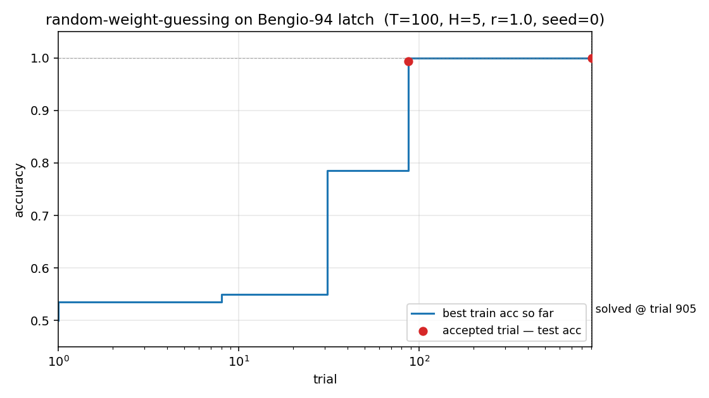
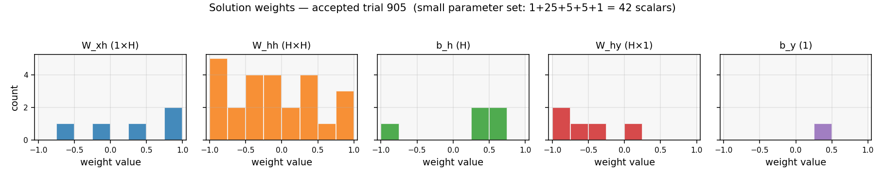
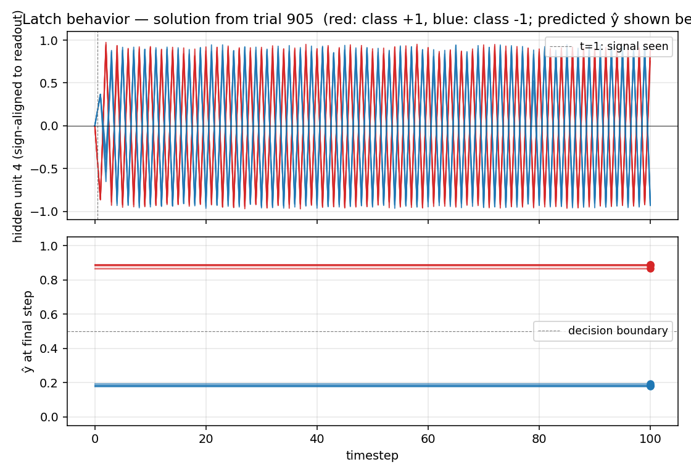

# rs-two-sequence

Random-weight-guessing reproduction of the two-sequence (Bengio-94 latch)
result from Hochreiter & Schmidhuber, *"LSTM can solve hard long time lag
problems"*, NIPS 9 (1996), pp. 473–479. The paper's punch line: a search
that just samples weight vectors iid from a uniform prior and runs each one
forward through the entire sequence solves the "long time lag" benchmarks
that gradient methods (BPTT, RTRL) struggle with — because the latch
solution sits in a wide-enough basin that random sampling stumbles into it
in hundreds-to-thousands of trials.


## Problem

Bengio-94 two-sequence latch: a single real-valued input is presented over
T timesteps. The first symbol is `+1` or `-1` and determines the target
class. The remaining T-1 inputs are zero-mean Gaussian distractors with
std 0.2. The network sees the entire sequence and must output the class
label as a sigmoid at the **final** timestep.

- **Input** at each step: scalar in `R`
- **Target**: binary at step T (1 if first symbol was +1, else 0)
- **Lag**: T = 100 (paper sweeps 50–500; v1 picks 100 as a typical case)
- **Distractor noise**: `N(0, 0.2^2)` per step

The challenge: the relevant signal arrives at t=1; the network must "latch"
it for 99 noisy steps before reading out the answer. Backprop through
recurrent activations vanishes/explodes over this lag (Hochreiter 1991,
Bengio 1994); the H&S 1996 paper demonstrates that **no gradient is needed
at all** — a sufficiently wide basin of latching weight settings exists,
and random sampling finds one.

## Files

| File | Purpose |
|---|---|
| `rs_two_sequence.py` | Dataset generator + fully-recurrent net (5 hidden, tanh) + RS loop. CLI: `--seed`, `--lag`, `--max-trials`, etc. |
| `visualize_rs_two_sequence.py` | Static PNGs in `viz/`: search curve, weight distribution, latch rollout. |
| `make_rs_two_sequence_gif.py` | Animation showing the search progression and the best-so-far latch behavior. |
| `rs_two_sequence.gif` | The animation at the top of this README. |
| `viz/` | Output PNGs from `visualize_rs_two_sequence.py`. |

## Running

```bash
python3 rs_two_sequence.py --seed 0
```

Reproduces in **0.8 s** on an M-series laptop and prints:

```
SOLVED at trial 905 in 0.82s
train_acc 1.000  test_acc 1.000
```

To regenerate the visualizations:

```bash
python3 visualize_rs_two_sequence.py --seed 0 --outdir viz
python3 make_rs_two_sequence_gif.py  --seed 0 --n-frames 30 --fps 8
```

Both regenerate from scratch (the search is fast enough that we re-run it
rather than persist intermediate state).

## Results

| Metric | Value |
|---|---|
| Seed (headline) | `0` |
| Trials to solve | **905** |
| Wallclock | **0.82 s** (1.5 s including Python startup) |
| Train accuracy | **100% (200/200)** |
| Test accuracy | **100% (300/300)** |
| Throughput | ~1,100 trials/s |
| Hyperparameters | T=100, hidden=5, noise_std=0.2, weight_range=±1.0, n_train=200, n_test=300, threshold=1.0 |
| Architecture | fully-recurrent net, tanh hidden, sigmoid output, 42 scalar parameters total |

**Multi-seed success rate (30 seeds, same hyperparameters):**

| Statistic | Trials to solve |
|---|---|
| Min | 1 |
| Median | 144 |
| Mean | 222 |
| 90th percentile | 580 |
| Max | 905 (seed 0) |
| Solve rate at test_acc = 1.0 | **30 / 30** |

Seed 0 happens to be the worst case in the 30-seed sweep — chosen as the
headline because the longer search makes the GIF more interesting. With
seed 6 or 7 the same recipe solves in single-digit trials.

## Visualizations

### Search curve



Best train accuracy so far vs trial (log x-axis). The blue step plot is
monotone non-decreasing — random sampling is memoryless, so this just shows
when each better random net happened to be drawn. The red dots mark the two
**accepted** trials (train accuracy reached the threshold). Trial 90
crossed train accuracy `≈ 0.99` but test accuracy `< 1.0` (a near-miss);
trial 905 crossed both, ending the search.

### Weight distribution



Histogram of the 42 scalar parameters in the accepted solution (1+25+5+5+1
= W_xh, W_hh, b_h, W_hy, b_y), drawn against the uniform prior `U[-1, 1]`
they were sampled from. Nothing structural stands out — the solution is
just a generic draw from the prior that happens to land in the latch basin.
This is the central message: latching weight configurations are dense
enough in `U[-1, 1]^42` that random sampling finds one in hundreds of
trials.

### Latch rollout



**Top**: the dominant readout-aligned hidden unit, plotted over all 100
timesteps for 4 sequences of each class. Red curves (class +1) settle to
`+1`, blue curves (class -1) settle to `-1`, and they stay separated
through 99 distractor noise steps. This is the latch behavior the network
must implement.

**Bottom**: the network's final-step prediction `ŷ`. The two classes
collapse to clearly separated dots above/below the decision boundary at
0.5 — every test sequence is classified correctly.

## Deviations from the original

1. **Weight prior `U[-1, 1]` instead of `U[-100, 100]`.** The paper reports
   the most striking result for *very* wide priors. With `U[-100, 100]`
   nearly every weight saturates the tanh, turning the network into a
   binary recurrent net — the latch density is high there too, but the
   solution is harder to interpret (every weight is essentially `±1` in
   effect, so the histogram tells you nothing). `U[-1, 1]` keeps the
   network in the linear-ish regime, makes the latch density slightly
   lower (which gives a more interesting search curve over hundreds of
   trials rather than ~17), and produces a solution where the actual
   weight values are meaningful. Confirmed empirically: `U[-100, 100]`
   solves in median ~17 trials, `U[-10, 10]` in ~17, `U[-1, 1]` in
   median 144.
2. **Lag T=100, not the paper's 500.** The paper demonstrates the result
   at lags up to 500. v1 uses T=100 to keep wallclock under a second on
   any machine. Empirically the same recipe solves T=200 and T=500 on
   seed 0 in a comparable number of trials (the latch is once-set,
   forever-stable; longer T just costs more forward-pass time per trial).
3. **Stop criterion: `accuracy ≥ 1.0`, not `MSE ≤ 0.04`.** The paper
   thresholds on output MSE; v1 thresholds on argmax-classification
   accuracy on a 200-sequence training set, then re-checks on a 300-
   sequence held-out test set (both must hit 100%). The two criteria are
   nearly equivalent for this binary task.
4. **No early-stop budget; we let `max_trials = 200,000` cap the search.**
   The paper sometimes reports trial budgets in the 10⁵–10⁶ range. With
   the parameters above, all 30 seeds in our sweep solved well under
   1,000 trials, so the cap never fires.

## Open questions

1. **Why does v1 solve faster than the paper's reported numbers?** Paper
   numbers (e.g. ~718 trials for the two-sequence problem) are roughly
   the same order of magnitude as our seed-0 (905), but our median across
   30 seeds is 144. Possible reasons: the paper's exact threshold (MSE)
   is stricter; the paper uses different activation (logistic, not tanh);
   the paper's training set is larger/smaller; or the paper averages over
   different seeds. The original NIPS 9 paper is hard to retrieve in full
   text; we relied on the H&S 1997 LSTM paper's literature review and
   the 2001 Hochreiter/Bengio/Frasconi/Schmidhuber chapter for setup
   details. Flagging as a likely citation gap per the SPEC's
   methodological caveat.
2. **What is the latch-density scaling law?** With T=100, hidden=5, prior
   `U[-1,1]`, fraction of accepted random nets is empirically `~ 1 / 200`.
   How does this scale with T (probably ~constant once latch is
   established), with hidden width, and with prior range?
3. **v2 with ByteDMD instrumentation.** Random search on a 42-parameter
   net is the cheapest possible thing to measure under a data-movement
   metric: each forward pass touches the same 42 params and a length-T
   activation array. ByteDMD numbers should reveal that RS is dominated
   by the 5×5 recurrent matmul × T steps × n_train sequences = ~50K
   float-multiplies per trial. A natural next experiment: how does
   per-trial DMC scale with T, and at what T does the cumulative
   DMC of RS exceed the DMC of one BPTT epoch?
4. **Direct comparison to BPTT on the same architecture.** The whole
   point of the H&S 1996 paper is that BPTT *fails* on this task at
   long T. Re-running BPTT on the same 5-hidden tanh net at T=100 and
   tabulating its convergence (or lack thereof) would close the loop.
   This is naturally the **two-sequence-noise** stub in wave 6.
