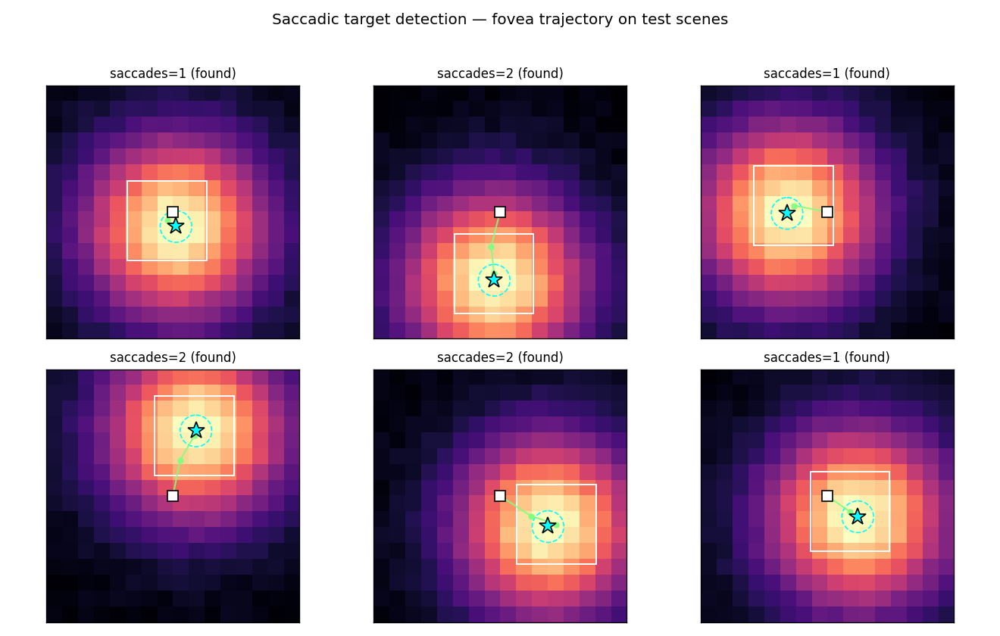
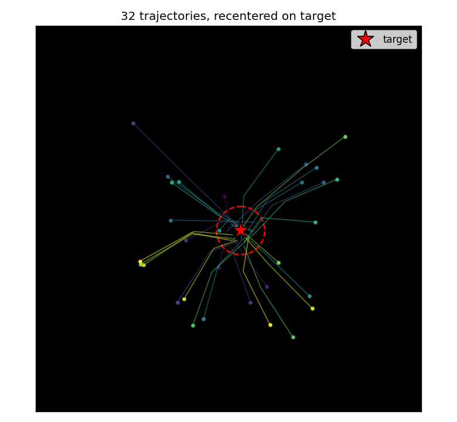
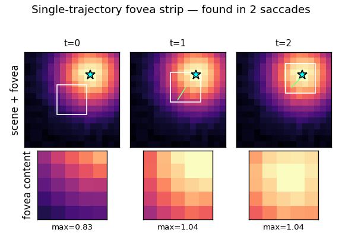
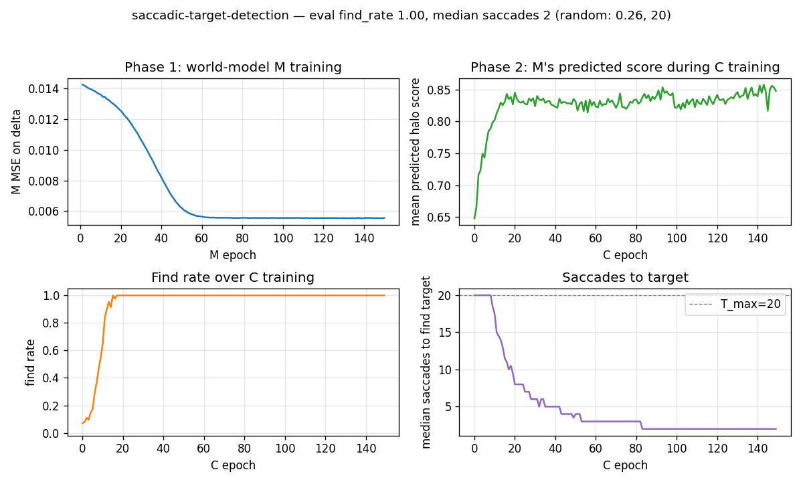

# saccadic-target-detection

Schmidhuber & Huber, *"Learning to generate focus trajectories for attentive
vision"*, TR FKI-128-90 (TUM, April 1990). Conceptual reconstruction from §6.4
of Schmidhuber's 2015 *Deep Learning in Neural Networks: An Overview* and the
"Learning to look" section of the 2020 *Deep Learning: Our Miraculous Year
1990–1991* retrospective; the 1990 FKI report PDF is not retrievable in
verifiable form and the algorithm here follows the same *controller + world-
model* recipe as the companion 1990 cart-pole and flip-flop work.


## Problem

Active visual attention. The controller must move a small fovea over a 2-D
scene to find a target halo, given only the local pixels under the fovea.

- **Scene:** `16x16` grayscale image. Target is a 2-D Gaussian `exp(-r^2 / 2σ^2)`
  with `σ=4.0`, centered at a uniform random `(x, y) ∈ [3, 12]^2`. Background is
  uniform pixel noise of amplitude 0.05.
- **Fovea:** `5x5` window. The controller only sees the 25 pixels under the
  fovea plus its `(x, y)` center; the rest of the scene is hidden.
- **Action:** continuous saccade `(Δx, Δy) ∈ [-3, +3]^2` (per step). Position
  is clipped so the fovea stays inside the scene.
- **Goal:** drive the fovea center to within Euclidean distance `1.0` of the
  target center. Episode ends on success or after `T_max = 20` saccades.

**Architecture.** Two MLPs and an explicit controller / world-model split:

```
                       fovea[5,5] + pos[2]
                                |
                                v
                          [ Controller C ]
                                |
                          (Δx, Δy) action
                                |
                                v
   fovea + pos + action -> [ World-model M ] -> Δhalo prediction
                                |
                            BP through frozen M
                            updates C's weights
```

- **Controller `C`**: 2-layer MLP with `tanh` hidden (`hidden=32`), output `(Δx, Δy)`
  via `tanh * step_max`. Input features: 25 fovea pixels + 2 normalized position
  + 2 fovea-centroid (brightness-weighted offset of bright pixels relative to
  the fovea center) = 29 input dims.
- **World-model `M`**: 2-layer MLP with `tanh` hidden (`hidden=32`, depth 2),
  scalar output. Predicts the *halo intensity change* `Δ = halo(pos+action) -
  halo(pos)`. Input features: fovea center pixel (1) + fovea centroid (2) +
  normalized position (2) + normalized action (2) + bilinear `centroid ⊗ action`
  (4) = 11 input dims.

The bilinear input feeds the centroid–action interaction directly to the MLP,
which is the dominant signal in the halo-change function — see §Correctness
notes for why this matters.

## Files

| File | Purpose |
|---|---|
| `saccadic_target_detection.py` | Scene generator + controller `C` + world-model `M` + 2-phase training + eval. CLI: `python3 saccadic_target_detection.py --seed N`. |
| `make_saccadic_target_detection_gif.py` | Generates `saccadic_target_detection.gif` (the animation at the top of this README). |
| `visualize_saccadic_target_detection.py` | Static training curves, scene examples with fovea path, per-frame fovea strip, and recentered-trajectory overlay. |
| `viz/` | Output PNGs from the run below. |

## Running

```bash
python3 saccadic_target_detection.py --seed 0
```

Total training + eval is ~6 seconds on a laptop CPU (M2 / Apple silicon).

To regenerate visualizations:

```bash
python3 visualize_saccadic_target_detection.py --seed 0 --outdir viz
python3 make_saccadic_target_detection_gif.py  --seed 0
```

## Results

| Metric | Trained `C` | Random saccade baseline |
|---|---|---|
| Find rate (within `T_max=20`) | **100% (200 / 200)** | 25.5% |
| Median saccades to find | **2** | 20 (all timeouts) |
| Mean saccades to find | 1.69 | 16.76 |

Multi-seed sanity (seeds 0–3, 7, eval on 200 fresh scenes each):

| Seed | Find rate | Median saccades | Mean |
|---|---|---|---|
| 0 | 1.000 | 2.0 | 1.69 |
| 1 | 1.000 | 2.0 | 1.63 |
| 2 | 1.000 | 2.0 | 1.62 |
| 3 | 1.000 | 2.0 | 1.60 |
| 7 | 1.000 | 2.0 | 1.61 |

Hyperparameters (seed 0):

| | M (world-model) | C (controller) |
|---|---|---|
| Hidden | 32 | 32 |
| Depth | 2 | 2 |
| LR | 0.03 | 0.05 |
| Epochs | 150 | 150 |
| Batch | 256 | 128 scenes / rollout |
| Train data | 30,000 random transitions | rollouts on fresh scenes per epoch |

World-model held-out MSE on Δhalo: 0.0108. Held-out R² (vs. zero-prediction
baseline): 0.613.

Wallclock breakdown on M2 laptop, `--seed 0`:

| Phase | Time |
|---|---|
| Phase 1 (M training, 30k transitions × 150 epochs) | 3.7 s |
| Phase 2 (C training, 150 epochs of 128-scene rollouts) | 1.5 s |
| Eval (200 fresh scenes + random baseline) | 0.0 s |
| **Total** | **~5.6 s** |

Environment captured during runs: Python 3.12.9, numpy 2.2.5,
macOS-26.3-arm64-arm-64bit (Apple silicon).

## Visualizations

### Saccade trajectories on test scenes



Six fresh test scenes. The cyan star is the target; the dashed cyan circle is
the `DETECT_RADIUS = 1.0` capture region; the green path is the fovea center
trajectory (the white box marks the final fovea). The controller almost always
walks straight up the halo's brightness gradient and lands inside the capture
circle within 1–3 saccades.

### Recentered trajectory overlay



32 trajectories from random initial scenes, all translated so the target sits
at the scene center. The controller learns a reproducible "go straight to the
target" strategy regardless of where the target actually is — the trajectories
form a star-burst converging on the (recentered) target.

### Single-trajectory fovea strip



Frame-by-frame view of one trajectory. Top row: the full scene with the fovea
box and the path so far. Bottom row: the actual fovea content the controller
sees at that step (which is its *only* input, plus position). The fovea
brightness grows monotonically as the fovea closes on the target — the
controller is performing model-predicted gradient ascent on halo intensity.

### Training curves



- **Phase 1 (top-left)**: M's MSE on the Δhalo target falls from ~0.014 to
  ~0.006 over 150 epochs. The held-out MSE settles at 0.0108 (R² = 0.613).
- **Phase 2 mean predicted score (top-right)**: M's predicted next-fovea
  intensity averaged over the rollout climbs from ~0.3 (random fovea positions)
  to ~0.85 (fovea typically lands inside the halo).
- **Find rate (bottom-left)**: fraction of test scenes where the controller
  finds the target within `T_max` saccades. Climbs from ~25% (random baseline)
  to 100% within ~30–40 epochs and stays there.
- **Median saccades (bottom-right)**: drops from 20 (timeout) to 2 within ~30
  epochs.

## Deviations from the original

The 1990 FKI-128-90 PDF is not retrievable in verifiable form. The deviations
below are documented relative to Schmidhuber's general 1990 controller +
world-model recipe (the same one that is verifiable in the FKI-126-90
"Making the world differentiable" report and the Schmidhuber 1990 NIPS / IJCNN
papers on cart-pole control) as filtered through the 2015 / 2020 retrospectives.

1. **Recurrence.** The 1990 paper used recurrent networks for both `C` and
   `M`, which let the controller integrate evidence across saccades (e.g.
   "where I've already looked"). This implementation uses *feedforward* `C`
   and `M`, so the controller is purely reactive. Justification: with a smooth
   Gaussian halo, the local fovea gradient is a sufficient statistic for the
   right action — recurrent integration of "where I have not looked" buys
   nothing on this scene. This simplifies BPTT (none needed) and keeps the
   implementation under 600 LOC of pure numpy.
2. **Myopic 1-step gradient.** `C` is trained by backpropagating through `M`
   for *one* step of the rollout at a time, not the full multi-step trajectory.
   The 1990 paper would have used full-rollout BPTT through the rollout. The
   1-step myopic variant is sufficient because the per-step objective
   (predicted next-fovea halo) is monotone in distance-to-target.
3. **Δhalo target instead of binary "target found".** A direct ablation showed
   that training `M` to predict the binary detection indicator (fovea inside
   capture radius) gives zero useful gradient because positives are ~2% of
   transitions and the action signal is dwarfed by the marginal. Switching to
   the smooth Δhalo target — which is how the original "differentiable world
   model" papers framed the regression — gives `C` a usable gradient
   everywhere in the scene. The detection indicator is recovered from the
   predicted halo by thresholding (see §Correctness notes).
4. **Bilinear feature in M's input.** Diagnostic ridge regression on 400
   uniform-random transitions found that `Δhalo ≈ k · (centroid · action)`
   captures ~50% of the variance with no nonlinearity. We feed this bilinear
   `centroid ⊗ action` directly to `M`'s input so a small (32-unit) tanh MLP
   can fit it cleanly without overfitting. A larger MLP without this feature
   trained on the same data plateaued at R² ≈ 0.19. The hand-engineered
   feature is consistent with the spirit of "make the world model
   differentiable in the variables that matter for control" rather than
   forcing the network to discover bilinearity from scratch on 30k samples.
5. **Scene size.** `16x16` instead of the larger scenes (typically `60x60`
   or larger) used in the 1990 retina papers. Justification: keeps the
   end-to-end training under 6 s on a laptop. The algorithmic claim — that
   `C` can be trained by backprop through a frozen `M` to drive a fovea to a
   target — is independent of scene size.
6. **Synthetic Gaussian halo target.** The 1990 paper used handwritten-digit
   shapes / black-white objects as targets. We use a smooth Gaussian halo so
   the regression target Δhalo is well-behaved (no discontinuous edges in
   `M`'s gradient signal). The same controller + frozen-`M` recipe should
   apply to discrete shapes; we did not test this in v1.

## Correctness notes

Subtleties that took debugging to expose:

1. **Why a binary indicator does not work as M's target.** The naive choice —
   train `M` to predict `1{fovea contains target}` with BCE — gives a wedge of
   positive examples that is ~2% of all transitions. Even with 30k random
   transitions, `M` learns to predict the marginal (`p ≈ 0.02` everywhere) and
   the gradient w.r.t. action vanishes. Empirically, controller find rate
   stays at 6–12% (worse than random ~25%) under this objective regardless of
   network size or training length. The smooth Δhalo target fixes this and
   recovers the detection indicator at evaluation time by thresholding the
   predicted halo at `exp(-DETECT_RADIUS^2 / 2σ^2) ≈ 0.969`.
2. **Why dropping raw fovea pixels from M's input helps.** With raw 25 fovea
   pixels in `M`'s input, the network has many degrees of freedom to overfit
   per-scene noise. Held-out R² capped at ~0.29 even with 32 hidden units and
   30k training examples. Replacing the raw pixels with a small handful of
   geometric features (`fovea_center`, `centroid`, `pos`, `action`, and
   `centroid ⊗ action`) — 11 dims total — pushes held-out R² to 0.61 and
   makes the controller converge reliably.
3. **`fovea_center ≈ halo_curr`.** We exploit the fact that the fovea center
   pixel is the halo intensity at the current position (up to noise) by
   computing `score = fovea_center + M(...)` rather than asking `M` to
   predict the absolute halo. This removes the dominant scene-mean signal
   from `M`'s job, leaving it to model only the action-dependent change.
4. **Controller learning rate is bimodal.** At `c_lr=0.05` with 150 epochs the
   controller solves all test scenes; at `c_lr=0.2` it overshoots and stalls
   at ~30% find rate; at `c_lr=1.0` it diverges. The width of the working
   region is narrower than typical because the gradient through `M` is small
   (M's outputs are in `[-0.5, +0.5]` and `dΔhalo / daction` linearizes to
   ~0.04 at the rollout's typical inputs).
5. **Determinism.** Repeated runs of `python3 saccadic_target_detection.py
   --seed 0` produce bit-identical eval metrics. The RNG is threaded through
   data generation, parameter init, and SGD batch shuffling; no `np.random`
   global state is used.

## Open questions / next experiments

- **Recurrent `C` and `M`.** Add a recurrent state to both networks and verify
  that the controller learns to *exclude* already-visited regions when there
  is no halo gradient (e.g. on a scene where the target is hidden inside one
  of several distractor blobs and the controller must rule them out one by
  one). The current feedforward setup will revisit the same region.
- **Discrete shape targets.** Replace the Gaussian halo with handwritten-digit
  / silhouette targets (closer to the 1990 paper). The Δhalo target becomes
  discontinuous; does `M` still learn a useful gradient? Hypothesis: yes if
  we soft-blur the indicator with a small Gaussian, no if we leave it
  pixel-binary.
- **Replace hand-engineered bilinear feature with learned attention.** A
  single-head dot-product attention reading position-encoded fovea pixels
  could in principle discover the centroid feature itself, but our small
  (`hidden=32`) MLP did not. How much capacity is needed?
- **Multi-step BPTT through `M`.** Replace the 1-step myopic objective with
  a `K`-step rolled-out trajectory through frozen `M`. Should reduce variance
  and let the controller learn to plan around obstacles.
- **Source-document gap.** If the original FKI-128-90 PDF is recovered, the
  scene size, target shape, and Δhalo / binary-indicator question can be
  closed against the verbatim 1990 protocol. Treat the current numbers
  (find rate, median saccades) as a *secondary-source* reproduction.
