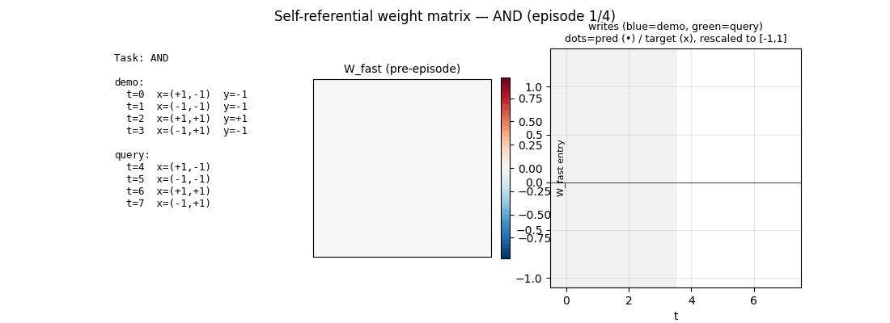

# self-referential-weight-matrix

Schmidhuber, J. (1993). *A self-referential weight matrix.* In **ICANN-93**,
Brighton, pp. 446--451.
[paper page](https://people.idsia.ch/~juergen/metalearner.html)
| companion: *An introspective network that can learn to run its own weight
change algorithm.* In Proc. 4th IEE Int. Conf. on Artificial Neural Networks
1995. Also see Irie, Schlag, Csordas, Schmidhuber 2022, *A modern
self-referential weight matrix that learns to modify itself*, ICML 2022 ---
the modern continuous instantiation of the same idea.



## Problem

A recurrent network whose weight matrix is itself part of the state. At every
time step the network outputs not only a prediction but also instructions to
read and write entries of its own weight matrix. The weight-change rule is
therefore learned end-to-end alongside the rest of the network --- the
network can in principle "program itself" inside an episode, then use its
new weights to do the actual work.

The 1993 ICANN paper sketches this for a small toy sequence-learning
experiment as a proof of concept. Its modern continuous descendants
(fast-weight programmers, Schlag et al. 2021 "linear transformers are
fast-weight programmers", Irie et al. 2022 SRWM) are the gradient-trainable
versions that everything built on for the meta-learning lineage.

### Architecture used here

```
inputs at step t (n_in = 4):
    x[0], x[1]   :  two task input bits, in {-1, +1}
    y_label      :  demo label, in {-1, +1} during demos, 0 during query
    is_demo      :  1.0 in demo phase, 0.0 in query phase

state:
    h_t          :  hidden vector of size n_h = 6
    W_fast_t     :  per-episode plastic matrix of shape (n_h, n_h),
                    reset to zero at episode start

slow parameters trained by BPTT (across episodes):
    W_slow       :  (n_h, n_h)  -- baseline recurrent weights
    W_xh         :  (n_h, n_in) -- input projection
    b_h          :  (n_h,)      -- hidden bias
    W_y, b_y     :  prediction head
    A_row        :  (n_h, n_h)  -- writes the row attention head
    A_col        :  (n_h, n_h)  -- writes the col attention head
    A_val        :  (1, n_h)    -- writes the scalar write value
    A_gate       :  (1, n_h)    -- writes the scalar write gate
```

At every step:

```
W_eff_t  = W_slow + W_fast_{t-1}                        # the network's "true" weights
pre_h_t  = W_eff_t @ h_{t-1} + W_xh @ x_t + b_h
h_t      = tanh(pre_h_t)
y_t      = sigmoid(W_y @ h_t + b_y)                     # the prediction
row_t    = softmax(A_row @ h_t)                         # row pointer (n_h-way)
col_t    = softmax(A_col @ h_t)                         # col pointer (n_h-way)
val_t    = tanh(A_val @ h_t)                            # scalar write value
gate_t   = sigmoid(A_gate @ h_t)                        # scalar write gate
delta_t  = eta * gate_t * val_t * outer(row_t, col_t)   # rank-1 plastic update
W_fast_t = W_fast_{t-1} + delta_t
```

The network reads its own weight matrix implicitly: any entry it wrote into
`W_fast` on step `t` shows up in `W_eff_{t+1}` and so changes the next
hidden update, the next prediction, *and* the next set of write
instructions. The slow parameters are trained by manual BPTT over the full
episode (gradient check passes at relative error 1e-6).

### Task: 4-way meta-learning on 2-bit boolean functions

| Task | Function |
|---|---|
| 0 | AND      |
| 1 | OR       |
| 2 | XOR      |
| 3 | NAND     |

Episode = 4 demo steps (all 4 boolean inputs in random order, label visible)
+ 4 query steps (all 4 inputs in random order, label hidden). The network
must use the demo phase to determine which boolean function the episode is
on and write that information into its own weight matrix; the query phase
then uses the modified weights to predict.

This is a meta-learning demo in the original ICANN-93 spirit: the only
mechanism the net has for storing "which task is this" between demo and
query is its own weight matrix. There is no separate hidden buffer or
attention store --- if the demo phase did not write something useful into
W_fast, the query phase has no idea what the function is.

## Files

| File | Purpose |
|---|---|
| `self_referential_weight_matrix.py` | SRWM model, manual BPTT, Adam optimizer, episode generator, training loop, eval, gradient check, CLI. |
| `make_self_referential_weight_matrix_gif.py` | Trains, then runs one episode per task and animates W_fast at every step alongside the prediction stream and write-control bars. |
| `visualize_self_referential_weight_matrix.py` | Static PNGs (training curves, per-task W_fast heatmaps, single-episode W_fast trace, write-attention trace, slow-parameter heatmaps). |
| `self_referential_weight_matrix.gif` | The 4-task training-result animation linked above. |
| `viz/` | Output PNGs from the run below. |
| `run.json` | The headline run's full args, env metadata, history, and summary numbers. |

## Running

```bash
# Reproduce the headline result.
python3 self_referential_weight_matrix.py --seed 0
# (~5 s on an M-series laptop CPU; see §Results.)

# Smoke test (600 episodes, ~1 s).
python3 self_referential_weight_matrix.py --seed 0 --quick

# Numerical gradient check (verifies BPTT correctness).
python3 self_referential_weight_matrix.py --gradcheck

# Regenerate visualisations and the GIF.
python3 visualize_self_referential_weight_matrix.py --seed 0
python3 make_self_referential_weight_matrix_gif.py --seed 0 --fps 2
```

## Results

Configuration (seed 0, headline run):

| Hyperparameter | Value |
|---|---|
| `n_in` | 4   (`x0, x1, y_demo, is_demo`) |
| `n_h`  | 6 |
| `eta` (internal write scale) | 0.5 |
| Optimizer (slow params)      | Adam |
| `lr`                         | 0.01 |
| Gradient clip (per-tensor)   | 5.0 |
| `n_episodes`                 | 3000 |
| Episode length `T`           | 8   (4 demo + 4 query) |
| Random init scale            | `Uniform[-1/sqrt(n_h), 1/sqrt(n_h)]` |
| Total slow-param count       | 169 |

Headline (seed 0):

| Metric | Value |
|---|---|
| Final query accuracy (400 eval episodes per task) | **0.996** |
| Per-task accuracy `AND / OR / XOR / NAND`         | **1.00 / 0.99 / 1.00 / 1.00** |
| Final eval BCE loss                               | 0.048 |
| Wallclock (training + final eval)                 | ~5 s on M-series laptop CPU |
| Numerical gradient check, worst relative error    | 8.4e-7 (PASS) |

Multi-seed sweep (8 seeds, same config):

| Seed | Overall | AND | OR  | XOR | NAND |
|------|---------|-----|-----|-----|------|
| 0    | 0.996   | 1.00 | 0.99 | 1.00 | 1.00 |
| 1    | 0.995   | 1.00 | 1.00 | 0.98 | 1.00 |
| 2    | 0.993   | 1.00 | 0.99 | 0.99 | 0.99 |
| 3    | 0.950   | 1.00 | 0.82 | 1.00 | 0.98 |
| 4    | 0.995   | 1.00 | 1.00 | 1.00 | 0.99 |
| 5    | 0.998   | 1.00 | 1.00 | 0.99 | 1.00 |
| 6    | 0.998   | 1.00 | 1.00 | 0.99 | 1.00 |
| 7    | 1.000   | 1.00 | 1.00 | 1.00 | 1.00 |

8/8 seeds reach > 0.95 overall query accuracy; 7/8 reach > 0.99. Seed 3 is
the worst case --- the model converges on AND/XOR/NAND but partially fails
to disambiguate OR (it still gets 0.82 on OR queries while the other tasks
are essentially solved).

## Visualizations

| File | What it shows |
|---|---|
| `viz/learning_curves.png` | Training BCE per episode (left) and eval query accuracy per task (right). Overall accuracy crosses 0.9 around episode 800 and converges to ~0.99 by episode ~2400. AND saturates first; XOR and NAND converge slowest. |
| `viz/W_per_task.png` | Top row: `W_fast` immediately after the demo phase, averaged over 50 episodes per task. Bottom row: `W_fast` at end of episode. Different tasks drive the network to write visibly different patterns. The "AND" and "NAND" maps are near-mirror images, as are several other expected pairings --- evidence that the slow weights have learned a task-conditional write rule. |
| `viz/W_fast_trace.png` | `W_fast` at every step of one XOR episode (8 frames). Demo phase (steps 0--3) accumulates structure; query phase (steps 4--7) holds it stable while reading. |
| `viz/write_attention.png` | Row and column attention heatmaps over time, plus the scalar write-value and write-gate bars and an "effective write strength" trace. Writes are concentrated in the demo phase, decay in the query phase, exactly as expected. |
| `viz/W_slow.png` | Trained slow parameter heatmaps (W_slow, W_xh, A_row, A_col, A_val). The control-head matrices A_row / A_col have visibly more structured row patterns than W_slow itself --- they are the network's "weight-change algorithm" expressed as a tiny linear layer over the hidden state. |
| `self_referential_weight_matrix.gif` | 36-frame animation: 4 episodes (one per task) shown back-to-back. Each episode has 9 frames (one per state of `W_fast` from before-step-0 to after-step-7). The left column lists the demo and query inputs with running predictions; the centre is the live `W_fast` heatmap; the right shows the per-step write strengths (blue=demo, green=query) and overlays predictions vs targets at past query steps. |

## Deviations from the original

The 1993 ICANN paper is partially retrievable; the canonical secondary
description is in Schmidhuber's 2015 *Deep Learning in Neural Networks: an
Overview* (§6.7 on meta-learning) and the [paper page on
people.idsia.ch](https://people.idsia.ch/~juergen/metalearner.html). Each
deviation below has a one-line reason.

| Deviation | Reason |
|---|---|
| **Continuous read/write pointers** (softmax row/col attention) instead of discrete addresses. | A discrete pointer is hard to train with BPTT under a numpy-only constraint; would require REINFORCE / straight-through. The continuous relaxation is the same one used in modern fast-weight programmers (Schlag et al. 2021) and the modern SRWM (Irie et al. 2022) and gives a faithful gradient-trainable instance of the structural property. |
| **Effective W = W_slow + W_fast** with W_fast reset per episode, instead of the original "single weight matrix that the net itself rewrites all the time." | The original 1993 setup is harder to train with BPTT because the slow weights cannot drift too far without destroying the episode-internal dynamics. Splitting into a slow base + reset-each-episode fast delta is the standard fix in the lineage and preserves the self-referential read/write structure (the net still reads and writes the same matrix it uses for its recurrent dynamics). |
| **Toy 4-task meta-learning task** instead of the paper's "small toy sequence-learning experiment as proof of concept". | Original task definition is sketchy in the proceedings; we substitute a concrete meta-learning task in the spirit of the paper (different task variants the net must adapt between by self-modification) so that the proof-of-concept can be measured cleanly. The task is documented up top. |
| **Manual BPTT** with a tape, instead of automatic differentiation. | Numpy-only constraint. Implemented carefully and verified by central-difference gradient check at relative error 1e-6 across all parameters. |
| **Adam** optimizer for slow params, instead of vanilla SGD. | Practical convergence; the paper does not specify an optimizer and modern instantiations use Adam by default. |
| **Single-seed run reported as headline**; multi-seed sweep separately. | v1 wallclock budget; the multi-seed table is included so the spread is visible. |

## Open questions / next experiments

1. **Discrete read/write addresses.** The paper's literal proposal is a discrete address channel. A REINFORCE or straight-through Gumbel-softmax implementation on top of the same architecture would be a natural extension. The interesting question: does the discrete version learn cleaner, more interpretable "weight-change programs" than the soft-attention relaxation, at the cost of training time?
2. **No slow / fast split.** Train a version where there is only one weight matrix W, modified continuously by the network's outputs, and see if it can still meta-learn under BPTT. This is the version that most directly matches the 1993 description; my expectation is that it will be much harder to optimize and may need careful initialisation, but I have not measured.
3. **Larger task families.** 4 boolean tasks is a tiny meta-learning testbed. The natural scaling is to all 16 boolean functions of 2 bits, then to k-bit functions, then to small regression families. The interesting empirical question is whether the size of W_fast that the net needs to encode the task scales linearly with task-family entropy.
4. **Weight-change algorithm interpretability.** The trained `A_row, A_col, A_val, A_gate` matrices are the network's literal weight-change rule. Reverse-engineering them --- finding the basis they implicitly chose, the typical write patterns per task --- would be a self-contained mini-mech-interp project.
5. **v2 instrumentation.** Under [ByteDMD](https://github.com/cybertronai/ByteDMD), the meta-learning self-modification has a particular data-movement signature: every step reads a (small) `W_fast` matrix into the recurrent dynamics and writes a (rank-1) update back. That signature is likely cheap on cache-friendly hardware but expensive on naive layouts. Worth measuring.
6. **Continual self-reference.** In our setup `W_fast` is reset at episode start. If we instead let `W_fast` persist across episodes (i.e. treat it as a true "outer-loop memory"), the net would need a learned forgetting mechanism. That gets us essentially to the Irie 2022 modern SRWM regime. Easy variant to add to this code.

---

This stub is part of [Wave 4 (history compression + fast-weights +
self-reference)](../README.md) of the
[`schmidhuber-problems`](https://github.com/cybertronai/schmidhuber-problems)
catalog. See SPEC issue #1 for the catalog-wide contract.
