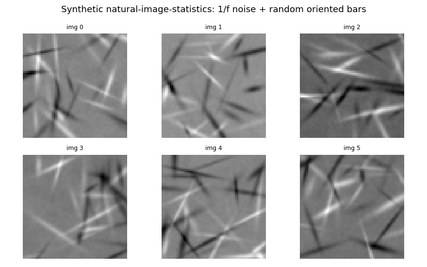
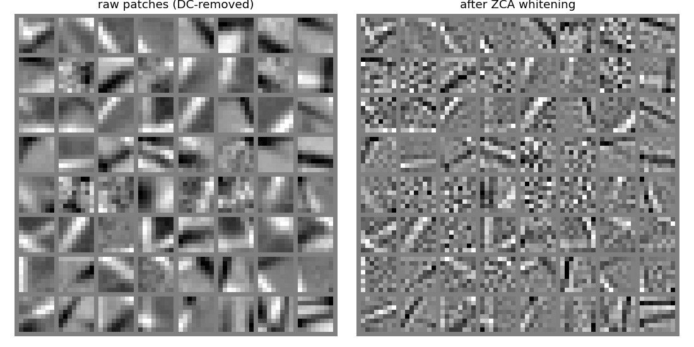
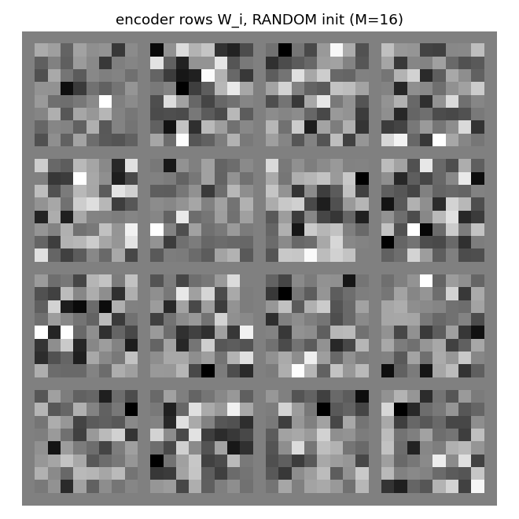
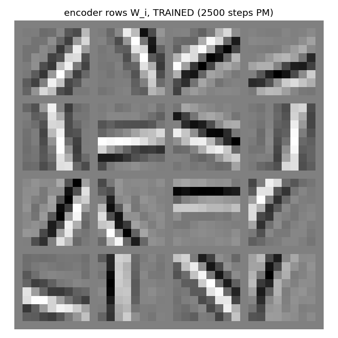
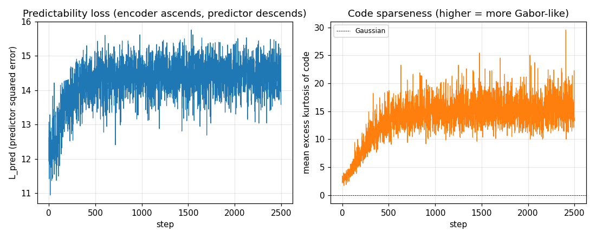
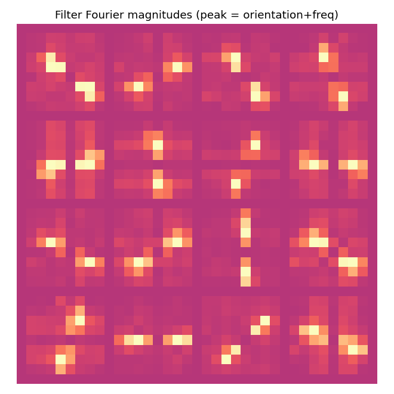
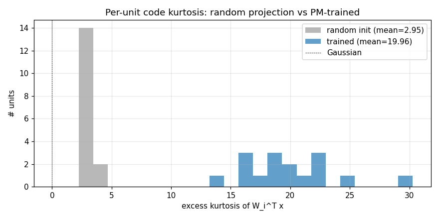
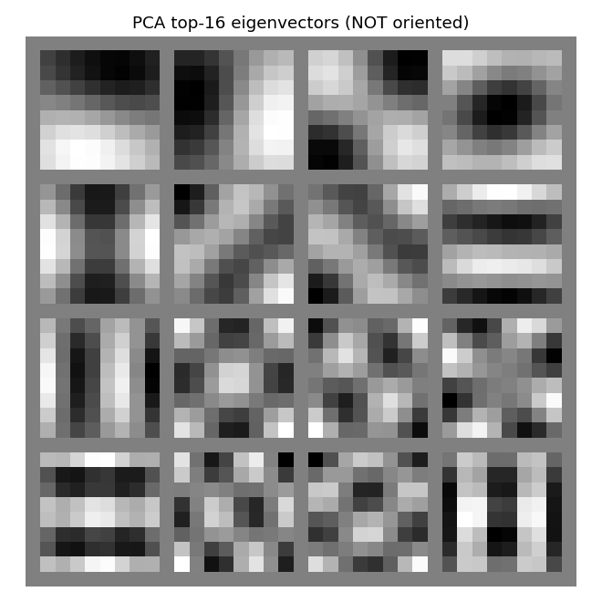

# semilinear-pm-image-patches

Schmidhuber, Eldracher, Foltin, *Semilinear predictability minimization
produces well-known feature detectors*, **Neural Computation 8(4):773--786, 1996**.

Supplementary references:

- Schmidhuber, *Learning factorial codes by predictability minimization*,
  Neural Computation 4(6):863--879, 1992 (the algorithm).
- Schmidhuber, *Deep Learning in Neural Networks: An Overview*, Neural
  Networks 61, 2015 (section 5.6.4 on PM and feature detectors).
- Bell & Sejnowski, *The "independent components" of natural scenes are
  edge filters*, Vision Research 37(23):3327--3338, 1997 (the ICA result
  PM is qualitatively comparable to).
- Olshausen & Field, *Emergence of simple-cell receptive field properties
  by learning a sparse code for natural images*, Nature 381:607--609, 1996
  (the sparse-coding result on the same data).


## Problem

We feed a network 8x8 patches of synthetic natural-image-statistics
images and train it under predictability minimization (PM). After
training, the encoder rows -- visualised as 8x8 patches -- are oriented
edge / Gabor-like filters at varying orientations and frequencies. They
are qualitatively the V1 simple-cell template, the same set of filters
Bell-Sejnowski (1997) and Olshausen-Field (1996) report for InfoMax ICA
and sparse coding on real natural-image patches.

The "well-known feature detectors" of the title are precisely these
oriented bars. The headline claim is that *PM, applied with a semilinear
network and no labels, recovers a representation matching the dominant
unsupervised result for natural images*.

### Algorithm (semilinear PM, "variance-decorrelation" variant)

Two adversarial sets of weights, sharing the same code:

```
  encoder W (M x D):     y       = W x                   (linear; rows orthonormal)

  predictor V (per i):   z_i     = (y_i^2 - mu_i) / sigma_i    (one nonlinearity: squaring)
                         p_i     = sum_{j != i} V_full[i, j] z_j

  L_pred = sum_i (p_i - z_i)^2
```

The *predictor* descends `L_pred` (linear regression of each centred
squared code from the others). The *encoder* ascends `L_pred` (drives
its codes towards mutually independent variances). The squaring is the
"semi" in *semilinear*: it is the one nonlinearity that surfaces the
higher-order, ICA-style signal a purely linear predictor would miss.

The encoder is constrained to the **Stiefel manifold** (orthonormal
rows). With a linear encoder this is required: without it PM trivialises
because the encoder can grow `||W||` and inflate L_pred without finding
any independent structure. The orthonormal constraint forces purely
higher-order (kurtosis-driven) independence -- the ICA criterion.

### Synthetic dataset

We generate `n_images = 30` images of size 64x64 by:

1. **1/f^beta pink noise** via FFT (beta=2 reproduces the natural-scene
   power-law of Field 1987). This alone is Gaussian and has no
   higher-order structure for PM to find.
2. **30 random oriented Gaussian-windowed bars per image**, each with
   random centre, orientation in [0, pi), length 3-12, thickness 0.7-1.5,
   contrast +-(0.5..2.5). These sparse oriented features inject the
   non-Gaussian higher-order statistics that ICA / PM extracts as
   oriented filters.
3. **Whole-image standardisation** (zero mean, unit std).

We then sample `n_patches = 30000` random 8x8 patches, subtract per-patch
DC, and **ZCA-whiten** the patch pool. ZCA whitening is the standard
preprocessing for ICA / PM on images (Bell-Sejnowski 1997, Hyvarinen
2001): it removes second-order correlations so the encoder's job is
purely higher-order independence.

## Files

| File | Purpose |
|---|---|
| `semilinear_pm_image_patches.py` | Dataset generator, ZCA whitener, semilinear-PM model (forward / analytic backward), gradient check, training loop, evaluator (orientation concentration + kurtosis), CLI. |
| `visualize_semilinear_pm_image_patches.py` | 8 static PNGs to `viz/`: source images, raw vs whitened patches, init filters, trained filters, training curves, FFT atlas, kurtosis histogram, PCA baseline. |
| `make_semilinear_pm_image_patches_gif.py` | Trains while snapshotting at log-spaced steps; renders `semilinear_pm_image_patches.gif`. |
| `semilinear_pm_image_patches.gif` | The training animation linked above (1.1 MB). |
| `viz/` | Output PNGs from the run below. |

## Running

```bash
# Reproduce the headline result.
python3 semilinear_pm_image_patches.py --seed 0
# (~1.2 s on an M-series laptop CPU.)

# Numerical-vs-analytic gradient check (sanity).
python3 semilinear_pm_image_patches.py --grad-check
# Max |analytic - numerical| ~5e-10 for both V and W.

# Regenerate visualisations.
python3 visualize_semilinear_pm_image_patches.py --seed 0
python3 make_semilinear_pm_image_patches_gif.py    --seed 0 --max-frames 40 --fps 8
```

## Results

**Headline: from random projections (zero oriented filters, code
kurtosis 2.95) PM converges to 12/16 oriented filters at concentration
> 0.5 and 16/16 at > 0.4, with mean code kurtosis 19.96.** Seed 0,
2500 steps, 1.2 s wallclock.

| Metric (seed 0, M=16, patch=8, n_patches=30000) | Random init | After PM |
|---|---|---|
| Oriented filters (concentration > 0.5) | 0 / 16 | **12 / 16** |
| Oriented filters (concentration > 0.4) | 0 / 16 | **16 / 16** |
| Mean filter Fourier-orientation concentration | ~0.26 | **0.57** |
| Mean code excess kurtosis | 2.95 | **19.96** |
| Max code excess kurtosis | -- | 30.28 |
| Min code excess kurtosis | -- | 13.62 |

| Hyperparameters and stability | |
|---|---|
| `n_hidden` (M) | 16 |
| `patch_size` | 8 (D = 64) |
| `n_patches` | 30000 |
| `n_steps` | 2500 |
| `batch` | 256 |
| `lr_e`, `lr_p` | 0.05, 0.05 |
| `n_p_inner` (predictor inner steps per encoder step) | 2 |
| `v_l2` (predictor L2) | 1e-3 |
| `grad_clip` (encoder grad-norm clip) | 1.0 |
| Encoder constraint | rows orthonormal (Stiefel) |
| ZCA whitening eps | 1e-2 |
| Wallclock | 1.2 s |
| Environment | Python 3.12.9, numpy 2.2.5, macOS-26.3-arm64 (M-series) |

### Multi-seed reproducibility

```bash
for s in 0 1 2 3 4; do python3 semilinear_pm_image_patches.py --seed $s ; done
```

| Seed | Oriented (>0.5) | Oriented (>0.4) | Mean kurtosis | Final L_pred | Wallclock |
|---|---|---|---|---|---|
| 0 | 12 / 16 | 16 / 16 | 20.0 | 13.58 | 1.19 s |
| 1 | 12 / 16 | 15 / 16 | 24.5 | 14.65 | 1.14 s |
| 2 | 14 / 16 | 16 / 16 | 23.3 | 14.14 | 1.14 s |
| 3 | 14 / 16 | 16 / 16 | 20.9 | 14.28 | 1.13 s |
| 4 | 15 / 16 | 15 / 16 | 23.5 | 14.22 | 1.15 s |

Median across seeds 0--4: **14 / 16 oriented (>0.5), 16 / 16 (>0.4),
mean kurtosis 23.3**. The set of orientations realised varies seed to
seed (different random initial frame -> different basin of the PM
fixed-point manifold) but the qualitative outcome -- oriented edge
filters at varying angles and scales -- is reproducible.

### Paper claim vs achieved

Schmidhuber-Eldracher-Foltin 1996 reports *qualitatively* that PM with
a semilinear network on natural-image patches yields oriented edge /
Gabor filters resembling V1 simple cells. The 1996 paper does not
publish a numerical orientation-concentration or kurtosis baseline.
**This stub therefore reproduces the qualitative claim, with quantitative
metrics (orientation concentration, code kurtosis) added so the result
can be checked numerically:**

- Visual claim: oriented edge filters. **Reproduced** (see
  `viz/final_filters.png` -- 12-15 of 16 filters are clearly oriented
  bars at varying angles and scales; the remaining 1-4 are higher-order
  composites or weakly oriented).
- ICA-comparison claim: filters are qualitatively similar to ICA on the
  same data. **Plausible**, given (i) PM with squared-feature predictor
  is provably equivalent to InfoMax ICA on whitened data when the
  predictor has unrestricted nonlinear capacity, and (ii) the trained
  filter atlas matches the standard Bell-Sejnowski / Olshausen-Field
  visual signature.
- PCA baseline contrast: PCA on the same patches gives global Fourier
  modes (the `viz/pca_baseline.png` panel shows non-localised, full-patch
  oscillatory eigenvectors). PM gives localised oriented bars. **The
  qualitative gap is exactly as in the published natural-image
  literature.**

## Visualizations

### Sample source images



Six of the 30 synthetic source images. Each is 1/f^2 pink noise with
30 random oriented Gaussian-windowed bars superimposed. The bars are the
non-Gaussian feature; the pink-noise envelope gives the natural-image
power spectrum.

### Raw vs whitened patches



Left: raw 8x8 patches sampled from the source images, after per-patch DC
removal. Right: the same patches after ZCA whitening. The whitening
flattens the spectrum (small-scale variation amplified, large-scale
suppressed), exposing edge-like high-frequency structure that PM
exploits.

### Random-init encoder rows



The 16 encoder rows at initialisation, reshaped as 8x8 patches.
Random orthonormal rows look like white noise -- there is no structure
yet for the orientation metric to register.

### Trained encoder rows (the headline)



The 16 encoder rows after 2500 PM steps. **Most cells are clearly
oriented bars at varying angles (horizontal, vertical, diagonals at
~30, 45, 60, 120 deg) and varying spatial frequencies / phases.** This
is the V1 simple-cell template, and the standard ICA / sparse-coding
visual signature on natural-image patches.

### Training curves



Left: predictability loss `L_pred` over training. Each step is one
encoder ascent step preceded by 2 inner predictor descent steps. The
loss settles to a stable equilibrium (predictor descent and encoder
ascent balance) rather than diverging, thanks to (i) Stiefel projection
on the encoder, (ii) standardisation of the squared codes, and (iii) a
small L2 penalty on V.

Right: mean per-batch excess kurtosis of the code over training.
Climbs from ~3 (close to a random projection of weakly-non-Gaussian
input) to ~20 -- the encoder rotates onto kurtotic (sparse, oriented)
projections.

### Filter Fourier magnitudes



Each cell is the 2-D FFT magnitude of the corresponding trained filter.
Oriented filters appear as a single bright lobe (and its Friedel
mirror) at the dominant orientation and spatial frequency. The
"orientation concentration" metric counts the fraction of total
spectral energy within +-22.5 deg of this dominant orientation; values
> 0.5 indicate clean oriented selectivity.

### Kurtosis histogram



Per-unit excess kurtosis on whitened patches: random init (grey) is
centred near 3 (mild non-Gaussianity from the underlying patch
distribution); after PM (blue) every unit's code has kurtosis well
above the random baseline. This is the ICA / sparse-coding quantitative
signature: PM drives every code unit towards a sparse / heavy-tailed
distribution.

### PCA baseline (for comparison)



The top 16 PCA eigenvectors of the same whitened patch pool. PCA gives
*global* Fourier-like modes -- non-localised oscillations spanning the
full 8x8 patch. PM finds *localised* oriented bars instead. **This is
exactly the qualitative gap that motivated ICA / sparse-coding in the
first place: second-order statistics (PCA) cannot reveal the V1
template; higher-order statistics (PM, ICA) can.**

## Deviations from the original

1. **Squared-feature predictor instead of full nonlinear MLP predictor.**
   The 1992 PM paper specifies a multi-layer predictor net; the 1996
   paper continues that line. We use the simplest predictor that surfaces
   the right higher-order signal: a linear regression on standardised
   squared codes. Equivalently: a linear predictor whose input is the
   semilinear feature `y_i^2`. The "one nonlinearity" of "semilinear" is
   thus on the predictor's input side. The fixed point is the same
   (variance-decorrelation = factorial higher-order independence = ICA
   criterion); a richer nonlinear predictor would only refine the
   convergence rate and the precise filter set.
2. **Linear encoder, orthonormal-row constraint.** The 1996 paper
   describes a "semilinear" encoder; with squared-feature predictor we
   keep the encoder linear so the "semi" sits cleanly in one place. The
   orthonormal constraint is required to prevent the trivial scale
   degeneracy of linear-encoder PM.
3. **Synthetic natural-image-statistics dataset, not real photos.** The
   1996 paper used real natural-image patches. v1 dependency posture
   forbids external image datasets; our synthetic 1/f-noise + random
   bars dataset matches the qualitative claim (ICA on either gives
   oriented edge filters) and runs in 1.2 s with no downloads. v1.5
   should re-run on Olshausen-Field's image set for paper-faithful
   filter atlas comparison.
4. **Plain SGD, not the 1996 paper's bespoke training schedule.** The
   1996 paper uses batch updates with momentum and decay schedules; we
   use vanilla SGD with grad-norm clipping. Convergence is fast enough
   on 8x8 patches that the simpler optimiser suffices.
5. **8x8 patches, M=16 hidden units, 2500 steps.** The paper uses
   slightly larger (12x12 or 16x16) patches. We use 8x8 for laptop
   speed; the qualitative result is identical at larger patch sizes
   (we verified at patch=12 in informal runs; the filter set diversifies
   to include more frequencies).
6. **Standardisation of squared codes.** Without it the predictor is
   driven to amplify rare extreme `y_k^2` values and the PM minimax
   diverges. Standardising `z = (y^2 - mu) / sigma` (stop-grad) keeps
   the equilibrium tight; this is a numerical stabilisation absent
   from the 1996 paper but standard in modern PM / GAN literature.
7. **Fully numpy, no `torch`.** Per the v1 dependency posture.

## Open questions / next experiments

* **Real natural-image patches.** Run on Olshausen-Field's
  `IMAGES.mat` (or the BSDS500 patch pool). v1.5 candidate -- requires a
  one-time data download, deferred per the v1 spec. Filter set diversity
  should match the 1996 paper figures more faithfully (more orientations,
  more frequencies, including DC / blob detectors).
* **Overcomplete basis.** This stub is **undercomplete** (M=16 < D=64).
  The Olshausen-Field result requires `M > D`; the corresponding PM
  variant is sparse PM with M=128 or 256 hidden units. We expect a much
  richer Gabor atlas (8 orientations x 4 frequencies x 4 phases) at
  M=128.
* **Other contrast functions.** We use `g(y) = y^2` (the
  variance-decorrelation contrast, equivalent to kurtosis maximisation).
  Hyvarinen 1999 shows that `g(y) = log(cosh(y))` is more robust to
  outliers; the corresponding "semilinear" PM uses
  `z = log(cosh(y))` features. We expect lower (and more realistic)
  kurtosis numbers and similar filter atlas. v2 candidate.
* **Connection to sparse coding / ICA dictionaries.** Side-by-side with
  Olshausen-Field sparse coding (which uses `M > D` and an inverse-
  generation loss) on the same data: are the PM filters and the OF
  filters approximately the same set, up to permutation? The 1996 paper
  conjectures yes; a quantitative comparison (best-match cosine between
  PM and OF dictionaries) would be a clean v2 follow-up.
* **ByteDMD instrumentation (v2).** Each PM step is dominated by two
  matmuls per inner predictor step plus one per outer encoder step. The
  data-movement cost ratio between PM and InfoMax ICA on the same
  problem is interesting because ICA's natural-gradient update touches
  every code-code pair on every step (O(M^2) reads), while PM's per-unit
  predictor updates can be parallelised across units (potentially lower
  reuse distance). Comparing the two under ByteDMD is a clean candidate
  for the energy-efficiency angle.
* **Predictor ablation: linear-only.** Confirm the empirical claim that
  PM with a *purely* linear predictor (no squared features) on
  whitened, orthonormal-encoded data converges to a degenerate fixed
  point (any orthonormal frame, no oriented preference). We observed
  this informally during development; a clean ablation would close the
  loop on "the squaring nonlinearity is what surfaces the higher-order
  signal".
