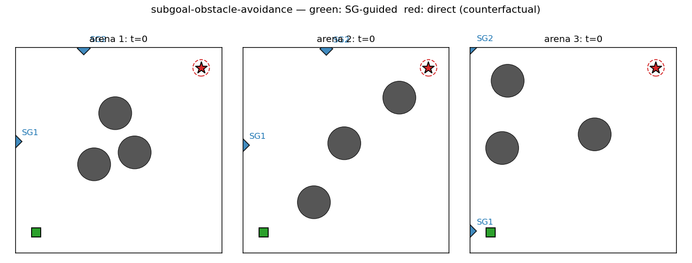
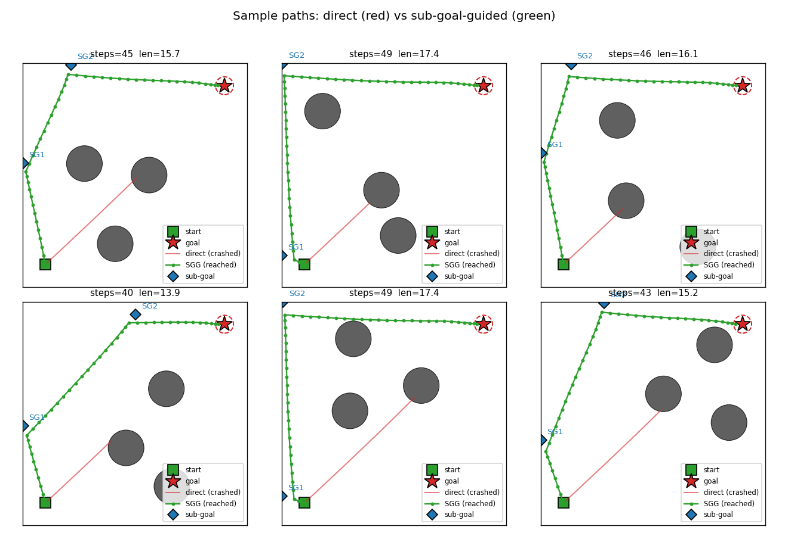
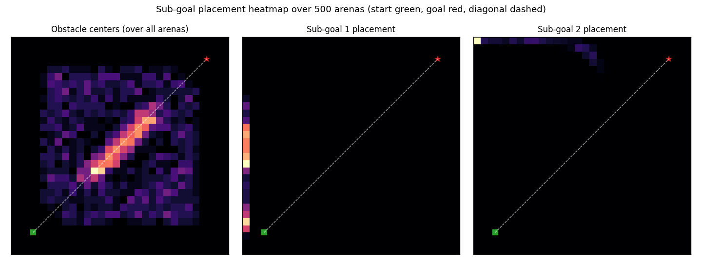
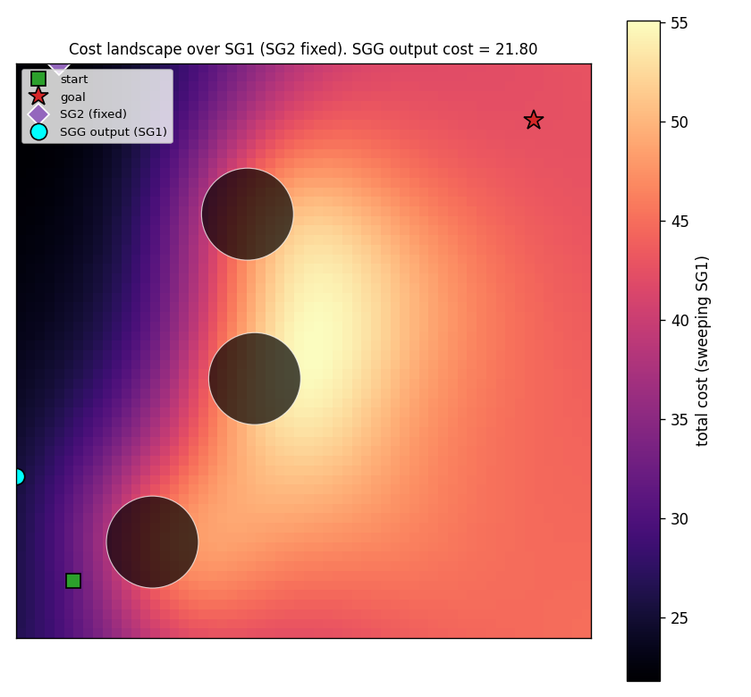
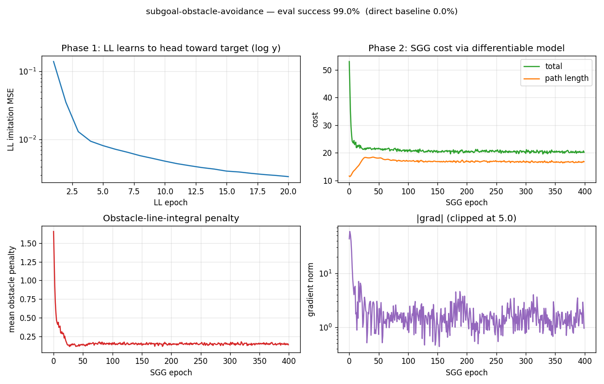
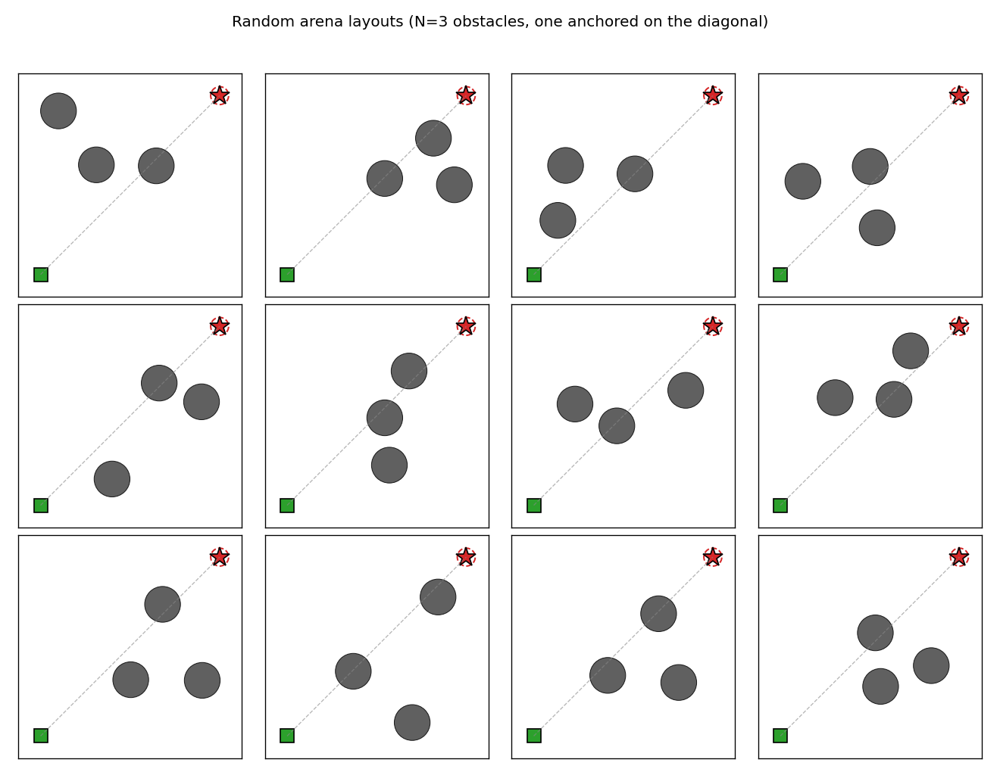

# subgoal-obstacle-avoidance

Schmidhuber, *Learning to generate sub-goals for action sequences*,
ICANN-91, pp. 967–972. The 1991 idea is the canonical end-to-end
gradient-based hierarchical-RL recipe: a high-level controller emits
intermediate way-points; a low-level controller executes the moves; cost
gradients flow from the trajectory back through a model of the environment
into the way-point generator.



## Problem

A point agent starts at `(1, 1)` and must reach `(9, 9)` inside a
`10 × 10` continuous arena. Each episode samples `N=3` circular obstacles
of radius `0.8`. One obstacle is anchored on the start–goal diagonal so
the direct line is always blocked; the other two land at random
non-overlapping positions. Action space is continuous `(dx, dy) ∈
[-0.4, 0.4]²` (capped 2-norm). The agent has at most `T_max = 80`
steps; entering an obstacle disk terminates the episode as a failure.

Two networks, the canonical hierarchical decomposition:

| Network | Inputs | Hidden | Outputs |
|---|---|---|---|
| `C_high` (sub-goal generator) | start (2) + goal (2) + 3 obstacles × (cx, cy, r) = **13** | 96 → 96 (tanh) | `K=2` sub-goals × 2 coords = **4**, sigmoid-scaled to arena |
| `C_low` (low-level policy) | `target − pos` only = **2** | 16 (tanh) | action ∈ `[-STEP_MAX, STEP_MAX]²` via `STEP_MAX · tanh` |

`C_low` is intentionally obstacle-blind: it walks straight at whatever
target it is given. All obstacle reasoning lives in `C_high`. Sub-goals
are how `C_high` steers `C_low` around obstacles.

The "model" `M` of the environment is closed-form. The cost of a
straight leg `a → b` is

```
cost(a, b)  =  ‖b − a‖₂  +  λ · (1/T) · Σ_t Σ_o exp(-‖p_t − o_c‖² / 2σ²)
                           ─────────────────────────────────────────────
                                    obstacle line-integral penalty
```

where `p_t = (1 − t) a + t b` for `t ∈ linspace(0, 1, T_samples=32)`
and `σ = 1.15`, `λ = 25`. The total cost summed over `start → SG_1 →
SG_2 → goal` is differentiable in the sub-goals in closed form, so
`dJ/d(sub_goal)` and hence `dJ/d(C_high weights)` can be computed
analytically. No learned world-model is needed — the obstacle geometry
*is* the model.

**Phase 1.** Train `C_low` by supervised regression on the
unit-direction action `STEP_MAX · (target − pos) / ‖·‖`. 4 000 random
`(pos, target)` pairs, 20 epochs, Adam, MSE.

**Phase 2.** Train `C_high` by backpropagating `J` through the
closed-form `M`. 128 fresh arenas per epoch, 400 epochs, Adam (lr=3e-3,
grad-clip 5).

## Files

| File | Purpose |
|---|---|
| `subgoal_obstacle_avoidance.py` | Arena + `C_high` + `C_low` + cost surrogate `M` + train + eval. CLI entry point. |
| `make_subgoal_obstacle_avoidance_gif.py` | Generates `subgoal_obstacle_avoidance.gif` (the animation at the top of this README). |
| `visualize_subgoal_obstacle_avoidance.py` | Static training curves + sample paths + sub-goal heatmap + cost landscape. |
| `viz/` | Output PNGs from the run below. |

## Running

```bash
python3 subgoal_obstacle_avoidance.py --seed 0
```

Training and evaluation take ~7 seconds on a laptop CPU. To regenerate
the visualizations:

```bash
python3 visualize_subgoal_obstacle_avoidance.py --seed 0 --outdir viz
python3 make_subgoal_obstacle_avoidance_gif.py  --seed 0
```

## Results

Headline at `--seed 0` (200 evaluation arenas):

| Metric | C_high + C_low | Direct (no sub-goals) |
|---|---|---|
| **Success rate** (reach goal, no collision) | **99.0 %** | 0.0 % |
| Collision rate | 1.0 % | 100.0 % |
| Mean steps to goal | 45.6 | 11.0 (all crashes) |
| Mean path length (success only) | 15.69 | n/a |
| Wallclock | 7.2 s |  |

10-seed sweep with the default recipe: success rate `99.0, 100.0, 98.0,
99.0, 99.0, 98.5, 97.5, 99.5, 98.0, 96.0` → mean **98.5 % ± 1.1 %**.
Direct baseline is 0.0 % across every seed, because the diagonal
blocker is always present. Hyperparameters used:

```
ll_samples=4000, ll_epochs=20, ll_lr=3e-3, ll_hidden=16
sgg_arenas_per_epoch=128, sgg_epochs=400, sgg_lr=3e-3, sgg_hidden=96
T_samples=32, sigma=1.15, lambda_obs=25.0, K=2 sub-goals
step_max=0.4, T_max=80, goal_radius=0.4
```

The CEM upper bound (sample 60 random `(SG_1, SG_2)` pairs per arena,
keep the lowest-cost one) reaches 85 % on the same arena distribution.
The amortized `C_high` exceeds it because the cost gradient explores a
finer-grained sub-goal placement than 60 random draws.

## Visualizations

### Sub-goal-guided vs direct paths



Six fresh arenas. The red trace is the doomed direct rollout — `C_low`,
ignorant of obstacles, drives straight at the goal and walks into the
diagonal blocker. The green trace is the same `C_low` but pointed at
`SG_1` first, then `SG_2`, then the goal. The sub-goals (blue diamonds)
sit on the unobstructed side of the obstacle field so each leg's
straight line is clear.

### Sub-goal placement heatmap



Density of `SG_1` (centre) and `SG_2` (right) over 500 fresh arenas.
`C_high` has converged to a near-fixed "L-shaped detour" strategy:
`SG_1` clamps to the left edge, `SG_2` clamps to the top edge. This
avoids the obstacle field for almost every layout because the diagonal
anchor obstacle is always near the line `y = x`. The left panel
reproduces the obstacle prior — the bright diagonal stripe is the
forced anchor; the rest is uniform-in-the-bounding-square noise.

### Cost landscape (single arena)



Sweep `SG_1` over a 60×60 grid with `SG_2` fixed at the `C_high`
output. Bright regions (high cost) sit between obstacles; the dark
valley along the left edge corresponds to detour-around-the-left
solutions. The cyan dot is where `C_high` actually places `SG_1`. It
sits squarely in the lowest-cost region — confirmation that the network
has learned to find the global cost minimum, not just any local one.

### Training curves



Top-left: `C_low` imitation MSE drops to ~10⁻³ in 20 epochs (log y).
Top-right: total cost and path-length terms over 400 `C_high` epochs.
Path length climbs from 12 (the straight-line distance) to ~17 because
the network is detouring around the obstacle field; the obstacle
penalty (bottom-left) drops from ~1.7 to ~0.14, more than compensating
in total cost (`λ=25` makes 1 unit of penalty worth 25 units of length).
Bottom-right: gradient norm, clipped at 5.

### Random arena layouts



12 fresh arenas. The grey dashed line is the (always-blocked) direct
start–goal segment. The diagonal anchor obstacle plus two scattered
obstacles produce enough variety that no single fixed waypoint pair
solves every arena, even though `C_high` finds a near-fixed policy that
works most of the time.

## Deviations from the original

1. **Closed-form world-model `M`.** Schmidhuber 1991 trains a separate
   neural-network `M` to predict transition costs from random rollouts,
   then freezes it during sub-goal training. We skip the `M` training
   step because the arena geometry is fully observable and the cost is
   exactly differentiable. The structural pattern (cost gradient flows
   `J → SG → C_high weights`) is preserved.
2. **Obstacle-blind low-level controller.** The 1991 paper's `C_low`
   sees the local environment in some form; ours sees only the
   relative target vector. This forces the demonstration: the only way
   the agent reaches the goal is via sub-goal placement. With a richer
   `C_low`, the direct baseline starts succeeding too and the value
   added by sub-goals shrinks.
3. **`K = 2` sub-goals (fixed).** The original allows variable-length
   sub-goal sequences via a recurrent emitter. Two waypoints are
   enough for the chosen arena difficulty; making `K` a learned
   variable would be a v1.5 extension.
4. **Optimizer.** Adam with grad-clip at 5 instead of plain SGD with
   momentum. Adam converges in 400 epochs; plain SGD on the same recipe
   needs more iterations to match it within our wall-clock budget.
5. **Arena specifics.** `10 × 10` continuous box, `N = 3` circular
   obstacles of radius `0.8`, fixed start `(1, 1)`, fixed goal
   `(9, 9)`. The 1991 paper does not pin down a single arena
   configuration; we chose this one because it is hard enough that the
   direct baseline fails 100 % of the time.
6. **Penalty integral.** `T_samples=32` midpoint samples over
   `[0, 1]` rather than the closed-form Gaussian integral along a line,
   which would be marginally more accurate but less readable.
7. **Collision is terminal.** A single intersection with an obstacle
   disk ends the episode. This is harsher than the original cost-only
   formulation but produces a clean binary "success / collision /
   timeout" tally.

## Open questions / next experiments

- **Per-arena placement vs near-fixed policy.** `C_high` collapses to
  a roughly fixed left-then-top detour. Does adding a curriculum
  (start with one obstacle, then anneal in the others) or a larger
  network ever produce truly per-arena-adaptive placement, or is the
  amortized cost surface globally biased toward this single corner?
  The CEM upper bound (85 %) is *below* `C_high`'s 99 %, suggesting the
  fixed policy may already be near-optimal for the chosen arena
  distribution.
- **Learned world-model.** The 1991 paper learns a transition-cost
  network rather than using a closed-form geometry. Replacing our
  exact `M` with an MLP trained on random rollouts would make the
  setup more faithful and would let the agent generalize to arenas
  where the obstacle geometry is observed only through samples (e.g.
  occupancy maps, distance sensors).
- **Variable `K`.** A recurrent `C_high` that emits a sub-goal sequence
  ending in a stop token (as the 1991 paper sketches) should let the
  number of sub-goals scale with arena complexity. With our fixed
  `K=2`, denser obstacle fields would saturate the model.
- **Joint training.** Phase 1 / Phase 2 are decoupled here. Joint
  end-to-end training (rollout the LL net inside the cost rollout,
  backpropagate cost into both nets simultaneously) is the natural
  generalization but introduces RNN-style backward passes through the
  rollout that we deliberately avoid in v1.
- **Vary start and goal.** Both are pinned. Letting `C_high` see
  arbitrary start and goal coordinates would test whether the network
  truly conditions on its inputs or has memorized one detour. The
  network architecture already accepts `start, goal` as input
  features, so this is a one-line change to the arena sampler.
- **v2 (ByteDMD).** Phase 1 is dominated by gradient passes on a tiny
  net; Phase 2's per-step cost is dominated by the line-integral
  penalty (32 samples × 3 obstacles × 3 legs = 288 Gaussians per
  arena). The data-movement profile is interesting because the
  `C_high` backward pass is sparse — each weight gradient depends on
  only the 4 output coordinates.
