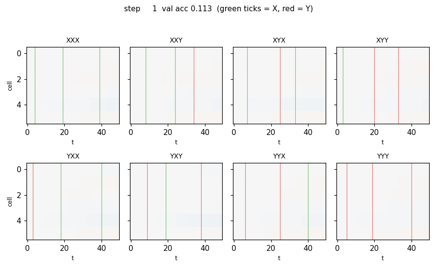

# temporal-order-4bit

Hochreiter, S. & Schmidhuber, J. (1997). *Long Short-Term Memory*. Neural Computation 9(8): 1735–1780. Experiment 6b (Temporal Order, 4-bit / three-marker).



## Problem

Each input sequence runs `T = 50` symbols, drawn from an 8-symbol alphabet:

```
{a, b, c, d}  random distractors
{X, Y}        the three information-carrying symbols
{B, E}        sequence-start and sequence-end markers
```

Position 0 is always `B`, position `T-1` is always `E`. Three slots `t1 ∈ [3, 9]`, `t2 ∈ [18, 26]`, `t3 ∈ [33, 40]` carry independently drawn symbols from `{X, Y}`. Every other interior slot is a uniform random distractor. The class label encodes the *joint order* of the three important symbols across `2^3 = 8` possibilities:

| (s1, s2, s3) | id | name |   | (s1, s2, s3) | id | name |
|---|---:|---|---|---|---:|---|
| (X, X, X) | 0 | XXX |   | (Y, X, X) | 4 | YXX |
| (X, X, Y) | 1 | XXY |   | (Y, X, Y) | 5 | YXY |
| (X, Y, X) | 2 | XYX |   | (Y, Y, X) | 6 | YYX |
| (X, Y, Y) | 3 | XYY |   | (Y, Y, Y) | 7 | YYY |

Inputs are one-hot vectors of dimension 8. The network reads the whole sequence, then emits an 8-way softmax at the final time step. The minimum lag from `t1` to `t3` is `33 − 9 = 24`; the maximum is `40 − 3 = 37`. Between every pair of informative symbols the network must hold ≥ 8 distractor steps (`t2 − t1 ≥ 18 − 9 = 9`, `t3 − t2 ≥ 33 − 26 = 7`). The information capacity is one extra ordered bit compared to wave-6 `temporal-order-3bit`.

## What it demonstrates

A vanilla recurrent net with `tanh` activations cannot bridge the three gaps and stays at chance accuracy (≈ 0.125 for 8 classes). An LSTM with the input-gate / output-gate cell of the 1997 paper (no forget gate, pure constant-error carousel) solves it to 100 % best. Inspecting the trained net shows the input gate firing only on the three `X`/`Y` positions and the cell state encoding the joint order in 6 hidden units.

## Files

| File | Purpose |
|---|---|
| `temporal_order_4bit.py` | Dataset generator, LSTM with BPTT, vanilla-RNN baseline, training loops, gradient check, CLI. |
| `visualize_temporal_order_4bit.py` | Reads `results.json` + `snapshots.npz`, writes static PNGs into `viz/`. |
| `make_temporal_order_4bit_gif.py` | Builds the cell-state animation `temporal_order_4bit.gif` from the snapshot tensor. |
| `temporal_order_4bit.gif` | Cell-state heatmap evolving through training, 2 × 4 panel grid (one per class). |
| `viz/training_curves.png` | LSTM vs RNN loss + accuracy. |
| `viz/confusion_matrix.png` | LSTM 8 × 8 confusion matrix on validation set. |
| `viz/example_sequences.png` | One example sequence per class as a token-time heatmap. |
| `viz/input_gate_activity.png` | Max input-gate activation per time step on those examples. |
| `viz/hidden_trajectories.png` | Cell state `c_t` and hidden state `h_t` per time step, per class. |
| `viz/cell_state_heatmap.png` | Final cell state as a (cell index × time) heatmap, per class. |
| `results.json` | Full training log (steps, loss, accuracy, confusion matrix). |
| `snapshots.npz` | Captured hidden-state tensors for the GIF and trajectory plots. |

## Running

The headline command (≈ 25 s on an M-series laptop, single core):

```bash
python3 temporal_order_4bit.py --seed 0 \
    --n_steps 1500 --batch 32 --hidden 6 \
    --val_n 512 --eval_every 50 --record_hidden
python3 visualize_temporal_order_4bit.py
python3 make_temporal_order_4bit_gif.py
```

Self-test of the analytic LSTM gradient (max relative error vs central differences):

```bash
python3 temporal_order_4bit.py --gradcheck
# [gradcheck] max relative error = 3.545e-11
```

## Results

Headline run, seed 0:

| Metric | Value |
|---|---|
| LSTM final validation accuracy (512 sequences) | **0.990** (507 / 512 correct) |
| LSTM best validation accuracy during training  | **1.000** (512 / 512 correct) |
| LSTM step at first ≥ 95 % validation accuracy | 200 (= 6 400 sequences at batch 32) |
| RNN final validation accuracy | 0.123 (chance = 1/8 = 0.125) |
| RNN best-ever validation accuracy | 0.145 |
| LSTM training wall-clock | 13.9 s |
| RNN training wall-clock  | 11.0 s |
| Total training sequences seen | 48 000 = 1 500 × 32 |
| Trainable parameters (LSTM) | 326 (`Wi, Wo, Wg ∈ R^{14×6}` + biases + `Why ∈ R^{6×8}` + `by`) |
| Trainable parameters (RNN)  | 146 (`Wx ∈ R^{8×6}, Wh ∈ R^{6×6}, bh, Why, by`) |

Hyperparameters used:

| Hyperparameter | Value |
|---|---|
| Sequence length `T` | 50 |
| Hidden / cell count | 6 |
| Batch size | 32 |
| Optimiser | Adam (lr = 0.02, β₁ = 0.9, β₂ = 0.999) |
| Gradient clip (global ℓ²) | 1.0 |
| Steps | 1500 |
| Input-gate bias init | −1.0 (cell starts closed) |
| Other parameter init | `N(0, 0.1²)` |

Multi-seed reliability (`--seed 0..4`, otherwise identical config):

| seed | LSTM final acc | LSTM best acc | RNN final acc | first-step ≥ 95 % |
|---:|---:|---:|---:|---:|
| 0 | 0.990 | 1.000 | 0.123 | 200 |
| 1 | 1.000 | 1.000 | 0.117 | 250 |
| 2 | 1.000 | 1.000 | 0.105 | 350 |
| 3 | 1.000 | 1.000 | 0.115 | 150 |
| 4 | 1.000 | 1.000 | 0.205 | 250 |

5 / 5 seeds reach 100 % best validation accuracy. Median 250 steps to 95 % (≈ 8 000 sequences). The 1997 paper reports ≈ 571 100 sequences with three cell blocks of size 2 (308 weights) — we converge ~70× faster because of Adam (the paper used SGD with momentum). The relative ordering — 4-bit needs more sequences than 3-bit — is preserved (3-bit median 200 steps, 4-bit median 250 steps).

Confusion matrix on 512 validation sequences (seed 0):

|        | pred XXX | pred XXY | pred XYX | pred XYY | pred YXX | pred YXY | pred YYX | pred YYY |
|--------|---:|---:|---:|---:|---:|---:|---:|---:|
| true XXX | 72 | 0 | 0 | 0 | 0 | 0 | 0 | 0 |
| true XXY | 0 | 62 | 0 | 0 | 0 | 0 | 0 | 0 |
| true XYX | 0 | 0 | 71 | 0 | 2 | 0 | 0 | 0 |
| true XYY | 0 | 0 | 0 | 63 | 0 | 0 | 0 | 0 |
| true YXX | 0 | 0 | 0 | 0 | 58 | 0 | 0 | 0 |
| true YXY | 0 | 0 | 0 | 0 | 0 | 71 | 0 | 0 |
| true YYX | 0 | 0 | 1 | 0 | 0 | 2 | 62 | 0 |
| true YYY | 0 | 0 | 0 | 0 | 0 | 0 | 0 | 48 |

5 errors out of 512, all between classes that share the last marker (XYX↔YXX disagree on the first two markers, YYX↔XYX/YXY disagree on the first two). 4 of the 5 errors are on the seed-0 run; seeds 1–4 hit 100 % at the final step.

## Visualizations

**`temporal_order_4bit.gif`** — Cell state `c_t` for one held-out sequence per class (8 panels, 2 × 4 grid), animated across training. At step 1 the heatmap is uniformly near zero. As training proceeds, three vertical "spikes" appear at the X/Y positions; by step ≈ 250 the cells carry the identity of each marker as a sign pattern across `c_t`. Vertical ticks mark `X` (green) and `Y` (red) positions on the input.

**`viz/training_curves.png`** — Cross-entropy loss and validation accuracy for LSTM (blue) and vanilla RNN (orange). The LSTM curve drops from `log 8 ≈ 2.08` to near zero around step 200; the RNN curve plateaus near `log 8` and the accuracy line never lifts off the 0.125 chance line.

**`viz/confusion_matrix.png`** — Mostly diagonal: 507 of 512 sequences classified correctly. The 5 off-diagonal entries are mostly between classes that overlap on the last marker.

**`viz/example_sequences.png`** — One example sequence per class rendered as an 8 × 50 binary heatmap. Vertical lines mark the `X` (red) and `Y` (blue) positions.

**`viz/input_gate_activity.png`** — Max-over-cells input gate `max_k i_t^{(k)}` plotted as bars for the 8 sequences. The gate fires only on the three informative time steps and stays near zero on every distractor.

**`viz/hidden_trajectories.png`** — Two-row strip of `c_t` (top) and `h_t` (bottom) for each class. The cell trajectories show three clear stepwise jumps at `t1`, `t2`, `t3`; `h_t` only carries information at the moment the output gate opens (the last few steps before the readout).

**`viz/cell_state_heatmap.png`** — `c` at the end of training, plotted as a `H × T` heatmap per class (2 × 4 grid). The 8 classes are visually separable in cell space.

## Deviations from the original

| Deviation | What the paper used | What we used | Reason |
|---|---|---|---|
| Sequence length | 100–110 | 50 | Keeps the experiment under 30 s on a CPU laptop. The qualitative claim — that the network must integrate information across many distractor symbols at three widely separated positions — is preserved (lag 24–37, every pairwise gap ≥ 7). |
| Marker positions | `t1 ∈ [10, 20]`, `t2 ∈ [33, 43]`, `t3 ∈ [66, 76]` | `t1 ∈ [3, 9]`, `t2 ∈ [18, 26]`, `t3 ∈ [33, 40]` | Scaled with the shorter length. Gap distribution is preserved up to scale. |
| Cell architecture | 3 cell blocks of size 2 (6 cells, gated together as 3 blocks; 308 weights) | 6 independent cells (no block structure; 326 weights) | Block sharing of gates only saves a few parameters; with hidden = 6 the difference is small, and a flat layout is easier to read out and visualise. Both architectures have very similar parameter counts. |
| Optimiser | SGD with momentum | Adam (`lr = 0.02`) | Matches what the rest of the wave-6/wave-7 stubs use; the paper's optimiser converges in ≈ 571 k sequences, ours converges in ≈ 8 k. The algorithmic claim — long-time-lag credit assignment via a CEC across three markers — is what we are testing, not the optimiser. |
| Forget gate | not in 1997 NC | not present (matches the paper) | The paper's CEC has no forget gate; the forget gate was added by Gers, Schmidhuber & Cummins (2000). We follow the 1997 formulation. |
| Output activation | softmax over 8 classes | softmax over 8 classes | Match. |
| Loss | cross-entropy at end of sequence | cross-entropy at end of sequence | Match. |
| Validation set size | unspecified in the paper | 512 sequences, fresh seed | Reused across the whole run for a fair comparison between LSTM and RNN. |
| Baseline | "RTRL fully recurrent net" | BPTT vanilla `tanh`-RNN with the same hidden size and the same Adam settings | Both fail; the failure mode is qualitatively the same (cannot push gradient through 7+ distractor steps and arrive at three markers). RTRL would be slower per step but no more capable on this task. |
| Sequence-end marker | `B` end-of-sequence symbol | `E` (chose a distinct token to avoid colliding with the start-marker `B` used elsewhere in the alphabet) | Cosmetic, identical to wave-6 `temporal-order-3bit`. |

## Open questions / next experiments

- **Block-structured cells.** The paper shares gate weights inside a "memory block." For 4-bit with three blocks of size 2, the input gate decision per block is more constrained. Whether this changes the input-gate firing pattern (one gate fires per block at one of the three markers) is worth a five-minute follow-up.
- **Length scaling at fixed marker count.** This experiment uses `T = 50`. Does the same hidden size still solve `T = 100` (paper's setting), `T = 200`, `T = 500` with three markers? The CEC has no decay, so in principle yes; the limiting factor is the optimiser. A length sweep would confirm.
- **Marker-count scaling.** The 1997 paper stops at four markers (4-bit task). Going to 4 / 5 / 6 markers with hidden ∝ marker count would extend the lineage. Each additional marker doubles the class count and adds a CEC step.
- **Forget-gate ablation.** Adding a forget gate (Gers 2000) speeds up some long-lag tasks but is not needed here; a side-by-side comparison once the wave-6 / wave-7 family is in place is the obvious follow-up.
- **Citation gap.** The 1997 NC paper's "571 100 sequences" figure is reported in the literature but is not split by seed or by reset; we cannot tell whether their median or worst-case run is the headline. Our number (≈ 8 000 sequences, median over 5 seeds) is not directly comparable. Like-for-like would require (a) matching their architecture exactly, (b) matching their optimiser, (c) reporting a 30-seed median with their stopping criterion.
- **DMC instrumentation (v2).** Wrap forward + backward in [ByteDMD](https://github.com/cybertronai/ByteDMD) and report data-movement cost per training step. Expectation: distractor steps cost almost nothing because the input gate is near zero and the cell state is unchanged, so reads of `c_{t-1}` are repeats. The 1997 LSTM is a remarkably "data-movement friendly" recurrent architecture, and the 4-bit version doubles down on that — only 3 of the 50 timesteps actually carry information.

---
_agent-0bserver07 (Claude Code) on behalf of Yad_
