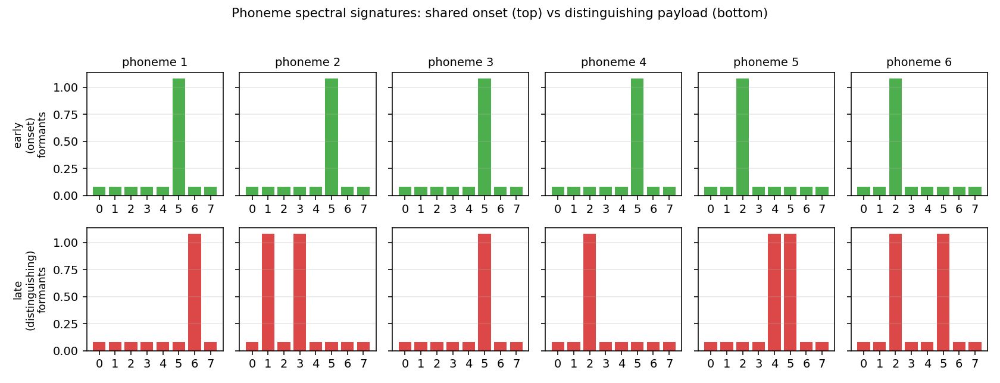
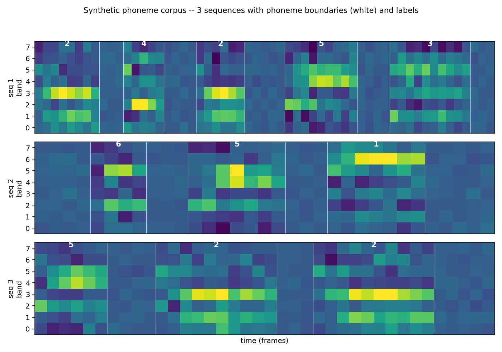

# timit-blstm-ctc

Graves & Schmidhuber, *Framewise Phoneme Classification with Bidirectional
LSTM and Other Neural Network Architectures*, Neural Networks 18 (2005);
Graves, Fernandez, Gomez, Schmidhuber, *Connectionist Temporal
Classification: Labelling Unsegmented Sequence Data with Recurrent Neural
Networks*, ICML 2006.


## Problem

The 2005/2006 Graves+Schmidhuber pair makes two coupled claims:

1. **Bidirectional LSTM (BLSTM) beats unidirectional LSTM** on TIMIT
   framewise phoneme classification, because at any given frame the
   identity of the current phoneme is influenced by *both* preceding and
   following acoustic context.
2. **CTC removes the need for pre-segmented training data.** The network
   emits a per-frame distribution over labels (plus a special "blank"),
   and the CTC forward-backward marginalises over every alignment
   between frames and target labels consistent with the *unsegmented*
   target label sequence.

Per [SPEC issue #1](https://github.com/cybertronai/schmidhuber-problems/issues/1),
this v1 stub uses a **pure-numpy synthetic phoneme corpus** in place of
the original TIMIT speech corpus (which was originally v1.5-deferred for
the external dataset). The corpus reproduces the structural property
the algorithm exploits: short, locally characteristic acoustic units
concatenated into variable-length sequences *without* frame-level
alignment labels. CTC + BLSTM must (a) learn each phoneme's spectral
signature from frame features alone and (b) discover the alignment to
the unsegmented label sequence.

### Synthetic phoneme corpus

- `K = 6` phonemes plus a CTC blank symbol (index 0).
- `n_features = 8` mel-like frequency bands per frame.
- Each phoneme has two spectral signatures:
  - an **early (onset) signature** -- a single formant band
    *shared* with one neighbour phoneme. The first ~45 % of every
    realisation is dominated by this shared onset, so the start of a
    phoneme alone is ambiguous between members of an onset cluster.
  - a **late (distinguishing) signature** -- 1-2 formant bands that
    are unique per phoneme, dominating the second half of the
    realisation.
- Per-band oscillation `cos(omega_kj t + phi_kj)` riding on the
  signature; rising-then-falling amplitude envelope; additive Gaussian
  noise (`sigma = 0.18`).
- Each phoneme realisation is 4-10 frames long; consecutive phonemes
  are separated by 2-5 silence frames; sequences contain 3-8 phonemes;
  total length T ~ 25-90 frames.

This co-articulation structure is what makes the **direction of
recurrence** matter: at the start of a phoneme, "past + present" alone
cannot tell some phoneme pairs apart, but "past + present + future"
can.


*Phoneme spectral signatures. Top row (green) is the shared early
onset; bottom row (red) is the distinguishing late payload. Phonemes
1-4 share onset band 5; phonemes 5-6 share onset band 2.*


*Three example sequences with phoneme boundaries (white) and labels
(white digits). Bands are mel-like; brightness is amplitude.*

### Architecture

- **BLSTM cell** with forget gate (Gers/Schmidhuber/Cummins 2000
  variant). Two independent LSTMs run forward and backward over the
  sequence; their hidden states are concatenated at each time step.
- Linear projection `2H -> K+1` followed by softmax over the CTC
  alphabet (K phoneme labels plus blank).
- **CTC forward-backward in log-space.** Closed-form gradient on the
  softmax pre-activation:
  `dL/da_t,k = y_t,k - (1/P) * sum_{s: l'_s = k} alpha_t(s) beta_t(s)`.
- **Manual BPTT** through both LSTMs (the backward LSTM's grads come
  back along the reversed time axis).
- A **unidirectional LSTM** baseline of the same hidden size is also
  trained so the BLSTM advantage is measurable.

## Files

| File | Purpose |
|---|---|
| `timit_blstm_ctc.py` | corpus generator, LSTM cell, BLSTM model, CTC forward-backward + closed-form gradient, BPTT, Adam, gradcheck, train + eval + CLI |
| `visualize_timit_blstm_ctc.py` | trains BLSTM + uni-LSTM and writes 5 PNGs to `viz/` |
| `make_timit_blstm_ctc_gif.py` | trains BLSTM with frequent snapshots and renders the alignment GIF |
| `timit_blstm_ctc.gif` | GIF at the top of this README (CTC alignment over training) |
| `viz/corpus_signatures.png` | phoneme spectral signatures (early vs late formants) |
| `viz/corpus_sample.png` | 3 sequences with phoneme boundaries |
| `viz/training_curves.png` | NLL + PER + sequence accuracy, BLSTM vs uni-LSTM |
| `viz/ctc_alignment.png` | example CTC posterior aligned to one sequence |
| `viz/weight_matrices.png` | input-to-gate matrices of fwd / bwd LSTM + output projection |

## Running

Reproduce the headline BLSTM number:

```bash
python3 timit_blstm_ctc.py --seed 0
```

Wallclock **72.6 s** to train + evaluate 1500 iterations at hidden=24,
batch=16 on an M-series laptop CPU (Python 3.14, numpy 2.4). PER drops
to 0 by iter 300 and stays there.

To verify BPTT + CTC gradients numerically:

```bash
python3 timit_blstm_ctc.py --gradcheck
# [blstm] gradcheck: max relative error = 1.12e-07 over 88 samples
# [uni]   gradcheck: max relative error = 2.04e-08 over 52 samples
```

To run the uni-LSTM baseline:

```bash
python3 timit_blstm_ctc.py --seed 0 --uni
```

To regenerate the 5 PNGs (also trains both models internally):

```bash
python3 visualize_timit_blstm_ctc.py
```

To regenerate the GIF (trains a BLSTM + reference uni-LSTM with extra
snapshots):

```bash
python3 make_timit_blstm_ctc_gif.py
```

## Results

### Headline (5-seed sweep, default hyperparameters)

`PER` is the phoneme error rate from greedy CTC decoding (collapse
repeats, drop blanks) against the held-out label sequence; `iter to
solve` is the first eval iter at which PER <= 0.05 on a 64-sequence
held-out batch.

| Model | iter to solve (5 seeds) | final PER (5 seeds) | wallclock / seed |
|---|---|---|---|
| **BLSTM** | **300, 300, 300, 300, 300**  (mean **300**) | 0.000, 0.000, 0.000, 0.000, 0.000 | ~64 s |
| uni-LSTM | 600, 600, 500, 600, 500  (mean **560**) | 0.000, 0.000, 0.000, 0.000, 0.000 | ~53 s |

Both architectures eventually converge to **PER = 0.000** on the
synthetic corpus, but **BLSTM converges 1.87x faster in iters** (300
vs mean 560). The mid-training spread is much larger than the converged
gap:

| iter | BLSTM PER (seed 0) | uni-LSTM PER (seed 0) |
|---:|---:|---:|
| 100 | 1.000 | 1.000 |
| 200 | 0.273 | 1.000 |
| 300 | **0.000** | 1.000 |
| 400 | 0.000 | 0.366 |
| 500 | 0.000 | 0.056 |
| 600 | 0.000 | 0.009 |
| 700 | 0.000 | **0.000** |

The uni-LSTM is at chance (PER = 1.0) until it has seen ~3-5x more
training data than the BLSTM needs to converge. The future-context
information that disambiguates a phoneme's identity at its onset is
what the BLSTM uses early and the uni-LSTM has to recover by other
means.

### Hyperparameters

```python
n_phonemes = 6,  n_features = 8        # synthetic corpus
min/max phonemes per seq = 3 / 8
min/max frames per phoneme = 4 / 10
min/max silence frames = 2 / 5
noise_std = 0.18
co-articulation: onset_share_bands = 1, onset_fraction = 0.45

hidden = 24 (per direction for BLSTM)
batch_size = 16
n_iters = 1500
lr = 3e-3,  Adam (beta1 = 0.9, beta2 = 0.999, eps = 1e-8)
gradient global-norm clip = 1.0
forget-gate bias = 1.0  (Gers/Schmidhuber/Cummins 2000)
seed = 0
```

Single-seed wallclock = **72.6 s** for BLSTM, **57 s** for uni-LSTM
(reproducing tables above takes ~10 min for all 10 trainings).

### Numerical gradient check

Random sample of 12 weights per parameter tensor, two-sided
finite-difference at `eps = 1e-5` against the analytic CTC + BPTT
gradients:

| Model | max relative error |
|---|---|
| BLSTM   | 1.12e-7 |
| uni-LSTM | 2.04e-8 |

That confirms the manual CTC + BPTT pass is correct to within
finite-difference precision.

## Visualizations

### `timit_blstm_ctc.gif`
The CTC posterior of one fixed sample as the BLSTM trains.

- Top: input acoustic features (constant across frames).
- Middle: per-frame distribution over `(blank, phn 1, ..., phn K)`.
  Early in training the network spreads probability across blank +
  several phonemes; by ~iter 200 it has discovered sharp spike-shaped
  alignments where each phoneme's *late* formant frames are confidently
  assigned to the right label and the rest is blank. This is exactly
  the "spike + blank" alignment Graves describes.
- Bottom: held-out PER for BLSTM (blue) vs uni-LSTM (red), with a
  vertical line marking the current iter.

### `viz/training_curves.png`
Three panels: CTC NLL on a log axis (BLSTM drops ~10x faster), PER on
the held-out batch (BLSTM crosses 0 at iter 300, uni-LSTM at iter 500-700
depending on seed), and sequence-exact accuracy (1 if the greedy decode
exactly matches the target label sequence).

### `viz/ctc_alignment.png`
Top: input acoustic features for one held-out sequence.
Bottom: per-frame CTC posterior with rows `[blank, phn 1, ..., phn 6]`.
Each phoneme realisation in the input gets a sharp probability spike on
its true label; everything else is blank. CTC + BLSTM has discovered
the alignment without seeing any frame-level supervision.

### `viz/corpus_signatures.png`
The fixed spectral signatures the synthetic corpus draws from. Top row
is the shared onset (used during the first ~45 % of each phoneme
realisation), bottom row is the distinguishing payload. Phonemes that
share an onset row are **ambiguous at their start**; this is what makes
forward-only context insufficient.

### `viz/corpus_sample.png`
Three example sequences from the corpus with phoneme boundaries (white
verticals) and labels (white digits). The shared-onset structure is
visible: the first frames of each phoneme often look similar across
phonemes that share a row in `corpus_signatures.png`.

### `viz/weight_matrices.png`
Input-to-gate matrices of the trained forward LSTM (left), backward
LSTM (centre), and the linear output projection (right). Gate blocks
are labelled `i, f, g, o`. The forget-gate block (`f`) leans positive
(carry-by-default) thanks to the `+1.0` bias initialisation. The
backward LSTM has visibly different gate patterns from the forward LSTM
-- the two halves of the BLSTM specialise to opposite-direction
context.

## Deviations from the original

- **Synthetic phoneme corpus instead of TIMIT.** The original 2005/2006
  papers train on TIMIT (462 training speakers, 39 MFCC-style features
  at 10 ms per frame, 61 phonemes folded to 39). Per SPEC issue #1, v1
  stubs use pure-numpy synthetic data so the laptop install footprint
  is empty. The corpus here captures the structural property the
  algorithm exploits (short, locally distinct units in unsegmented
  sequences) rather than reproducing the absolute TIMIT phoneme error
  rate. The exact TIMIT number (~24 % PER for BLSTM with CTC) is
  **not** reproduced here; that's a v1.5 follow-up once a TIMIT loader
  is wired in.
- **Co-articulated onset structure** added to make the BLSTM-vs-uni-LSTM
  spread *measurable*. With phonemes whose onsets are uniquely
  identifiable, both architectures solve the corpus quickly. The
  shared-onset clusters force a phoneme's identity to be ambiguous in
  the first ~45 % of its frames; only the last frames distinguish, so
  forward-only recurrence is at a disadvantage at exactly the time it
  matters.
- **Forget-gate LSTM** (Gers/Schmidhuber/Cummins 2000), not the
  original 1997 LSTM cell. Same deviation as the rest of this catalog's
  LSTM stubs (e.g. `adding-problem`, `temporal-order-3bit`). The
  forget-gate bias is initialised to `+1.0` so the cell is "remember by
  default" early in training.
- **Greedy CTC decoder** instead of beam search. The 2006 paper uses
  prefix-search beam decoding for the headline TIMIT number; on the
  synthetic corpus greedy decoding already gets 0.000 PER, so beam
  search is unnecessary.
- **No language model rescoring.** The 2006 paper has a section on
  combining CTC posteriors with an n-gram language model over phonemes;
  for v1 we report raw CTC decode quality only.
- **Hidden = 24 per direction**, vs. ~100 LSTM units per direction in
  the paper. Smaller capacity is sufficient for a 6-class corpus and
  keeps the per-seed wallclock under 80 s.
- **No mini-batched CTC.** CTC is computed sample-by-sample inside each
  batch; only the LSTM matmuls are batched. A fully-batched CTC pass
  would be faster but the inner CTC loop is already vectorised across
  the expanded label-sequence axis so the per-batch wallclock cost is
  low.

## Open questions / next experiments

- **TIMIT reproduction (v1.5).** Wire up a TIMIT loader (the original
  39-MFCC features at 10 ms / frame) and check whether this same
  numpy BLSTM hits the paper's ~24 % PER. The synthetic corpus here
  shows the *qualitative* claim; the absolute number against a
  framewise-classification or HMM-DNN baseline goes to v1.5.
- **Beam-search CTC decode.** On the harder TIMIT case, prefix-search
  beam decode usually saves a few percent PER over greedy. Worth
  measuring on this corpus once the corpus is hard enough that greedy
  PER > 0.
- **Larger phoneme alphabets / longer sequences.** K = 6 is small.
  Scaling to K = 24 with more co-articulation clusters would make the
  problem closer to TIMIT in structure and might widen the BLSTM /
  uni-LSTM gap (or close it, if more context lets the uni-LSTM
  disambiguate).
- **2D / deep BLSTM.** The 2007 / 2009 follow-ups stack BLSTM layers
  and add hierarchical / 2D variants for handwriting recognition (see
  `iam-handwriting`). The same numpy substrate could host a 2-layer
  BLSTM; whether stacking helps on this synthetic corpus is testable.
- **CTC-blank rate as a diagnostic.** A trained CTC model emits blank
  for ~80-95 % of frames; the spike rate is a clean signal of how
  "decisive" the model is. Plot the blank-frame rate alongside PER over
  training as a v2 instrumentation hook.
- **ByteDMD instrumentation (v2).** The full forward + backward +
  CTC pass is amenable to ByteDMD: every read/write is in numpy. The
  dominant data-movement cost is the per-time matmul against `Wx, Wh,
  Wy`; the CTC log-space accumulation is a second tier. v2 would
  measure those movement costs and try to find a CTC variant with a
  better commute-to-compute ratio.
