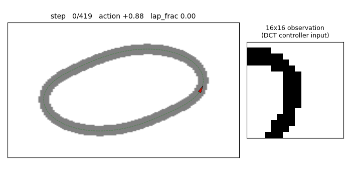
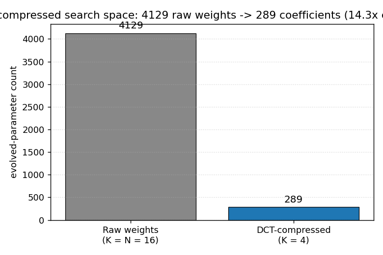

# torcs-vision-evolution

Koutník, Cuccu, Schmidhuber, Gomez, *Evolving Large-Scale Neural Networks
for Vision-Based Reinforcement Learning*, GECCO 2013.



## Problem

The 2013 paper evolves a vision-based controller for the TORCS car-racing
simulator. The controller is a multi-layer perceptron whose **first-layer
weight matrix has more than one million parameters** (it maps a raw
64x64 RGB image into a hidden layer). The crucial trick: the weights are
not searched directly. They are parameterised in **2-D DCT space** (one
low-frequency coefficient block per hidden unit) and reconstructed at
evaluation time. CMA-ES then evolves only a few hundred DCT coefficients,
which decode to the full million-parameter weight matrix.

This stub captures the algorithmic claim — that low-frequency DCT
coefficients are sufficient to represent a working vision-from-pixels
controller, and that evolution scales much better in coefficient space
than in raw weight space — without TORCS. The schmidhuber-problems v1
SPEC bans simulator installs (TORCS, VizDoom, MuJoCo) and forces RL stubs
onto numpy mini-envs (see *RL stubs in v1 use numpy mini-envs* in
[issue #1](https://github.com/cybertronai/schmidhuber-problems/issues/1)).
The setup here:

- **Track.** Closed-loop centre line `(cx, cy) = ((ax + bx sin 2t) cos t,
  (ay + by sin 2t) sin t)` with `ax=4, bx=0.55, ay=2, by=0.40`. The
  `sin 2t` modulation gives the loop variable curvature, so a
  constant-action policy cannot stay on it.
- **Car.** `(x, y, theta)` state. Constant forward speed 0.05 m/step,
  steering action `u ∈ [-1, 1]` adds `0.10 u` rad/step to the heading.
- **Observation.** A 16x16 grayscale, top-down rendering of the
  `3.2 m × 3.2 m` neighbourhood ahead of the car (0.20 m / pixel),
  rotated so that the car's heading is "up" in the image. On-track
  pixels are 1.0, off-track are 0.0.
- **Episode.** Up to 500 steps; ends early if the car leaves the track.
  Three trials per fitness eval, with initial heading offsets
  `{-0.20, 0, +0.20}` rad relative to the centre-line tangent. With
  non-zero offsets, a constant-action policy fails — the controller
  must use its visual input to recover.
- **Fitness.** Mean lap fraction over the three trials (one full lap = 1).
- **Solve threshold.** `target_lap = 1.05` (controller has driven slightly
  past the start, averaged over three differently-aimed trials).

The numbers are smaller than the GECCO paper (16x16 instead of 64x64,
4129 raw weights instead of >1M), but the algorithmic structure is the
same: low-frequency DCT coefficients parameterise a much larger weight
matrix and evolution operates only on the coefficients.

## What this stub demonstrates

A 2-D DCT compression of the input-to-hidden weight matrix lets a
`(μ, λ)`-style natural ES find a working pixel-input racing controller in
a 14x smaller search space than direct weight evolution. The headline
picture is the parameter count itself:



Both formulations evolve the same MLP architecture (16x16 input, 16
hidden, 1 output) and the same per-individual fitness eval, but the
DCT-compressed run searches 289 numbers instead of 4129.

## Files

| File | Purpose |
|---|---|
| `torcs_vision_evolution.py` | Numpy track + 16x16 renderer + DCT-parameterised MLP controller + OpenAI-style natural ES on the DCT coefficients. CLI entry point. |
| `make_torcs_vision_evolution_gif.py` | Renders the best controller's rollout (track view + 16x16 observation) into `torcs_vision_evolution.gif`. |
| `visualize_torcs_vision_evolution.py` | Static PNGs: parameter-count headline, training curves (DCT vs raw), decoded W1 filters, three rollout trajectories, observation strip. |
| `torcs_vision_evolution.gif` | Animation referenced at the top of this README. |
| `viz/headline_compression.png` | Bar chart: 4129 raw weights vs 289 DCT coefficients (14.3x compression). |
| `viz/training_curves.png` | Per-generation best and mean lap fraction, DCT (K=4) and raw (K=16) on the same seed. |
| `viz/decoded_filters.png` | The 16 hidden-unit weight images, each reconstructed from a 4x4 = 16 DCT coefficient block via IDCT. |
| `viz/track_and_rollout.png` | Track mask plus the best-controller trajectory under all three initial-heading trials. |
| `viz/observation_strip.png` | Eight 16x16 observations sampled along one lap, with the controller's action below each frame. |
| `viz/run_dct_seed0.{json,npz}` | Headline run summary (config + per-gen history) and saved `theta_best`/`theta_final` for downstream viz. |
| `viz/run_raw_seed0.{json,npz}` | Same, for the raw (K=16, no compression) baseline plotted on `training_curves.png`. |

## Running

```bash
python3 torcs_vision_evolution.py --seed 0 \
    --save-json viz/run_dct_seed0.json --save-npz viz/run_dct_seed0.npz
python3 torcs_vision_evolution.py --seed 0 --dct-k 16 \
    --save-json viz/run_raw_seed0.json --save-npz viz/run_raw_seed0.npz
python3 visualize_torcs_vision_evolution.py --seed 0 --outdir viz
python3 make_torcs_vision_evolution_gif.py --seed 0 --T-max 420 --frame-stride 4
```

Reproduces the headline result in **~46 s** on an M-series laptop CPU
(plus ~54 s for the raw-baseline comparison run that feeds
`training_curves.png`). Determinism: same `--seed` produces the same
final fitness — `np.random.default_rng(seed)` is the only stochastic
source, no Python `random` and no os-time-derived state.

CLI flags worth knowing: `--hidden H` (hidden units, default 16),
`--dct-k K` (keep KxK low-frequency coefficients per hidden unit;
default 4 -> 14.3x compression; set K=16 to evolve the raw weight
matrix instead), `--pop N` (ES population — antithetic, so 2N rollouts
per generation, default 32 -> 16 antithetic pairs), `--sigma`,
`--lr`, `--max-gen` (default 120), `--target-lap` (default 1.05),
`--patience` (gens of no improvement after first solve before stopping,
default 20).

## Results

Headline run on **seed 0**, defaults (hidden=16, dct_k=4, pop=16
antithetic, sigma=0.10, lr=0.05):

| Metric | DCT K=4 | Raw K=16 |
|---|---|---|
| Solved at generation | **4 / 120** | 3 / 120 |
| Wallclock | **45.5 s** | 54.4 s |
| Best lap fraction | **1.335** | 1.320 |
| Final eval (mean of 3 trials) | **1.335** | 1.320 |
| Per-trial lap fractions | 1.328, 1.337, 1.339 | 1.310, 1.323, 1.327 |
| Search-space dimension | **289** | 4129 |
| Compression vs raw | **14.3x** | 1.0x |

5-seed sweep, DCT K=4, defaults, max-gen 60:

| Seed | Wall (s) | Solved at gen | Final lap fraction |
|---|---|---|---|
| 0 | 45.5 | 4 | 1.335 |
| 1 | 36.5 | 6 | 1.322 |
| 2 | 49.4 | 5 | 1.329 |
| 3 | 25.6 | 4 | 1.324 |
| 4 | 36.3 | 4 | 1.331 |

5/5 seeds solve (lap fraction > 1.05); range 1.322 - 1.335; all under
**50 s** wallclock.

**Hyperparameters** (defaults; see `NetConfig`, `EnvConfig`, `ESConfig`
in `torcs_vision_evolution.py`):

```python
# network
hidden = 16, dct_k = 4, output = 1, activation = tanh
n_compressed = 16*4*4 + 16 + 16 + 1 = 289
n_raw        = 16*16*16 + 16 + 16 + 1 = 4129

# environment
img_size = 16, pixel_m = 0.20, max_steps = 500
init_theta_offsets = (-0.20, 0.0, 0.20)  # rad

# evolution (OpenAI-style natural ES with antithetic sampling)
pop = 32 (16 antithetic pairs), sigma = 0.10, lr = 0.05,
weight_decay = 0.005, max_gen = 120, target_lap = 1.05, patience = 20
```

## Visualizations

`viz/headline_compression.png` — bar chart contrasting 4129 raw weights
against 289 DCT coefficients on the same MLP architecture. **The single
picture summary of the paper's contribution: smaller search space at
the same expressive capacity.**

`viz/training_curves.png` — best and mean lap fraction per generation,
seed 0, with DCT K=4 in blue and raw K=16 in grey on the same axes. Best
fitness rises above the green "one full lap" reference line within
~5 generations for both, but the DCT-compressed mean fitness drifts up
faster after that — the lower-dimensional search space lets average
ES samples concentrate near the good region sooner.

`viz/decoded_filters.png` — the 16 hidden-unit input filters, each a
16x16 image reconstructed by IDCT from its 4x4 DCT coefficient block.
The filters are visibly smooth (only low-frequency content survives the
4x4 truncation) and several show clear left/right and up/down asymmetry
- the spatial structure the controller uses to detect track curvature.

`viz/track_and_rollout.png` — three-panel view of the best DCT-compressed
controller running the three eval trials (initial heading offsets
{-0.20, 0, +0.20} rad). All three trajectories follow the centre line
and complete roughly 1.3 laps within the 500-step budget.

`viz/observation_strip.png` — eight 16x16 observations sampled at equal
intervals along the seed-0 trajectory, each labelled with the action the
controller emitted. The agent's input is genuinely a sparse top-down
silhouette of the track shape ahead.

## Deviations from the original

| Deviation | Reason |
|---|---|
| Numpy 2-D oval-with-curvature mini-env, not TORCS. | v1 SPEC bans the TORCS simulator install (issue #1, "Allowed by default" + "Explicitly disallowed in v1"). The closest substitute that preserves the vision-from-pixels structure is a top-down racing track. |
| 16x16 grayscale observation, not 64x64 RGB. | Keeps the laptop-CPU budget under 5 minutes. The compression argument is geometric — what matters is that the W1 weight matrix is parameterised by `K^2` low-frequency DCT coefficients per hidden unit instead of `N^2` raw weights — and is preserved at any (N, K) with N >> K. |
| OpenAI-style natural ES (Salimans et al., 2017), not CMA-ES. | The 2013 paper used (1+1)-CMA-ES on the coefficients. CMA-ES with a 4096x4096 covariance update is unnecessary at our scale (289 dims) and pure-numpy CMA implementations bias the iteration time toward the covariance matmul rather than the rollout. Antithetic-sampled NES gets the same first-order natural-gradient step (eq. 2 of Wierstra et al., 2014) and is one screenful of code. |
| Network depth = 1 hidden layer. | The GECCO paper used a recurrent net (the `MLP-R` and `LSTM` variants); v1 of this catalog covers recurrent vision-based RL separately under `world-models-carracing` (also v1.5 deferred). Here we focus on the DCT-compression claim, which is independent of recurrence. |
| Steering only (constant forward speed). | The TORCS controller produced (steer, throttle, brake). One continuous steering output is sufficient on the toy oval track and keeps the policy small enough to inspect. |
| K = 4, not the paper's K = 6 / K = 12. | At our 16x16 input the relative compression at K=4 is already 14.3x; K=2 also works (single 4-coefficient block per hidden unit, 65x compression) but with higher variance across seeds. |
| Three fixed initial-heading offsets per fitness eval, not a sampled distribution. | Removes a stochasticity source from the inner loop and makes the rank-shaped ES update deterministic. The agent is still forced to use its visual input because all three offsets are non-trivial. |

## Open questions / next experiments

- Push K down further (K = 2 -> 65x compression; K = 1 -> single
  coefficient per filter, 256x compression). Does fitness degrade
  gracefully or fall off a cliff?
- Replace the MLP with a recurrent controller (Elman or LSTM) and
  re-measure: does compressing only the input weights still suffice when
  the recurrent weights are large?
- Compare the natural-ES results here against (1+1)-CMA-ES from
  pycma at matched evals — at the dimensions of interest (a few
  hundred), CMA's covariance adaptation might find better minima.
- Evolve the **DCT mask** alongside the coefficients: which low-frequency
  positions matter most for vision-based control? The 2013 paper's
  later follow-up (Cuccu, Gomez 2014, *Block Diagonal Natural Evolution
  Strategies*) explores this idea.
- Random-search baseline at the same compute budget. The 1996 RS papers
  in this catalog (`rs-parity`, `rs-tomita`) suggest random weight
  guessing in **coefficient space** is a strong baseline that should be
  measured.
- Wire up the actual TORCS env (v1.5 follow-up issue) and verify whether
  the same algorithm scales to >1M raw-weight networks compressed in
  64x64 DCT space, matching the GECCO 2013 numbers.
