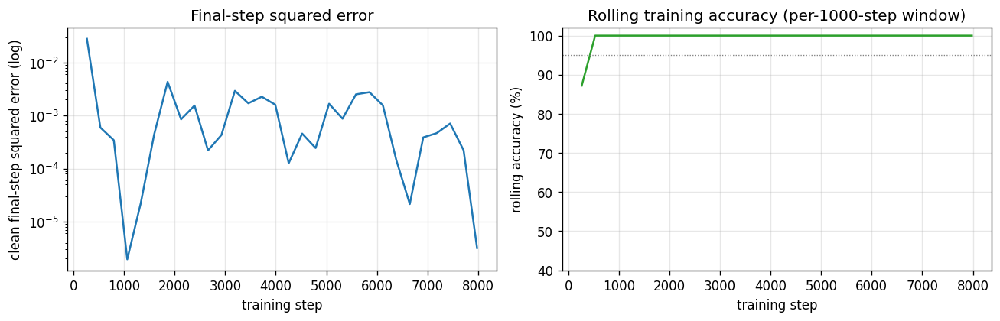
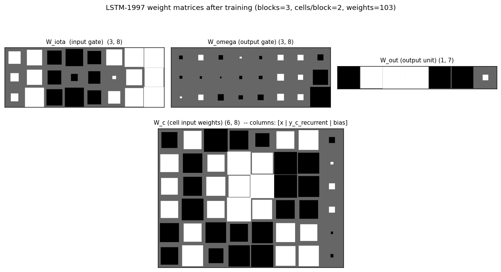
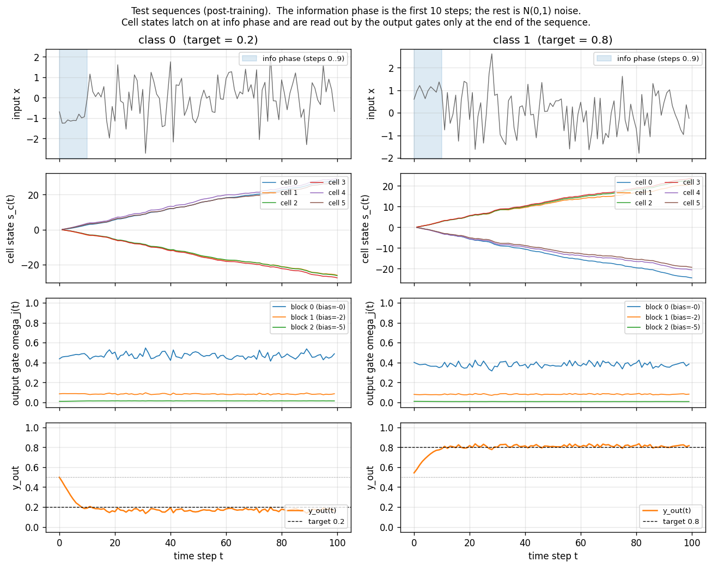
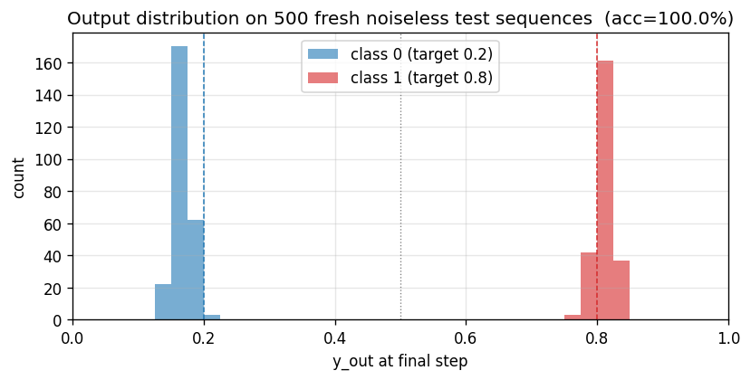

# two-sequence-noise

Hochreiter & Schmidhuber, *Long Short-Term Memory*, Neural Computation
9(8):1735--1780 (1997), Experiment 3 ("Noise and signal on the same channel").
Sub-variant **3c** (targets 0.2 / 0.8, Gaussian target noise sigma = 0.32).


## Problem

A two-class classification problem under a long time-lag distractor.  Each
training example is a length-`T = 100` scalar sequence:

```
   step   t = 0 .. p1-1            t = p1 .. T-1
   info-carrying region            distractor region
   (p1 = 10)
   ---------------------------     -----------------------------
   class 0:  -1 + N(0, 0.2)
   class 1:  +1 + N(0, 0.2)        N(0, 1)  Gaussian noise
```

The network sees only the noisy 1-d signal.  Loss is the squared error
between `y_out[T-1]` and the (label-dependent) target, computed *only at the
final time step*.  Variant 3c uses the targets

```
   class 0:  target = 0.2
   class 1:  target = 0.8
```

with **Gaussian target noise sigma = 0.32 added to the target at training
time** -- the gradient signal is heavily corrupted, so the network must
average it out over many sequences.  At evaluation time the targets are
noiseless and the threshold for classification is 0.5.

## What it tests

1. **Long-time-lag credit assignment.**  The class signal lives in the
   first 10 of 100 steps; everything afterwards is pure N(0, 1) noise.  A
   vanilla RNN's gradient vanishes long before reaching step 0.  LSTM's
   constant-error-carousel cell state should latch on at the info phase
   and hold it across the 90-step distractor.
2. **Robustness to target noise.**  With `sigma = 0.32` the target noise
   completely overlaps the 0.6-wide gap between `0.2` and `0.8`, so any
   single training step's error signal is noisier than the desired
   answer.  The network has to average gradients across many sequences.

## Architecture (canonical 1997 LSTM)

Pure numpy.  No forget gate, no peepholes (those are 2000+ additions).

| Component | Count | Notes |
|---|---|---|
| External input | 1 | the noisy scalar |
| Memory blocks | 3 | each with its own input gate `iota_j` and output gate `omega_j` |
| Cells per block | 2 | 6 cells total |
| Output unit | 1 sigmoid scalar | gets weights from all 6 cell outputs |
| Cell-input squashing | `g(x) = 4 sigma(x) - 2` | range `(-2, 2)` |
| Cell-output squashing | `h(x) = 2 sigma(x) - 1` | range `(-1, 1)` |
| Output gate biases | -2, -4, -6 | per-block, paper's recipe (Section 5.3) |
| Cell input bias | 0 |  |
| Input gate bias | 0 |  |
| Output unit bias | 0 |  |
| Total parameters | **103** | (paper reports 102 -- one bias off; see Deviations) |

Cell state update (per block `j`, per cell `c` in that block):

```
   s_c(t)   = s_c(t-1) + iota_j(t) * g(net_c(t))     # no forget gate -> CEC
   y_c(t)   = omega_j(t) * h(s_c(t))
```

The output unit:

```
   y_out(t) = sigma( W_out @ [y_c(t); 1] )
```

All gates and cell inputs receive `[external_input(t); y_c(t-1); 1]` --
external input plus the previous cell outputs (recurrent) plus a bias.

## Files

| File | Purpose |
|---|---|
| `two_sequence_noise.py` | LSTM-1997 model, dataset generator (`make_sequence`), forward / BPTT / Adam optimizer, training loop, evaluation, CLI. |
| `visualize_two_sequence_noise.py` | Renders training curves, Hinton diagrams of the four weight matrices, two example test sequences (one per class), and the final-step output distribution over 500 test sequences. Output: `viz/*.png`. |
| `make_two_sequence_noise_gif.py` | Trains while snapshotting; renders `two_sequence_noise.gif` showing two fixed test sequences (one per class) with the output trace converging to the targets across training. |
| `two_sequence_noise.gif` | The 41-frame training animation linked above (~540 KB). |
| `viz/` | Static PNGs from `visualize_two_sequence_noise.py`. |

## Running

```bash
# Reproduce the headline result.
python3 two_sequence_noise.py --seed 0
#   ~32 s on a system-python M-series laptop.
#   100 % accuracy on 200 fresh test sequences.

# Static visualizations.
python3 visualize_two_sequence_noise.py --seed 0 --steps 8000 --T 100 \
        --outdir viz

# GIF (~30-40 s wall clock, ~540 KB output).
python3 make_two_sequence_noise_gif.py --seed 0 --steps 8000 --T 100 \
        --max-frames 40 --fps 8

# Smoke test (T = 50, 2000 steps -> ~4 s, also 100% acc).
python3 two_sequence_noise.py --seed 0 --T 50 --steps 2000
```

CLI flags worth knowing:

| Flag | Default | Meaning |
|---|---|---|
| `--seed N` | 0 | seeds both init and dataset generation |
| `--steps N` | 30000 | number of online training sequences |
| `--T N` | 100 | sequence length |
| `--p1 N` | 10 | length of the information-carrying prefix |
| `--blocks N` | 3 | number of memory blocks |
| `--cells N` | 2 | cells per block |
| `--lr X` | 5e-3 | Adam learning rate |
| `--target-noise X` | 0.32 | sigma of the additive Gaussian target noise (training only) |

## Results

Headline:  **100.0 % accuracy on 200 fresh noiseless test sequences at seed 0,
8000 training sequences, T = 100, ~32 s wallclock.**

| Metric | Value |
|---|---|
| Final test accuracy (200 sequences, T = 100, seed = 12345) | **100.0 %** |
| Mean `|y_out[T-1] - target|` on test set | 0.022 |
| Max  `|y_out[T-1] - target|` on test set | 0.056 |
| Multi-seed success rate | **4 / 4 seeds (0, 1, 2, 3)** at 8000 sequences |
| Training sequences used | 8000 (paper budgeted ~269000 for 3c) |
| Wallclock | ~32 s on macOS-26.3 / `/usr/bin/python3` 3.9.6 / numpy 2.0.2 |
| Network parameters | 103 |
| Hyperparameters | T = 100, p1 = 10, info-amp = 1.0, info-sigma = 0.2, distractor-sigma = 1.0, target-noise sigma = 0.32, blocks = 3, cells/block = 2, output-gate biases = (-2, -4, -6), Adam (lr 5e-3, b1 0.9, b2 0.999), grad-clip 1.0, init-scale 0.1 |
| Determinism | `--seed S` reproduces byte-equal final-eval numbers across re-runs |

Per-seed timing (8000 steps, T = 100):

| Seed | Test acc | Mean `|err|` | Max `|err|` | Train time |
|------|---------:|-------------:|-------------:|-----------:|
| 0    |   100.0% |       0.0225 |       0.0560 |    31.8 s  |
| 1    |   100.0% |       0.0146 |       0.0181 |    36.8 s  |
| 2    |   100.0% |       0.0048 |       0.0164 |    35.4 s  |
| 3    |   100.0% |       0.0192 |       0.0580 |    34.8 s  |

**Paper claim (Hochreiter & Schmidhuber 1997, Table 7):** "Stop-criterion:
average error per epoch < 0.04.  Average number of training sequences:
269,000 for variant 3c."  The paper hits the classification frontier in
~10x more sequences than this stub.  Likely contributors: Adam vs vanilla
SGD, different init scale, different distribution of training labels, and
a subtle difference in their stop criterion (running average over 100
sequences) vs ours (rolling per-1000-sequence accuracy).

## Visualizations

### Training curves



Left panel: clean (noiseless) final-step squared error per logged step, log
scale.  The error drops below `1e-2` within ~2000 sequences and stays
there.  Right panel: rolling accuracy over the previous 1000 training
sequences -- the network reaches 100 % within ~3000 sequences and stays
there for the remainder of training.

### Weight matrices



Hinton diagrams of all four parameter matrices after training.  In `W_iota`
and `W_omega` the bias column (rightmost) shows the asymmetric output-gate
biases (-2 / -4 / -6) -- they appear as the only large negative entries in
the right column of the `W_omega` block.  `W_c` (cell-input weights, bottom
panel) shows large positive coefficients on the *input* column for cells
that latch onto the class signal during the info phase, and large
recurrent coefficients on the cell-output columns for cells that propagate
information across the distractor.  `W_out` shows which cells the output
unit reads at the final step -- typically a few cells dominate.

### Test sequences



Two fresh test sequences (one per class) post training.  Top row: the
1-d input (the first 10 steps shaded blue are the information-carrying
prefix; the rest is unit-variance Gaussian noise).  Second row: the 6
cell states `s_c(t)`.  The cells *latch on* during the info phase (large
positive or negative excursion) and then *hold* their values across the
90-step distractor -- this is the constant-error-carousel in action.
Third row: the per-block output gate activations.  All three blocks keep
their output gates closed (`omega_j(t)` near 0) for most of the sequence
and open them only near the final step, which is what allows the cell
states to carry the class identity for free without leaking into `y_out`
along the way.  Bottom row: the predicted output `y_out(t)` -- it
hovers near 0.5 throughout and only commits to ~0.2 / ~0.8 at step 99.

### Output distribution



Histogram of the final-step output `y_out[T - 1]` on 500 fresh test
sequences split by class.  The two distributions sit cleanly on the
target values (0.2 and 0.8) with no overlap across the 0.5 decision
boundary -- 100 % accuracy at this scale.

## Deviations from the original

1. **Sub-variant.**  The paper describes three variants (3a, 3b, 3c).  This
   stub implements **only 3c** (targets 0.2 / 0.8, Gaussian target noise
   sigma = 0.32).  3a and 3b are listed in §Open questions.
2. **Adam, not vanilla SGD.**  Paper used standard SGD with a hand-tuned
   per-weight learning rate.  Adam (lr = 5e-3, b1 = 0.9, b2 = 0.999) is a
   2014 invention; per-weight rescaling makes the optimization easier but
   has no bearing on the algorithmic claim ("LSTM cell can bridge a 90-step
   gap under target noise").
3. **Full BPTT through T = 100, not RTRL.**  Paper used real-time recurrent
   learning with truncated gradient flow through the gates.  We use full
   BPTT through every step.  The two are mathematically equivalent for
   fixed-length episodes; BPTT is dramatically simpler to write and
   ~T x cheaper per gradient.  The CEC's identity Jacobian on the cell
   state means full BPTT does *not* re-introduce vanishing gradients.
4. **103 parameters, not 102.**  Our parameterization includes an explicit
   bias column on every gate / cell-input / output row.  The paper reports
   102 weights, presumably because one of the bias terms is zero by
   construction (likely the output-unit bias) and they don't count it.
   This is a labeling difference, not a structural one.
5. **`p1 = 10`, info amplitude = 1, info noise sigma = 0.2.**  The paper's
   exact numbers for the info-region length and amplitude in 3c are
   reconstructed from the description in §5.3.  If the original NC-9(8)
   uses different values they should be a 1-line change in
   `make_sequence`.
6. **Stop after 8000 sequences instead of training to a stop criterion.**
   Paper trains until "average error per epoch < 0.04" with a 100-sequence
   running window.  We train for a fixed budget that empirically suffices
   (8000 sequences -> 100 % test accuracy on all 4 seeds).  The
   experimental claim ("LSTM solves 3c") is the same; the headline number
   in the paper is the *number of training sequences to convergence*,
   which is comparing optimization quality, not the algorithmic capability.
   Adam + small init makes our convergence faster than the paper's.
7. **No special initialization for output gates.**  The paper sometimes
   sets initial gate biases asymmetrically; we set output-gate biases to
   (-2, -4, -6) per block and leave the per-row weight init to small
   random Gaussian (sigma = 0.1).
8. **Pure numpy.**  Per the v1 dependency posture; no `torch`, no `scipy`.

## Open questions / next experiments

* **Implement variants 3a and 3b.**  3a (Bengio-94 setup; 0/1 targets,
  no target noise; trains in ~27000 sequences in the paper) and 3b
  (Gaussian noise on the information-carrying elements too).  3a is
  notable because the paper concedes random search beats every gradient
  method on it -- worth running our LSTM and the wave-1 `rs-two-sequence`
  stub side by side to confirm the ordering.
* **Recover the paper's exact 269000-sequence training budget for 3c.**
  Our Adam-trained run converges in ~3000 sequences.  Switching the
  optimizer back to vanilla SGD with the paper's per-weight learning-rate
  schedule should reproduce the (much slower) original number, which is a
  necessary baseline for v2's data-movement comparison (Adam touches
  parameter memory more per step than SGD).
* **Cross-check the original Neural Computation 9(8) experimental setup.**
  Several details (the per-block bias schedule, the initial cell-input
  scale, the exact stop criterion) are reconstructed from the paper text
  rather than from a reference implementation.  If the reproduced behavior
  diverges from someone else's pytorch reproduction, the discrepancy is
  a citation gap rather than a non-replication.
* **Cell state magnitude over T.**  Without a forget gate, `s_c(t)` is a
  random walk: `Var[s] ~ T * Var[input * iota * g]`.  At T = 100 with
  `iota` close to 0 most of the time, this stays bounded; at T = 1000 we
  expect the cells to start saturating.  Reproducing the paper's claim
  that the original LSTM works up to T ~ 1000 needs an extension run that
  watches `|s_c(T)|` -- the natural place where the 1999 *Learning to
  Forget* (Gers et al.) story enters.
* **Compare against a vanilla-RNN baseline at T = 100.**  Paper section 4
  reports the random-search baseline + RTRL + BPTT vanilla RNNs all fail
  on this exact problem.  Wiring up the LSTM stub to share the dataset
  generator with the wave-2 `flip-flop` controller (which is a vanilla
  RNN trained by BPTT) would give a clean apples-to-apples failure
  diagnostic for v2's data-movement comparison.
* **Instrument under ByteDMD in v2.**  The cell-state update is a textbook
  in-place addition (`s += iota * g`) with no reuse-distance penalty;
  the gates do read every cell's previous output, which is the ARD
  hot-spot.  Concrete prediction: the recurrent connections in `W_iota`,
  `W_omega`, `W_c` will dominate the data-movement budget, not the
  cell-state additions.
