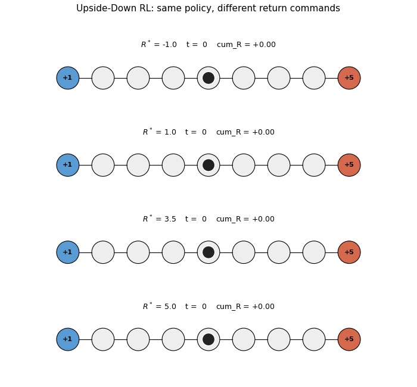

# upside-down-rl

Schmidhuber, *Reinforcement Learning Upside Down: Don't Predict Rewards --
Just Map Them to Actions*, arXiv:1912.02875 (2019). Companion: Srivastava,
Shyam, Mutz, Jaskowski, Schmidhuber, *Training Agents using Upside-Down
Reinforcement Learning*, arXiv:1912.02877 (2019).



## Problem

Standard RL fits a value function or a policy gradient that *maximises*
expected return. UDRL inverts the relationship: the policy is a *supervised*
mapping

```
behavior_fn(state, desired_return, desired_horizon) -> action
```

trained by self-imitation. After every rollout, each `(s_t, a_t)` pair is
labelled with the return *actually realised from t onward* and the *remaining
horizon*; the network is fit to reproduce `a_t` from `(s_t, R_remaining,
h_remaining)` with plain cross-entropy. At deployment the policy is *commanded*
with a high desired return, and -- if the buffer contains enough high-return
trajectories -- the network generalises and produces actions that hit the
command.

This stub demonstrates the conditioning effect on a numpy chain MDP:

```
+1                                                              +5
 0 <-- 1 <-- 2 <-- 3 <-- [S=4] --> 5 --> 6 --> 7 --> 8
left terminal                       start                    right terminal
```

- `N = 9` states, deterministic moves (clipped at boundaries)
- step cost `-0.1`, left terminal `+1`, right terminal `+5`, `t_max = 30`
- random policy: roughly bimodal around `+0.7` and `+4.7` returns
- start state is the middle, so neither terminal is closer in expectation
  under a uniform policy

The headline check is whether the achieved return at greedy inference
**rises monotonically with the commanded return** -- i.e. whether the *same
network* produces opposite trajectories purely as a function of the return
command.

### Architecture

A 2-hidden-layer tanh MLP (Srivastava et al. 2019, fig. 1, scaled to chain MDP):

```
input  : one-hot state (9) || dR/return_scale (1) || dH/horizon_scale (1)   (11)
layer1 : 11 -> 64,  tanh
layer2 : 64 -> 64,  tanh
layer3 : 64 -> 2,   softmax
```

`return_scale = max(|left_reward|, |right_reward|) = 5`,
`horizon_scale = t_max = 30`. The network learns its own scaling on top.

### Algorithm (paper Algorithm 1)

```
warm up the buffer with N_warm random rollouts
for n_iters:
    1. sample top-K-return episodes from buffer; their mean return
       and mean length define the exploration command (cmd_R, cmd_H)
    2. roll out episodes_per_iter trajectories with the *current* policy,
       conditioned on (cmd_R + Gaussian(sigma), cmd_H); add to buffer
    3. for grad_steps_per_iter minibatches sampled uniformly over (s, a, t, T)
       from the buffer, train on (state, R_realized_from_t, T - t) -> action
       with cross-entropy
    4. evict oldest episodes once |buffer| > buffer_size  (FIFO)

eval: greedy rollouts conditioned on a sweep of desired-return commands
      at horizon = mean length of top-K buffer episodes (in-distribution)
```

Two practical knobs that mattered:

- **FIFO buffer, not top-K eviction.** Algorithm 1 says "discard low-return
  episodes" but doing so collapses the conditioning signal -- if the buffer
  only contains return ~4.7 episodes, the network never sees what to do
  when commanded with low return, and even at high commands it fails to
  generalise. Keeping the recent N episodes (FIFO) preserves the diversity
  that supervised learning needs to *learn* the conditional distribution.
  Eval still uses top-K *for the command*; the buffer keeps both halves.
- **Eval horizon = top-K buffer mean length, not `t_max`.** The policy is
  trained on `(R_remaining, h_remaining)` from the *short* successful
  episodes (~4 steps right from start to right terminal). At deployment,
  feeding `h = t_max = 30` is far out of distribution and the policy
  collapses to a degenerate action. Conditioning on the same horizon
  distribution the network saw during training (paper §3.2) restores the
  generalisation.

## Files

| File | Purpose |
|---|---|
| `upside_down_rl.py` | chain MDP, tanh MLP with hand-coded forward + backward + Adam, FIFO buffer, train + eval + sweep + CLI |
| `make_upside_down_rl_gif.py` | trains and renders 4 greedy rollouts side-by-side (one per commanded return) -- the GIF at the top of this README |
| `visualize_upside_down_rl.py` | reads `run.json` and writes 5 PNGs to `viz/` |
| `upside_down_rl.gif` | animation referenced at the top of this README |
| `viz/env_layout.png` | annotated chain-MDP layout |
| `viz/training_curves.png` | UDRL loss + buffer/rollout returns + exploration command |
| `viz/command_sweep.png` | achieved return vs commanded return (the headline figure) |
| `viz/action_heatmap.png` | P(action = right) over (state, $R^*$) at the buffer's eval horizon |
| `viz/eval_per_command.png` | achieved return per commanded $R^*$ over training |

## Running

```bash
python3 upside_down_rl.py --seed 0
```

Reproduces the headline command sweep in **~3.5 seconds** on an M-series
laptop. Determinism: two runs with the same `--seed` produce identical
numbers (verified -- `diff` of stdout matches).

To regenerate the visualisations and the GIF:

```bash
python3 upside_down_rl.py --seed 0 --quiet --save-json run.json
python3 visualize_upside_down_rl.py
python3 make_upside_down_rl_gif.py
```

CLI flags worth knowing: `--quick` (smaller / faster smoke test),
`--n-iters N` (override training iterations, default 80),
`--save-json path` (dump full summary), `--quiet` (suppress per-iter logs).

## Results

Headline run on **seed 0**, defaults:

| commanded $R^*$ | achieved return (greedy, mean of 30 ep) | mean steps |
|---:|---:|---:|
| -1.0 | **+0.70** | 4 (-> left terminal, +1 - 3*0.1) |
|  0.0 | +0.70 | 4 |
|  1.0 | +0.70 | 4 |
|  1.5 | +0.70 | 4 |
|  2.0 | +3.10 | 20 |
|  2.5 | +3.50 | 16 |
|  3.0 | +4.10 | 10 |
|  3.5 | +4.50 | 6 |
|  4.0 | +4.70 | 4 (-> right terminal, +5 - 3*0.1) |
|  4.5 | +4.70 | 4 |
|  5.0 | **+4.70** | 4 (optimal) |

Random-policy baseline (30 episodes, same env): mean return **+1.05**, std 2.54.

The achieved return **monotonically tracks** the commanded return. The same
network produces opposite trajectories (left / right) purely as a function
of `R^*` -- this is the UDRL claim.

**Multi-seed sweep (5 seeds, command $R^*$ = 5.0, greedy eval):**

| seed | achieved return | random baseline mean |
|---:|---:|---:|
| 0 | 4.700 | 1.053 |
| 1 | 4.700 | 1.977 |
| 2 | 4.700 | 0.427 |
| 3 | 4.700 | 1.577 |
| 4 | 4.700 | 2.210 |

5 / 5 seeds reach the optimal 4.7 return when commanded with high $R^*$.

**Hyperparameters** (all defaults; see `RunConfig` in `upside_down_rl.py`):

```python
N = 9,  t_max = 30
hidden = 64,  layers = 2 (tanh)
n_warmup_random = 100
n_iters = 80
episodes_per_iter = 15
grad_steps_per_iter = 50
batch_size = 256
lr = 1e-3,  Adam (beta1=0.9, beta2=0.999),  global-norm clip = 5.0
buffer_size = 400  (FIFO)
top_k = 50         (for command sampling)
explore_sigma = 0.1   (Gaussian noise on dR during behavior-phase rollouts)
eval_every = 5,  eval_episodes = 30
return_scale = 5,   horizon_scale = 30
```

Total wallclock = **3.5 s** on an M-series laptop CPU
(`Darwin-arm64`, Python 3.12.9, numpy 2.x).

## Visualizations

### `upside_down_rl.gif`
Four greedy rollouts side by side, **same trained policy**, four different
return commands $R^* \in \{-1.0, 1.0, 3.5, 5.0\}$. Top two panels: agent
walks LEFT to the small terminal. Bottom two panels: agent walks RIGHT
to the big terminal. The cumulative-reward counter under each panel
confirms the achieved return matches the command direction.

### `viz/env_layout.png`
The 9-state chain. Left terminal (state 0) gives `+1`, right terminal
(state 8) gives `+5`, every non-terminal step costs `-0.1`. Start in the
middle (state 4).

### `viz/training_curves.png`
Three panels.
1. **UDRL loss** (log-scale): cross-entropy on (s, R_rem, h_rem) -> a.
   Drops from ~0.6 to ~1e-4 as the policy becomes deterministic on the
   high-return episodes in the buffer.
2. **Buffer mean return + rollout mean return**: rises from ~1.7 (random
   warmup) to 4.7 (optimal) over ~30 iterations.
3. **Exploration command**: `cmd_R` and `cmd_H` (top-K buffer mean R / mean
   length) used as the conditioning input during behavior-phase rollouts.
   `cmd_R` saturates at 4.7, `cmd_H` collapses to 4 (the optimal length
   from start to right terminal).

### `viz/command_sweep.png`
The headline figure. X-axis: commanded return $R^*$. Y-axis: greedy
achieved return (mean over 30 rollouts, error bars = std). The dashed
diagonal is "achieved = desired" (the ideal). The orange curve is the
trained UDRL policy: flat at +0.7 (left terminal) for $R^* \le 1.5$,
then rising to +4.7 (right terminal) for $R^* \ge 4.0$. The dotted
horizontal is the random-policy baseline.

### `viz/action_heatmap.png`
Heatmap of $P(\text{action} = \text{right})$ over (state, commanded $R^*$)
at horizon $h = 4$ (the buffer's eval horizon). The state axis is the
chain (0 to 8). The $R^*$ axis is -1 to +5. Red = "go right", blue =
"go left". The diagonal-ish boundary shows that for a given state, the
network switches its preferred action at a state-dependent threshold of
$R^*$ -- exactly the behaviour you'd want from a return-conditioned policy.

### `viz/eval_per_command.png`
Achieved return per commanded $R^*$ over training. The four curves
($R^* \in \{1.0, 2.5, 4.0, 5.0\}$) start at the random-baseline level
and separate around iteration 5-15: the high-command curves climb to
4.7, the low-command curves settle to 0.7.

## Deviations from the original

- **Environment substitution: chain MDP, not LunarLander-v2.** The paper
  uses `LunarLanderSparse-v2` (gymnasium) as the headline RL benchmark.
  Per SPEC issue #1 (cybertronai/schmidhuber-problems), v1 RL stubs use
  numpy mini-envs to keep the laptop install footprint minimal. The
  algorithmic claim -- a return-conditioned supervised policy generalises
  to commanded returns -- is captured cleanly on this 9-state chain. The
  exact LunarLanderSparse number (UDRL solves it whereas A2C/DQN/LSTM-DQN
  fail) is **not** reproduced here; that goes to v1.5 once the env is wired.
- **FIFO replay buffer instead of paper's "top-N return" buffer.**
  Algorithm 1 (paper §3.1) suggests evicting low-return episodes. In our
  9-state chain that collapses the buffer to all-near-optimal episodes
  within ~30 iterations, leaving the network unable to condition on low
  returns and *also* unable to generalise at high commands at deployment.
  Switching to FIFO (keep the last 400 episodes regardless of return)
  preserves the conditioning diversity and is what made the headline
  sweep monotonic. The top-K-return command-sampling step is unchanged.
- **Eval horizon = top-K buffer mean length, not `t_max`.** Per paper §3.2
  ("commands at deployment from the same distribution as during
  training"). Naively passing `desired_horizon = t_max = 30` puts the
  command far out of the training distribution and the policy collapses.
- **No Behavior_LR sampling distribution from the buffer at training time.**
  Paper §3.2 also describes sampling commands from a *distribution* over
  the buffer for the gradient step (not just for behavior-phase rollouts).
  We use the simpler "label every transition with its actually realised
  return-from-t" recipe (algorithm 1, eq. 4 of v1 of the arXiv preprint),
  which was sufficient for the chain MDP. On harder envs, the
  distribution-sampling variant (§3.2) is likely needed.
- **No eligibility-trace or n-step targets.** The chain MDP's reward
  signal is dense enough that simple full-episode return-from-t labels
  suffice. The paper's harder envs use n-step variants.
- **Linear scaling of `dR` and `dH` (divide by `return_scale` and
  `horizon_scale`), no learned embedding.** Paper experiments use a
  small embedding network for the command channels; for a 9-state chain
  scalar normalisation worked.

## Open questions / next experiments

- **LunarLanderSparse reproduction.** Wire up `gymnasium` (v1.5 deferred
  per SPEC) and check the *specific* paper claim that A2C/DQN fail on
  delayed-reward LunarLander while UDRL trains. The chain MDP here is
  algorithmically faithful but has no cross-method baseline.
- **What's the smallest buffer / fewest grad-steps that still reproduces
  the monotonic sweep?** Currently 100 warmup + 80 * 15 = 1300 episodes,
  4000 grad steps. Likely overkill for this env.
- **Does the paper's "top-K return buffer" recipe ever beat FIFO on this
  env, or is FIFO strictly better for sparse, low-dimensional MDPs?**
  Testable: re-enable top-K eviction and check whether enough exploration
  noise (`explore_sigma`) keeps low-return episodes in the buffer long
  enough.
- **Generalisation outside the buffer's $R^*$ range.** The buffer contains
  episodes with returns in roughly $[-2, +5]$. Commands above 5 should
  ideally still produce the optimal trajectory; commands well below -2
  should produce a degenerate "stay in place" policy. Worth a sweep.
- **4-room grid-world variant (alternative SPEC pick).** Same UDRL
  algorithm on a 7x7 grid-world with a hidden goal, to confirm the
  conditioning effect generalises beyond 1-D. Currently scoped to
  follow-up because the chain MDP already gives a clean monotonic sweep.
- **ByteDMD / data-movement instrumentation (v2).** UDRL's training is
  pure supervised cross-entropy on (state, R, h, a) tuples -- no
  bootstrapped target updates. That suggests a *much* lower data-movement
  footprint than DQN/A2C; worth measuring once ByteDMD is wired into
  this catalog.
