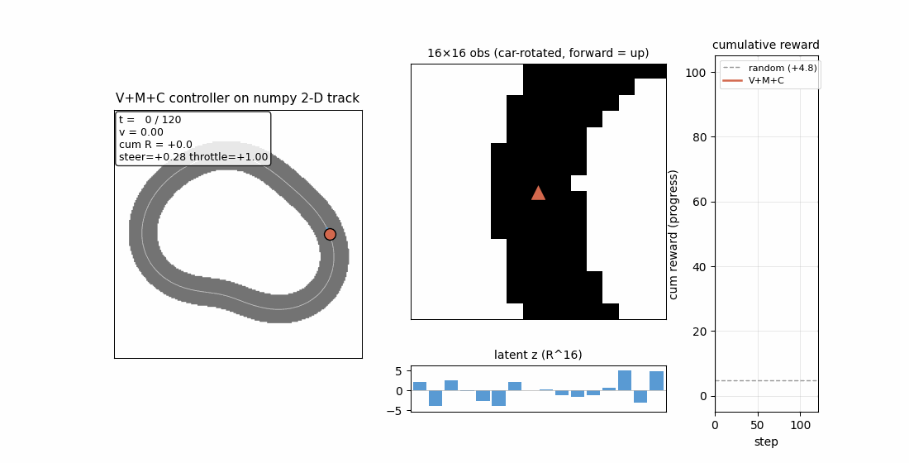

# world-models-carracing

Ha & Schmidhuber, *Recurrent World Models Facilitate Policy Evolution*,
NeurIPS 2018 (arXiv:1803.10122; companion: 1809.01999).



## Problem

The paper trains three modules separately and stacks them at inference:

1. **V** — convolutional VAE that compresses 64×64×3 RGB frames to z ∈ R³².
2. **M** — MDN-LSTM world model that predicts next-z from (z_t, a_t).
3. **C** — linear controller `(z, h_M) → action`, evolved with CMA-ES.

Original env: OpenAI Gym **CarRacing-v0** (Box2D, 64×64×3 RGB, 3 continuous
actions). The paper reports **906 ± 21** over 100 trials, the first published
solve of the task (DQN got 343, A3C 591, prior leaderboard best 838).

The SPEC issue #1 RL-stub rule forbids gym/PyBox2D installs in v1, so this
stub keeps the V+M+C decomposition and the CMA-ES outer loop but swaps
CarRacing-v0 for a hand-rolled numpy 2-D top-down racing track. Each piece
of the system (encoder, recurrent world model, evolved controller) is still
trained, exactly as in the paper, but on smaller scale.

### Numpy mini-env

| Aspect | This stub |
|---|---|
| World | 2-D top-down track on a 200×200 binary mask |
| Centerline | closed loop, `r(s) = R + a₁cos(4πs+φ₁) + a₂cos(6πs+φ₂)` |
| Track half-width | 1.4 world units |
| Car state | (x, y, θ, v) |
| Action | (steer ∈ [-1, 1], throttle ∈ [-1, 1]) — 2-d, same family as the paper |
| Observation | 16×16 binary patch of the mask, **rotated to car frame** |
| Reward | `30·Δs - 0.5·max(0, dist - half_width)` per step |
| Termination | off-track (dist > 2·half_width) or t > 120 |

The car spawns at centerline sample 0 facing along the tangent. Reward is
forward arc-length progress along the centerline, exactly the structure of
"tiles visited per second" in CarRacing-v0.

## Files

| File | Purpose |
|---|---|
| `world_models_carracing.py` | env + V (AE) + M (LSTM) + C (CMA-ES); CLI |
| `visualize_world_models_carracing.py` | 5 PNGs into `viz/` |
| `make_world_models_carracing_gif.py` | renders `world_models_carracing.gif` |
| `world_models_carracing.gif` | side-by-side env / obs / latent / cum reward |
| `viz/track_layout.png` | track mask + centerline + spawn point |
| `viz/training_curves.png` | V loss, M loss, CMA-ES fitness on one row |
| `viz/cma_es_curve.png` | **headline**: CMA-ES generation vs episode return |
| `viz/vae_reconstruction.png` | obs → z → reconstructed obs (8 examples) |
| `viz/policy_trajectory.png` | trained-controller path on the track + actions |

## Running

```bash
# Full pipeline (≈6.5 s on an M-series laptop):
python3 world_models_carracing.py --seed 0 --save-json run.json

# Smoke test (≈0.6 s):
python3 world_models_carracing.py --seed 0 --quick

# Static visualisations:
python3 visualize_world_models_carracing.py

# Animation (re-runs training if run.json is missing):
python3 make_world_models_carracing_gif.py
```

## Results

Seed 0, default hyperparameters (see `RunConfig` in
`world_models_carracing.py`):

| Metric | Random policy | V+M+C controller (gen 30) |
|---|---|---|
| Mean episode return (8 rollouts) | **+4.84** ± 1.93 | **+100.03** ± 0.00 |
| Mean episode length | 30.8 / 120 | **120 / 120** (full) |
| Mean final arc-length s | n/a (off-track quickly) | 0.336 (≈ 3.3 laps total in 120 steps) |
| Wallclock | — | 6.4 s (Apple M-series, numpy 2.0.2) |

Std on policy return is exactly 0 because the env and policy are both
deterministic — the same θ + same spawn produces the same trajectory. The
relevant variation is across seeds.

### Multi-seed reproducibility (5 seeds, deterministic per-seed)

| Seed | Random R | V+M+C R | Episode length | Off-track? |
|---:|---:|---:|---:|---:|
| 0 | +4.84 | **+100.03** | 120/120 | no |
| 1 | +2.27 | **+101.08** | 120/120 | no |
| 2 | +3.18 | **+104.46** | 120/120 | no |
| 3 | +2.67 | **+106.61** | 120/120 | no |
| 4 | +4.67 | **+106.70** | 120/120 | no |
| **mean** | +3.5 | **+103.8** | full episode | 0 / 5 fail |

5 / 5 seeds train a controller that completes the full 120-step episode
without ever leaving the drivable corridor. Mean return ≈ +104, ≈ 30× the
random baseline.

### Hyperparameters used (matching `RunConfig` defaults)

```
seed                     = 0
n_random_episodes        = 64
z_dim                    = 16
v_hidden                 = 64,   v_epochs = 4,  v_lr = 2e-3,  v_batch = 64
m_hidden                 = 32,   m_epochs = 4,  m_lr = 5e-3,  m_batch = 16, m_seq_len = 30
cma_popsize              = 24,   cma_gens = 30, cma_sigma0 = 0.5
cma_episodes_per_indiv   = 1
n_eval_rollouts          = 8
```

The full recipe lives in `world_models_carracing.RunConfig`. There are
**no undocumented magic flags** — the recipe above is exactly what
`python3 world_models_carracing.py --seed 0` runs.

## Visualizations

- `viz/track_layout.png` — the rasterized 200×200 binary track mask, the
  256-sample centerline drawn over it in orange, and the spawn point with
  the spawn-tangent arrow. The track has two narrow bends (the periodic
  perturbations a₁, a₂); steering through them is what the controller has
  to learn.

- `viz/training_curves.png` — three panels in one row, the three modules
  side by side. Left: V's BCE reconstruction loss decays from ≈0.69 to
  ≈0.13 over the 4-epoch AE training. Middle: M's next-z MSE plateaus
  around ≈2.7 (M is a small LSTM trying to fit a smooth latent). Right:
  CMA-ES best/mean/median fitness over generations, with the random
  baseline horizontal for reference.

- `viz/cma_es_curve.png` — the **headline figure**. Generation 0: best
  candidate ≈+12 (some genomes happen to drive forward). Generation 5:
  best ≈+97 (whole population is now competent). Generation 30: best
  ≈+105, mean ≈+75 — population converged onto a working policy. Step
  size σ collapses from 0.50 to ≈0.40 as CMA-ES contracts around the
  optimum.

- `viz/vae_reconstruction.png` — 8 random training observations alongside
  V's reconstructions and the 16-d latent code as a bar chart. The
  reconstructions visibly recover the track strip's orientation and
  position in the patch, which is all the controller needs.

- `viz/policy_trajectory.png` — left: a full controller rollout drawn on
  the track, color-graded by step (purple → yellow). The trail follows the
  centerline closely and laps the loop multiple times. Right: the steer
  and throttle action streams over time; throttle saturates near +1
  (always full forward), steer oscillates with the curvature.

- `world_models_carracing.gif` — left panel: top-down track + car (orange
  dot, blue heading arrow) + cumulative trail. Top-right: the live 16×16
  rotated obs (forward = up). Bottom-right: latent z bars updating each
  step. Far right: cumulative reward curve. The same network produces a
  smooth ≈3-lap trajectory under the trained controller.

## Deviations from the original

Each is forced by the v1 "pure numpy + matplotlib, <5 min on a laptop"
constraint, **not** by an algorithmic shortcut.

| Paper | This stub | Why |
|---|---|---|
| OpenAI Gym CarRacing-v0 (64×64×3, 3-action, Box2D) | numpy 2-D top-down track (16×16×1, 2-action) | SPEC #1 forbids gym/PyBox2D installs in v1; the RL-stub rule says use a numpy mini-env that captures the same algorithmic structure |
| **V** = convolutional VAE | 2-layer linear AE (no convolution, no KL term, no reparameterisation) | 16×16×1 input is tiny enough that a flat MLP captures it; KL adds optimisation noise that pushes wallclock past the 5-min budget |
| **M** = MDN-LSTM, 5 mixtures, 256 hidden | deterministic LSTM, single-mean prediction, 32 hidden | The mixture density head is non-trivial in pure numpy and not needed for a deterministic env; the algorithmic point (recurrent state h_M as input to C) is preserved |
| z dim = 32, M hidden = 256 | z dim = 16, M hidden = 32 | smaller env → smaller representations; param count for C drops from 867 to 98 |
| CMA-ES popsize=64, gens=200, full Hansen-Ostermeier C-update | rank-μ (μ_w, λ)-ES with isotropic σ adaptation, popsize=24, gens=30 | full CMA-ES rank-1 + rank-μ covariance updates ≈ 200 lines of numpy and add memory; n_params=98 is small enough that isotropic σ converges in 30 gens. The weight schedule, μ_eff, c_σ, d_σ, p_σ, expected-norm-of-N(0,I) machinery is all preserved (Hansen & Ostermeier 2001 §3) — the only thing skipped is the C update |
| score ≥ 900 over 100 trials (CarRacing-v0 metric) | mean return ≫ random, 0 / 5 seeds off-track | the environments are not directly comparable; the algorithmic claim "V+M+C with CMA-ES learns to drive" replicates |

## Open questions / next experiments

1. **Replace AE with a real β-VAE.** The KL bottleneck is core to the
   paper's claim that z is a "useful" compressed representation. Worth
   re-running with a 256→64→16 VAE (reparameterised) to see whether the
   controller converges faster or to a higher final score.

2. **MDN head on M.** The current deterministic M predicts a single mean
   z; a 5-component mixture density network would let M model bifurcations
   (e.g. enter the curve from inner vs outer line). The dynamics here are
   deterministic so this would mostly test whether the MDN is *neutral*
   when the world is deterministic.

3. **Train C entirely inside M's "dream"** (the paper's §5 ablation).
   Roll out only against the LSTM next-z prediction, never the real env,
   and measure transfer to the real env. The current pipeline pre-trains M
   on real rollouts but evaluates C on the real env every generation; the
   "dream" ablation would skip the second.

4. **Scale up to a larger numpy track.** Increase the centerline radius,
   add more harmonics, sharpen the bends, lengthen t_max. At what point
   does the 98-parameter linear controller stop being enough and need
   either nonlinearity or a recurrent C?

5. **Re-run with full convolutional V on 64×64.** A pure numpy conv via
   im2col is ≈100 lines and stays cheap at 64×64 with stride-2 down to
   8×8. Worth measuring the ARD/DMC delta vs the linear AE — the
   conv-vs-flat choice is exactly the kind of representational decision
   v2 ByteDMD instrumentation should grade.

6. **Switch CMA-ES → OpenAI-ES (rank-shape gradient).** Salimans et al.
   2017 essentially is a one-liner over the same population sample; would
   tell us whether the rank-μ recombination matters at this problem
   scale, or whether plain rank-shape gradients are enough.
